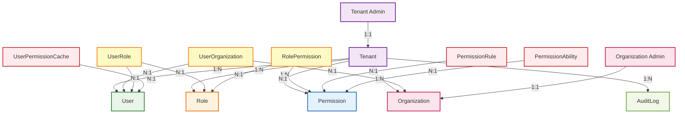

# IAM领域实体设计方案

## 概述

本方案基于DDD（领域驱动设计）和Clean Architecture（整洁架构）原则，设计IAM系统的核心领域实体。重点关注业务用例（use-cases）的实现需求，确保领域实体能够支撑复杂的身份认证与权限管理业务场景。

**重要说明**：本方案将引入CASL（基于属性的访问控制）库，以支持更细粒度和灵活的权限控制机制。

## 一、现有领域实体分析

### 1.1 已实现的领域实体

#### 1.1.1 租户（Tenant）实体
```typescript
// 核心属性
- id: string (UUID)
- name: TenantName (值对象)
- code: TenantCode (值对象)
- status: TenantStatusValue (值对象)
- adminUserId: string (租户管理员ID)
- description?: string
- settings: Record<string, any>
- createdAt: Date
- updatedAt: Date
- deletedAt?: Date
```

#### 1.1.2 用户（User）实体
```typescript
// 核心属性
- id: string (UUID)
- username: Username (值对象)
- email: Email (值对象)
- phone?: Phone (值对象)
- firstName: string
- lastName: string
- displayName?: string
- avatar?: string
- status: UserStatusValue (值对象)
- tenantId: string (租户隔离)
- organizationIds: string[] (多组织支持) ⚠️ 需要调整
- roleIds: string[] (多角色支持) ⚠️ 需要调整
- adminUserId: string
- passwordHash: string
- lastLoginAt?: Date
- loginAttempts: number
- lockedUntil?: Date
- emailVerified: boolean
- phoneVerified: boolean
- twoFactorEnabled: boolean
- twoFactorSecret?: string
- preferences: Record<string, any>
- createdAt: Date
- updatedAt: Date
- deletedAt?: Date
```

#### 1.1.3 角色（Role）实体
```typescript
// 核心属性
- id: string (UUID)
- name: RoleName (值对象)
- code: RoleCode (值对象)
- description?: string
- status: RoleStatusValue (值对象)
- tenantId: string (租户隔离)
- organizationId?: string (组织级角色)
- adminUserId: string
- permissionIds: string[] (多权限支持)
- userIds: string[] (多用户支持) ⚠️ 需要调整
- isSystemRole: boolean
- isDefaultRole: boolean
- priority: RolePriority (值对象)
- maxUsers?: number
- expiresAt?: Date
- parentRoleId?: string (角色继承)
- childRoleIds: string[] (子角色)
- createdAt: Date
- updatedAt: Date
- deletedAt?: Date
```

#### 1.1.4 权限（Permission）实体
```typescript
// 核心属性
- id: string (UUID)
- name: PermissionName (值对象)
- code: PermissionCode (值对象)
- description?: string
- type: PermissionTypeValue (值对象)
- status: PermissionStatusValue (值对象)
- action: PermissionActionValue (值对象)
- tenantId: string (租户隔离)
- organizationId?: string (组织级权限)
- adminUserId: string
- roleIds: string[] (多角色支持) ⚠️ 需要调整
- isSystemPermission: boolean
- isDefaultPermission: boolean
- conditions?: PermissionCondition (值对象) 🔥 CASL集成
- fields: string[] (字段级权限) 🔥 CASL集成
- expiresAt?: Date
- parentPermissionId?: string (权限继承)
- childPermissionIds: string[] (子权限)
- resource?: string 🔥 CASL资源标识
- module?: string 🔥 CASL模块标识
- tags?: string
- createdAt: Date
- updatedAt: Date
- deletedAt?: Date
```

## 二、缺失的领域实体设计

### 2.1 组织（Organization）实体

基于业务需求，需要补充组织实体：

```typescript
// 组织实体核心属性
- id: string (UUID)
- name: string (组织名称，租户内唯一)
- code: string (组织编码，租户内唯一)
- description?: string
- type: string (组织类型：部门、子公司、项目组等)
- status: string (组织状态：激活、禁用、已删除)
- tenantId: string (租户隔离)
- parentId?: string (父组织ID，支持树状结构)
- path: string (组织路径，如：/总公司/技术部/前端组)
- level: number (组织层级，从0开始)
- sortOrder: number (同级组织排序)
- adminUserId?: string (组织管理员ID)
- contactInfo: Record<string, any> (联系信息)
- settings: Record<string, any> (组织设置)
- createdAt: Date
- updatedAt: Date
- deletedAt?: Date
```

### 2.2 用户组织关联（UserOrganization）实体

实现用户与组织的多对多关系：

```typescript
// 用户组织关联实体核心属性
- id: string (UUID)
- userId: string (用户ID)
- organizationId: string (组织ID)
- tenantId: string (租户隔离)
- role: string (在组织中的角色：成员、主管、管理员等)
- isPrimary: boolean (是否为主要组织)
- joinDate: Date (加入组织时间)
- leaveDate?: Date (离开组织时间)
- status: string (关联状态：激活、非激活、待审核等)
- createdAt: Date
- updatedAt: Date
```

### 2.3 审计日志（AuditLog）实体

支持合规和审计需求：

```typescript
// 审计日志实体核心属性
- id: string (UUID)
- tenantId: string (租户隔离)
- userId: string (操作用户ID)
- action: string (操作类型)
- resourceType: string (资源类型：用户、角色、权限、组织等)
- resourceId: string (资源ID)
- oldValues?: Record<string, any> (变更前值)
- newValues?: Record<string, any> (变更后值)
- ipAddress?: string (IP地址)
- userAgent?: string (用户代理)
- timestamp: Date (操作时间)
- metadata?: Record<string, any> (额外元数据)
```

### 2.4 CASL集成实体

#### 2.4.1 权限规则（PermissionRule）实体
```typescript
// 权限规则实体核心属性（CASL集成）
- id: string (UUID)
- permissionId: string (关联权限ID)
- tenantId: string (租户隔离)
- action: string (操作：create, read, update, delete, manage)
- subject: string (资源类型：User, Role, Permission, Organization等)
- conditions: Record<string, any> (CASL条件对象)
- fields: string[] (允许访问的字段)
- inverted: boolean (是否为否定规则)
- reason?: string (规则原因)
- createdAt: Date
- updatedAt: Date
```

#### 2.4.2 权限能力（PermissionAbility）实体
```typescript
// 权限能力实体核心属性（CASL集成）
- id: string (UUID)
- permissionId: string (关联权限ID)
- tenantId: string (租户隔离)
- action: string (操作类型)
- subject: string (资源类型)
- conditions: Record<string, any> (CASL条件)
- fields: string[] (字段限制)
- createdAt: Date
- updatedAt: Date
```

#### 2.4.3 用户权限缓存（UserPermissionCache）实体
```typescript
// 用户权限缓存实体核心属性（CASL集成）
- id: string (UUID)
- userId: string (用户ID)
- tenantId: string (租户隔离)
- abilities: Record<string, any>[] (CASL能力数组)
- cachedAt: Date (缓存时间)
- expiresAt: Date (过期时间)
- version: number (缓存版本)
- createdAt: Date
- updatedAt: Date
```

## 二、现有实体调整建议

### 2.4 需要调整的现有实体

#### 2.4.1 用户（User）实体调整

**当前问题**：
- `organizationIds: string[]` - 直接在用户实体中存储组织ID列表
- `roleIds: string[]` - 直接在用户实体中存储角色ID列表

**调整建议**：
```typescript
// 移除这些属性，改为通过关联实体管理
- organizationIds: string[] ❌ 移除
- roleIds: string[] ❌ 移除

// 添加查询方法，通过关联实体获取
+ getOrganizations(): Promise<Organization[]>
+ getRoles(): Promise<Role[]>
+ hasOrganization(organizationId: string): Promise<boolean>
+ hasRole(roleId: string): Promise<boolean>
```

**调整原因**：
1. **聚合边界清晰**：用户聚合不应该直接持有其他聚合的ID列表
2. **数据一致性**：避免用户实体与关联实体数据不一致
3. **性能考虑**：避免在用户实体中维护大量ID列表
4. **DDD原则**：聚合间通过ID引用，不直接持有数据

#### 2.4.2 角色（Role）实体调整

**当前问题**：
- `userIds: string[]` - 直接在角色实体中存储用户ID列表

**调整建议**：
```typescript
// 移除这个属性，改为通过关联实体管理
- userIds: string[] ❌ 移除

// 添加查询方法，通过关联实体获取
+ getUsers(): Promise<User[]>
+ hasUser(userId: string): Promise<boolean>
+ getUserCount(): Promise<number>
```

**调整原因**：
1. **聚合边界清晰**：角色聚合不应该直接持有用户聚合的ID列表
2. **数据一致性**：避免角色实体与用户实体数据不一致
3. **性能考虑**：避免在角色实体中维护大量用户ID列表
4. **DDD原则**：聚合间通过ID引用，不直接持有数据

#### 2.4.3 权限（Permission）实体调整

**当前问题**：
- `roleIds: string[]` - 直接在权限实体中存储角色ID列表

**调整建议**：
```typescript
// 移除这个属性，改为通过关联实体管理
- roleIds: string[] ❌ 移除

// 添加查询方法，通过关联实体获取
+ getRoles(): Promise<Role[]>
+ hasRole(roleId: string): Promise<boolean>
```

**调整原因**：
1. **聚合边界清晰**：权限聚合不应该直接持有角色聚合的ID列表
2. **数据一致性**：避免权限实体与角色实体数据不一致
3. **DDD原则**：聚合间通过ID引用，不直接持有数据

### 2.5 新增关联实体

#### 2.5.1 用户角色关联（UserRole）实体
```typescript
// 用户角色关联实体核心属性
- id: string (UUID)
- userId: string (用户ID)
- roleId: string (角色ID)
- tenantId: string (租户隔离)
- assignedBy: string (分配人ID)
- assignedAt: Date (分配时间)
- expiresAt?: Date (过期时间)
- status: string (关联状态：激活、非激活等)
- createdAt: Date
- updatedAt: Date
```

#### 2.5.2 角色权限关联（RolePermission）实体
```typescript
// 角色权限关联实体核心属性
- id: string (UUID)
- roleId: string (角色ID)
- permissionId: string (权限ID)
- tenantId: string (租户隔离)
- assignedBy: string (分配人ID)
- assignedAt: Date (分配时间)
- expiresAt?: Date (过期时间)
- status: string (关联状态：激活、非激活等)
- createdAt: Date
- updatedAt: Date
```

### 2.6 调整后的聚合根设计

#### 2.6.1 用户聚合根
- **聚合根**：User
- **包含实体**：User（自包含）
- **关联实体**：UserOrganization、UserRole（通过ID引用）
- **边界**：用户级别的所有业务操作
- **一致性**：确保用户数据的完整性和状态一致性

#### 2.6.2 角色聚合根
- **聚合根**：Role
- **包含实体**：Role（自包含）
- **关联实体**：UserRole、RolePermission（通过ID引用）
- **边界**：角色级别的所有业务操作
- **一致性**：确保角色权限分配的一致性

#### 2.6.3 权限聚合根
- **聚合根**：Permission
- **包含实体**：Permission（自包含）
- **关联实体**：RolePermission（通过ID引用）
- **边界**：权限级别的所有业务操作
- **一致性**：确保权限定义和分配的一致性

## 三、核心业务用例（Use Cases）分析

### 3.1 租户管理用例

#### 3.1.1 租户创建
- **输入**：租户名称、编码、管理员信息
- **输出**：租户实体、管理员用户实体
- **涉及实体**：Tenant、User
- **业务规则**：
  - 租户名称和编码在系统内唯一
  - 自动创建租户管理员用户
  - 分配系统默认角色

#### 3.1.2 租户激活/禁用
- **输入**：租户ID、目标状态
- **输出**：更新后的租户实体
- **涉及实体**：Tenant
- **业务规则**：
  - 禁用租户后，所有用户无法登录
  - 状态变更记录审计日志

### 3.2 用户管理用例

#### 3.2.1 用户注册
- **输入**：用户名、邮箱、密码、基本信息
- **输出**：用户实体
- **涉及实体**：User
- **业务规则**：
  - 用户名和邮箱在租户内唯一
  - 密码强度验证
  - 自动分配默认角色
  - 发送邮箱验证邮件

#### 3.2.2 用户认证
- **输入**：用户名/邮箱、密码
- **输出**：JWT令牌、用户信息
- **涉及实体**：User
- **业务规则**：
  - 验证用户状态（非禁用、非删除）
  - 验证密码哈希
  - 检查账户锁定状态
  - 支持二步验证
  - 记录登录审计日志

#### 3.2.3 用户组织分配
- **输入**：用户ID、组织ID、角色
- **输出**：用户组织关联实体
- **涉及实体**：User、Organization、UserOrganization
- **业务规则**：
  - 用户可关联多个组织
  - 每个组织关联有特定角色
  - 支持设置主要组织

#### 3.2.4 用户角色分配
- **输入**：用户ID、角色ID列表
- **输出**：更新后的用户实体
- **涉及实体**：User、Role
- **业务规则**：
  - 用户可分配多个角色
  - 角色分配仅限租户管理员或组织管理员
  - 角色分配实时生效
  - 支持角色优先级处理（权限冲突时）
  - 记录角色分配审计日志
  - 验证角色是否属于同一租户
  - 检查角色状态（激活状态才能分配）
  - 支持批量角色分配和移除

### 3.3 角色管理用例

#### 3.3.1 角色创建
- **输入**：角色名称、代码、描述、权限
- **输出**：角色实体
- **涉及实体**：Role、Permission
- **业务规则**：
  - 角色名称和代码在租户内唯一
  - 支持角色继承关系
  - 可设置最大用户数限制

#### 3.3.2 角色权限分配
- **输入**：角色ID、权限ID列表
- **输出**：更新后的角色实体
- **涉及实体**：Role、Permission
- **业务规则**：
  - 权限变更实时生效
  - 支持权限继承
  - 记录权限分配审计日志

#### 3.3.3 角色用户分配
- **输入**：角色ID、用户ID列表
- **输出**：更新后的角色实体
- **涉及实体**：Role、User
- **业务规则**：
  - 角色可分配给多个用户
  - 用户分配仅限租户管理员或组织管理员
  - 用户分配实时生效
  - 检查角色最大用户数限制
  - 记录用户分配审计日志
  - 验证用户是否属于同一租户
  - 检查用户状态（激活状态才能分配）
  - 支持批量用户分配和移除

### 3.4 权限管理用例

#### 3.4.1 权限创建
- **输入**：权限名称、代码、类型、操作、资源、CASL规则
- **输出**：权限实体、权限规则实体
- **涉及实体**：Permission、PermissionRule
- **业务规则**：
  - 权限代码在租户内唯一
  - 支持CASL条件权限和字段级权限
  - 支持权限继承
  - 自动生成CASL能力定义

#### 3.4.2 权限验证（CASL集成）
- **输入**：用户ID、资源、操作、资源属性
- **输出**：是否有权限（布尔值）
- **涉及实体**：User、Role、Permission、PermissionRule、UserPermissionCache
- **业务规则**：
  - 检查用户角色
  - 检查角色权限
  - 支持权限继承
  - 支持CASL条件权限评估
  - 支持字段级权限控制
  - 缓存权限验证结果

#### 3.4.3 用户权限查询（CASL集成）
- **输入**：用户ID、资源类型（可选）
- **输出**：用户CASL能力列表
- **涉及实体**：User、Role、Permission、PermissionRule、UserPermissionCache
- **业务规则**：
  - 聚合用户所有角色的权限
  - 处理权限冲突（按角色优先级）
  - 支持权限继承计算
  - 支持CASL条件权限评估
  - 生成CASL能力数组
  - 缓存用户权限结果
  - 权限变更时自动失效缓存

#### 3.4.4 CASL权限规则管理
- **输入**：权限ID、CASL规则配置
- **输出**：权限规则实体
- **涉及实体**：Permission、PermissionRule
- **业务规则**：
  - 支持复杂的CASL条件表达式
  - 支持字段级权限控制
  - 支持否定规则
  - 规则变更时更新相关缓存

### 3.5 组织管理用例

#### 3.5.1 组织创建
- **输入**：组织名称、编码、类型、父组织ID
- **输出**：组织实体
- **涉及实体**：Organization
- **业务规则**：
  - 组织名称和编码在租户内唯一
  - 自动生成组织路径和层级
  - 支持组织继承权限

#### 3.5.2 组织层级调整
- **输入**：组织ID、新父组织ID
- **输出**：更新后的组织实体
- **涉及实体**：Organization
- **业务规则**：
  - 验证不会形成循环引用
  - 自动更新组织路径
  - 更新子组织层级

## 四、领域实体关系设计

### 4.1 实体关系图



### 4.2 聚合根设计

#### 4.2.1 租户聚合根
- **聚合根**：Tenant
- **包含实体**：Tenant（自包含）
- **边界**：租户级别的所有业务操作
- **一致性**：确保租户数据的完整性和隔离性

#### 4.2.2 用户聚合根
- **聚合根**：User
- **包含实体**：User（自包含）
- **关联实体**：UserOrganization、UserRole（通过ID引用）
- **边界**：用户级别的所有业务操作
- **一致性**：确保用户数据的完整性和状态一致性

#### 4.2.3 角色聚合根
- **聚合根**：Role
- **包含实体**：Role（自包含）
- **关联实体**：UserRole、RolePermission（通过ID引用）
- **边界**：角色级别的所有业务操作
- **一致性**：确保角色权限分配的一致性

#### 4.2.4 权限聚合根
- **聚合根**：Permission
- **包含实体**：Permission（自包含）
- **关联实体**：RolePermission（通过ID引用）
- **边界**：权限级别的所有业务操作
- **一致性**：确保权限定义和分配的一致性

#### 4.2.5 用户组织关联聚合根
- **聚合根**：UserOrganization
- **包含实体**：UserOrganization（自包含）
- **边界**：用户组织关联的所有业务操作
- **一致性**：确保用户组织关联的一致性

#### 4.2.6 用户角色关联聚合根
- **聚合根**：UserRole
- **包含实体**：UserRole（自包含）
- **边界**：用户角色关联的所有业务操作
- **一致性**：确保用户角色关联的一致性

#### 4.2.7 角色权限关联聚合根
- **聚合根**：RolePermission
- **包含实体**：RolePermission（自包含）
- **边界**：角色权限关联的所有业务操作
- **一致性**：确保角色权限关联的一致性

#### 4.2.8 权限规则聚合根（CASL集成）
- **聚合根**：PermissionRule
- **包含实体**：PermissionRule（自包含）
- **边界**：权限规则的所有业务操作
- **一致性**：确保CASL权限规则的一致性

#### 4.2.9 权限能力聚合根（CASL集成）
- **聚合根**：PermissionAbility
- **包含实体**：PermissionAbility（自包含）
- **边界**：权限能力的所有业务操作
- **一致性**：确保CASL能力定义的一致性

#### 4.2.10 用户权限缓存聚合根（CASL集成）
- **聚合根**：UserPermissionCache
- **包含实体**：UserPermissionCache（自包含）
- **边界**：用户权限缓存的所有业务操作
- **一致性**：确保权限缓存的一致性和性能

#### 4.2.11 组织聚合根
- **聚合根**：Organization
- **包含实体**：Organization（自包含）
- **边界**：组织级别的所有业务操作
- **一致性**：确保组织层级和权限继承的一致性

#### 4.2.12 审计日志聚合根
- **聚合根**：AuditLog
- **包含实体**：AuditLog（自包含）
- **边界**：审计日志的所有业务操作
- **一致性**：确保审计日志的完整性和不可变性

## 五、领域事件设计

### 5.1 租户领域事件
- `TenantCreatedEvent`
- `TenantActivatedEvent`
- `TenantSuspendedEvent`
- `TenantDeletedEvent`
- `TenantRestoredEvent`

### 5.2 用户领域事件
- `UserCreatedEvent`
- `UserActivatedEvent`
- `UserSuspendedEvent`
- `UserDeletedEvent`
- `UserRestoredEvent`
- `UserLoginSuccessEvent`
- `UserLoginFailureEvent`
- `UserAssignedToOrganizationEvent`
- `UserRemovedFromOrganizationEvent`

### 5.3 角色领域事件
- `RoleCreatedEvent`
- `RoleActivatedEvent`
- `RoleSuspendedEvent`
- `RoleDeletedEvent`
- `RoleRestoredEvent`
- `RolePermissionAssignedEvent`
- `RolePermissionRemovedEvent`
- `RoleUserAssignedEvent`
- `RoleUserRemovedEvent`

### 5.4 权限领域事件
- `PermissionCreatedEvent`
- `PermissionActivatedEvent`
- `PermissionSuspendedEvent`
- `PermissionDeletedEvent`
- `PermissionRestoredEvent`
- `PermissionAssignedToRoleEvent`
- `PermissionRemovedFromRoleEvent`

### 5.5 组织领域事件
- `OrganizationCreatedEvent`
- `OrganizationActivatedEvent`
- `OrganizationSuspendedEvent`
- `OrganizationDeletedEvent`
- `OrganizationRestoredEvent`
- `OrganizationHierarchyChangedEvent`

### 5.6 用户组织关联领域事件
- `UserOrganizationCreatedEvent`
- `UserOrganizationUpdatedEvent`
- `UserOrganizationDeletedEvent`
- `UserPrimaryOrganizationChangedEvent`

### 5.7 用户角色关联领域事件
- `UserRoleCreatedEvent`
- `UserRoleUpdatedEvent`
- `UserRoleDeletedEvent`
- `UserRoleExpiredEvent`

### 5.8 角色权限关联领域事件
- `RolePermissionCreatedEvent`
- `RolePermissionUpdatedEvent`
- `RolePermissionDeletedEvent`
- `RolePermissionExpiredEvent`

## 六、数据隔离策略

### 6.1 租户级隔离
- 所有实体都包含`tenantId`字段
- 查询时必须基于租户ID进行过滤
- 确保不同租户间数据完全隔离

### 6.2 组织级隔离
- 角色和权限可关联到特定组织
- 用户组织关联实现组织级权限控制
- 支持组织级权限继承

### 6.3 软删除策略
- 所有实体都支持软删除
- 保留数据用于审计和恢复
- 软删除不影响关联关系

## 七、性能优化考虑

### 7.1 索引策略
- 租户ID + 实体ID的复合索引
- 用户名、邮箱的唯一索引
- 组织路径的索引
- 审计日志的时间索引

### 7.2 缓存策略
- 用户权限缓存
- 角色权限缓存
- 组织树结构缓存
- 租户配置缓存

### 7.3 查询优化
- 分页查询支持
- 复杂权限查询优化
- 组织层级查询优化
- 审计日志查询优化

## 八、安全与合规

### 8.1 数据安全
- 密码哈希存储
- 敏感信息加密
- 审计日志完整性
- 数据备份策略

### 8.2 访问控制
- 基于角色的访问控制（RBAC）
- 基于属性的访问控制（ABAC）
- 细粒度权限控制
- 权限继承机制

### 8.3 合规要求
- GDPR数据保护
- 审计日志保留
- 数据导出功能
- 隐私保护机制

## 九、扩展性设计

### 9.1 多租户扩展
- 支持无限租户
- 租户配置自定义
- 租户数据隔离
- 租户级功能开关

### 9.2 权限模型扩展
- 支持自定义权限类型
- 支持条件权限
- 支持字段级权限
- 支持动态权限

### 9.3 集成能力
- LDAP/AD集成
- OAuth2.0集成
- SAML集成
- Webhook事件通知

## 十、实施建议

### 10.1 开发优先级
1. **第一阶段**：租户、用户、角色、权限核心实体
2. **第二阶段**：组织实体和用户组织关联
3. **第三阶段**：审计日志和高级功能
4. **第四阶段**：集成和优化

### 10.2 测试策略
- 单元测试：每个领域实体的业务规则
- 集成测试：实体间的交互
- 端到端测试：完整业务流程
- 性能测试：大数据量场景

### 10.3 部署策略
- 渐进式部署
- 功能开关控制
- 回滚机制
- 监控和告警

这个设计方案确保了IAM系统能够满足复杂的业务需求，同时保持代码的可维护性和可扩展性。

## 十一、值对象（Value Objects）设计

### 11.1 租户相关值对象

#### 11.1.1 租户名称（TenantName）
- **约束条件**：长度2-100字符，仅允许中文、英文、数字、空格、连字符
- **业务规则**：租户名称在系统内唯一，支持国际化
- **验证逻辑**：不能包含特殊字符，不能以数字开头

#### 11.1.2 租户编码（TenantCode）
- **约束条件**：长度3-20字符，仅允许英文、数字、下划线
- **业务规则**：租户编码在系统内唯一，用于API路径和数据库分区
- **验证逻辑**：必须以字母开头，不能包含连续下划线

#### 11.1.3 租户状态（TenantStatus）
- **枚举值**：PENDING（待激活）、ACTIVE（激活）、SUSPENDED（禁用）、DELETED（已删除）
- **状态转换**：定义各状态间的合法转换路径
- **业务影响**：不同状态对租户内所有用户的影响

### 11.2 用户相关值对象

#### 11.2.1 用户名（Username）
- **约束条件**：长度3-50字符，仅允许英文、数字、下划线、连字符
- **业务规则**：用户名在租户内唯一，全局唯一性通过租户ID+用户名组合实现
- **验证逻辑**：不能以数字开头，不能包含连续特殊字符

#### 11.2.2 邮箱地址（Email）
- **约束条件**：符合RFC 5322标准，最大254字符
- **业务规则**：邮箱在租户内唯一，支持国际化邮箱地址
- **验证逻辑**：支持国家代码前缀，本地部分和域名部分验证

#### 11.2.3 手机号码（Phone）
- **约束条件**：支持国际格式，8-15位数字
- **业务规则**：手机号在租户内唯一，支持国家代码前缀
- **验证逻辑**：支持+86、+1等国际格式，本地号码验证

#### 11.2.4 用户状态（UserStatus）
- **枚举值**：PENDING（待激活）、ACTIVE（激活）、SUSPENDED（禁用）、DELETED（已删除）
- **状态转换**：定义各状态间的合法转换和业务影响
- **业务规则**：不同状态对用户登录、权限等的影响

### 11.3 角色相关值对象

#### 11.3.1 角色名称（RoleName）
- **约束条件**：长度2-100字符，支持中文、英文、数字、空格
- **业务规则**：角色名称在租户内唯一，支持角色描述
- **验证逻辑**：不能包含特殊字符，不能为空

#### 11.3.2 角色编码（RoleCode）
- **约束条件**：长度3-50字符，仅允许英文、数字、下划线
- **业务规则**：角色编码在租户内唯一，用于API权限标识
- **验证逻辑**：必须以字母开头，全大写格式

#### 11.3.3 角色优先级（RolePriority）
- **数值范围**：1-100，数字越大优先级越高
- **业务规则**：权限冲突时按角色优先级处理
- **默认值**：系统角色优先级为90，自定义角色默认为50

### 11.4 权限相关值对象

#### 11.4.1 权限名称（PermissionName）
- **约束条件**：长度2-100字符，支持中文、英文、数字、空格
- **业务规则**：权限名称在租户内唯一，支持权限描述
- **验证逻辑**：不能包含特殊字符，不能为空

#### 11.4.2 权限编码（PermissionCode）
- **约束条件**：长度3-100字符，仅允许英文、数字、下划线、冒号
- **业务规则**：权限编码在租户内唯一，格式为"模块:资源:操作"
- **验证逻辑**：必须以字母开头，支持多级命名空间

#### 11.4.3 权限类型（PermissionType）
- **枚举值**：PAGE（页面级）、OPERATION（操作级）、DATA（数据级）、FIELD（字段级）
- **业务规则**：不同权限类型对应不同的验证策略
- **扩展性**：支持自定义权限类型

#### 11.4.4 权限操作（PermissionAction）
- **枚举值**：CREATE、READ、UPDATE、DELETE、MANAGE、EXPORT、IMPORT
- **业务规则**：支持CRUD操作和特殊业务操作
- **扩展性**：支持自定义操作类型

### 11.5 组织相关值对象

#### 11.5.1 组织名称（OrganizationName）
- **约束条件**：长度2-100字符，支持中文、英文、数字、空格
- **业务规则**：组织名称在租户内唯一，支持组织描述
- **验证逻辑**：不能包含特殊字符，不能为空

#### 11.5.2 组织编码（OrganizationCode）
- **约束条件**：长度3-50字符，仅允许英文、数字、下划线
- **业务规则**：组织编码在租户内唯一，用于组织标识
- **验证逻辑**：必须以字母开头，支持层级编码

#### 11.5.3 组织路径（OrganizationPath）
- **约束条件**：最大500字符，格式为"/根组织/子组织/孙组织"
- **业务规则**：自动生成和维护，支持组织层级查询
- **验证逻辑**：不能包含特殊字符，不能形成循环引用

## 十二、仓储接口（Repository Interfaces）设计

### 12.1 租户仓储接口

#### 12.1.1 核心查询方法
- `findById(id: string): Promise<Tenant | null>`
- `findByCode(code: string): Promise<Tenant | null>`
- `findByName(name: string): Promise<Tenant | null>`
- `findByStatus(status: TenantStatus): Promise<Tenant[]>`
- `findAll(): Promise<Tenant[]>`
- `findByAdminUserId(adminUserId: string): Promise<Tenant[]>`

#### 12.1.2 统计查询方法
- `countByStatus(status: TenantStatus): Promise<number>`
- `countActiveTenants(): Promise<number>`
- `getTenantStatistics(): Promise<TenantStatistics>`

### 12.2 用户仓储接口

#### 12.2.1 核心查询方法
- `findById(id: string, tenantId: string): Promise<User | null>`
- `findByUsername(username: string, tenantId: string): Promise<User | null>`
- `findByEmail(email: string, tenantId: string): Promise<User | null>`
- `findByPhone(phone: string, tenantId: string): Promise<User | null>`
- `findByStatus(status: UserStatus, tenantId: string): Promise<User[]>`
- `findByOrganizationId(organizationId: string, tenantId: string): Promise<User[]>`

#### 12.2.2 复杂查询方法
- `findByRoleId(roleId: string, tenantId: string): Promise<User[]>`
- `findByPermissionCode(permissionCode: string, tenantId: string): Promise<User[]>`
- `searchUsers(criteria: UserSearchCriteria): Promise<UserSearchResult>`
- `findUsersWithExpiredRoles(tenantId: string): Promise<User[]>`

#### 12.2.3 统计查询方法
- `countByStatus(status: UserStatus, tenantId: string): Promise<number>`
- `countByOrganizationId(organizationId: string, tenantId: string): Promise<number>`
- `getUserStatistics(tenantId: string): Promise<UserStatistics>`

### 12.3 角色仓储接口

#### 12.3.1 核心查询方法
- `findById(id: string, tenantId: string): Promise<Role | null>`
- `findByCode(code: string, tenantId: string): Promise<Role | null>`
- `findByName(name: string, tenantId: string): Promise<Role | null>`
- `findByStatus(status: RoleStatus, tenantId: string): Promise<Role[]>`
- `findByOrganizationId(organizationId: string, tenantId: string): Promise<Role[]>`

#### 12.3.2 复杂查询方法
- `findByUserId(userId: string, tenantId: string): Promise<Role[]>`
- `findByPermissionId(permissionId: string, tenantId: string): Promise<Role[]>`
- `findSystemRoles(tenantId: string): Promise<Role[]>`
- `findDefaultRoles(tenantId: string): Promise<Role[]>`
- `findRolesByPriority(priority: RolePriority, tenantId: string): Promise<Role[]>`

#### 12.3.3 统计查询方法
- `countByStatus(status: RoleStatus, tenantId: string): Promise<number>`
- `countByOrganizationId(organizationId: string, tenantId: string): Promise<number>`
- `getRoleStatistics(tenantId: string): Promise<RoleStatistics>`

### 12.4 权限仓储接口

#### 12.4.1 核心查询方法
- `findById(id: string, tenantId: string): Promise<Permission | null>`
- `findByCode(code: string, tenantId: string): Promise<Permission | null>`
- `findByName(name: string, tenantId: string): Promise<Permission | null>`
- `findByType(type: PermissionType, tenantId: string): Promise<Permission[]>`
- `findByAction(action: PermissionAction, tenantId: string): Promise<Permission[]>`

#### 12.4.2 复杂查询方法
- `findByRoleId(roleId: string, tenantId: string): Promise<Permission[]>`
- `findByUserId(userId: string, tenantId: string): Promise<Permission[]>`
- `findSystemPermissions(tenantId: string): Promise<Permission[]>`
- `findByModule(module: string, tenantId: string): Promise<Permission[]>`
- `findByResource(resource: string, tenantId: string): Promise<Permission[]>`

#### 12.4.3 统计查询方法
- `countByType(type: PermissionType, tenantId: string): Promise<number>`
- `countByAction(action: PermissionAction, tenantId: string): Promise<number>`
- `getPermissionStatistics(tenantId: string): Promise<PermissionStatistics>`

### 12.5 组织仓储接口

#### 12.5.1 核心查询方法
- `findById(id: string, tenantId: string): Promise<Organization | null>`
- `findByCode(code: string, tenantId: string): Promise<Organization | null>`
- `findByName(name: string, tenantId: string): Promise<Organization | null>`
- `findByStatus(status: OrganizationStatus, tenantId: string): Promise<Organization[]>`
- `findByParentId(parentId: string, tenantId: string): Promise<Organization[]>`

#### 12.5.2 层级查询方法
- `findByPath(path: string, tenantId: string): Promise<Organization[]>`
- `findByLevel(level: number, tenantId: string): Promise<Organization[]>`
- `findAncestors(organizationId: string, tenantId: string): Promise<Organization[]>`
- `findDescendants(organizationId: string, tenantId: string): Promise<Organization[]>`
- `findSiblings(organizationId: string, tenantId: string): Promise<Organization[]>`

#### 12.5.3 统计查询方法
- `countByStatus(status: OrganizationStatus, tenantId: string): Promise<number>`
- `countByLevel(level: number, tenantId: string): Promise<number>`
- `getOrganizationStatistics(tenantId: string): Promise<OrganizationStatistics>`

### 12.6 关联实体仓储接口

#### 12.6.1 用户组织关联仓储
- `findByUserId(userId: string, tenantId: string): Promise<UserOrganization[]>`
- `findByOrganizationId(organizationId: string, tenantId: string): Promise<UserOrganization[]>`
- `findPrimaryOrganization(userId: string, tenantId: string): Promise<UserOrganization | null>`
- `findByStatus(status: string, tenantId: string): Promise<UserOrganization[]>`

#### 12.6.2 用户角色关联仓储
- `findByUserId(userId: string, tenantId: string): Promise<UserRole[]>`
- `findByRoleId(roleId: string, tenantId: string): Promise<UserRole[]>`
- `findExpiredAssignments(tenantId: string): Promise<UserRole[]>`
- `findByStatus(status: string, tenantId: string): Promise<UserRole[]>`

#### 12.6.3 角色权限关联仓储
- `findByRoleId(roleId: string, tenantId: string): Promise<RolePermission[]>`
- `findByPermissionId(permissionId: string, tenantId: string): Promise<RolePermission[]>`
- `findExpiredAssignments(tenantId: string): Promise<RolePermission[]>`
- `findByStatus(status: string, tenantId: string): Promise<RolePermission[]>`

### 12.7 CASL集成仓储接口

#### 12.7.1 权限规则仓储
- `findByPermissionId(permissionId: string, tenantId: string): Promise<PermissionRule[]>`
- `findByAction(action: string, tenantId: string): Promise<PermissionRule[]>`
- `findBySubject(subject: string, tenantId: string): Promise<PermissionRule[]>`

#### 12.7.2 用户权限缓存仓储
- `findByUserId(userId: string, tenantId: string): Promise<UserPermissionCache | null>`
- `findExpiredCache(tenantId: string): Promise<UserPermissionCache[]>`
- `findByVersion(version: number, tenantId: string): Promise<UserPermissionCache[]>`

### 12.8 审计日志仓储接口

#### 12.8.1 核心查询方法
- `findByUserId(userId: string, tenantId: string): Promise<AuditLog[]>`
- `findByResourceType(resourceType: string, tenantId: string): Promise<AuditLog[]>`
- `findByResourceId(resourceId: string, tenantId: string): Promise<AuditLog[]>`
- `findByAction(action: string, tenantId: string): Promise<AuditLog[]>`

#### 12.8.2 时间范围查询
- `findByTimeRange(startTime: Date, endTime: Date, tenantId: string): Promise<AuditLog[]>`
- `findByDate(date: Date, tenantId: string): Promise<AuditLog[]>`
- `findRecentLogs(days: number, tenantId: string): Promise<AuditLog[]>`

#### 12.8.3 统计查询方法
- `countByAction(action: string, tenantId: string): Promise<number>`
- `countByResourceType(resourceType: string, tenantId: string): Promise<number>`
- `getAuditStatistics(tenantId: string): Promise<AuditStatistics>`

## 十三、应用服务（Application Services）设计

### 13.1 租户管理应用服务

#### 13.1.1 租户创建服务
- **服务名称**：`TenantCreationService`
- **主要职责**：处理租户创建流程，包括租户实体创建、管理员用户创建、默认角色分配
- **输入参数**：租户创建DTO（名称、编码、管理员信息等）
- **输出结果**：租户实体和管理员用户实体
- **业务规则**：
  - 验证租户名称和编码唯一性
  - 自动创建租户管理员用户
  - 分配系统默认角色
  - 发送租户创建确认邮件
  - 记录租户创建审计日志

#### 13.1.2 租户状态管理服务
- **服务名称**：`TenantStatusManagementService`
- **主要职责**：处理租户状态变更，包括激活、禁用、删除等操作
- **输入参数**：租户ID、目标状态、操作原因
- **输出结果**：更新后的租户实体
- **业务规则**：
  - 验证状态转换的合法性
  - 禁用租户后影响所有用户登录
  - 记录状态变更审计日志
  - 发送状态变更通知

#### 13.1.3 租户配置管理服务
- **服务名称**：`TenantConfigurationService`
- **主要职责**：管理租户级别的配置信息，包括功能开关、权限策略等
- **输入参数**：租户ID、配置项、配置值
- **输出结果**：更新后的租户配置
- **业务规则**：
  - 验证配置项的有效性
  - 配置变更实时生效
  - 记录配置变更审计日志

### 13.2 用户管理应用服务

#### 13.2.1 用户注册服务
- **服务名称**：`UserRegistrationService`
- **主要职责**：处理用户注册流程，包括用户创建、默认角色分配、邮箱验证等
- **输入参数**：用户注册DTO（用户名、邮箱、密码、基本信息等）
- **输出结果**：用户实体
- **业务规则**：
  - 验证用户名和邮箱在租户内唯一性
  - 验证密码强度符合安全策略
  - 自动分配默认角色
  - 发送邮箱验证邮件
  - 记录用户注册审计日志

#### 13.2.2 用户认证服务
- **服务名称**：`UserAuthenticationService`
- **主要职责**：处理用户登录认证，包括密码验证、账户锁定检查、JWT令牌生成等
- **输入参数**：用户认证DTO（用户名/邮箱、密码、验证码等）
- **输出结果**：认证结果、JWT令牌、用户信息
- **业务规则**：
  - 验证用户状态（非禁用、非删除）
  - 验证密码哈希
  - 检查账户锁定状态
  - 支持二步验证
  - 更新最后登录时间和失败次数
  - 记录登录审计日志

#### 13.2.3 用户信息管理服务
- **服务名称**：`UserProfileManagementService`
- **主要职责**：处理用户信息维护，包括基本信息更新、密码修改、偏好设置等
- **输入参数**：用户信息更新DTO
- **输出结果**：更新后的用户实体
- **业务规则**：
  - 验证信息更新的权限
  - 敏感信息变更需重新验证
  - 记录信息变更审计日志

#### 13.2.4 用户组织管理服务
- **服务名称**：`UserOrganizationManagementService`
- **主要职责**：处理用户与组织的关联管理，包括分配、移除、角色设置等
- **输入参数**：用户组织关联DTO
- **输出结果**：用户组织关联实体
- **业务规则**：
  - 验证用户和组织属于同一租户
  - 支持多组织关联
  - 支持设置主要组织
  - 记录组织关联变更审计日志

#### 13.2.5 用户角色管理服务
- **服务名称**：`UserRoleManagementService`
- **主要职责**：处理用户角色分配，包括角色分配、移除、批量操作等
- **输入参数**：用户角色关联DTO
- **输出结果**：用户角色关联实体
- **业务规则**：
  - 验证角色分配权限
  - 角色分配实时生效
  - 支持角色优先级处理
  - 记录角色分配审计日志

### 13.3 角色管理应用服务

#### 13.3.1 角色创建服务
- **服务名称**：`RoleCreationService`
- **主要职责**：处理角色创建，包括角色定义、权限分配、继承关系设置等
- **输入参数**：角色创建DTO
- **输出结果**：角色实体
- **业务规则**：
  - 验证角色名称和代码在租户内唯一
  - 支持角色继承关系
  - 可设置最大用户数限制
  - 记录角色创建审计日志

#### 13.3.2 角色权限管理服务
- **服务名称**：`RolePermissionManagementService`
- **主要职责**：处理角色权限分配，包括权限分配、移除、批量操作等
- **输入参数**：角色权限关联DTO
- **输出结果**：角色权限关联实体
- **业务规则**：
  - 权限变更实时生效
  - 支持权限继承
  - 记录权限分配审计日志

#### 13.3.3 角色用户管理服务
- **服务名称**：`RoleUserManagementService`
- **主要职责**：处理角色用户分配，包括用户分配、移除、批量操作等
- **输入参数**：角色用户关联DTO
- **输出结果**：角色用户关联实体
- **业务规则**：
  - 验证用户分配权限
  - 检查角色最大用户数限制
  - 用户分配实时生效
  - 记录用户分配审计日志

### 13.4 权限管理应用服务

#### 13.4.1 权限创建服务
- **服务名称**：`PermissionCreationService`
- **主要职责**：处理权限创建，包括权限定义、CASL规则配置、字段级权限设置等
- **输入参数**：权限创建DTO
- **输出结果**：权限实体和权限规则实体
- **业务规则**：
  - 验证权限代码在租户内唯一
  - 支持CASL条件权限和字段级权限
  - 支持权限继承
  - 自动生成CASL能力定义
  - 记录权限创建审计日志

#### 13.4.2 权限验证服务（CASL集成）
- **服务名称**：`PermissionValidationService`
- **主要职责**：处理权限验证，包括用户权限检查、CASL条件评估、字段级权限控制等
- **输入参数**：权限验证DTO（用户ID、资源、操作、资源属性等）
- **输出结果**：权限验证结果（布尔值）
- **业务规则**：
  - 检查用户角色
  - 检查角色权限
  - 支持权限继承
  - 支持CASL条件权限评估
  - 支持字段级权限控制
  - 缓存权限验证结果

#### 13.4.3 用户权限查询服务（CASL集成）
- **服务名称**：`UserPermissionQueryService`
- **主要职责**：查询用户权限，包括权限聚合、冲突处理、CASL能力生成等
- **输入参数**：用户权限查询DTO（用户ID、资源类型等）
- **输出结果**：用户CASL能力列表
- **业务规则**：
  - 聚合用户所有角色的权限
  - 处理权限冲突（按角色优先级）
  - 支持权限继承计算
  - 支持CASL条件权限评估
  - 生成CASL能力数组
  - 缓存用户权限结果
  - 权限变更时自动失效缓存

#### 13.4.4 CASL权限规则管理服务
- **服务名称**：`CASLPermissionRuleManagementService`
- **主要职责**：管理CASL权限规则，包括规则创建、更新、条件表达式处理等
- **输入参数**：CASL权限规则DTO
- **输出结果**：权限规则实体
- **业务规则**：
  - 支持复杂的CASL条件表达式
  - 支持字段级权限控制
  - 支持否定规则
  - 规则变更时更新相关缓存
  - 记录规则变更审计日志

### 13.5 组织管理应用服务

#### 13.5.1 组织创建服务
- **服务名称**：`OrganizationCreationService`
- **主要职责**：处理组织创建，包括组织定义、层级关系设置、路径生成等
- **输入参数**：组织创建DTO
- **输出结果**：组织实体
- **业务规则**：
  - 验证组织名称和编码在租户内唯一
  - 自动生成组织路径和层级
  - 支持组织继承权限
  - 记录组织创建审计日志

#### 13.5.2 组织层级管理服务
- **服务名称**：`OrganizationHierarchyManagementService`
- **主要职责**：处理组织层级调整，包括父组织变更、路径更新、子组织层级调整等
- **输入参数**：组织层级调整DTO
- **输出结果**：更新后的组织实体
- **业务规则**：
  - 验证不会形成循环引用
  - 自动更新组织路径
  - 更新子组织层级
  - 记录层级变更审计日志

#### 13.5.3 组织用户管理服务
- **服务名称**：`OrganizationUserManagementService`
- **主要职责**：处理组织用户管理，包括用户分配、移除、组织内角色设置等
- **输入参数**：组织用户管理DTO
- **输出结果**：用户组织关联实体
- **业务规则**：
  - 验证用户和组织属于同一租户
  - 支持组织内角色设置
  - 支持组织级权限继承
  - 记录组织用户变更审计日志

### 13.6 审计日志应用服务

#### 13.6.1 审计日志记录服务
- **服务名称**：`AuditLogRecordingService`
- **主要职责**：记录系统操作审计日志，包括操作记录、变更追踪、合规要求等
- **输入参数**：审计日志DTO
- **输出结果**：审计日志实体
- **业务规则**：
  - 记录所有关键操作
  - 包含操作人、时间、变更内容等
  - 支持结构化日志格式
  - 确保日志完整性和不可变性

#### 13.6.2 审计日志查询服务
- **服务名称**：`AuditLogQueryService`
- **主要职责**：查询审计日志，包括条件查询、时间范围查询、统计分析等
- **输入参数**：审计日志查询DTO
- **输出结果**：审计日志查询结果
- **业务规则**：
  - 支持多条件组合查询
  - 支持时间范围查询
  - 支持分页和排序
  - 支持审计日志导出

## 十四、总结与展望

### 14.1 设计总结

本IAM领域实体设计方案基于DDD和Clean Architecture原则，设计了完整的身份认证与权限管理系统。主要特点包括：

#### 14.1.1 架构优势
- **分层清晰**：领域层、应用层、基础设施层、表现层职责明确
- **聚合边界**：每个聚合根边界清晰，确保数据一致性
- **依赖倒置**：通过接口实现依赖倒置，降低耦合度
- **事件驱动**：通过领域事件实现模块间解耦

#### 14.1.2 功能完整性
- **多租户支持**：完整的多租户架构，支持数据隔离
- **灵活权限**：支持RBAC和ABAC，集成CASL实现细粒度权限控制
- **组织管理**：支持复杂的组织层级和权限继承
- **审计合规**：完整的审计日志和合规支持

#### 14.1.3 扩展性设计
- **模块化设计**：每个业务模块独立，便于扩展
- **接口抽象**：通过接口抽象支持多种实现
- **配置驱动**：支持配置驱动的功能开关
- **插件机制**：支持插件化的功能扩展

### 14.2 技术亮点

#### 14.2.1 CASL集成
- **细粒度权限**：支持字段级权限控制
- **条件权限**：支持复杂的条件表达式
- **性能优化**：通过缓存机制优化权限验证性能
- **灵活扩展**：支持自定义权限规则

#### 14.2.2 多租户架构
- **数据隔离**：通过租户ID实现数据软隔离
- **配置隔离**：每个租户拥有独立的配置
- **功能隔离**：支持租户级功能开关
- **性能隔离**：支持租户级性能优化

#### 14.2.3 事件驱动架构
- **解耦设计**：通过领域事件实现模块解耦
- **异步处理**：支持异步事件处理
- **事件溯源**：支持事件溯源和审计
- **扩展性**：支持事件驱动的功能扩展

### 14.3 实施建议

#### 14.3.1 开发策略
- **渐进式开发**：按照优先级分阶段开发
- **测试驱动**：采用TDD开发模式
- **代码审查**：建立严格的代码审查机制
- **文档同步**：保持代码和文档同步更新

#### 14.3.2 部署策略
- **容器化部署**：采用Docker容器化部署
- **微服务架构**：支持微服务拆分
- **自动化部署**：建立CI/CD自动化部署流程
- **监控告警**：建立完善的监控告警体系

#### 14.3.3 运维策略
- **数据备份**：建立完善的数据备份策略
- **性能监控**：建立实时性能监控体系
- **安全防护**：建立多层次安全防护机制
- **故障恢复**：建立快速故障恢复机制

### 14.4 未来展望

#### 14.4.1 技术演进
- **AI集成**：集成AI技术实现智能权限管理
- **区块链**：探索区块链在身份认证中的应用
- **零信任**：向零信任架构演进
- **边缘计算**：支持边缘计算场景

#### 14.4.2 功能扩展
- **多因素认证**：支持更多认证方式
- **生物识别**：集成生物识别技术
- **社交登录**：支持更多社交平台登录
- **API网关**：集成API网关功能

#### 14.4.3 生态建设
- **开源贡献**：将核心组件开源
- **社区建设**：建立开发者社区
- **标准制定**：参与相关标准制定
- **生态合作**：与生态伙伴深度合作

这个设计方案为IAM系统提供了完整的技术架构和实施方案，确保系统能够满足当前和未来的业务需求，同时保持技术先进性和可维护性。 