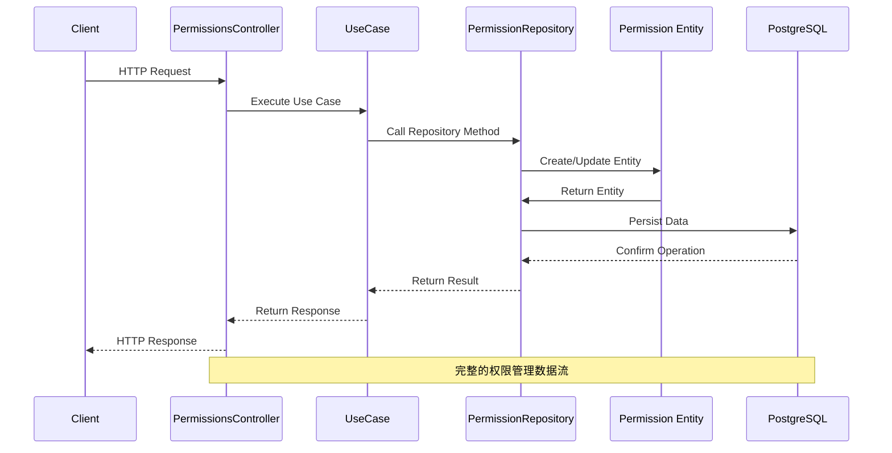
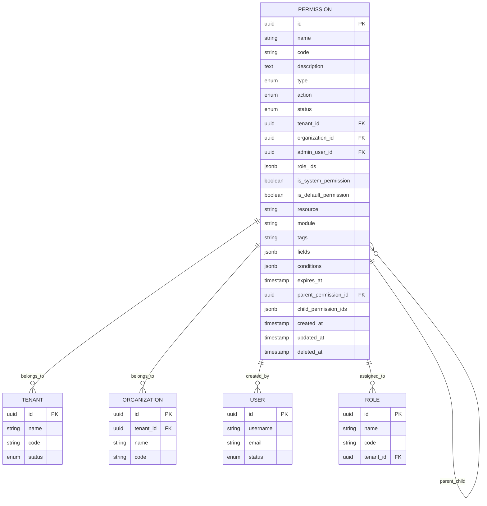
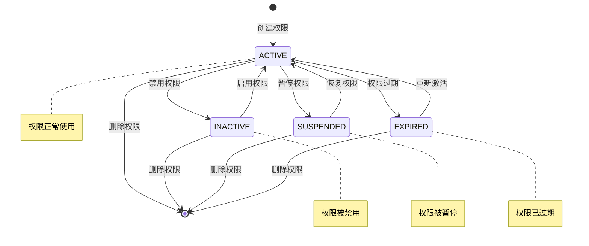
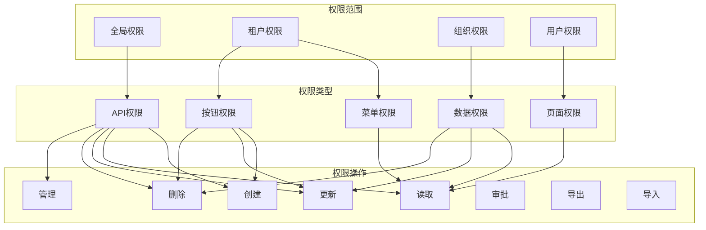
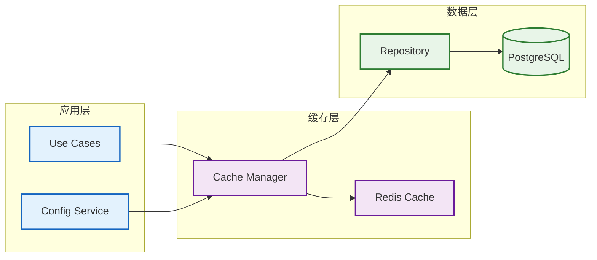
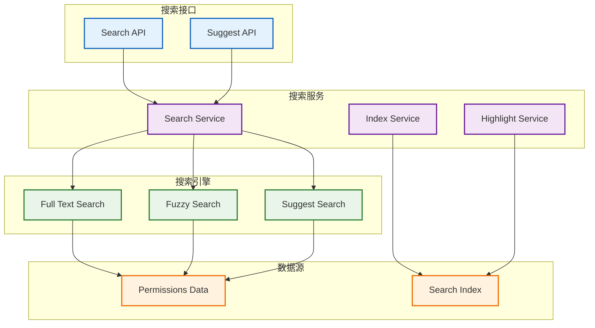
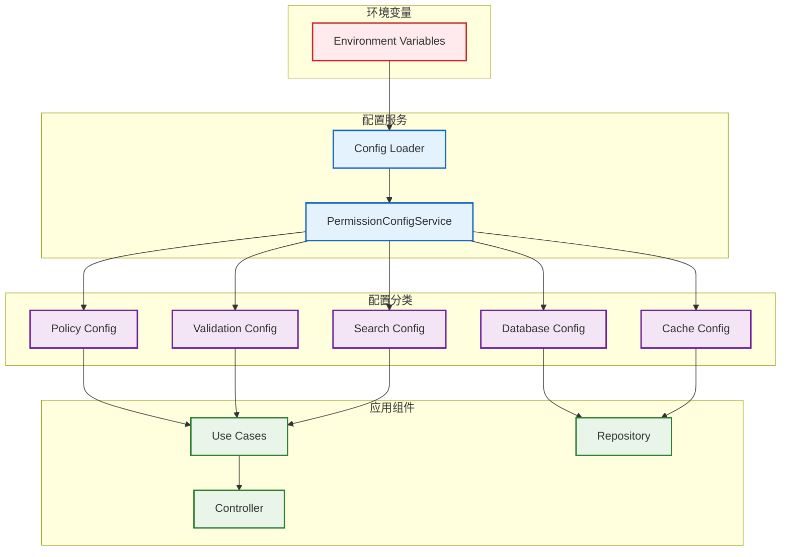

# 权限管理模块架构图

## 整体架构

```mermaid
graph TB
    subgraph "展示层 (Presentation)"
        PC[PermissionsController]
        DTO[DTOs]
        PC --> DTO
    end
    
    subgraph "应用层 (Application)"
        UC1[CreatePermissionUseCase]
        UC2[UpdatePermissionUseCase]
        UC3[DeletePermissionUseCase]
        UC4[GetPermissionUseCase]
        UC5[GetPermissionsUseCase]
        UC6[SearchPermissionsUseCase]
        UC7[CountPermissionsUseCase]
        UC8[UpdatePermissionStatusUseCase]
        UC9[GetPermissionStatisticsUseCase]
    end
    
    subgraph "领域层 (Domain)"
        PE[Permission Entity]
        VO1[PermissionAction]
        VO2[PermissionStatus]
        VO3[PermissionType]
        VO4[PermissionCondition]
        PR[PermissionRepository Interface]
        PE --> VO1
        PE --> VO2
        PE --> VO3
        PE --> VO4
    end
    
    subgraph "基础设施层 (Infrastructure)"
        POE[PermissionOrmEntity]
        PRM[PermissionRepositoryMikroOrm]
        PCS[PermissionConfigService]
        PCONF[PermissionConfig]
        PRM --> POE
        PCS --> PCONF
    end
    
    subgraph "外部依赖"
        DB[(PostgreSQL)]
        CACHE[(Redis)]
        LOG[Logger]
    end
    
    PC --> UC1
    PC --> UC2
    PC --> UC3
    PC --> UC4
    PC --> UC5
    PC --> UC6
    PC --> UC7
    PC --> UC8
    PC --> UC9
    
    UC1 --> PR
    UC2 --> PR
    UC3 --> PR
    UC4 --> PR
    UC5 --> PR
    UC6 --> PR
    UC7 --> PR
    UC8 --> PR
    UC9 --> PR
    
    PR -.-> PRM
    PRM --> DB
    PCS --> CACHE
    PCS --> LOG
    
    classDef presentation fill:#e3f2fd,stroke:#1565c0,stroke-width:2px,color:#0d47a1
    classDef application fill:#f3e5f5,stroke:#6a1b9a,stroke-width:2px,color:#4a148c
    classDef domain fill:#e8f5e8,stroke:#2e7d32,stroke-width:2px,color:#1b5e20
    classDef infrastructure fill:#fff3e0,stroke:#ef6c00,stroke-width:2px,color:#e65100
    classDef external fill:#ffebee,stroke:#c62828,stroke-width:2px,color:#b71c1c
    
    class PC,DTO presentation
    class UC1,UC2,UC3,UC4,UC5,UC6,UC7,UC8,UC9 application
    class PE,VO1,VO2,VO3,VO4,PR domain
    class POE,PRM,PCS,PCONF infrastructure
    class DB,CACHE,LOG external
```

## 数据流图

```mermaid
sequenceDiagram
    participant Client
    participant Controller as PermissionsController
    participant UseCase as UseCase
    participant Repository as PermissionRepository
    participant Entity as Permission Entity
    participant Database as PostgreSQL
    
    Client->>Controller: HTTP Request
    Controller->>UseCase: Execute Use Case
    UseCase->>Repository: Call Repository Method
    Repository->>Entity: Create/Update Entity
    Entity->>Repository: Return Entity
    Repository->>Database: Persist Data
    Database-->>Repository: Confirm Operation
    Repository-->>UseCase: Return Result
    UseCase-->>Controller: Return Response
    Controller-->>Client: HTTP Response
    
    Note over Controller,Database: 完整的权限管理数据流
```

## 权限实体关系图

```mermaid
erDiagram
    PERMISSION {
        uuid id PK
        string name
        string code
        text description
        enum type
        enum action
        enum status
        uuid tenant_id FK
        uuid organization_id FK
        uuid admin_user_id FK
        jsonb role_ids
        boolean is_system_permission
        boolean is_default_permission
        string resource
        string module
        string tags
        jsonb fields
        jsonb conditions
        timestamp expires_at
        uuid parent_permission_id FK
        jsonb child_permission_ids
        timestamp created_at
        timestamp updated_at
        timestamp deleted_at
    }
    
    TENANT {
        uuid id PK
        string name
        string code
        enum status
    }
    
    ORGANIZATION {
        uuid id PK
        uuid tenant_id FK
        string name
        string code
    }
    
    USER {
        uuid id PK
        string username
        string email
        enum status
    }
    
    ROLE {
        uuid id PK
        string name
        string code
        uuid tenant_id FK
    }
    
    PERMISSION ||--o{ TENANT : belongs_to
    PERMISSION ||--o{ ORGANIZATION : belongs_to
    PERMISSION ||--o{ USER : created_by
    PERMISSION ||--o{ ROLE : assigned_to
    PERMISSION ||--o{ PERMISSION : parent_child
```

## 权限状态转换图

```mermaid
stateDiagram-v2
    [*] --> ACTIVE : 创建权限
    ACTIVE --> INACTIVE : 禁用权限
    ACTIVE --> SUSPENDED : 暂停权限
    ACTIVE --> EXPIRED : 权限过期
    INACTIVE --> ACTIVE : 启用权限
    SUSPENDED --> ACTIVE : 恢复权限
    EXPIRED --> ACTIVE : 重新激活
    ACTIVE --> [*] : 删除权限
    INACTIVE --> [*] : 删除权限
    SUSPENDED --> [*] : 删除权限
    EXPIRED --> [*] : 删除权限
    
    note right of ACTIVE : 权限正常使用
    note right of INACTIVE : 权限被禁用
    note right of SUSPENDED : 权限被暂停
    note right of EXPIRED : 权限已过期
```

## 权限类型层次图

```mermaid
graph TD
    subgraph "权限类型"
        API[API权限]
        MENU[菜单权限]
        BUTTON[按钮权限]
        DATA[数据权限]
        PAGE[页面权限]
    end
    
    subgraph "权限操作"
        CREATE[创建]
        READ[读取]
        UPDATE[更新]
        DELETE[删除]
        MANAGE[管理]
        APPROVE[审批]
        EXPORT[导出]
        IMPORT[导入]
    end
    
    subgraph "权限范围"
        GLOBAL[全局权限]
        TENANT[租户权限]
        ORGANIZATION[组织权限]
        USER[用户权限]
    end
    
    API --> CREATE
    API --> READ
    API --> UPDATE
    API --> DELETE
    API --> MANAGE
    
    MENU --> READ
    BUTTON --> CREATE
    BUTTON --> UPDATE
    BUTTON --> DELETE
    
    DATA --> READ
    DATA --> UPDATE
    DATA --> DELETE
    
    PAGE --> READ
    
    GLOBAL --> API
    TENANT --> MENU
    TENANT --> BUTTON
    ORGANIZATION --> DATA
    USER --> PAGE
```

## 缓存架构图

```mermaid
graph LR
    subgraph "应用层"
        UC[Use Cases]
        CS[Config Service]
    end
    
    subgraph "缓存层"
        CACHE[Redis Cache]
        CACHE_MANAGER[Cache Manager]
    end
    
    subgraph "数据层"
        DB[(PostgreSQL)]
        REPO[Repository]
    end
    
    UC --> CACHE_MANAGER
    CS --> CACHE_MANAGER
    CACHE_MANAGER --> CACHE
    REPO --> DB
    CACHE_MANAGER --> REPO
    
    classDef app fill:#e3f2fd,stroke:#1565c0,stroke-width:2px
    classDef cache fill:#f3e5f5,stroke:#6a1b9a,stroke-width:2px
    classDef data fill:#e8f5e8,stroke:#2e7d32,stroke-width:2px
    
    class UC,CS app
    class CACHE,CACHE_MANAGER cache
    class DB,REPO data
```

## 搜索架构图

```mermaid
graph TB
    subgraph "搜索接口"
        SEARCH_API[Search API]
        SUGGEST_API[Suggest API]
    end
    
    subgraph "搜索服务"
        SEARCH_SERVICE[Search Service]
        INDEX_SERVICE[Index Service]
        HIGHLIGHT_SERVICE[Highlight Service]
    end
    
    subgraph "搜索引擎"
        FULL_TEXT[Full Text Search]
        FUZZY[Fuzzy Search]
        SUGGEST[Suggest Search]
    end
    
    subgraph "数据源"
        PERMISSIONS[Permissions Data]
        INDEX[Search Index]
    end
    
    SEARCH_API --> SEARCH_SERVICE
    SUGGEST_API --> SEARCH_SERVICE
    
    SEARCH_SERVICE --> FULL_TEXT
    SEARCH_SERVICE --> FUZZY
    SEARCH_SERVICE --> SUGGEST
    
    INDEX_SERVICE --> INDEX
    HIGHLIGHT_SERVICE --> INDEX
    
    FULL_TEXT --> PERMISSIONS
    FUZZY --> PERMISSIONS
    SUGGEST --> PERMISSIONS
    
    classDef api fill:#e3f2fd,stroke:#1565c0,stroke-width:2px
    classDef service fill:#f3e5f5,stroke:#6a1b9a,stroke-width:2px
    classDef engine fill:#e8f5e8,stroke:#2e7d32,stroke-width:2px
    classDef data fill:#fff3e0,stroke:#ef6c00,stroke-width:2px
    
    class SEARCH_API,SUGGEST_API api
    class SEARCH_SERVICE,INDEX_SERVICE,HIGHLIGHT_SERVICE service
    class FULL_TEXT,FUZZY,SUGGEST engine
    class PERMISSIONS,INDEX data
```

## 配置管理图

```mermaid
graph TB
    subgraph "环境变量"
        ENV[Environment Variables]
    end
    
    subgraph "配置服务"
        CONFIG_SERVICE[PermissionConfigService]
        CONFIG_LOADER[Config Loader]
    end
    
    subgraph "配置分类"
        DB_CONFIG[Database Config]
        CACHE_CONFIG[Cache Config]
        POLICY_CONFIG[Policy Config]
        VALIDATION_CONFIG[Validation Config]
        SEARCH_CONFIG[Search Config]
    end
    
    subgraph "应用组件"
        USE_CASES[Use Cases]
        REPOSITORY[Repository]
        CONTROLLER[Controller]
    end
    
    ENV --> CONFIG_LOADER
    CONFIG_LOADER --> CONFIG_SERVICE
    
    CONFIG_SERVICE --> DB_CONFIG
    CONFIG_SERVICE --> CACHE_CONFIG
    CONFIG_SERVICE --> POLICY_CONFIG
    CONFIG_SERVICE --> VALIDATION_CONFIG
    CONFIG_SERVICE --> SEARCH_CONFIG
    
    DB_CONFIG --> REPOSITORY
    CACHE_CONFIG --> REPOSITORY
    POLICY_CONFIG --> USE_CASES
    VALIDATION_CONFIG --> USE_CASES
    SEARCH_CONFIG --> USE_CASES
    
    USE_CASES --> CONTROLLER
    
    classDef env fill:#ffebee,stroke:#c62828,stroke-width:2px
    classDef config fill:#e3f2fd,stroke:#1565c0,stroke-width:2px
    classDef category fill:#f3e5f5,stroke:#6a1b9a,stroke-width:2px
    classDef component fill:#e8f5e8,stroke:#2e7d32,stroke-width:2px
    
    class ENV env
    class CONFIG_SERVICE,CONFIG_LOADER config
    class DB_CONFIG,CACHE_CONFIG,POLICY_CONFIG,VALIDATION_CONFIG,SEARCH_CONFIG category
    class USE_CASES,REPOSITORY,CONTROLLER component
``` 