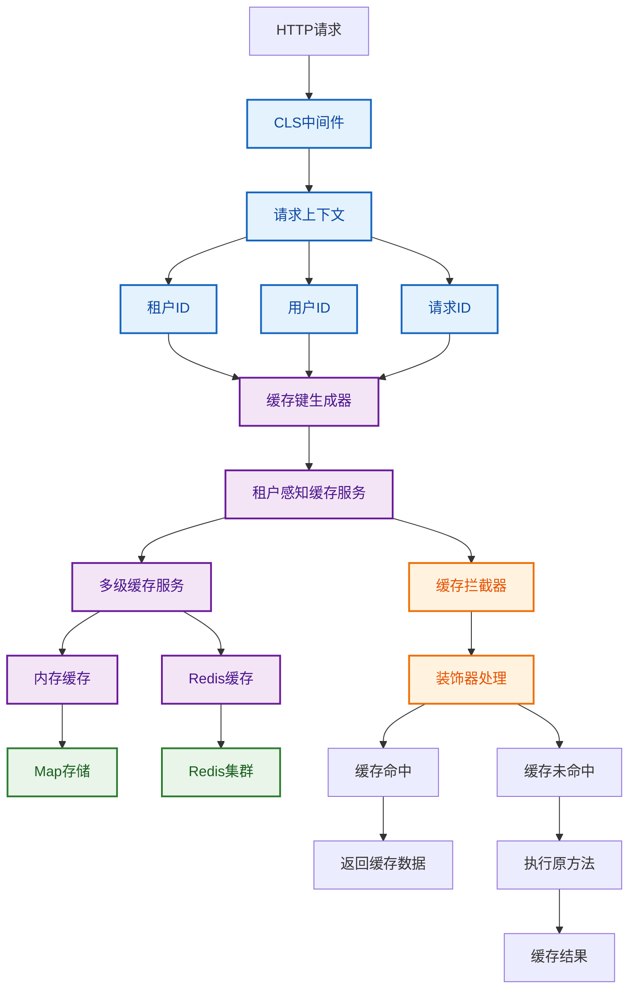

# 缓存基础设施层

基于nestjs-cls的多级缓存系统，提供租户感知的缓存解决方案。

## 架构图



## 核心组件

### 1. 配置层 (Config)
- **cache.config.ts**: 缓存配置定义
- 支持环境变量配置
- 多级缓存策略配置

### 2. 接口层 (Interfaces)
- **cache.interface.ts**: 缓存相关接口定义
- 支持多种缓存策略
- 租户感知缓存接口

### 3. 实现层 (Implementations)
- **memory-cache.service.ts**: 内存缓存实现
- 基于Map的LRU缓存
- 自动过期清理

### 4. 服务层 (Services)
- **multi-level-cache.service.ts**: 多级缓存服务
- **tenant-aware-cache.service.ts**: 租户感知缓存服务
- 支持内存+Redis多级缓存

### 5. 工具层 (Utils)
- **cache-key.generator.ts**: 基于CLS的缓存键生成器
- 自动注入请求上下文
- 租户隔离支持

### 6. 装饰器层 (Decorators)
- **cache.decorator.ts**: 缓存装饰器
- 支持多种缓存策略
- 租户和用户缓存装饰器

### 7. 拦截器层 (Interceptors)
- **cache.interceptor.ts**: 缓存拦截器
- 自动缓存处理
- 缓存失效处理

## 使用示例

### 基础缓存使用

```typescript
@Injectable()
export class UserService {
  @Cache('user:profile', { ttl: 3600 })
  async getUserProfile(userId: string): Promise<UserProfile> {
    // 方法实现
  }
}
```

### 租户感知缓存

```typescript
@Injectable()
export class TenantService {
  @TenantCache('tenant:settings', { ttl: 1800 })
  async getTenantSettings(): Promise<TenantSettings> {
    // 方法实现
  }
}
```

### 缓存失效

```typescript
@Injectable()
export class DataService {
  @InvalidateCache('user:profile')
  async updateUserProfile(userId: string, data: any): Promise<void> {
    // 更新后自动清除相关缓存
  }
}
```

### 手动缓存使用

```typescript
@Injectable()
export class CustomService {
  constructor(private readonly tenantCache: TenantAwareCacheService) {}

  async getData(): Promise<any> {
    return await this.tenantCache.getTenantData(
      'custom:key',
      async () => {
        // 数据获取逻辑
        return await this.fetchFromDatabase()
      },
      { ttl: 900 }
    )
  }
}
```

## 配置说明

### 环境变量

```bash
# 缓存开关
CACHE_ENABLED=true

# Redis配置
REDIS_HOST=localhost
REDIS_PORT=6379
REDIS_PASSWORD=
REDIS_DB=0

# 缓存策略
CACHE_STRATEGY_MEMORY_FIRST=true
CACHE_STRATEGY_REDIS_FIRST=false

# 租户配置
CACHE_TENANT_ISOLATION=true
CACHE_TENANT_PREFIX=tenant
CACHE_TENANT_TTL=1800

# 内存缓存配置
CACHE_MEMORY_MAX_SIZE=1000
CACHE_MEMORY_TTL=300
CACHE_MEMORY_STRATEGY=lru
```

### 缓存策略

1. **Memory-First**: 优先从内存获取，未命中时从Redis获取
2. **Redis-First**: 优先从Redis获取，未命中时从内存获取
3. **Write-Through**: 同时写入内存和Redis
4. **Write-Back**: 先写入内存，异步写入Redis

## 性能特性

### 多级缓存
- L1: 内存缓存（最快）
- L2: Redis缓存（分布式）
- L3: 数据库（持久化）

### 缓存隔离
- 租户级别隔离
- 用户级别隔离
- 请求级别追踪

### 自动管理
- 自动过期清理
- LRU淘汰策略
- 缓存预热
- 缓存失效

## 监控和统计

```typescript
// 获取缓存统计
const stats = await tenantCache.getStats()
console.log('Hit Rate:', stats.overallHitRate)
console.log('Memory Hit Rate:', stats.memoryHitRate)
console.log('Redis Hit Rate:', stats.redisHitRate)
```

## 最佳实践

1. **合理设置TTL**: 根据数据更新频率设置合适的过期时间
2. **使用标签**: 为缓存添加标签，便于批量失效
3. **避免缓存穿透**: 对空值也进行缓存
4. **预热关键数据**: 系统启动时预热常用数据
5. **监控缓存命中率**: 定期检查缓存效果

## 故障处理

1. **Redis连接失败**: 自动降级到内存缓存
2. **内存不足**: 自动清理过期数据
3. **缓存雪崩**: 使用随机TTL避免同时过期
4. **缓存穿透**: 对空值进行短期缓存
