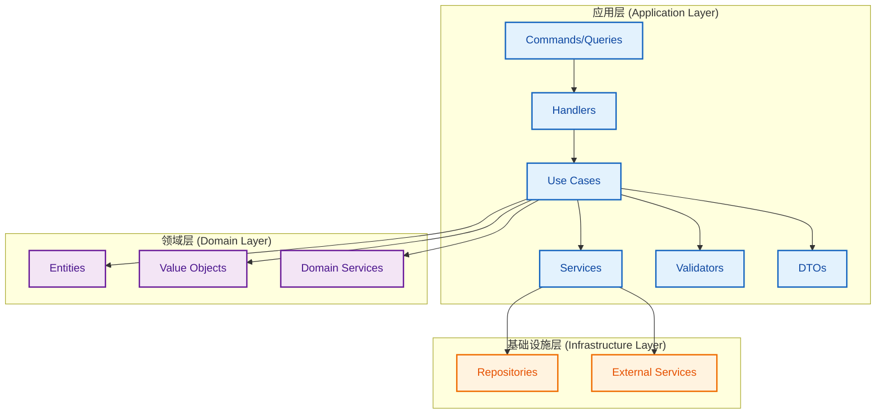

# 租户模块应用层开发文档

## 概述

本文档详细描述了租户模块应用层的架构设计、组件说明、开发规范和最佳实践。应用层采用 DDD（领域驱动设计）+ Clean Architecture（整洁架构）模式，实现了高度模块化、可维护、可扩展的架构。

## 架构设计

### 整体架构



### 分层职责

#### 1. Use Cases（用例层）
- **职责**：协调完整的业务流程
- **特点**：包含完整的业务逻辑，协调多个服务和验证器

#### 2. Handlers（处理器层）
- **职责**：接收命令/查询，委托给用例
- **特点**：专注于命令/查询的接收和分发

#### 3. Commands/Queries（命令/查询层）
- **职责**：定义业务操作的输入数据结构
- **特点**：包含验证逻辑，提供序列化功能

#### 4. DTOs（数据传输对象层）
- **职责**：定义 API 接口的数据结构
- **特点**：支持从实体转换和 JSON 序列化

#### 5. Validators（验证器层）
- **职责**：验证业务规则和数据完整性
- **特点**：集成 class-validator，提供业务规则验证

#### 6. Services（服务接口层）
- **职责**：定义应用服务契约
- **特点**：采用依赖倒置原则，确保应用层不依赖具体实现

## 目录结构

```
apps/api/src/tenants/application/
├── commands/                    # 命令
│   ├── create-tenant.command.ts
│   ├── activate-tenant.command.ts
│   └── __tests__/
├── queries/                     # 查询
│   ├── get-tenant-by-id.query.ts
│   └── __tests__/
├── use-cases/                   # 用例
│   ├── create-tenant.use-case.ts
│   ├── get-tenant-by-id.use-case.ts
│   └── __tests__/
├── handlers/                    # 处理器
│   ├── create-tenant.handler.ts
│   ├── get-tenant-by-id.handler.ts
│   └── __tests__/
├── dto/                        # 数据传输对象
│   ├── tenant.dto.ts
│   ├── admin-user.dto.ts
│   ├── tenant-settings.dto.ts
│   ├── tenant-statistics.dto.ts
│   └── __tests__/
├── validators/                 # 验证器
│   ├── tenant-validator.ts
│   └── __tests__/
├── services/                   # 服务接口
│   └── interfaces/
│       └── tenant-service.interface.ts
└── index.ts                   # 模块导出
```

## 核心组件详解

### 1. Use Cases（用例）

#### CreateTenantUseCase

```typescript
/**
 * @class CreateTenantUseCase
 * @description 创建租户用例
 * 
 * 该用例负责协调创建租户的完整业务流程，包括：
 * 1. 验证输入数据
 * 2. 执行业务规则验证
 * 3. 调用领域服务创建租户
 * 4. 处理结果和异常
 */
@Injectable()
export class CreateTenantUseCase {
  async execute(command: CreateTenantCommand): Promise<CreateTenantUseCaseResult>
}
```

**主要功能**：
- 验证命令数据的有效性
- 执行业务规则验证（租户编码唯一性、名称唯一性等）
- 调用租户服务创建租户
- 处理异常和错误情况
- 记录操作日志

#### GetTenantByIdUseCase

```typescript
/**
 * @class GetTenantByIdUseCase
 * @description 根据ID查询租户用例
 * 
 * 该用例负责协调查询租户的完整业务流程，包括：
 * 1. 验证查询参数
 * 2. 检查访问权限
 * 3. 调用服务获取租户数据
 * 4. 处理结果和异常
 */
@Injectable()
export class GetTenantByIdUseCase {
  async execute(query: GetTenantByIdQuery): Promise<GetTenantByIdUseCaseResult>
}
```

**主要功能**：
- 验证查询参数的有效性
- 检查用户访问权限
- 获取租户详细信息
- 处理权限验证失败的情况
- 记录查询日志

### 2. Commands（命令）

#### CreateTenantCommand

```typescript
/**
 * @class CreateTenantCommand
 * @description 创建租户命令
 * 
 * 该命令包含创建租户所需的所有数据，包括：
 * - 租户基本信息（名称、编码、描述）
 * - 管理员用户信息
 * - 租户设置
 * - 元数据信息
 */
export class CreateTenantCommand {
  readonly commandId: string
  readonly data: CreateTenantCommandDto
  
  constructor(data: CreateTenantCommandDto)
  validate(): void
  toJSON(): object
  toString(): string
}
```

**数据结构**：
```typescript
export interface CreateTenantCommandDto {
  name: string                    // 租户名称
  code: string                    // 租户编码
  description?: string            // 租户描述
  adminUserInfo: AdminUserInfoDto // 管理员用户信息
  settings?: Record<string, any>  // 租户设置
  metadata?: Record<string, any>  // 元数据
  createdBy: string              // 创建者ID
}
```

#### ActivateTenantCommand

```typescript
/**
 * @class ActivateTenantCommand
 * @description 激活租户命令
 * 
 * 该命令用于激活已创建的租户，使其可以正常使用
 */
export class ActivateTenantCommand {
  readonly commandId: string
  readonly data: ActivateTenantCommandDto
  
  constructor(data: ActivateTenantCommandDto)
  validate(): void
  toJSON(): object
  toString(): string
}
```

### 3. Queries（查询）

#### GetTenantByIdQuery

```typescript
/**
 * @class GetTenantByIdQuery
 * @description 根据ID查询租户查询
 * 
 * 该查询用于获取指定租户的详细信息，支持包含关联数据
 */
export class GetTenantByIdQuery {
  readonly queryId: string
  readonly data: GetTenantByIdQueryDto
  
  constructor(data: GetTenantByIdQueryDto)
  validate(): void
  toJSON(): object
  toString(): string
}
```

**数据结构**：
```typescript
export interface GetTenantByIdQueryDto {
  tenantId: string               // 租户ID
  requestedBy: string           // 请求者ID
  includeAdminUser?: boolean    // 是否包含管理员用户信息
  includeSettings?: boolean     // 是否包含设置信息
  includeStatistics?: boolean   // 是否包含统计信息
}
```

### 4. DTOs（数据传输对象）

#### TenantDto

```typescript
/**
 * @class TenantDto
 * @description 租户数据传输对象
 * 
 * 该DTO用于在应用层和表现层之间传输租户数据
 */
export class TenantDto {
  id: string                    // 租户ID
  name: string                  // 租户名称
  code: string                  // 租户编码
  description?: string          // 租户描述
  status: string               // 租户状态
  adminUserId?: string         // 管理员用户ID
  adminUser?: AdminUserDto     // 管理员用户信息
  settings?: TenantSettingsDto // 租户设置
  statistics?: TenantStatisticsDto // 租户统计
  createdAt?: Date             // 创建时间
  updatedAt?: Date             // 更新时间
  createdBy?: string           // 创建者
  updatedBy?: string           // 更新者
  
  static fromEntity(entity: any): TenantDto
  toJSON(): object
}
```

#### AdminUserDto

```typescript
/**
 * @class AdminUserDto
 * @description 管理员用户数据传输对象
 */
export class AdminUserDto {
  id: string                   // 用户ID
  username: string             // 用户名
  email: string               // 邮箱
  firstName: string           // 名
  lastName: string            // 姓
  status: string              // 用户状态
  createdAt?: Date            // 创建时间
  updatedAt?: Date            // 更新时间
  
  static fromEntity(entity: any): AdminUserDto
  toJSON(): object
}
```

### 5. Validators（验证器）

#### TenantValidator

```typescript
/**
 * @class TenantValidator
 * @description 租户验证器
 * 
 * 该验证器负责验证租户相关的业务规则和数据完整性
 */
@Injectable()
export class TenantValidator {
  // 验证创建租户数据
  async validateCreateTenant(data: CreateTenantData): Promise<ValidationResult>
  
  // 验证激活租户数据
  async validateActivateTenant(data: ActivateTenantData): Promise<ValidationResult>
  
  // 验证租户访问权限
  validateTenantAccess(tenant: Tenant, userId: string): ValidationResult
  
  // 验证租户编码唯一性
  validateTenantCodeUniqueness(code: string, existingTenants: Tenant[]): ValidationResult
  
  // 验证租户名称唯一性
  validateTenantNameUniqueness(name: string, existingTenants: Tenant[]): ValidationResult
}
```

**验证规则**：
- 租户名称：2-50个字符，不能为空
- 租户编码：字母开头，只能包含字母、数字、下划线
- 邮箱格式：有效的邮箱地址格式
- 密码长度：最少6个字符
- 租户编码唯一性：不能与现有租户编码重复
- 租户名称唯一性：不能与现有租户名称重复

### 6. Services（服务接口）

#### ITenantService

```typescript
/**
 * @interface ITenantService
 * @description 租户服务接口
 * 
 * 该接口定义了租户相关的所有业务操作契约
 */
export interface ITenantService {
  // 租户生命周期管理
  createTenant(command: CreateTenantCommand): Promise<CreateTenantResult>
  activateTenant(command: ActivateTenantCommand): Promise<ActivateTenantResult>
  suspendTenant(command: SuspendTenantCommand): Promise<SuspendTenantResult>
  deleteTenant(command: DeleteTenantCommand): Promise<DeleteTenantResult>
  restoreTenant(command: RestoreTenantCommand): Promise<RestoreTenantResult>

  // 租户查询
  getTenantById(query: GetTenantByIdQuery): Promise<GetTenantByIdResult>
  searchTenants(query: SearchTenantsQuery): Promise<SearchTenantsResult>
  getAllTenants(query: GetAllTenantsQuery): Promise<GetAllTenantsResult>

  // 租户配置管理
  updateTenantSettings(command: UpdateTenantSettingsCommand): Promise<UpdateTenantSettingsResult>
  getTenantSettings(query: GetTenantSettingsQuery): Promise<GetTenantSettingsResult>

  // 租户统计
  getTenantStatistics(query: GetTenantStatisticsQuery): Promise<GetTenantStatisticsResult>
}
```

## 开发规范

### 1. 命名规范

#### 文件命名
- 命令文件：`kebab-case.command.ts`
- 查询文件：`kebab-case.query.ts`
- 用例文件：`kebab-case.use-case.ts`
- 处理器文件：`kebab-case.handler.ts`
- DTO文件：`kebab-case.dto.ts`
- 验证器文件：`kebab-case.validator.ts`

#### 类命名
- 命令类：`PascalCaseCommand`
- 查询类：`PascalCaseQuery`
- 用例类：`PascalCaseUseCase`
- 处理器类：`PascalCaseHandler`
- DTO类：`PascalCaseDto`
- 验证器类：`PascalCaseValidator`

#### 接口命名
- 服务接口：`IPascalCaseService`
- 结果接口：`PascalCaseResult`
- 数据接口：`PascalCaseData`

### 2. 代码组织

#### 文件结构
```typescript
// 1. 导入语句
import { ... } from '...'

// 2. 接口定义
export interface InterfaceName {
  // ...
}

// 3. 类定义
@Injectable()
export class ClassName {
  // 构造函数
  constructor(...) { ... }
  
  // 公共方法
  public methodName(): void { ... }
  
  // 私有方法
  private privateMethod(): void { ... }
}
```

#### 注释规范
```typescript
/**
 * @class ClassName
 * @description 类的详细描述
 * 
 * 主要原理与机制：
 * 1. 功能点1
 * 2. 功能点2
 * 3. 功能点3
 */
export class ClassName {
  /**
   * @method methodName
   * @description 方法的详细描述
   * @param param1 参数1的描述
   * @param param2 参数2的描述
   * @returns 返回值的描述
   */
  methodName(param1: string, param2: number): boolean {
    // 方法实现
  }
}
```

### 3. 测试规范

#### 测试文件结构
```typescript
describe('ClassName', () => {
  let instance: ClassName
  let mockDependency: jest.Mocked<Dependency>

  beforeEach(async () => {
    // 设置测试环境
  })

  describe('methodName', () => {
    it('应该成功执行正常情况', async () => {
      // 测试正常情况
    })

    it('应该在异常情况下返回错误', async () => {
      // 测试异常情况
    })
  })
})
```

#### 测试命名
- 测试套件：`ClassName`
- 测试方法：`methodName`
- 测试用例：`应该...` 或 `应该在...时...`

### 4. 依赖注入

#### 服务注册
```typescript
// 在模块中注册服务
@Module({
  providers: [
    CreateTenantUseCase,
    GetTenantByIdUseCase,
    TenantValidator,
    {
      provide: TENANT_SERVICE_TOKEN,
      useClass: TenantService,
    },
  ],
})
export class TenantsApplicationModule {}
```

#### 依赖注入令牌
```typescript
// 定义依赖注入令牌
export const TENANT_SERVICE_TOKEN = 'TENANT_SERVICE_TOKEN'

// 使用令牌注入服务
constructor(
  @Inject(TENANT_SERVICE_TOKEN)
  private readonly tenantService: ITenantService,
) {}
```

## 最佳实践

### 1. 错误处理

#### 统一错误处理
```typescript
try {
  // 业务逻辑
} catch (error) {
  this.logger.error('操作失败', error)
  return {
    success: false,
    error: (error as Error).message,
  }
}
```

#### 验证结果处理
```typescript
const validationResult = await this.validator.validate(data)
if (!validationResult.isValid) {
  return {
    success: false,
    error: validationResult.errors.join('; '),
    warnings: validationResult.warnings,
  }
}
```

### 2. 日志记录

#### 结构化日志
```typescript
const logData = {
  commandId: command.commandId,
  tenantName: command.data.name,
  success: result.success,
  timestamp: new Date().toISOString(),
}

if (result.success) {
  this.logger.log('操作成功', logData)
} else {
  this.logger.error('操作失败', logData)
}
```

### 3. 数据验证

#### 使用 class-validator
```typescript
import { IsString, IsEmail, MinLength, IsOptional } from 'class-validator'

export class CreateTenantCommandDto {
  @IsString()
  @MinLength(2)
  name: string

  @IsString()
  @Matches(/^[a-zA-Z][a-zA-Z0-9_]*$/)
  code: string

  @IsEmail()
  email: string
}
```

### 4. 类型安全

#### 严格类型定义
```typescript
// 使用接口定义数据结构
export interface CreateTenantResult {
  success: boolean
  tenantId?: string
  adminUserId?: string
  error?: string
}

// 使用类型别名简化复杂类型
export type ValidationResult = {
  isValid: boolean
  errors: string[]
  warnings: string[]
}
```

## 扩展指南

### 1. 添加新的 Use Case

```typescript
// 1. 创建用例文件
@Injectable()
export class NewUseCase {
  constructor(
    private readonly service: IService,
    private readonly validator: Validator,
    logger: Logger,
  ) {}

  async execute(command: Command): Promise<Result> {
    // 实现业务逻辑
  }
}

// 2. 创建对应的测试文件
describe('NewUseCase', () => {
  // 编写测试用例
})

// 3. 在模块中注册
@Module({
  providers: [NewUseCase],
})
export class ApplicationModule {}
```

### 2. 添加新的 Command/Query

```typescript
// 1. 创建命令/查询类
export class NewCommand {
  readonly commandId: string
  readonly data: NewCommandDto

  constructor(data: NewCommandDto) {
    this.commandId = generateId()
    this.data = data
  }

  validate(): void {
    // 实现验证逻辑
  }
}

// 2. 创建对应的 DTO
export interface NewCommandDto {
  // 定义数据结构
}

// 3. 创建测试文件
describe('NewCommand', () => {
  // 编写测试用例
})
```

### 3. 添加新的 DTO

```typescript
// 1. 创建 DTO 类
export class NewDto {
  // 定义属性

  static fromEntity(entity: any): NewDto {
    // 实现从实体转换的逻辑
  }

  toJSON(): object {
    // 实现序列化逻辑
  }
}

// 2. 创建测试文件
describe('NewDto', () => {
  // 编写测试用例
})
```

## 性能优化

### 1. 缓存策略
- 对频繁查询的数据进行缓存
- 使用 Redis 等缓存系统
- 实现缓存失效策略

### 2. 异步处理
- 使用异步方法处理耗时操作
- 实现事件驱动架构
- 使用消息队列处理大量请求

### 3. 数据库优化
- 使用索引优化查询性能
- 实现分页查询
- 使用连接池管理数据库连接

## 安全考虑

### 1. 输入验证
- 对所有输入数据进行验证
- 使用白名单验证允许的字符
- 防止 SQL 注入和 XSS 攻击

### 2. 权限控制
- 实现基于角色的访问控制（RBAC）
- 验证用户权限
- 记录敏感操作的审计日志

### 3. 数据保护
- 对敏感数据进行加密
- 实现数据脱敏
- 遵守数据保护法规

## 总结

应用层作为整个系统的核心，承担着协调业务逻辑的重要职责。通过采用 DDD 和 Clean Architecture 的设计原则，我们实现了：

1. **清晰的职责分离**：每个组件都有明确的职责
2. **高度的可测试性**：所有组件都可以独立测试
3. **良好的可维护性**：代码结构清晰，易于理解和修改
4. **强大的可扩展性**：可以轻松添加新的功能

这种架构设计为后续的基础设施层和表现层开发奠定了坚实的基础。