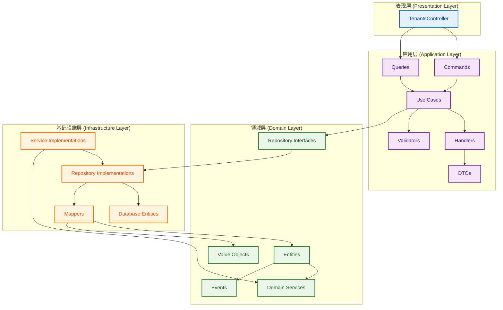
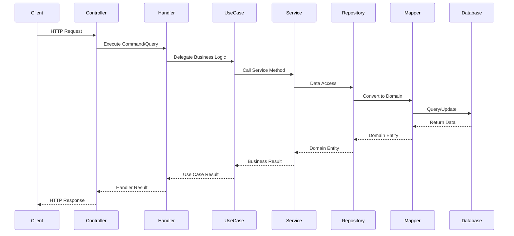
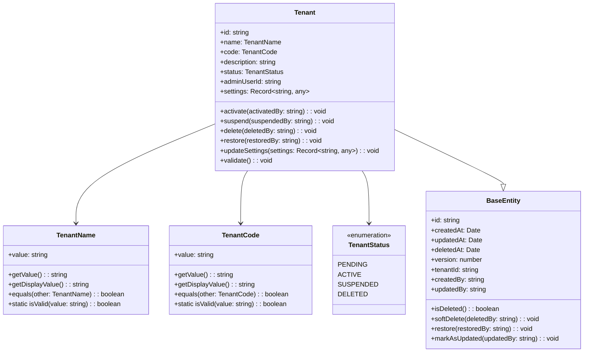
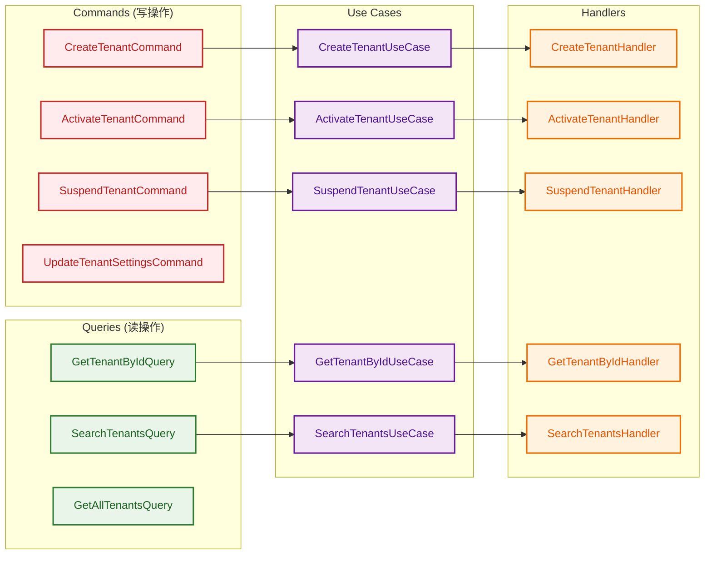
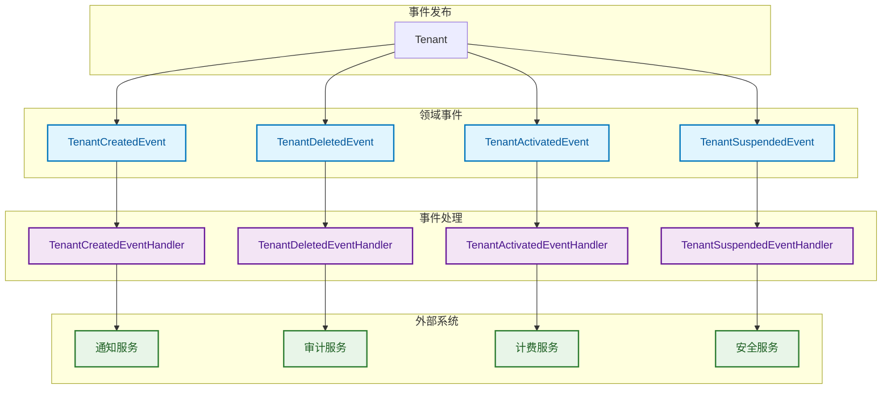
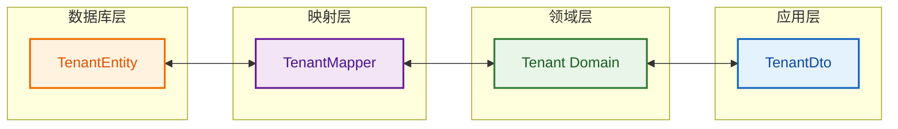
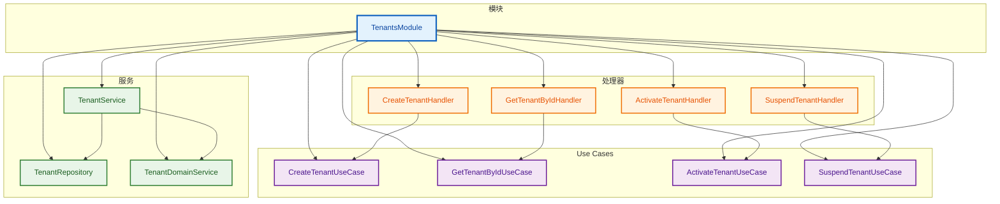

# 租户子领域架构图

## 整体架构

```mermaid
graph TB
    subgraph "表现层 (Presentation Layer)"
        Controller[TenantsController]
    end
    
    subgraph "应用层 (Application Layer)"
        Commands[Commands]
        Queries[Queries]
        UseCases[Use Cases]
        Handlers[Handlers]
        DTOs[DTOs]
        Validators[Validators]
    end
    
    subgraph "领域层 (Domain Layer)"
        Entities[Entities]
        ValueObjects[Value Objects]
        DomainServices[Domain Services]
        Events[Events]
        RepoInterface[Repository Interfaces]
    end
    
    subgraph "基础设施层 (Infrastructure Layer)"
        DBEntities[Database Entities]
        Mappers[Mappers]
        RepoImpl[Repository Implementations]
        ServiceImpl[Service Implementations]
    end
    
    Controller --> Commands
    Controller --> Queries
    Commands --> UseCases
    Queries --> UseCases
    UseCases --> Handlers
    Handlers --> DTOs
    UseCases --> Validators
    UseCases --> RepoInterface
    RepoInterface --> RepoImpl
    RepoImpl --> DBEntities
    RepoImpl --> Mappers
    Mappers --> Entities
    Mappers --> ValueObjects
    Entities --> DomainServices
    Entities --> Events
    ServiceImpl --> RepoImpl
    ServiceImpl --> DomainServices
    
    classDef presentation fill:#e3f2fd,stroke:#1565c0,stroke-width:2px,color:#0d47a1
    classDef application fill:#f3e5f5,stroke:#6a1b9a,stroke-width:2px,color:#4a148c
    classDef domain fill:#e8f5e8,stroke:#2e7d32,stroke-width:2px,color:#1b5e20
    classDef infrastructure fill:#fff3e0,stroke:#ef6c00,stroke-width:2px,color:#e65100
    
    class Controller presentation
    class Commands,Queries,UseCases,Handlers,DTOs,Validators application
    class Entities,ValueObjects,DomainServices,Events,RepoInterface domain
    class DBEntities,Mappers,RepoImpl,ServiceImpl infrastructure
```

## 数据流图

```mermaid
sequenceDiagram
    participant Client
    participant Controller
    participant Handler
    participant UseCase
    participant Service
    participant Repository
    participant Mapper
    participant Database
    
    Client->>Controller: HTTP Request
    Controller->>Handler: Execute Command/Query
    Handler->>UseCase: Delegate Business Logic
    UseCase->>Service: Call Service Method
    Service->>Repository: Data Access
    Repository->>Mapper: Convert to Domain
    Mapper->>Database: Query/Update
    Database-->>Mapper: Return Data
    Mapper-->>Repository: Domain Entity
    Repository-->>Service: Domain Entity
    Service-->>UseCase: Business Result
    UseCase-->>Handler: Use Case Result
    Handler-->>Controller: Handler Result
    Controller-->>Client: HTTP Response
```

## 领域模型

```mermaid
classDiagram
    class Tenant {
        +id: string
        +name: TenantName
        +code: TenantCode
        +description: string
        +status: TenantStatus
        +adminUserId: string
        +settings: Record~string, any~
        +activate(activatedBy: string): void
        +suspend(suspendedBy: string): void
        +delete(deletedBy: string): void
        +restore(restoredBy: string): void
        +updateSettings(settings: Record~string, any~): void
        +validate(): void
    }
    
    class TenantName {
        +value: string
        +getValue(): string
        +getDisplayValue(): string
        +equals(other: TenantName): boolean
        +static isValid(value: string): boolean
    }
    
    class TenantCode {
        +value: string
        +getValue(): string
        +getDisplayValue(): string
        +equals(other: TenantCode): boolean
        +static isValid(value: string): boolean
    }
    
    class TenantStatus {
        <<enumeration>>
        PENDING
        ACTIVE
        SUSPENDED
        DELETED
    }
    
    class BaseEntity {
        +id: string
        +createdAt: Date
        +updatedAt: Date
        +deletedAt: Date
        +version: number
        +tenantId: string
        +createdBy: string
        +updatedBy: string
        +isDeleted(): boolean
        +softDelete(deletedBy: string): void
        +restore(restoredBy: string): void
        +markAsUpdated(updatedBy: string): void
    }
    
    Tenant --> TenantName
    Tenant --> TenantCode
    Tenant --> TenantStatus
    Tenant --|> BaseEntity
```

## CQRS模式

```mermaid
graph LR
    subgraph "Commands (写操作)"
        CreateTenant[CreateTenantCommand]
        ActivateTenant[ActivateTenantCommand]
        SuspendTenant[SuspendTenantCommand]
        UpdateSettings[UpdateTenantSettingsCommand]
    end
    
    subgraph "Queries (读操作)"
        GetTenantById[GetTenantByIdQuery]
        SearchTenants[SearchTenantsQuery]
        GetAllTenants[GetAllTenantsQuery]
    end
    
    subgraph "Use Cases"
        CreateUseCase[CreateTenantUseCase]
        ActivateUseCase[ActivateTenantUseCase]
        SuspendUseCase[SuspendTenantUseCase]
        GetUseCase[GetTenantByIdUseCase]
        SearchUseCase[SearchTenantsUseCase]
    end
    
    subgraph "Handlers"
        CreateHandler[CreateTenantHandler]
        ActivateHandler[ActivateTenantHandler]
        SuspendHandler[SuspendTenantHandler]
        GetHandler[GetTenantByIdHandler]
        SearchHandler[SearchTenantsHandler]
    end
    
    CreateTenant --> CreateUseCase
    ActivateTenant --> ActivateUseCase
    SuspendTenant --> SuspendUseCase
    GetTenantById --> GetUseCase
    SearchTenants --> SearchUseCase
    
    CreateUseCase --> CreateHandler
    ActivateUseCase --> ActivateHandler
    SuspendUseCase --> SuspendHandler
    GetUseCase --> GetHandler
    SearchUseCase --> SearchHandler
    
    classDef command fill:#ffebee,stroke:#c62828,stroke-width:2px,color:#b71c1c
    classDef query fill:#e8f5e8,stroke:#2e7d32,stroke-width:2px,color:#1b5e20
    classDef usecase fill:#f3e5f5,stroke:#6a1b9a,stroke-width:2px,color:#4a148c
    classDef handler fill:#fff3e0,stroke:#ef6c00,stroke-width:2px,color:#e65100
    
    class CreateTenant,ActivateTenant,SuspendTenant,UpdateSettings command
    class GetTenantById,SearchTenants,GetAllTenants query
    class CreateUseCase,ActivateUseCase,SuspendUseCase,GetUseCase,SearchUseCase usecase
    class CreateHandler,ActivateHandler,SuspendHandler,GetHandler,SearchHandler handler
```

## 事件驱动架构

```mermaid
graph TD
    subgraph "领域事件"
        TenantCreated[TenantCreatedEvent]
        TenantDeleted[TenantDeletedEvent]
        TenantActivated[TenantActivatedEvent]
        TenantSuspended[TenantSuspendedEvent]
    end
    
    subgraph "事件发布"
        Tenant --> TenantCreated
        Tenant --> TenantDeleted
        Tenant --> TenantActivated
        Tenant --> TenantSuspended
    end
    
    subgraph "事件处理"
        TenantCreated --> EventHandler1[TenantCreatedEventHandler]
        TenantDeleted --> EventHandler2[TenantDeletedEventHandler]
        TenantActivated --> EventHandler3[TenantActivatedEventHandler]
        TenantSuspended --> EventHandler4[TenantSuspendedEventHandler]
    end
    
    subgraph "外部系统"
        EventHandler1 --> NotificationService[通知服务]
        EventHandler2 --> AuditService[审计服务]
        EventHandler3 --> BillingService[计费服务]
        EventHandler4 --> SecurityService[安全服务]
    end
    
    classDef event fill:#e1f5fe,stroke:#0277bd,stroke-width:2px,color:#01579b
    classDef handler fill:#f3e5f5,stroke:#6a1b9a,stroke-width:2px,color:#4a148c
    classDef service fill:#e8f5e8,stroke:#2e7d32,stroke-width:2px,color:#1b5e20
    
    class TenantCreated,TenantDeleted,TenantActivated,TenantSuspended event
    class EventHandler1,EventHandler2,EventHandler3,EventHandler4 handler
    class NotificationService,AuditService,BillingService,SecurityService service
```

## 数据映射

```mermaid
graph LR
    subgraph "数据库层"
        TenantEntity[TenantEntity]
    end
    
    subgraph "映射层"
        TenantMapper[TenantMapper]
    end
    
    subgraph "领域层"
        TenantDomain[Tenant Domain]
    end
    
    subgraph "应用层"
        TenantDto[TenantDto]
    end
    
    TenantEntity <--> TenantMapper
    TenantMapper <--> TenantDomain
    TenantDomain <--> TenantDto
    
    classDef database fill:#fff3e0,stroke:#ef6c00,stroke-width:2px,color:#e65100
    classDef mapper fill:#f3e5f5,stroke:#6a1b9a,stroke-width:2px,color:#4a148c
    classDef domain fill:#e8f5e8,stroke:#2e7d32,stroke-width:2px,color:#1b5e20
    classDef dto fill:#e3f2fd,stroke:#1565c0,stroke-width:2px,color:#0d47a1
    
    class TenantEntity database
    class TenantMapper mapper
    class TenantDomain domain
    class TenantDto dto
```

## 依赖注入

```mermaid
graph TD
    subgraph "模块"
        TenantsModule[TenantsModule]
    end
    
    subgraph "服务"
        TenantService[TenantService]
        TenantRepository[TenantRepository]
        TenantDomainService[TenantDomainService]
    end
    
    subgraph "处理器"
        CreateHandler[CreateTenantHandler]
        GetHandler[GetTenantByIdHandler]
        ActivateHandler[ActivateTenantHandler]
        SuspendHandler[SuspendTenantHandler]
    end
    
    subgraph "Use Cases"
        CreateUseCase[CreateTenantUseCase]
        GetUseCase[GetTenantByIdUseCase]
        ActivateUseCase[ActivateTenantUseCase]
        SuspendUseCase[SuspendTenantUseCase]
    end
    
    TenantsModule --> TenantService
    TenantsModule --> TenantRepository
    TenantsModule --> TenantDomainService
    TenantsModule --> CreateHandler
    TenantsModule --> GetHandler
    TenantsModule --> ActivateHandler
    TenantsModule --> SuspendHandler
    TenantsModule --> CreateUseCase
    TenantsModule --> GetUseCase
    TenantsModule --> ActivateUseCase
    TenantsModule --> SuspendUseCase
    
    TenantService --> TenantRepository
    TenantService --> TenantDomainService
    CreateHandler --> CreateUseCase
    GetHandler --> GetUseCase
    ActivateHandler --> ActivateUseCase
    SuspendHandler --> SuspendUseCase
    
    classDef module fill:#e3f2fd,stroke:#1565c0,stroke-width:3px,color:#0d47a1
    classDef service fill:#e8f5e8,stroke:#2e7d32,stroke-width:2px,color:#1b5e20
    classDef handler fill:#fff3e0,stroke:#ef6c00,stroke-width:2px,color:#e65100
    classDef usecase fill:#f3e5f5,stroke:#6a1b9a,stroke-width:2px,color:#4a148c
    
    class TenantsModule module
    class TenantService,TenantRepository,TenantDomainService service
    class CreateHandler,GetHandler,ActivateHandler,SuspendHandler handler
    class CreateUseCase,GetUseCase,ActivateUseCase,SuspendUseCase usecase
```
