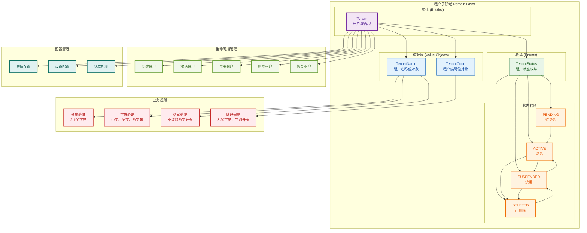
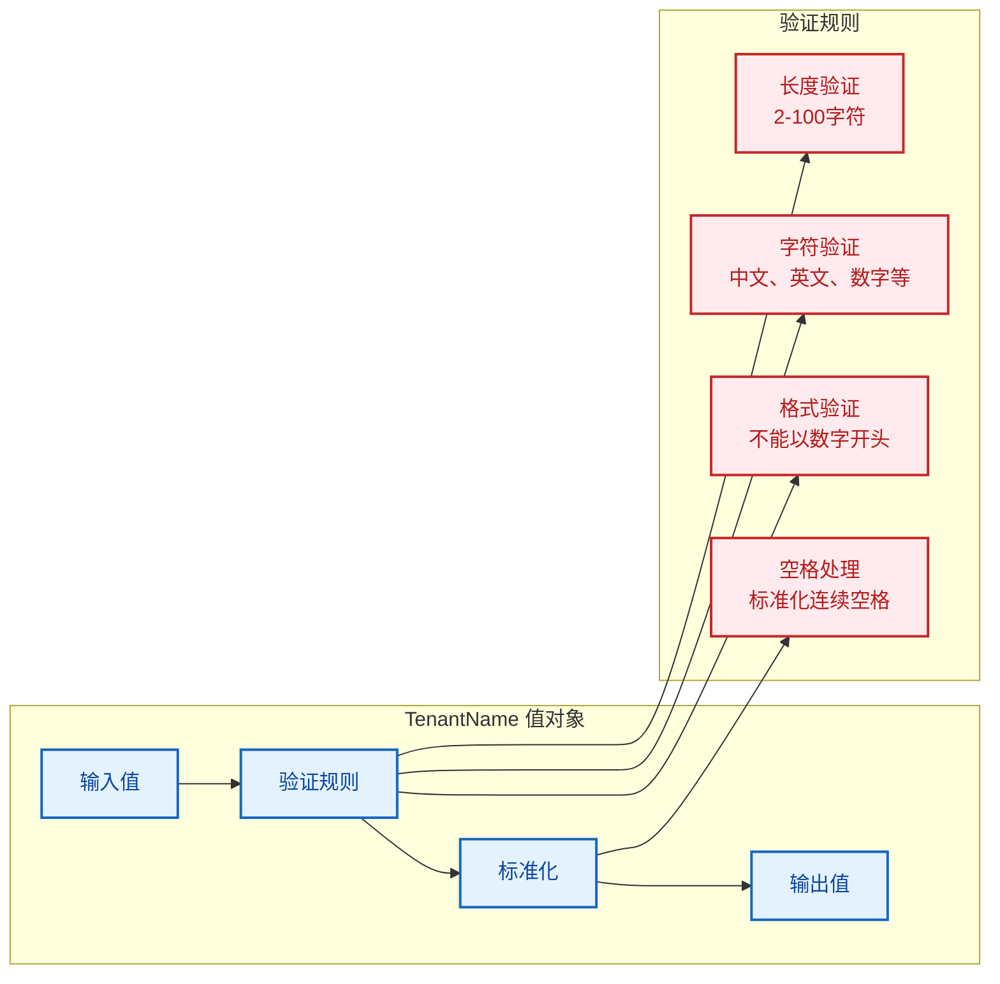
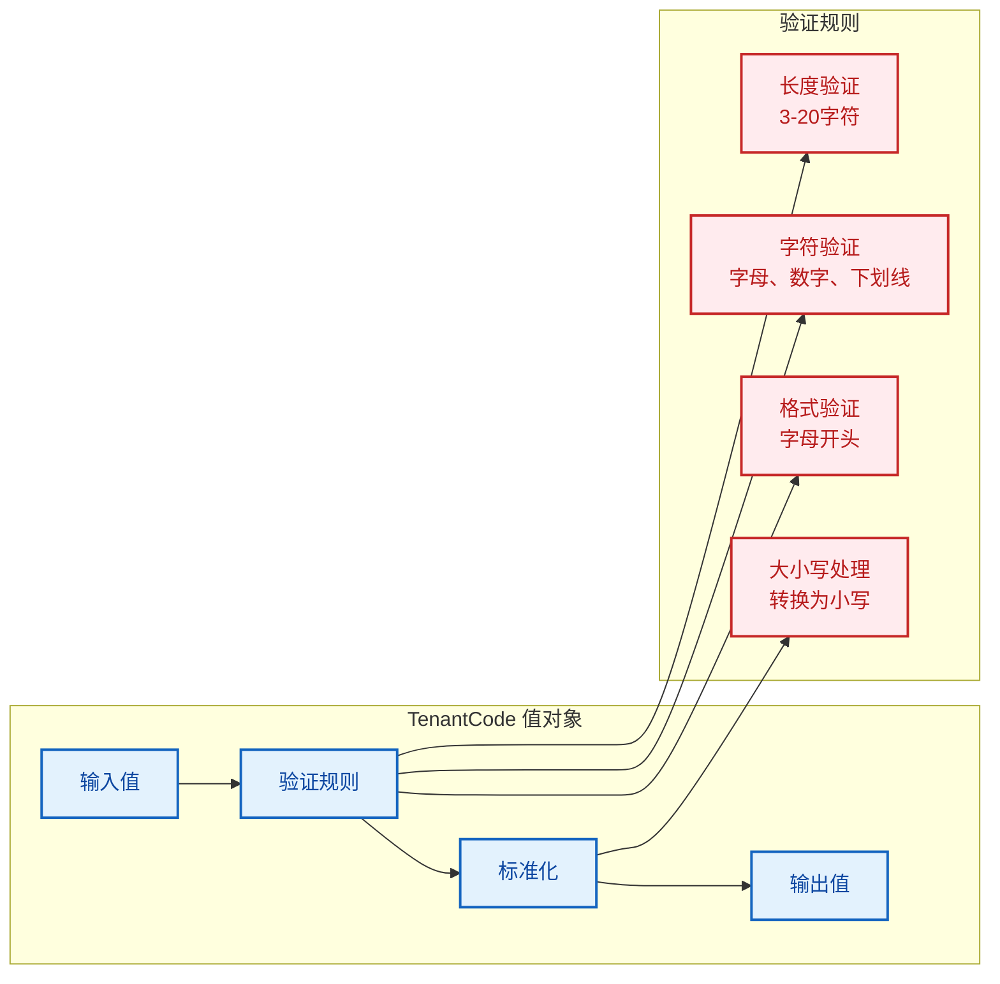
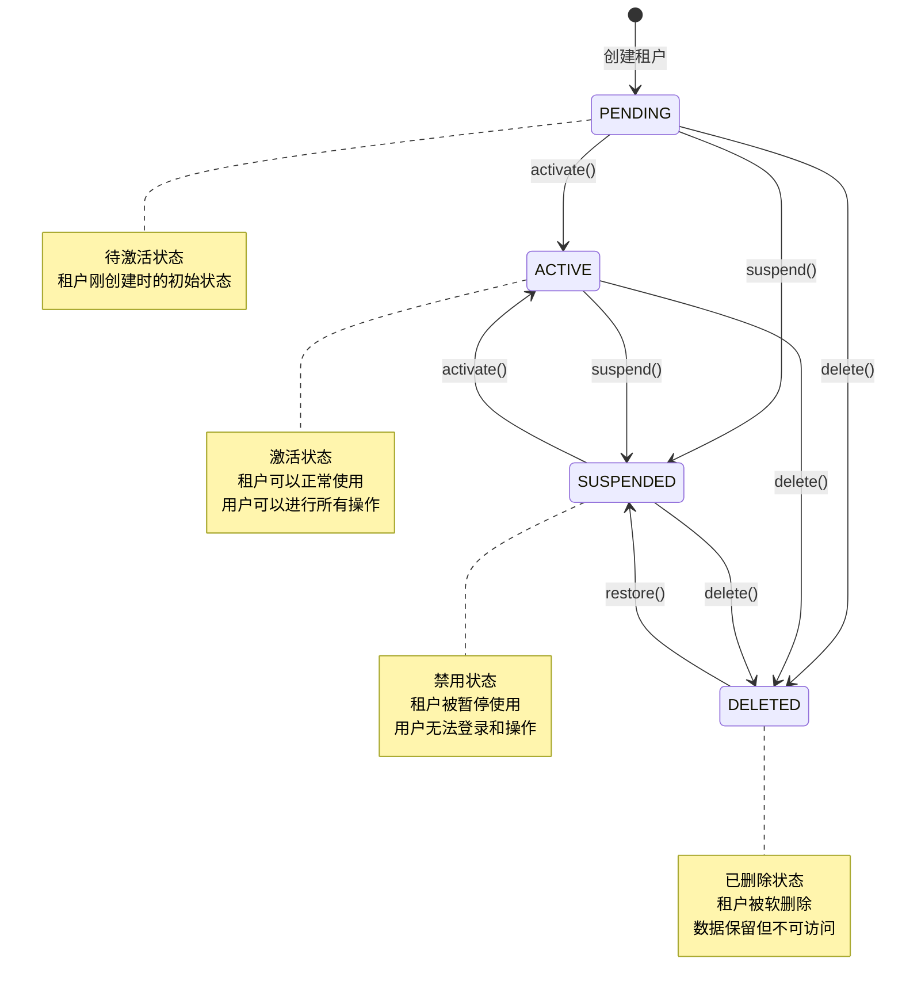
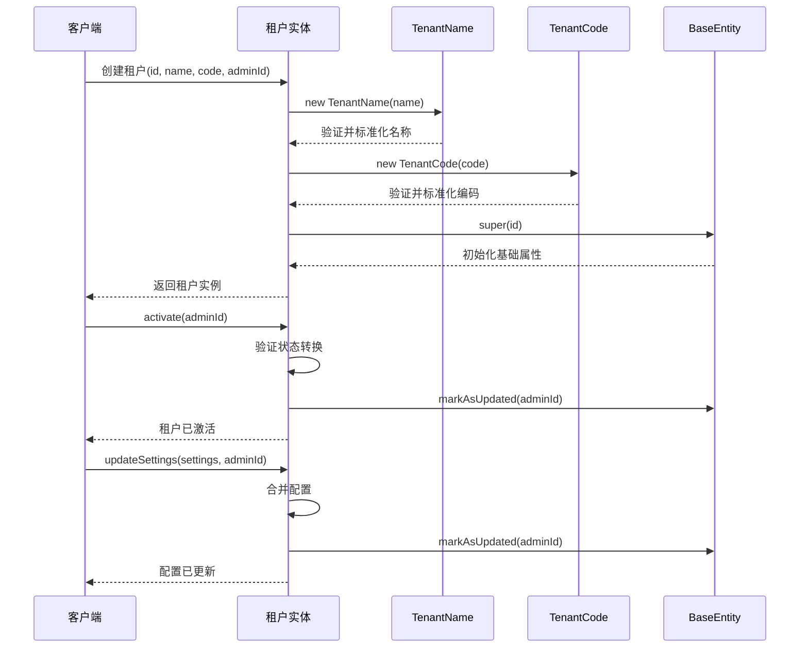
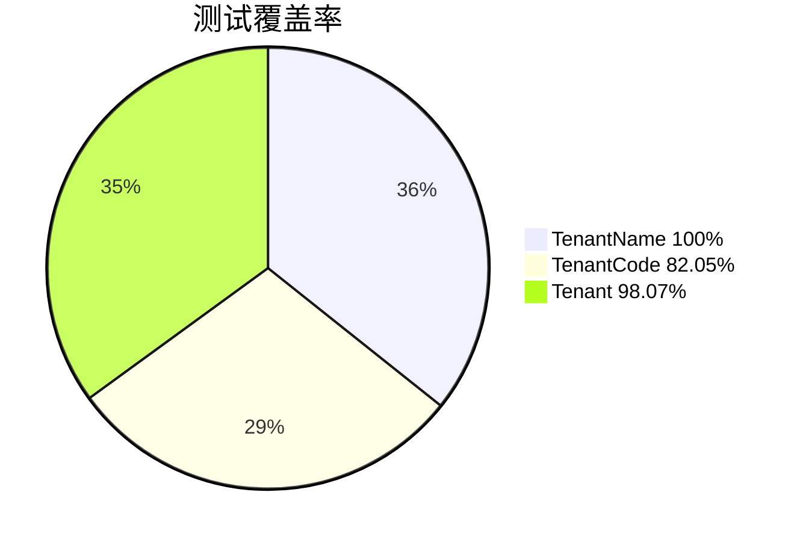
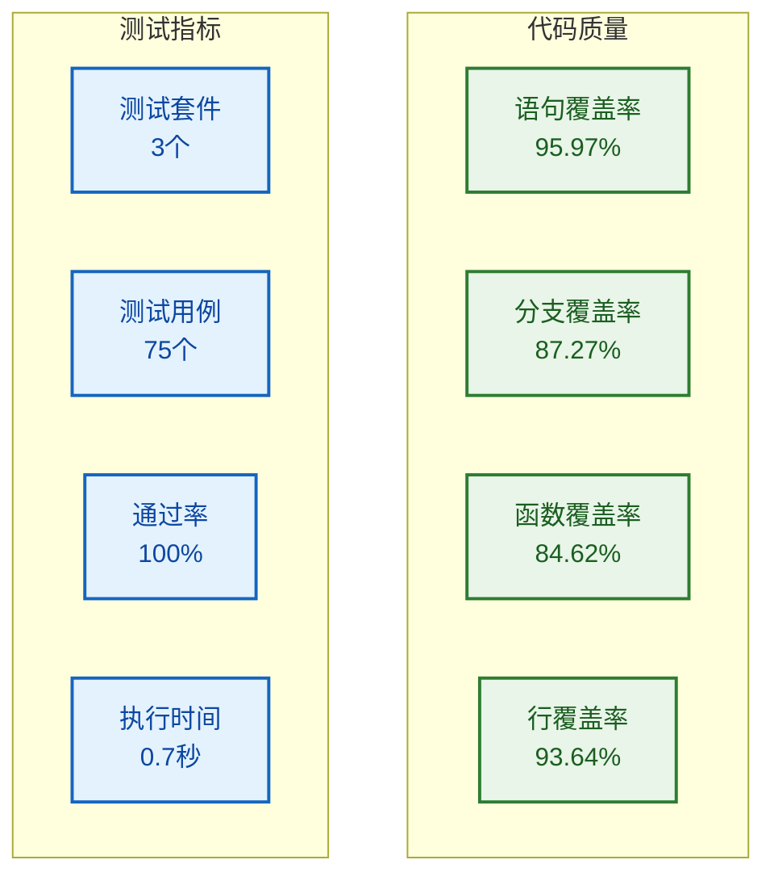

# 租户子领域领域模型

## 领域模型图

```mermaid
graph TB
    subgraph "租户子领域 Domain Layer"
        subgraph "值对象 (Value Objects)"
            TN[TenantName<br/>租户名称值对象]
            TC[TenantCode<br/>租户编码值对象]
        end
        
        subgraph "实体 (Entities)"
            T[Tenant<br/>租户聚合根]
        end
        
        subgraph "枚举 (Enums)"
            TS[TenantStatus<br/>租户状态枚举]
        end
        
        subgraph "状态转换"
            PENDING[PENDING<br/>待激活]
            ACTIVE[ACTIVE<br/>激活]
            SUSPENDED[SUSPENDED<br/>禁用]
            DELETED[DELETED<br/>已删除]
        end
    end
    
    subgraph "业务规则"
        BR1[长度验证<br/>2-100字符]
        BR2[字符验证<br/>中文、英文、数字等]
        BR3[格式验证<br/>不能以数字开头]
        BR4[编码规则<br/>3-20字符，字母开头]
    end
    
    subgraph "生命周期管理"
        LM1[创建租户]
        LM2[激活租户]
        LM3[禁用租户]
        LM4[删除租户]
        LM5[恢复租户]
    end
    
    subgraph "配置管理"
        CM1[更新配置]
        CM2[设置配置]
        CM3[获取配置]
    end
    
    %% 关系连接
    T --> TN
    T --> TC
    T --> TS
    
    TN --> BR1
    TN --> BR2
    TN --> BR3
    
    TC --> BR4
    
    TS --> PENDING
    TS --> ACTIVE
    TS --> SUSPENDED
    TS --> DELETED
    
    T --> LM1
    T --> LM2
    T --> LM3
    T --> LM4
    T --> LM5
    
    T --> CM1
    T --> CM2
    T --> CM3
    
    %% 状态转换流程
    PENDING --> ACTIVE
    ACTIVE --> SUSPENDED
    SUSPENDED --> ACTIVE
    ACTIVE --> DELETED
    SUSPENDED --> DELETED
    DELETED --> SUSPENDED
    
    classDef valueObject fill:#e3f2fd,stroke:#1565c0,stroke-width:2px,color:#0d47a1
    classDef entity fill:#f3e5f5,stroke:#6a1b9a,stroke-width:3px,color:#4a148c
    classDef enum fill:#e8f5e8,stroke:#2e7d32,stroke-width:2px,color:#1b5e20
    classDef status fill:#fff3e0,stroke:#ef6c00,stroke-width:2px,color:#e65100
    classDef rule fill:#ffebee,stroke:#c62828,stroke-width:2px,color:#b71c1c
    classDef lifecycle fill:#f1f8e9,stroke:#689f38,stroke-width:2px,color:#33691e
    classDef config fill:#e0f2f1,stroke:#00695c,stroke-width:2px,color:#004d40
    
    class TN,TC valueObject
    class T entity
    class TS enum
    class PENDING,ACTIVE,SUSPENDED,DELETED status
    class BR1,BR2,BR3,BR4 rule
    class LM1,LM2,LM3,LM4,LM5 lifecycle
    class CM1,CM2,CM3 config
```

## 值对象详细设计

### TenantName 值对象

```mermaid
graph LR
    subgraph "TenantName 值对象"
        V1[输入值]
        V2[验证规则]
        V3[标准化]
        V4[输出值]
        
        V1 --> V2
        V2 --> V3
        V3 --> V4
    end
    
    subgraph "验证规则"
        R1[长度验证<br/>2-100字符]
        R2[字符验证<br/>中文、英文、数字等]
        R3[格式验证<br/>不能以数字开头]
        R4[空格处理<br/>标准化连续空格]
    end
    
    V2 --> R1
    V2 --> R2
    V2 --> R3
    V3 --> R4
    
    classDef process fill:#e3f2fd,stroke:#1565c0,stroke-width:2px,color:#0d47a1
    classDef rule fill:#ffebee,stroke:#c62828,stroke-width:2px,color:#b71c1c
    
    class V1,V2,V3,V4 process
    class R1,R2,R3,R4 rule
```

### TenantCode 值对象

```mermaid
graph LR
    subgraph "TenantCode 值对象"
        C1[输入值]
        C2[验证规则]
        C3[标准化]
        C4[输出值]
        
        C1 --> C2
        C2 --> C3
        C3 --> C4
    end
    
    subgraph "验证规则"
        CR1[长度验证<br/>3-20字符]
        CR2[字符验证<br/>字母、数字、下划线]
        CR3[格式验证<br/>字母开头]
        CR4[大小写处理<br/>转换为小写]
    end
    
    C2 --> CR1
    C2 --> CR2
    C2 --> CR3
    C3 --> CR4
    
    classDef process fill:#e3f2fd,stroke:#1565c0,stroke-width:2px,color:#0d47a1
    classDef rule fill:#ffebee,stroke:#c62828,stroke-width:2px,color:#b71c1c
    
    class C1,C2,C3,C4 process
    class CR1,CR2,CR3,CR4 rule
```

## 租户实体状态转换

```mermaid
stateDiagram-v2
    [*] --> PENDING : 创建租户
    
    PENDING --> ACTIVE : activate()
    PENDING --> SUSPENDED : suspend()
    PENDING --> DELETED : delete()
    
    ACTIVE --> SUSPENDED : suspend()
    ACTIVE --> DELETED : delete()
    
    SUSPENDED --> ACTIVE : activate()
    SUSPENDED --> DELETED : delete()
    
    DELETED --> SUSPENDED : restore()
    
    note right of PENDING
        待激活状态
        租户刚创建时的初始状态
    end note
    
    note right of ACTIVE
        激活状态
        租户可以正常使用
        用户可以进行所有操作
    end note
    
    note right of SUSPENDED
        禁用状态
        租户被暂停使用
        用户无法登录和操作
    end note
    
    note right of DELETED
        已删除状态
        租户被软删除
        数据保留但不可访问
    end note
```

## 业务方法调用流程

```mermaid
sequenceDiagram
    participant Client as 客户端
    participant Tenant as 租户实体
    participant Name as TenantName
    participant Code as TenantCode
    participant Base as BaseEntity
    
    Client->>Tenant: 创建租户(id, name, code, adminId)
    Tenant->>Name: new TenantName(name)
    Name-->>Tenant: 验证并标准化名称
    Tenant->>Code: new TenantCode(code)
    Code-->>Tenant: 验证并标准化编码
    Tenant->>Base: super(id)
    Base-->>Tenant: 初始化基础属性
    Tenant-->>Client: 返回租户实例
    
    Client->>Tenant: activate(adminId)
    Tenant->>Tenant: 验证状态转换
    Tenant->>Base: markAsUpdated(adminId)
    Tenant-->>Client: 租户已激活
    
    Client->>Tenant: updateSettings(settings, adminId)
    Tenant->>Tenant: 合并配置
    Tenant->>Base: markAsUpdated(adminId)
    Tenant-->>Client: 配置已更新
```

## 测试覆盖情况

```mermaid
pie title 测试覆盖率
    "TenantName 100%" : 100
    "TenantCode 82.05%" : 82.05
    "Tenant 98.07%" : 98.07
```

## 代码质量指标

```mermaid
graph TD
    subgraph "代码质量"
        Q1[语句覆盖率<br/>95.97%]
        Q2[分支覆盖率<br/>87.27%]
        Q3[函数覆盖率<br/>84.62%]
        Q4[行覆盖率<br/>93.64%]
    end
    
    subgraph "测试指标"
        T1[测试套件<br/>3个]
        T2[测试用例<br/>75个]
        T3[通过率<br/>100%]
        T4[执行时间<br/>0.7秒]
    end
    
    classDef quality fill:#e8f5e8,stroke:#2e7d32,stroke-width:2px,color:#1b5e20
    classDef test fill:#e3f2fd,stroke:#1565c0,stroke-width:2px,color:#0d47a1
    
    class Q1,Q2,Q3,Q4 quality
    class T1,T2,T3,T4 test
```
