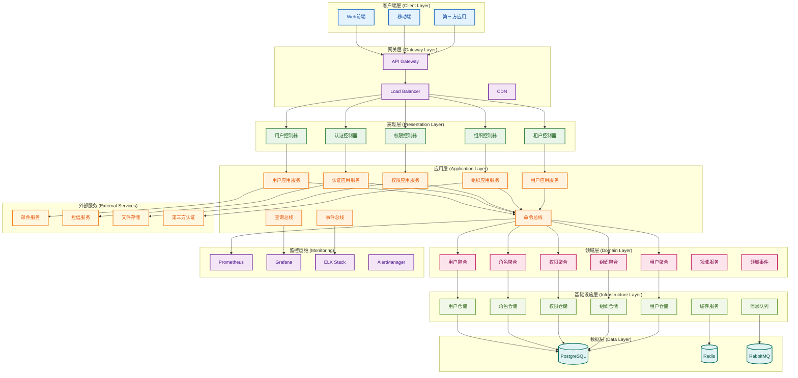

# 身份认证与权限管理（IAM）系统详细设计方案

## 文档概述

本文档是IAM系统的总体设计方案，基于领域驱动设计（DDD）和整洁架构（Clean Architecture）模式，实现CQRS和事件溯源（Event Sourcing），为多租户SaaS平台提供完整的身份认证与权限管理解决方案。

### 文档结构

- **01-IAM系统总体设计方案.md** - 系统概述、架构设计、技术选型
- **02-领域模型设计.md** - 领域实体、聚合根、值对象设计
- **03-应用服务设计.md** - 应用层服务、CQRS实现
- **04-基础设施设计.md** - 数据库设计、仓储实现、外部服务集成
- **05-API接口设计.md** - RESTful API设计、DTO定义
- **06-安全与合规设计.md** - 安全策略、审计日志、合规要求
- **07-部署与运维设计.md** - 部署方案、监控告警、运维工具

---

## 一、系统概述

### 1.1 系统目标

IAM系统旨在为多租户SaaS平台提供：

- **身份认证**：支持多种认证方式，确保用户身份安全
- **权限管理**：基于RBAC和ABAC的细粒度权限控制
- **多租户隔离**：确保不同租户间数据完全隔离
- **组织管理**：支持复杂的组织层级和权限继承
- **审计合规**：完整的操作审计和合规支持
- **高可用性**：支持大规模用户和复杂业务场景

### 1.2 核心功能模块

#### 1.2.1 租户管理模块
- 租户生命周期管理（创建、激活、禁用、删除）
- 租户配置管理（功能开关、权限策略等）
- 租户数据隔离和资源管理

#### 1.2.2 用户管理模块
- 用户注册、认证、信息维护
- 用户状态管理（激活、禁用、锁定）
- 密码管理和安全策略
- 多因素认证支持

#### 1.2.3 角色管理模块
- 角色定义和权限分配
- 角色继承和层级关系
- 角色用户分配管理
- 系统预置角色和自定义角色

#### 1.2.4 权限管理模块
- 细粒度权限控制（页面级、操作级、数据级、字段级）
- CASL集成实现ABAC
- 权限缓存和性能优化
- 动态权限规则

#### 1.2.5 组织管理模块
- 组织层级结构管理
- 用户组织关联管理
- 组织级权限继承
- 组织数据隔离

#### 1.2.6 审计日志模块
- 操作审计记录
- 安全事件监控
- 合规报告生成
- 审计数据管理

### 1.3 系统特性

#### 1.3.1 多租户架构
- **数据隔离**：通过租户ID实现数据软隔离
- **配置隔离**：每个租户拥有独立的配置
- **功能隔离**：支持租户级功能开关
- **性能隔离**：支持租户级性能优化

#### 1.3.2 高安全性
- **密码安全**：bcrypt/Argon2哈希算法
- **会话管理**：JWT令牌和刷新机制
- **访问控制**：基于角色的细粒度权限控制
- **安全审计**：完整的操作审计日志

#### 1.3.3 高可用性
- **水平扩展**：支持多实例部署
- **缓存机制**：Redis缓存提升性能
- **数据库优化**：索引优化和查询优化
- **监控告警**：实时监控和告警机制

#### 1.3.4 高扩展性
- **模块化设计**：基于DDD的模块化架构
- **插件机制**：支持功能插件扩展
- **API设计**：RESTful API支持多种集成
- **事件驱动**：基于领域事件的解耦设计

---

## 二、架构设计

### 2.1 整体架构

基于DDD和Clean Architecture的分层架构：



### 2.2 分层职责

#### 2.2.1 表现层（Presentation Layer）
- **职责**：处理外部交互，协议适配
- **组件**：
  - Controllers：RESTful API控制器
  - Middlewares：认证、日志、CORS等中间件
  - Filters：异常处理和响应格式化
  - Guards：权限验证守卫
  - Interceptors：请求响应拦截器

#### 2.2.2 应用层（Application Layer）
- **职责**：协调领域对象完成业务用例
- **组件**：
  - Commands：写操作命令（CQRS）
  - Queries：读操作查询（CQRS）
  - Handlers：命令和查询处理器
  - DTOs：数据传输对象
  - Validators：应用层校验器

#### 2.2.3 领域层（Domain Layer）
- **职责**：核心业务逻辑和规则
- **组件**：
  - Entities：聚合根和实体
  - Value Objects：值对象
  - Repositories：仓储接口
  - Services：领域服务
  - Events：领域事件
  - Policies：业务策略

#### 2.2.4 基础设施层（Infrastructure Layer）
- **职责**：技术实现细节
- **组件**：
  - Repositories：仓储实现
  - Database：数据库配置和迁移
  - External：外部服务集成
  - Cache：缓存实现
  - Message Queue：消息队列

### 2.3 CQRS架构

#### 2.3.1 命令端（Command Side）
```
┌─────────────┐    ┌─────────────┐    ┌─────────────┐
│   Command   │───▶│   Handler   │───▶│  Aggregate  │
└─────────────┘    └─────────────┘    └─────────────┘
                           │                   │
                           ▼                   ▼
                    ┌─────────────┐    ┌─────────────┐
                    │ Repository  │    │   Events    │
                    └─────────────┘    └─────────────┘
```

#### 2.3.2 查询端（Query Side）
```
┌─────────────┐    ┌─────────────┐    ┌─────────────┐
│   Query     │───▶│   Handler   │───▶│  Read Model │
└─────────────┘    └─────────────┘    └─────────────┘
                           │
                           ▼
                    ┌─────────────┐
                    │ Repository  │
                    └─────────────┘
```

### 2.4 事件溯源架构

#### 2.4.1 事件存储
- **事件流**：每个聚合根的事件序列
- **快照**：定期保存聚合状态快照
- **事件版本**：支持事件版本管理

#### 2.4.2 事件处理
- **事件发布**：聚合根发布领域事件
- **事件处理**：事件处理器处理业务逻辑
- **事件投影**：构建查询端数据模型

### 2.5 多租户架构

#### 2.5.1 数据隔离策略
- **软隔离**：通过租户ID字段实现数据隔离
- **硬隔离**：支持数据库级别的租户隔离
- **混合隔离**：根据业务需求选择隔离策略

#### 2.5.2 租户上下文
- **租户识别**：从请求中提取租户信息
- **上下文传播**：在请求链路中传播租户上下文
- **数据过滤**：自动基于租户ID过滤数据

---

## 三、技术选型

### 3.1 核心技术栈

#### 3.1.1 编程语言和框架
- **语言**：TypeScript 5.x
- **运行时**：Node.js 18+
- **后端框架**：NestJS 11.x
- **前端框架**：Next.js 15.x（React 19）

#### 3.1.2 数据库和ORM
- **主数据库**：PostgreSQL 15+
- **ORM框架**：MikroORM 5.x
- **缓存数据库**：Redis 7+
- **消息队列**：RabbitMQ 3.x

#### 3.1.3 权限控制
- **RBAC**：基于角色的访问控制
- **ABAC**：基于属性的访问控制（CASL）
- **细粒度权限**：字段级权限控制
- **动态权限**：运行时权限规则

#### 3.1.4 认证和安全
- **JWT**：JSON Web Token认证
- **密码哈希**：bcrypt/Argon2
- **多因素认证**：TOTP、SMS、Email
- **安全防护**：CSRF、XSS、SQL注入防护

### 3.2 开发工具和库

#### 3.2.1 开发工具
- **包管理**：pnpm
- **代码规范**：Biome
- **类型检查**：TypeScript严格模式
- **测试框架**：Jest + Supertest

#### 3.2.2 核心库
- **验证**：class-validator + class-transformer
- **序列化**：class-transformer
- **日志**：Pino
- **配置**：@nestjs/config

#### 3.2.3 监控和运维
- **监控**：Prometheus + Grafana
- **日志聚合**：ELK Stack
- **链路追踪**：Jaeger
- **健康检查**：@nestjs/terminus

### 3.3 部署和运维

#### 3.3.1 容器化
- **容器**：Docker
- **编排**：Docker Compose / Kubernetes
- **镜像仓库**：Docker Hub / 私有仓库

#### 3.3.2 CI/CD
- **版本控制**：Git
- **CI/CD**：GitHub Actions / GitLab CI
- **自动化测试**：单元测试、集成测试、E2E测试
- **自动化部署**：蓝绿部署、滚动更新

#### 3.3.3 监控告警
- **应用监控**：APM工具
- **基础设施监控**：系统资源监控
- **业务监控**：关键业务指标监控
- **告警通知**：邮件、短信、钉钉等

---

## 四、系统模块设计

### 4.1 核心模块

#### 4.1.1 租户管理模块
- **功能**：租户生命周期管理
- **核心实体**：Tenant
- **主要用例**：租户创建、配置管理、状态变更

#### 4.1.2 用户管理模块
- **功能**：用户身份管理
- **核心实体**：User
- **主要用例**：用户注册、认证、信息维护

#### 4.1.3 角色管理模块
- **功能**：角色定义和分配
- **核心实体**：Role
- **主要用例**：角色创建、权限分配、用户分配

#### 4.1.4 权限管理模块
- **功能**：细粒度权限控制
- **核心实体**：Permission
- **主要用例**：权限定义、验证、缓存

#### 4.1.5 组织管理模块
- **功能**：组织层级管理
- **核心实体**：Organization
- **主要用例**：组织创建、层级调整、用户关联

#### 4.1.6 审计日志模块
- **功能**：操作审计和安全监控
- **核心实体**：AuditLog
- **主要用例**：日志记录、查询、导出

### 4.2 共享模块

#### 4.2.1 认证模块
- **功能**：统一认证服务
- **组件**：JWT服务、密码服务、多因素认证

#### 4.2.2 缓存模块
- **功能**：分布式缓存服务
- **组件**：Redis客户端、缓存策略、缓存失效

#### 4.2.3 事件模块
- **功能**：事件发布和订阅
- **组件**：事件总线、事件存储、事件处理器

#### 4.2.4 通知模块
- **功能**：消息通知服务
- **组件**：邮件服务、短信服务、WebSocket

---

## 五、实施计划

### 5.1 开发阶段

#### 5.1.1 第一阶段：核心功能（4周）
- **目标**：完成基础认证和权限功能
- **内容**：
  - 用户注册、登录、认证
  - 基础角色和权限管理
  - 租户管理基础功能
  - 基础API接口

#### 5.1.2 第二阶段：高级功能（4周）
- **目标**：完成组织管理和高级权限功能
- **内容**：
  - 组织层级管理
  - 细粒度权限控制
  - CASL集成
  - 审计日志功能

#### 5.1.3 第三阶段：优化和集成（2周）
- **目标**：性能优化和外部集成
- **内容**：
  - 缓存优化
  - 性能调优
  - 外部服务集成
  - 监控告警

#### 5.1.4 第四阶段：测试和部署（2周）
- **目标**：系统测试和部署上线
- **内容**：
  - 单元测试、集成测试
  - 性能测试、安全测试
  - 部署配置
  - 上线准备

### 5.2 测试策略

#### 5.2.1 测试类型
- **单元测试**：业务逻辑单元测试
- **集成测试**：模块间集成测试
- **端到端测试**：完整业务流程测试
- **性能测试**：负载和压力测试
- **安全测试**：安全漏洞测试

#### 5.2.2 测试环境
- **开发环境**：开发人员本地环境
- **测试环境**：功能测试环境
- **预生产环境**：生产环境模拟
- **生产环境**：正式运行环境

### 5.3 部署策略

#### 5.3.1 部署方式
- **容器化部署**：Docker容器部署
- **自动化部署**：CI/CD流水线
- **蓝绿部署**：零停机部署
- **滚动更新**：渐进式更新

#### 5.3.2 环境管理
- **配置管理**：环境配置管理
- **密钥管理**：敏感信息管理
- **监控告警**：部署监控和告警
- **回滚机制**：快速回滚能力

---

## 六、总结

本IAM系统设计方案基于DDD和Clean Architecture架构模式，采用CQRS和事件溯源技术，为多租户SaaS平台提供完整的身份认证与权限管理解决方案。

### 6.1 设计亮点

1. **架构清晰**：分层架构职责明确，依赖关系清晰
2. **扩展性强**：模块化设计，支持功能扩展
3. **安全性高**：多层次安全防护，符合合规要求
4. **性能优秀**：缓存策略和优化措施
5. **运维友好**：完善的监控和运维工具

### 6.2 技术优势

1. **现代化技术栈**：TypeScript + NestJS + MikroORM
2. **DDD设计**：领域驱动设计，业务逻辑清晰
3. **CQRS模式**：读写分离，性能优化
4. **事件溯源**：完整的数据变更追踪
5. **多租户支持**：完整的多租户架构

### 6.3 实施建议

1. **渐进式开发**：按阶段逐步实现功能
2. **测试驱动**：重视测试，确保质量
3. **文档同步**：保持代码和文档同步
4. **团队协作**：建立良好的协作机制
5. **持续改进**：根据反馈持续优化

这个设计方案为IAM系统提供了完整的技术架构和实施方案，确保系统能够满足复杂的业务需求，同时保持技术先进性和可维护性。 