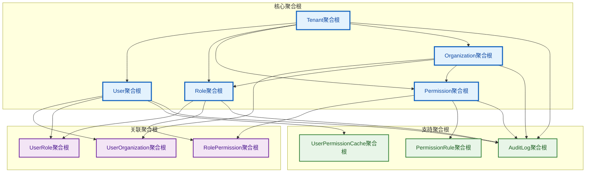

# 领域模型设计

## 文档概述

本文档详细描述IAM系统的领域模型设计，基于领域驱动设计（DDD）原则，定义核心实体、聚合根、值对象和领域事件，确保业务逻辑的清晰性和一致性。

---

## 一、领域实体设计

### 1.1 租户（Tenant）实体

#### 1.1.1 核心属性
- **id**：租户唯一标识（UUID）
- **name**：租户名称值对象（必填，系统内唯一）
- **code**：租户编码值对象（必填，系统内唯一，用于API路径和数据库分区）
- **description**：租户描述（可选）
- **status**：租户状态值对象（PENDING、ACTIVE、SUSPENDED、DELETED）
- **adminUserId**：租户管理员ID（必填）
- **settings**：租户配置（JSON，扩展字段）
- **createdAt**：创建时间
- **updatedAt**：更新时间
- **deletedAt**：软删除时间（可选）

#### 1.1.2 领域规则
- 租户名称和编码在系统内唯一
- 租户必须有一个管理员用户
- 租户删除采用软删除策略
- 租户状态变更需记录审计日志
- 继承BaseEntity获得通用属性和方法

#### 1.1.3 业务方法
- `activate()`：激活租户
- `suspend()`：禁用租户
- `delete()`：软删除租户
- `restore()`：恢复租户
- `updateSettings(settings)`：更新租户配置

### 1.2 用户（User）实体

#### 1.2.1 核心属性
- **id**：用户唯一标识（UUID）
- **username**：用户名值对象（必填，租户内唯一）
- **email**：邮箱地址值对象（必填，租户内唯一）
- **phone**：手机号码值对象（可选）
- **firstName**：名（必填）
- **lastName**：姓（必填）
- **displayName**：显示名称（可选，默认firstName + lastName）
- **avatar**：头像URL（可选）
- **status**：用户状态值对象（PENDING、ACTIVE、SUSPENDED、DELETED）
- **tenantId**：所属租户ID（必填，实现数据隔离）
- **adminUserId**：创建该用户的管理员ID（必填）
- **passwordHash**：密码哈希（必填，加密存储）
- **lastLoginAt**：最后登录时间（可选）
- **loginAttempts**：登录失败次数（用于锁定机制）
- **lockedUntil**：锁定截止时间（可选）
- **emailVerified**：邮箱验证状态（布尔值）
- **phoneVerified**：手机验证状态（布尔值）
- **twoFactorEnabled**：二步验证启用状态（布尔值）
- **twoFactorSecret**：二步验证密钥（可选，加密存储）
- **preferences**：用户偏好设置（JSON，扩展字段）
- **createdAt**：创建时间
- **updatedAt**：更新时间
- **deletedAt**：软删除时间（可选）

#### 1.2.2 领域规则
- 用户名、邮箱在租户内唯一，全局唯一性通过租户ID+用户名/邮箱组合实现
- 用户必须归属于某个租户，实现数据软隔离
- 用户删除采用软删除策略，保留数据以便审计
- 用户状态变更需记录审计日志
- 密码必须符合安全策略（长度、复杂度等）
- 登录失败超过阈值后自动锁定账户

#### 1.2.3 业务方法
- `activate()`：激活用户
- `suspend()`：禁用用户
- `delete()`：软删除用户
- `restore()`：恢复用户
- `lockAccount()`：锁定账户
- `unlockAccount()`：解锁账户
- `updatePassword(newPassword)`：更新密码
- `enableTwoFactor()`：启用二步验证
- `disableTwoFactor()`：禁用二步验证
- `verifyEmail()`：验证邮箱
- `verifyPhone()`：验证手机号

### 1.3 角色（Role）实体

#### 1.3.1 核心属性
- **id**：角色唯一标识（UUID）
- **name**：角色名称值对象（必填，租户内唯一）
- **code**：角色编码值对象（必填，租户内唯一，用于API权限标识）
- **description**：角色描述（可选）
- **status**：角色状态值对象（ACTIVE、SUSPENDED、DELETED）
- **tenantId**：所属租户ID（必填，实现数据隔离）
- **organizationId**：组织级角色（可选）
- **adminUserId**：创建该角色的管理员ID（必填）
- **isSystemRole**：是否系统角色（布尔值）
- **isDefaultRole**：是否默认角色（布尔值）
- **priority**：角色优先级值对象（1-100，数字越大优先级越高）
- **maxUsers**：最大用户数（可选）
- **expiresAt**：过期时间（可选）
- **parentRoleId**：父角色ID（角色继承）
- **childRoleIds**：子角色ID列表（子角色）
- **createdAt**：创建时间
- **updatedAt**：更新时间
- **deletedAt**：软删除时间（可选）

#### 1.3.2 领域规则
- 角色名称和编码在租户内唯一
- 角色必须归属于某个租户，实现数据软隔离
- 系统角色不可删除，只能禁用
- 角色删除前需校验是否有用户仍绑定该角色
- 角色优先级用于权限冲突处理
- 支持角色继承关系

#### 1.3.3 业务方法
- `activate()`：激活角色
- `suspend()`：禁用角色
- `delete()`：软删除角色
- `restore()`：恢复角色
- `assignPermission(permissionId)`：分配权限
- `removePermission(permissionId)`：移除权限
- `assignUser(userId)`：分配用户
- `removeUser(userId)`：移除用户
- `setParentRole(parentRoleId)`：设置父角色
- `addChildRole(childRoleId)`：添加子角色
- `removeChildRole(childRoleId)`：移除子角色

### 1.4 权限（Permission）实体

#### 1.4.1 核心属性
- **id**：权限唯一标识（UUID）
- **name**：权限名称值对象（必填，租户内唯一）
- **code**：权限编码值对象（必填，租户内唯一，格式为"模块:资源:操作"）
- **description**：权限描述（可选）
- **type**：权限类型值对象（PAGE、OPERATION、DATA、FIELD）
- **status**：权限状态值对象（ACTIVE、SUSPENDED、DELETED）
- **action**：权限操作值对象（CREATE、READ、UPDATE、DELETE、MANAGE、EXPORT、IMPORT）
- **tenantId**：所属租户ID（必填，实现数据隔离）
- **organizationId**：组织级权限（可选）
- **adminUserId**：创建该权限的管理员ID（必填）
- **isSystemPermission**：是否系统权限（布尔值）
- **isDefaultPermission**：是否默认权限（布尔值）
- **conditions**：权限条件值对象（CASL条件表达式）
- **fields**：字段级权限（字符串数组）
- **expiresAt**：过期时间（可选）
- **parentPermissionId**：父权限ID（权限继承）
- **childPermissionIds**：子权限ID列表（子权限）
- **resource**：资源标识（CASL资源标识）
- **module**：模块标识（CASL模块标识）
- **tags**：标签（可选）
- **createdAt**：创建时间
- **updatedAt**：更新时间
- **deletedAt**：软删除时间（可选）

#### 1.4.2 领域规则
- 权限编码在租户内唯一，格式为"模块:资源:操作"
- 权限必须归属于某个租户，实现数据软隔离
- 系统权限不可删除，只能禁用
- 支持权限继承关系
- 支持CASL条件权限和字段级权限
- 权限变更实时生效

#### 1.4.3 业务方法
- `activate()`：激活权限
- `suspend()`：禁用权限
- `delete()`：软删除权限
- `restore()`：恢复权限
- `assignToRole(roleId)`：分配给角色
- `removeFromRole(roleId)`：从角色移除
- `setConditions(conditions)`：设置权限条件
- `setFields(fields)`：设置字段权限
- `setParentPermission(parentPermissionId)`：设置父权限
- `addChildPermission(childPermissionId)`：添加子权限
- `removeChildPermission(childPermissionId)`：移除子权限

### 1.5 组织（Organization）实体

#### 1.5.1 核心属性
- **id**：组织唯一标识（UUID）
- **name**：组织名称值对象（必填，租户内唯一）
- **code**：组织编码值对象（必填，租户内唯一，用于组织标识）
- **description**：组织描述（可选）
- **type**：组织类型值对象（DEPARTMENT、SUBSIDIARY、PROJECT、TEAM、DIVISION、BRANCH）
- **status**：组织状态值对象（ACTIVE、SUSPENDED、DELETED）
- **tenantId**：所属租户ID（必填，实现数据隔离）
- **parentId**：父组织ID（可选，支持树状结构）
- **path**：组织路径值对象（如：/总公司/技术部/前端组，用于快速查询层级）
- **level**：组织层级（从0开始，顶级组织为0）
- **sortOrder**：排序字段（同级组织间的显示顺序）
- **adminUserId**：组织管理员ID（可选，负责该组织的管理）
- **contactInfo**：联系信息（JSON，包含地址、电话、邮箱等）
- **settings**：组织设置（JSON，扩展字段）
- **createdAt**：创建时间
- **updatedAt**：更新时间
- **deletedAt**：软删除时间（可选）

#### 1.5.2 领域规则
- 组织名称和编码在租户内唯一
- 组织必须归属于某个租户，实现数据软隔离
- 组织支持树状结构，每个组织只能有一个父组织（顶级组织除外）
- 组织路径自动生成和维护，便于层级查询和权限继承
- 组织删除前需校验是否有用户或子组织仍关联
- 组织状态变更需记录审计日志

#### 1.5.3 业务方法
- `activate()`：激活组织
- `suspend()`：禁用组织
- `delete()`：软删除组织
- `restore()`：恢复组织
- `setParent(parentId)`：设置父组织
- `addChild(childId)`：添加子组织
- `removeChild(childId)`：移除子组织
- `updatePath()`：更新组织路径
- `updateLevel()`：更新组织层级
- `setAdmin(adminUserId)`：设置组织管理员
- `updateContactInfo(contactInfo)`：更新联系信息
- `updateSettings(settings)`：更新组织设置

### 1.6 用户组织关联（UserOrganization）实体

#### 1.6.1 核心属性
- **id**：关联唯一标识（UUID）
- **userId**：用户ID（必填）
- **organizationId**：组织ID（必填）
- **tenantId**：所属租户ID（必填，实现数据隔离）
- **role**：在组织中的角色值对象（如：成员、主管、管理员等）
- **isPrimary**：是否为主要组织（布尔值，用户可能有多个组织，但通常有一个主要组织）
- **joinDate**：加入组织时间
- **leaveDate**：离开组织时间（可选）
- **status**：关联状态值对象（ACTIVE、INACTIVE、PENDING）
- **createdAt**：创建时间
- **updatedAt**：更新时间

#### 1.6.2 领域规则
- 用户与组织为多对多关系，一个用户可以关联多个组织，一个组织可以关联多个用户
- 用户在每个组织中只能有一个关联记录
- 用户的主要组织用于默认权限和界面显示
- 关联状态变更需记录审计日志
- 所有用户组织关联数据均需包含租户ID字段，确保数据隔离

#### 1.6.3 业务方法
- `activate()`：激活关联
- `deactivate()`：停用关联
- `setPrimary()`：设置为主要组织
- `removePrimary()`：移除主要组织标识
- `setRole(role)`：设置组织角色
- `setLeaveDate(leaveDate)`：设置离开时间
- `extendMembership()`：延长成员资格

### 1.7 用户角色关联（UserRole）实体

#### 1.7.1 核心属性
- **id**：关联唯一标识（UUID）
- **userId**：用户ID（必填）
- **roleId**：角色ID（必填）
- **tenantId**：所属租户ID（必填，实现数据隔离）
- **assignedBy**：分配人ID（必填）
- **assignedAt**：分配时间（必填）
- **expiresAt**：过期时间（可选）
- **status**：关联状态值对象（ACTIVE、INACTIVE、EXPIRED）
- **createdAt**：创建时间
- **updatedAt**：更新时间

#### 1.7.2 领域规则
- 用户与角色为多对多关系，一个用户可以分配多个角色，一个角色可以分配给多个用户
- 用户角色关联必须归属于某个租户，实现数据软隔离
- 角色分配仅限租户管理员或组织管理员
- 角色分配实时生效
- 支持角色分配过期时间
- 关联状态变更需记录审计日志

#### 1.7.3 业务方法
- `activate()`：激活关联
- `deactivate()`：停用关联
- `extendExpiration(newExpiresAt)`：延长过期时间
- `revoke()`：撤销角色分配
- `renew()`：续期角色分配

### 1.8 角色权限关联（RolePermission）实体

#### 1.8.1 核心属性
- **id**：关联唯一标识（UUID）
- **roleId**：角色ID（必填）
- **permissionId**：权限ID（必填）
- **tenantId**：所属租户ID（必填，实现数据隔离）
- **assignedBy**：分配人ID（必填）
- **assignedAt**：分配时间（必填）
- **expiresAt**：过期时间（可选）
- **status**：关联状态值对象（ACTIVE、INACTIVE、EXPIRED）
- **createdAt**：创建时间
- **updatedAt**：更新时间

#### 1.8.2 领域规则
- 角色与权限为多对多关系，一个角色可以分配多个权限，一个权限可以分配给多个角色
- 角色权限关联必须归属于某个租户，实现数据软隔离
- 权限分配仅限租户管理员或组织管理员
- 权限变更实时生效
- 支持权限分配过期时间
- 关联状态变更需记录审计日志

#### 1.8.3 业务方法
- `activate()`：激活关联
- `deactivate()`：停用关联
- `extendExpiration(newExpiresAt)`：延长过期时间
- `revoke()`：撤销权限分配
- `renew()`：续期权限分配

### 1.9 审计日志（AuditLog）实体

#### 1.9.1 核心属性
- **id**：日志唯一标识（UUID）
- **tenantId**：所属租户ID（必填，实现数据隔离）
- **userId**：操作用户ID（必填）
- **action**：操作类型（字符串）
- **resourceType**：资源类型（字符串：用户、角色、权限、组织等）
- **resourceId**：资源ID（字符串）
- **oldValues**：变更前值（JSON，可选）
- **newValues**：变更后值（JSON，可选）
- **ipAddress**：IP地址（可选）
- **userAgent**：用户代理（可选）
- **timestamp**：操作时间（必填）
- **metadata**：额外元数据（JSON，可选）

#### 1.9.2 领域规则
- 审计日志不可修改，确保数据完整性
- 审计日志必须归属于某个租户，实现数据软隔离
- 记录所有关键操作，包括创建、修改、删除、状态变更等
- 支持结构化日志格式，便于查询和分析
- 审计日志保留期限：7年

#### 1.9.3 业务方法
- `addMetadata(key, value)`：添加元数据
- `setOldValues(values)`：设置变更前值
- `setNewValues(values)`：设置变更后值
- `setUserInfo(userId, ipAddress, userAgent)`：设置用户信息

---

## 二、值对象设计

### 2.1 租户相关值对象

#### 2.1.1 租户名称（TenantName）
- **约束条件**：长度2-100字符，仅允许中文、英文、数字、空格、连字符
- **业务规则**：租户名称在系统内唯一，支持国际化
- **验证逻辑**：不能包含特殊字符，不能以数字开头

#### 2.1.2 租户编码（TenantCode）
- **约束条件**：长度3-20字符，仅允许英文、数字、下划线
- **业务规则**：租户编码在系统内唯一，用于API路径和数据库分区
- **验证逻辑**：必须以字母开头，不能包含连续下划线

#### 2.1.3 租户状态（TenantStatus）
- **枚举值**：PENDING（待激活）、ACTIVE（激活）、SUSPENDED（禁用）、DELETED（已删除）
- **状态转换**：定义各状态间的合法转换路径
- **业务影响**：不同状态对租户内所有用户的影响

### 2.2 用户相关值对象

#### 2.2.1 用户名（Username）
- **约束条件**：长度3-50字符，仅允许英文、数字、下划线、连字符
- **业务规则**：用户名在租户内唯一，全局唯一性通过租户ID+用户名组合实现
- **验证逻辑**：不能以数字开头，不能包含连续特殊字符

#### 2.2.2 邮箱地址（Email）
- **约束条件**：符合RFC 5322标准，最大254字符
- **业务规则**：邮箱在租户内唯一，支持国际化邮箱地址
- **验证逻辑**：支持国家代码前缀，本地部分和域名部分验证

#### 2.2.3 手机号码（Phone）
- **约束条件**：支持国际格式，8-15位数字
- **业务规则**：手机号在租户内唯一，支持国家代码前缀
- **验证逻辑**：支持+86、+1等国际格式，本地号码验证

#### 2.2.4 用户状态（UserStatus）
- **枚举值**：PENDING（待激活）、ACTIVE（激活）、SUSPENDED（禁用）、DELETED（已删除）
- **状态转换**：定义各状态间的合法转换和业务影响
- **业务规则**：不同状态对用户登录、权限等的影响

### 2.3 角色相关值对象

#### 2.3.1 角色名称（RoleName）
- **约束条件**：长度2-100字符，支持中文、英文、数字、空格
- **业务规则**：角色名称在租户内唯一，支持角色描述
- **验证逻辑**：不能包含特殊字符，不能为空

#### 2.3.2 角色编码（RoleCode）
- **约束条件**：长度3-50字符，仅允许英文、数字、下划线
- **业务规则**：角色编码在租户内唯一，用于API权限标识
- **验证逻辑**：必须以字母开头，全大写格式

#### 2.3.3 角色优先级（RolePriority）
- **数值范围**：1-100，数字越大优先级越高
- **业务规则**：权限冲突时按角色优先级处理
- **默认值**：系统角色优先级为90，自定义角色默认为50

### 2.4 权限相关值对象

#### 2.4.1 权限名称（PermissionName）
- **约束条件**：长度2-100字符，支持中文、英文、数字、空格
- **业务规则**：权限名称在租户内唯一，支持权限描述
- **验证逻辑**：不能包含特殊字符，不能为空

#### 2.4.2 权限编码（PermissionCode）
- **约束条件**：长度3-100字符，仅允许英文、数字、下划线、冒号
- **业务规则**：权限编码在租户内唯一，格式为"模块:资源:操作"
- **验证逻辑**：必须以字母开头，支持多级命名空间

#### 2.4.3 权限类型（PermissionType）
- **枚举值**：PAGE（页面级）、OPERATION（操作级）、DATA（数据级）、FIELD（字段级）
- **业务规则**：不同权限类型对应不同的验证策略
- **扩展性**：支持自定义权限类型

#### 2.4.4 权限操作（PermissionAction）
- **枚举值**：CREATE、READ、UPDATE、DELETE、MANAGE、EXPORT、IMPORT
- **业务规则**：支持CRUD操作和特殊业务操作
- **扩展性**：支持自定义操作类型

### 2.5 组织相关值对象

#### 2.5.1 组织名称（OrganizationName）
- **约束条件**：长度2-100字符，支持中文、英文、数字、空格
- **业务规则**：组织名称在租户内唯一，支持组织描述
- **验证逻辑**：不能包含特殊字符，不能为空

#### 2.5.2 组织编码（OrganizationCode）
- **约束条件**：长度3-50字符，仅允许英文、数字、下划线
- **业务规则**：组织编码在租户内唯一，用于组织标识
- **验证逻辑**：必须以字母开头，支持层级编码

#### 2.5.3 组织路径（OrganizationPath）
- **约束条件**：最大500字符，格式为"/根组织/子组织/孙组织"
- **业务规则**：自动生成和维护，支持组织层级查询
- **验证逻辑**：不能包含特殊字符，不能形成循环引用

#### 2.5.4 组织类型（OrganizationType）
- **枚举值**：DEPARTMENT（部门）、SUBSIDIARY（子公司）、PROJECT（项目组）、TEAM（团队）、DIVISION（事业部）、BRANCH（分支机构）
- **类型影响**：不同组织类型可能有不同的管理策略和权限模型

#### 2.5.5 组织状态（OrganizationStatus）
- **枚举值**：ACTIVE（激活）、SUSPENDED（禁用）、DELETED（已删除）
- **状态转换规则**：定义各状态间的合法转换
- **业务影响**：不同状态对组织内用户权限等的影响

---

## 三、聚合根设计

### 3.1 聚合根定义

#### 3.1.1 聚合关系图



#### 3.1.2 聚合根职责说明

##### 3.1.2.1 核心聚合根
- **Tenant聚合根**：租户生命周期管理，数据隔离边界
- **User聚合根**：用户身份管理，认证和授权核心
- **Role聚合根**：角色定义和权限分配管理
- **Permission聚合根**：权限定义和规则管理
- **Organization聚合根**：组织层级和权限继承管理

##### 3.1.2.2 关联聚合根
- **UserOrganization聚合根**：用户与组织的多对多关联
- **UserRole聚合根**：用户与角色的多对多关联
- **RolePermission聚合根**：角色与权限的多对多关联

##### 3.1.2.3 支持聚合根
- **AuditLog聚合根**：操作审计和安全监控
- **PermissionRule聚合根**：CASL权限规则管理
- **UserPermissionCache聚合根**：用户权限缓存管理

#### 3.1.3 租户聚合根
- **聚合根**：Tenant
- **包含实体**：Tenant（自包含）
- **边界**：租户级别的所有业务操作
- **一致性**：确保租户数据的完整性和隔离性

#### 3.1.2 用户聚合根
- **聚合根**：User
- **包含实体**：User（自包含）
- **关联实体**：UserOrganization、UserRole（通过ID引用）
- **边界**：用户级别的所有业务操作
- **一致性**：确保用户数据的完整性和状态一致性

#### 3.1.3 角色聚合根
- **聚合根**：Role
- **包含实体**：Role（自包含）
- **关联实体**：UserRole、RolePermission（通过ID引用）
- **边界**：角色级别的所有业务操作
- **一致性**：确保角色权限分配的一致性

#### 3.1.4 权限聚合根
- **聚合根**：Permission
- **包含实体**：Permission（自包含）
- **关联实体**：RolePermission（通过ID引用）
- **边界**：权限级别的所有业务操作
- **一致性**：确保权限定义和分配的一致性

#### 3.1.5 组织聚合根
- **聚合根**：Organization
- **包含实体**：Organization（自包含）
- **边界**：组织级别的所有业务操作
- **一致性**：确保组织层级和权限继承的一致性

#### 3.1.6 用户组织关联聚合根
- **聚合根**：UserOrganization
- **包含实体**：UserOrganization（自包含）
- **边界**：用户组织关联的所有业务操作
- **一致性**：确保用户组织关联的一致性

#### 3.1.7 用户角色关联聚合根
- **聚合根**：UserRole
- **包含实体**：UserRole（自包含）
- **边界**：用户角色关联的所有业务操作
- **一致性**：确保用户角色关联的一致性

#### 3.1.8 角色权限关联聚合根
- **聚合根**：RolePermission
- **包含实体**：RolePermission（自包含）
- **边界**：角色权限关联的所有业务操作
- **一致性**：确保角色权限关联的一致性

#### 3.1.9 审计日志聚合根
- **聚合根**：AuditLog
- **包含实体**：AuditLog（自包含）
- **边界**：审计日志的所有业务操作
- **一致性**：确保审计日志的完整性和不可变性

### 3.2 聚合边界设计

#### 3.2.1 聚合间关系
- 聚合间通过ID引用进行关联，不直接持有数据
- 聚合间通过领域事件进行通信
- 聚合边界确保数据一致性

#### 3.2.2 事务边界
- 每个聚合根作为一个事务边界
- 聚合内操作保证一致性
- 聚合间操作通过事件驱动实现最终一致性

#### 3.2.3 并发控制
- 聚合根级别的乐观锁控制
- 版本号机制防止并发冲突
- 事件溯源支持并发冲突解决

---

## 四、领域事件设计

### 4.1 租户领域事件

#### 4.1.1 租户创建事件（TenantCreatedEvent）
- **事件数据**：租户ID、租户名称、租户编码、管理员用户ID、创建时间
- **事件处理**：发送租户创建通知、初始化租户配置、记录审计日志
- **业务影响**：触发租户初始化流程、通知相关系统

#### 4.1.2 租户激活事件（TenantActivatedEvent）
- **事件数据**：租户ID、激活时间、激活原因
- **事件处理**：启用租户内所有用户登录、发送激活通知
- **业务影响**：恢复租户内所有用户访问权限

#### 4.1.3 租户禁用事件（TenantSuspendedEvent）
- **事件数据**：租户ID、禁用时间、禁用原因
- **事件处理**：禁用租户内所有用户登录、发送禁用通知
- **业务影响**：暂停租户内所有用户访问权限

### 4.2 用户领域事件

#### 4.2.1 用户创建事件（UserCreatedEvent）
- **事件数据**：用户ID、用户名、邮箱、租户ID、创建时间
- **事件处理**：发送欢迎邮件、分配默认角色、记录审计日志
- **业务影响**：触发用户初始化流程、通知相关系统

#### 4.2.2 用户登录成功事件（UserLoginSuccessEvent）
- **事件数据**：用户ID、登录时间、IP地址、用户代理
- **事件处理**：更新最后登录时间、记录登录审计日志
- **业务影响**：触发用户会话管理、安全监控

#### 4.2.3 用户登录失败事件（UserLoginFailureEvent）
- **事件数据**：用户名、失败时间、IP地址、失败原因
- **事件处理**：增加登录失败次数、检查账户锁定、记录安全审计日志
- **业务影响**：触发安全防护机制、异常登录告警

#### 4.2.4 用户分配组织事件（UserAssignedToOrganizationEvent）
- **事件数据**：用户ID、组织ID、分配角色、分配时间
- **事件处理**：更新用户组织关联、记录分配审计日志
- **业务影响**：触发组织权限继承、通知相关用户

### 4.3 角色领域事件

#### 4.3.1 角色创建事件（RoleCreatedEvent）
- **事件数据**：角色ID、角色名称、角色编码、租户ID、创建时间
- **事件处理**：初始化角色权限、记录创建审计日志
- **业务影响**：触发角色权限管理、通知相关管理员

#### 4.3.2 角色权限分配事件（RolePermissionAssignedEvent）
- **事件数据**：角色ID、权限ID、分配时间、分配人ID
- **事件处理**：更新角色权限关联、记录分配审计日志
- **业务影响**：触发权限缓存失效、通知相关用户

#### 4.3.3 角色用户分配事件（RoleUserAssignedEvent）
- **事件数据**：角色ID、用户ID、分配时间、分配人ID
- **事件处理**：更新用户角色关联、记录分配审计日志
- **业务影响**：触发用户权限更新、通知相关用户

### 4.4 权限领域事件

#### 4.4.1 权限创建事件（PermissionCreatedEvent）
- **事件数据**：权限ID、权限名称、权限编码、权限类型、租户ID
- **事件处理**：初始化权限规则、记录创建审计日志
- **业务影响**：触发权限管理流程、通知相关管理员

#### 4.4.2 权限分配角色事件（PermissionAssignedToRoleEvent）
- **事件数据**：权限ID、角色ID、分配时间、分配人ID
- **事件处理**：更新角色权限关联、记录分配审计日志
- **业务影响**：触发权限缓存失效、通知相关用户

### 4.5 组织领域事件

#### 4.5.1 组织创建事件（OrganizationCreatedEvent）
- **事件数据**：组织ID、组织名称、组织编码、父组织ID、租户ID
- **事件处理**：生成组织路径、记录创建审计日志
- **业务影响**：触发组织层级管理、通知相关管理员

#### 4.5.2 组织层级变更事件（OrganizationHierarchyChangedEvent）
- **事件数据**：组织ID、新父组织ID、变更时间、变更原因
- **事件处理**：更新组织路径、调整子组织层级、记录变更审计日志
- **业务影响**：触发组织权限继承调整、通知相关用户

### 4.6 关联实体领域事件

#### 4.6.1 用户组织关联事件
- **用户组织创建事件（UserOrganizationCreatedEvent）**
- **用户组织更新事件（UserOrganizationUpdatedEvent）**
- **用户组织删除事件（UserOrganizationDeletedEvent）**
- **用户主要组织变更事件（UserPrimaryOrganizationChangedEvent）**

#### 4.6.2 用户角色关联事件
- **用户角色创建事件（UserRoleCreatedEvent）**
- **用户角色更新事件（UserRoleUpdatedEvent）**
- **用户角色删除事件（UserRoleDeletedEvent）**
- **用户角色过期事件（UserRoleExpiredEvent）**

#### 4.6.3 角色权限关联事件
- **角色权限创建事件（RolePermissionCreatedEvent）**
- **角色权限更新事件（RolePermissionUpdatedEvent）**
- **角色权限删除事件（RolePermissionDeletedEvent）**
- **角色权限过期事件（RolePermissionExpiredEvent）**

---

## 五、领域服务设计

### 5.1 认证领域服务

#### 5.1.1 密码服务（PasswordService）
- **职责**：密码哈希、验证、策略管理
- **方法**：
  - `hashPassword(password)`：密码哈希
  - `verifyPassword(password, hash)`：密码验证
  - `validatePasswordPolicy(password)`：密码策略验证
  - `generatePassword()`：生成随机密码

#### 5.1.2 JWT服务（JWTService）
- **职责**：JWT令牌生成、验证、刷新
- **方法**：
  - `generateToken(user)`：生成访问令牌
  - `generateRefreshToken(user)`：生成刷新令牌
  - `verifyToken(token)`：验证令牌
  - `refreshToken(refreshToken)`：刷新令牌

#### 5.1.3 多因素认证服务（TwoFactorService）
- **职责**：二步验证管理
- **方法**：
  - `generateSecret()`：生成密钥
  - `generateQRCode(secret, user)`：生成二维码
  - `verifyCode(secret, code)`：验证验证码
  - `enableTwoFactor(user, secret)`：启用二步验证

### 5.2 权限领域服务

#### 5.2.1 权限验证服务（PermissionValidationService）
- **职责**：权限验证和缓存管理
- **方法**：
  - `hasPermission(user, resource, action)`：验证权限
  - `getUserPermissions(user)`：获取用户权限
  - `invalidateUserCache(userId)`：失效用户缓存
  - `checkFieldPermission(user, resource, field)`：字段级权限验证

#### 5.2.2 CASL权限服务（CASLPermissionService）
- **职责**：CASL权限规则管理
- **方法**：
  - `createAbility(user)`：创建用户能力
  - `addPermissionRule(permission, rule)`：添加权限规则
  - `evaluateCondition(condition, context)`：评估条件
  - `getFieldPermissions(user, resource)`：获取字段权限

### 5.3 组织领域服务

#### 5.3.1 组织层级服务（OrganizationHierarchyService）
- **职责**：组织层级管理
- **方法**：
  - `getAncestors(organizationId)`：获取祖先组织
  - `getDescendants(organizationId)`：获取后代组织
  - `moveOrganization(orgId, newParentId)`：移动组织
  - `validateHierarchy(orgId, parentId)`：验证层级关系

#### 5.3.2 组织权限继承服务（OrganizationPermissionInheritanceService）
- **职责**：组织级权限继承
- **方法**：
  - `inheritPermissions(organizationId)`：继承权限
  - `propagatePermissionChange(permissionId, organizationId)`：传播权限变更
  - `getInheritedPermissions(organizationId)`：获取继承权限

### 5.4 审计领域服务

#### 5.4.1 审计日志服务（AuditLogService）
- **职责**：审计日志记录和查询
- **方法**：
  - `logAction(action, resource, user, changes)`：记录操作
  - `getUserAuditLogs(userId, filters)`：获取用户审计日志
  - `getResourceAuditLogs(resourceType, resourceId)`：获取资源审计日志
  - `exportAuditLogs(filters, format)`：导出审计日志

#### 5.4.2 安全监控服务（SecurityMonitoringService）
- **职责**：安全事件监控
- **方法**：
  - `detectAnomaly(user, action, context)`：异常检测
  - `generateSecurityAlert(incident)`：生成安全告警
  - `analyzeUserBehavior(userId)`：用户行为分析
  - `getSecurityMetrics(tenantId)`：获取安全指标

---

## 六、领域策略设计

### 6.1 密码策略

#### 6.1.1 密码复杂度策略
- **最小长度**：8个字符
- **复杂度要求**：包含大小写字母、数字、特殊字符
- **历史密码**：禁止重复使用最近5次密码
- **密码过期**：90天强制更换密码

#### 6.1.2 账户锁定策略
- **失败次数**：5次失败后锁定
- **锁定时间**：30分钟自动解锁
- **锁定通知**：发送锁定通知邮件

### 6.2 权限策略

#### 6.2.1 权限继承策略
- **角色继承**：子角色继承父角色权限
- **组织继承**：子组织继承父组织权限
- **权限冲突**：按角色优先级处理
- **权限覆盖**：子级权限可覆盖父级权限

#### 6.2.2 权限缓存策略
- **缓存时间**：用户权限缓存30分钟
- **缓存失效**：权限变更时立即失效
- **缓存预热**：用户登录时预热缓存
- **缓存清理**：定期清理过期缓存

### 6.3 审计策略

#### 6.3.1 审计范围策略
- **用户操作**：记录所有用户相关操作
- **系统操作**：记录所有系统配置操作
- **安全事件**：记录所有安全相关事件
- **数据变更**：记录所有数据创建、修改、删除

#### 6.3.2 审计保留策略
- **保留期限**：审计日志保留7年
- **存储策略**：热数据保留1年，冷数据归档
- **备份策略**：定期备份审计日志
- **清理策略**：定期清理过期日志

### 6.4 多租户策略

#### 6.4.1 数据隔离策略
- **软隔离**：通过租户ID字段实现数据隔离
- **硬隔离**：支持数据库级别的租户隔离
- **混合隔离**：根据业务需求选择隔离策略
- **缓存隔离**：租户级缓存隔离

#### 6.4.2 资源限制策略
- **用户数量**：每个租户最大用户数限制
- **存储空间**：每个租户存储空间限制
- **API调用**：每个租户API调用频率限制
- **功能模块**：租户级功能模块开关

---

## 七、总结

本领域模型设计基于DDD原则，定义了完整的实体、值对象、聚合根和领域事件，确保业务逻辑的清晰性和一致性。

### 7.1 设计亮点

1. **聚合边界清晰**：每个聚合根边界明确，确保数据一致性
2. **值对象封装**：通过值对象封装业务概念，确保业务规则一致性
3. **事件驱动**：通过领域事件实现模块解耦
4. **多租户支持**：完整的多租户数据隔离设计
5. **扩展性强**：支持业务规则扩展和定制

### 7.2 技术优势

1. **DDD设计**：领域驱动设计，业务逻辑清晰
2. **事件溯源**：支持事件溯源和审计
3. **CQRS支持**：支持命令查询职责分离
4. **缓存友好**：设计支持高效的缓存策略
5. **性能优化**：聚合设计支持性能优化

### 7.3 实施建议

1. **渐进式实现**：按模块逐步实现领域模型
2. **测试驱动**：为每个聚合根编写单元测试
3. **文档同步**：保持领域模型和文档同步
4. **团队协作**：建立领域专家和开发团队协作机制
5. **持续演进**：根据业务需求持续演进领域模型

这个领域模型设计为IAM系统提供了完整的业务逻辑基础，确保系统能够满足复杂的业务需求，同时保持代码的可维护性和可扩展性。

---

## 八、补充实体设计

### 8.1 会话管理实体（Session）

#### 8.1.1 核心属性
- **id**：会话唯一标识（UUID）
- **userId**：用户ID（必填）
- **tenantId**：所属租户ID（必填，实现数据隔离）
- **token**：访问令牌（JWT，必填）
- **refreshToken**：刷新令牌（必填）
- **deviceId**：设备ID（可选）
- **ipAddress**：IP地址（可选）
- **userAgent**：用户代理（可选）
- **location**：登录位置（可选）
- **status**：会话状态值对象（ACTIVE、EXPIRED、REVOKED）
- **createdAt**：创建时间
- **expiresAt**：过期时间
- **lastActivityAt**：最后活动时间
- **revokedAt**：撤销时间（可选）
- **revokedBy**：撤销人ID（可选）
- **revokeReason**：撤销原因（可选）

#### 8.1.2 领域规则
- 会话必须归属于某个用户和租户
- 会话有过期时间，超时自动失效
- 支持会话撤销和强制下线
- 记录会话活动时间，支持会话超时
- 支持多设备同时登录
- 会话状态变更需记录审计日志

#### 8.1.3 业务方法
- `extendExpiration(extensionTime)`：延长会话过期时间
- `revoke(reason, revokedBy)`：撤销会话
- `updateActivity()`：更新最后活动时间
- `isExpired()`：检查会话是否过期
- `isActive()`：检查会话是否活跃
- `refreshToken()`：刷新访问令牌

### 8.2 API密钥实体（ApiKey）

#### 8.2.1 核心属性
- **id**：API密钥唯一标识（UUID）
- **name**：密钥名称值对象（必填，租户内唯一）
- **key**：API密钥值（必填，加密存储）
- **secret**：API密钥密文（必填，加密存储）
- **tenantId**：所属租户ID（必填，实现数据隔离）
- **userId**：创建用户ID（必填）
- **permissions**：权限列表（字符串数组）
- **scopes**：作用域列表（字符串数组）
- **status**：密钥状态值对象（ACTIVE、SUSPENDED、REVOKED）
- **type**：密钥类型值对象（USER、SERVICE、SYSTEM）
- **expiresAt**：过期时间（可选）
- **lastUsedAt**：最后使用时间（可选）
- **usageCount**：使用次数（可选）
- **rateLimit**：速率限制（可选）
- **createdAt**：创建时间
- **updatedAt**：更新时间
- **revokedAt**：撤销时间（可选）

#### 8.2.2 领域规则
- API密钥必须归属于某个用户和租户
- 密钥值必须加密存储
- 支持密钥过期和撤销
- 支持权限和作用域限制
- 支持使用次数和速率限制
- 密钥状态变更需记录审计日志

#### 8.2.3 业务方法
- `activate()`：激活密钥
- `suspend()`：暂停密钥
- `revoke(reason)`：撤销密钥
- `extendExpiration(extensionTime)`：延长过期时间
- `updateUsage()`：更新使用统计
- `validatePermission(permission)`：验证权限
- `validateScope(scope)`：验证作用域
- `isExpired()`：检查是否过期
- `isRateLimited()`：检查是否超出速率限制

### 8.3 设备管理实体（Device）

#### 8.3.1 核心属性
- **id**：设备唯一标识（UUID）
- **userId**：用户ID（必填）
- **tenantId**：所属租户ID（必填，实现数据隔离）
- **deviceId**：设备标识（必填，如设备指纹）
- **name**：设备名称（可选）
- **type**：设备类型值对象（MOBILE、DESKTOP、TABLET、OTHER）
- **platform**：平台信息（如iOS、Android、Windows、macOS）
- **browser**：浏览器信息（可选）
- **ipAddress**：IP地址（可选）
- **location**：地理位置（可选）
- **status**：设备状态值对象（ACTIVE、SUSPENDED、BLOCKED）
- **trusted**：是否可信设备（布尔值）
- **lastLoginAt**：最后登录时间
- **createdAt**：创建时间
- **updatedAt**：更新时间

#### 8.3.2 领域规则
- 设备必须归属于某个用户和租户
- 支持设备信任管理
- 支持设备状态管理
- 记录设备登录历史
- 支持设备地理位置追踪
- 设备状态变更需记录审计日志

#### 8.3.3 业务方法
- `activate()`：激活设备
- `suspend()`：暂停设备
- `block()`：阻止设备
- `markAsTrusted()`：标记为可信设备
- `markAsUntrusted()`：标记为不可信设备
- `updateLastLogin()`：更新最后登录时间
- `isTrusted()`：检查是否为可信设备
- `isBlocked()`：检查是否被阻止

### 8.4 安全策略实体（SecurityPolicy）

#### 8.4.1 核心属性
- **id**：策略唯一标识（UUID）
- **name**：策略名称值对象（必填，租户内唯一）
- **type**：策略类型值对象（PASSWORD、SESSION、LOCKOUT、MFA、API）
- **tenantId**：所属租户ID（必填，实现数据隔离）
- **status**：策略状态值对象（ACTIVE、INACTIVE）
- **priority**：策略优先级（1-100，数字越大优先级越高）
- **conditions**：策略条件（JSON，扩展字段）
- **actions**：策略动作（JSON，扩展字段）
- **createdBy**：创建人ID（必填）
- **createdAt**：创建时间
- **updatedAt**：更新时间
- **effectiveAt**：生效时间
- **expiresAt**：过期时间（可选）

#### 8.4.2 领域规则
- 安全策略必须归属于某个租户
- 支持多种策略类型
- 策略按优先级执行
- 支持策略条件配置
- 支持策略动作配置
- 策略变更需记录审计日志

#### 8.4.3 业务方法
- `activate()`：激活策略
- `deactivate()`：停用策略
- `evaluate(context)`：评估策略
- `execute(context)`：执行策略
- `isEffective()`：检查策略是否生效
- `isExpired()`：检查策略是否过期
- `updatePriority(priority)`：更新优先级

### 8.5 通知模板实体（NotificationTemplate）

#### 8.5.1 核心属性
- **id**：模板唯一标识（UUID）
- **name**：模板名称值对象（必填，租户内唯一）
- **type**：通知类型值对象（EMAIL、SMS、PUSH、WEBHOOK）
- **category**：模板分类值对象（AUTH、SECURITY、SYSTEM、BUSINESS）
- **tenantId**：所属租户ID（必填，实现数据隔离）
- **subject**：邮件主题模板（可选）
- **content**：内容模板（必填）
- **variables**：模板变量定义（JSON）
- **status**：模板状态值对象（ACTIVE、INACTIVE）
- **language**：语言代码（如zh-CN、en-US）
- **createdBy**：创建人ID（必填）
- **createdAt**：创建时间
- **updatedAt**：更新时间

#### 8.5.2 领域规则
- 通知模板必须归属于某个租户
- 支持多语言模板
- 支持模板变量替换
- 支持多种通知类型
- 模板状态变更需记录审计日志

#### 8.5.3 业务方法
- `activate()`：激活模板
- `deactivate()`：停用模板
- `render(variables)`：渲染模板
- `validateTemplate()`：验证模板语法
- `getVariables()`：获取模板变量
- `isActive()`：检查模板是否激活

---

## 八、补充实体设计

### 8.1 会话管理实体（Session）

#### 8.1.1 核心属性
- **id**：会话唯一标识（UUID）
- **userId**：用户ID（必填）
- **tenantId**：所属租户ID（必填，实现数据隔离）
- **token**：访问令牌（JWT，必填）
- **refreshToken**：刷新令牌（必填）
- **deviceId**：设备ID（可选）
- **ipAddress**：IP地址（可选）
- **userAgent**：用户代理（可选）
- **location**：登录位置（可选）
- **status**：会话状态值对象（ACTIVE、EXPIRED、REVOKED）
- **createdAt**：创建时间
- **expiresAt**：过期时间
- **lastActivityAt**：最后活动时间
- **revokedAt**：撤销时间（可选）
- **revokedBy**：撤销人ID（可选）
- **revokeReason**：撤销原因（可选）

#### 8.1.2 领域规则
- 会话必须归属于某个用户和租户
- 会话有过期时间，超时自动失效
- 支持会话撤销和强制下线
- 记录会话活动时间，支持会话超时
- 支持多设备同时登录
- 会话状态变更需记录审计日志

#### 8.1.3 业务方法
- `extendExpiration(extensionTime)`：延长会话过期时间
- `revoke(reason, revokedBy)`：撤销会话
- `updateActivity()`：更新最后活动时间
- `isExpired()`：检查会话是否过期
- `isActive()`：检查会话是否活跃
- `refreshToken()`：刷新访问令牌

### 8.2 API密钥实体（ApiKey）

#### 8.2.1 核心属性
- **id**：API密钥唯一标识（UUID）
- **name**：密钥名称值对象（必填，租户内唯一）
- **key**：API密钥值（必填，加密存储）
- **secret**：API密钥密文（必填，加密存储）
- **tenantId**：所属租户ID（必填，实现数据隔离）
- **userId**：创建用户ID（必填）
- **permissions**：权限列表（字符串数组）
- **scopes**：作用域列表（字符串数组）
- **status**：密钥状态值对象（ACTIVE、SUSPENDED、REVOKED）
- **type**：密钥类型值对象（USER、SERVICE、SYSTEM）
- **expiresAt**：过期时间（可选）
- **lastUsedAt**：最后使用时间（可选）
- **usageCount**：使用次数（可选）
- **rateLimit**：速率限制（可选）
- **createdAt**：创建时间
- **updatedAt**：更新时间
- **revokedAt**：撤销时间（可选）

#### 8.2.2 领域规则
- API密钥必须归属于某个用户和租户
- 密钥值必须加密存储
- 支持密钥过期和撤销
- 支持权限和作用域限制
- 支持使用次数和速率限制
- 密钥状态变更需记录审计日志

#### 8.2.3 业务方法
- `activate()`：激活密钥
- `suspend()`：暂停密钥
- `revoke(reason)`：撤销密钥
- `extendExpiration(extensionTime)`：延长过期时间
- `updateUsage()`：更新使用统计
- `validatePermission(permission)`：验证权限
- `validateScope(scope)`：验证作用域
- `isExpired()`：检查是否过期
- `isRateLimited()`：检查是否超出速率限制

### 8.3 设备管理实体（Device）

#### 8.3.1 核心属性
- **id**：设备唯一标识（UUID）
- **userId**：用户ID（必填）
- **tenantId**：所属租户ID（必填，实现数据隔离）
- **deviceId**：设备标识（必填，如设备指纹）
- **name**：设备名称（可选）
- **type**：设备类型值对象（MOBILE、DESKTOP、TABLET、OTHER）
- **platform**：平台信息（如iOS、Android、Windows、macOS）
- **browser**：浏览器信息（可选）
- **ipAddress**：IP地址（可选）
- **location**：地理位置（可选）
- **status**：设备状态值对象（ACTIVE、SUSPENDED、BLOCKED）
- **trusted**：是否可信设备（布尔值）
- **lastLoginAt**：最后登录时间
- **createdAt**：创建时间
- **updatedAt**：更新时间

#### 8.3.2 领域规则
- 设备必须归属于某个用户和租户
- 支持设备信任管理
- 支持设备状态管理
- 记录设备登录历史
- 支持设备地理位置追踪
- 设备状态变更需记录审计日志

#### 8.3.3 业务方法
- `activate()`：激活设备
- `suspend()`：暂停设备
- `block()`：阻止设备
- `markAsTrusted()`：标记为可信设备
- `markAsUntrusted()`：标记为不可信设备
- `updateLastLogin()`：更新最后登录时间
- `isTrusted()`：检查是否为可信设备
- `isBlocked()`：检查是否被阻止

### 8.4 安全策略实体（SecurityPolicy）

#### 8.4.1 核心属性
- **id**：策略唯一标识（UUID）
- **name**：策略名称值对象（必填，租户内唯一）
- **type**：策略类型值对象（PASSWORD、SESSION、LOCKOUT、MFA、API）
- **tenantId**：所属租户ID（必填，实现数据隔离）
- **status**：策略状态值对象（ACTIVE、INACTIVE）
- **priority**：策略优先级（1-100，数字越大优先级越高）
- **conditions**：策略条件（JSON，扩展字段）
- **actions**：策略动作（JSON，扩展字段）
- **createdBy**：创建人ID（必填）
- **createdAt**：创建时间
- **updatedAt**：更新时间
- **effectiveAt**：生效时间
- **expiresAt**：过期时间（可选）

#### 8.4.2 领域规则
- 安全策略必须归属于某个租户
- 支持多种策略类型
- 策略按优先级执行
- 支持策略条件配置
- 支持策略动作配置
- 策略变更需记录审计日志

#### 8.4.3 业务方法
- `activate()`：激活策略
- `deactivate()`：停用策略
- `evaluate(context)`：评估策略
- `execute(context)`：执行策略
- `isEffective()`：检查策略是否生效
- `isExpired()`：检查策略是否过期
- `updatePriority(priority)`：更新优先级

### 8.5 通知模板实体（NotificationTemplate）

#### 8.5.1 核心属性
- **id**：模板唯一标识（UUID）
- **name**：模板名称值对象（必填，租户内唯一）
- **type**：通知类型值对象（EMAIL、SMS、PUSH、WEBHOOK）
- **category**：模板分类值对象（AUTH、SECURITY、SYSTEM、BUSINESS）
- **tenantId**：所属租户ID（必填，实现数据隔离）
- **subject**：邮件主题模板（可选）
- **content**：内容模板（必填）
- **variables**：模板变量定义（JSON）
- **status**：模板状态值对象（ACTIVE、INACTIVE）
- **language**：语言代码（如zh-CN、en-US）
- **createdBy**：创建人ID（必填）
- **createdAt**：创建时间
- **updatedAt**：更新时间

#### 8.5.2 领域规则
- 通知模板必须归属于某个租户
- 支持多语言模板
- 支持模板变量替换
- 支持多种通知类型
- 模板状态变更需记录审计日志

#### 8.5.3 业务方法
- `activate()`：激活模板
- `deactivate()`：停用模板
- `render(variables)`：渲染模板
- `validateTemplate()`：验证模板语法
- `getVariables()`：获取模板变量
- `isActive()`：检查模板是否激活

---

## 九、仓储接口设计

### 9.1 基础仓储接口

#### 9.1.1 通用仓储接口
```typescript
/**
 * @interface IBaseRepository
 * @description
 * 基础仓储接口，定义所有仓储的通用操作。该接口采用依赖倒置原则，
 * 确保领域层不依赖具体的数据访问实现，而是依赖抽象。
 * 
 * 主要原理与机制：
 * 1. 泛型设计：使用泛型T表示实体类型，ID表示主键类型，提供类型安全
 * 2. 异步操作：所有方法返回Promise，支持异步数据访问
 * 3. 空值处理：查询方法返回null表示未找到，避免抛出异常
 * 4. 批量操作：提供批量操作方法，提升性能
 */
export interface IBaseRepository<T, ID = string> {
  findById(id: ID): Promise<T | null>;
  findByIds(ids: ID[]): Promise<T[]>;
  save(entity: T): Promise<void>;
  saveAll(entities: T[]): Promise<void>;
  delete(id: ID): Promise<void>;
  deleteAll(ids: ID[]): Promise<void>;
  exists(id: ID): Promise<boolean>;
  count(): Promise<number>;
}
```

#### 9.1.2 查询仓储接口
```typescript
/**
 * @interface IQueryRepository
 * @description
 * 查询仓储接口，继承基础仓储接口，提供高级查询功能。
 * 该接口专门处理复杂的查询操作，支持条件查询、分页、排序等。
 * 
 * 主要原理与机制：
 * 1. 接口继承：继承IBaseRepository，获得基础CRUD功能
 * 2. 条件查询：通过QueryCriteria对象支持动态条件查询
 * 3. 分页支持：通过criteria参数支持分页查询
 * 4. 统计功能：提供基于条件的统计查询
 */
export interface IQueryRepository<T, ID = string> extends IBaseRepository<T, ID> {
  findAll(): Promise<T[]>;
  findByCriteria(criteria: QueryCriteria): Promise<T[]>;
  findOneByCriteria(criteria: QueryCriteria): Promise<T | null>;
  countByCriteria(criteria: QueryCriteria): Promise<number>;
  existsByCriteria(criteria: QueryCriteria): Promise<boolean>;
}
```

#### 9.1.3 基础仓储抽象类
```typescript
/**
 * @abstract class BaseRepository
 * @description
 * 基础仓储抽象类，提供仓储接口的通用实现。该抽象类实现了
 * 仓储接口的通用逻辑，具体仓储类可以继承此类并实现特定的业务逻辑。
 * 
 * 主要原理与机制：
 * 1. 模板方法模式：定义算法骨架，子类实现具体步骤
 * 2. 依赖注入：通过构造函数注入具体的仓储实现
 * 3. 日志记录：统一的日志记录和错误处理
 * 4. 事务管理：统一的事务管理机制
 * 5. 缓存支持：统一的缓存处理逻辑
 */
export abstract class BaseRepository<T, ID = string> implements IBaseRepository<T, ID> {
  constructor(
    protected readonly logger: Logger,
    protected readonly cacheService: CacheService,
  ) {}

  /**
   * @method findById
   * @description 根据ID查找实体，优先从缓存获取
   */
  async findById(id: ID): Promise<T | null> {
    try {
      // 先从缓存获取
      const cached = await this.cacheService.get<T>(`${this.getEntityName()}:${id}`);
      if (cached) {
        return cached;
      }

      // 从数据库获取
      const entity = await this.findByIdFromDatabase(id);
      if (entity) {
        // 缓存结果
        await this.cacheService.set(`${this.getEntityName()}:${id}`, entity);
      }
      return entity;
    } catch (error) {
      this.logger.error(`Failed to find entity by id: ${id}`, error);
      throw new RepositoryException(`Failed to find entity by id: ${id}`, error);
    }
  }

  /**
   * @method save
   * @description 保存实体，更新缓存
   */
  async save(entity: T): Promise<void> {
    try {
      await this.saveToDatabase(entity);
      // 更新缓存
      const id = this.getId(entity);
      await this.cacheService.set(`${this.getEntityName()}:${id}`, entity);
      this.logger.log(`Entity saved: ${id}`);
    } catch (error) {
      this.logger.error('Failed to save entity', error);
      throw new RepositoryException('Failed to save entity', error);
    }
  }

  /**
   * @method delete
   * @description 删除实体，清除缓存
   */
  async delete(id: ID): Promise<void> {
    try {
      await this.deleteFromDatabase(id);
      // 清除缓存
      await this.cacheService.del(`${this.getEntityName()}:${id}`);
      this.logger.log(`Entity deleted: ${id}`);
    } catch (error) {
      this.logger.error(`Failed to delete entity: ${id}`, error);
      throw new RepositoryException(`Failed to delete entity: ${id}`, error);
    }
  }

  // 抽象方法，由子类实现
  protected abstract findByIdFromDatabase(id: ID): Promise<T | null>;
  protected abstract saveToDatabase(entity: T): Promise<void>;
  protected abstract deleteFromDatabase(id: ID): Promise<void>;
  protected abstract getId(entity: T): ID;
  protected abstract getEntityName(): string;

  // 其他方法的默认实现...
  async findByIds(ids: ID[]): Promise<T[]> {
    const results = await Promise.all(ids.map(id => this.findById(id)));
    return results.filter(Boolean);
  }

  async saveAll(entities: T[]): Promise<void> {
    await Promise.all(entities.map(entity => this.save(entity)));
  }

  async deleteAll(ids: ID[]): Promise<void> {
    await Promise.all(ids.map(id => this.delete(id)));
  }

  async exists(id: ID): Promise<boolean> {
    const entity = await this.findById(id);
    return entity !== null;
  }

  async count(): Promise<number> {
    return this.countFromDatabase();
  }

  protected abstract countFromDatabase(): Promise<number>;
}
```

### 9.2 用户仓储接口

#### 9.2.1 用户仓储接口定义
```typescript
/**
 * @interface IUserRepository
 * @description
 * 用户仓储接口，定义用户相关的数据访问操作。该接口继承查询仓储接口，
 * 提供用户特有的查询方法，如按用户名、邮箱、租户等查询。
 * 
 * 主要原理与机制：
 * 1. 多租户支持：所有查询方法都包含tenantId参数，确保数据隔离
 * 2. 业务查询：提供基于业务场景的查询方法，如按状态、组织查询
 * 3. 统计功能：提供用户统计相关的查询方法
 * 4. 关联查询：支持用户与组织、角色的关联查询
 */
export interface IUserRepository extends IQueryRepository<User> {
  findByUsername(username: string, tenantId: string): Promise<User | null>;
  findByEmail(email: string, tenantId: string): Promise<User | null>;
  findByPhone(phone: string, tenantId: string): Promise<User | null>;
  findByTenantId(tenantId: string): Promise<User[]>;
  findByOrganizationId(organizationId: string): Promise<User[]>;
  findByRoleId(roleId: string): Promise<User[]>;
  findActiveUsersByTenantId(tenantId: string): Promise<User[]>;
  findUsersByStatus(status: UserStatus, tenantId: string): Promise<User[]>;
  findUsersByLastLoginRange(startDate: Date, endDate: Date, tenantId: string): Promise<User[]>;
  countByTenantId(tenantId: string): Promise<number>;
  countByOrganizationId(organizationId: string): Promise<number>;
  countByStatus(status: UserStatus, tenantId: string): Promise<number>;
}
```

#### 9.2.2 用户仓储抽象类
```typescript
/**
 * @abstract class UserRepository
 * @description
 * 用户仓储抽象类，继承基础仓储抽象类，提供用户仓储的通用实现。
 * 该抽象类实现了用户仓储接口的通用逻辑，具体实现类可以继承此类。
 * 
 * 主要原理与机制：
 * 1. 继承基础仓储：获得通用的CRUD和缓存功能
 * 2. 用户特定逻辑：实现用户特有的业务逻辑，如密码验证、状态管理
 * 3. 多租户过滤：自动添加租户过滤条件，确保数据隔离
 * 4. 审计日志：用户操作自动记录审计日志
 * 5. 安全处理：敏感信息（如密码）的安全处理
 */
export abstract class UserRepository extends BaseRepository<User> implements IUserRepository {
  constructor(
    protected readonly logger: Logger,
    protected readonly cacheService: CacheService,
    protected readonly auditService: AuditService,
  ) {
    super(logger, cacheService);
  }

  /**
   * @method findByUsername
   * @description 根据用户名查找用户，支持缓存
   */
  async findByUsername(username: string, tenantId: string): Promise<User | null> {
    try {
      const cacheKey = `user:username:${tenantId}:${username}`;
      const cached = await this.cacheService.get<User>(cacheKey);
      if (cached) {
        return cached;
      }

      const user = await this.findByUsernameFromDatabase(username, tenantId);
      if (user) {
        await this.cacheService.set(cacheKey, user);
      }
      return user;
    } catch (error) {
      this.logger.error(`Failed to find user by username: ${username}`, error);
      throw new RepositoryException(`Failed to find user by username: ${username}`, error);
    }
  }

  /**
   * @method findByEmail
   * @description 根据邮箱查找用户，支持缓存
   */
  async findByEmail(email: string, tenantId: string): Promise<User | null> {
    try {
      const cacheKey = `user:email:${tenantId}:${email}`;
      const cached = await this.cacheService.get<User>(cacheKey);
      if (cached) {
        return cached;
      }

      const user = await this.findByEmailFromDatabase(email, tenantId);
      if (user) {
        await this.cacheService.set(cacheKey, user);
      }
      return user;
    } catch (error) {
      this.logger.error(`Failed to find user by email: ${email}`, error);
      throw new RepositoryException(`Failed to find user by email: ${email}`, error);
    }
  }

  /**
   * @method save
   * @description 保存用户，包含密码加密和审计日志
   */
  async save(user: User): Promise<void> {
    try {
      // 密码加密处理
      if (user.isPasswordChanged()) {
        user.encryptPassword();
      }

      await this.saveToDatabase(user);
      
      // 更新缓存
      const cacheKey = `user:${user.id}`;
      await this.cacheService.set(cacheKey, user);
      
      // 清除用户名和邮箱缓存
      await this.cacheService.del(`user:username:${user.tenantId}:${user.username}`);
      await this.cacheService.del(`user:email:${user.tenantId}:${user.email}`);
      
      // 记录审计日志
      await this.auditService.logUserAction(user.id, 'USER_SAVED', user);
      
      this.logger.log(`User saved: ${user.id}`);
    } catch (error) {
      this.logger.error('Failed to save user', error);
      throw new RepositoryException('Failed to save user', error);
    }
  }

  /**
   * @method delete
   * @description 删除用户，包含软删除和审计日志
   */
  async delete(id: string): Promise<void> {
    try {
      const user = await this.findById(id);
      if (!user) {
        throw new EntityNotFoundException(`User not found: ${id}`);
      }

      await this.deleteFromDatabase(id);
      
      // 清除所有相关缓存
      await this.clearUserCache(user);
      
      // 记录审计日志
      await this.auditService.logUserAction(id, 'USER_DELETED', user);
      
      this.logger.log(`User deleted: ${id}`);
    } catch (error) {
      this.logger.error(`Failed to delete user: ${id}`, error);
      throw new RepositoryException(`Failed to delete user: ${id}`, error);
    }
  }

  /**
   * @method findByTenantId
   * @description 根据租户查找用户列表
   */
  async findByTenantId(tenantId: string): Promise<User[]> {
    try {
      const cacheKey = `users:tenant:${tenantId}`;
      const cached = await this.cacheService.get<User[]>(cacheKey);
      if (cached) {
        return cached;
      }

      const users = await this.findByTenantIdFromDatabase(tenantId);
      await this.cacheService.set(cacheKey, users);
      return users;
    } catch (error) {
      this.logger.error(`Failed to find users by tenant: ${tenantId}`, error);
      throw new RepositoryException(`Failed to find users by tenant: ${tenantId}`, error);
    }
  }

  // 抽象方法，由具体实现类实现
  protected abstract findByUsernameFromDatabase(username: string, tenantId: string): Promise<User | null>;
  protected abstract findByEmailFromDatabase(email: string, tenantId: string): Promise<User | null>;
  protected abstract findByTenantIdFromDatabase(tenantId: string): Promise<User[]>;
  protected abstract findByOrganizationIdFromDatabase(organizationId: string): Promise<User[]>;
  protected abstract findByRoleIdFromDatabase(roleId: string): Promise<User[]>;
  protected abstract findActiveUsersByTenantIdFromDatabase(tenantId: string): Promise<User[]>;
  protected abstract findUsersByStatusFromDatabase(status: UserStatus, tenantId: string): Promise<User[]>;
  protected abstract findUsersByLastLoginRangeFromDatabase(startDate: Date, endDate: Date, tenantId: string): Promise<User[]>;
  protected abstract countByTenantIdFromDatabase(tenantId: string): Promise<number>;
  protected abstract countByOrganizationIdFromDatabase(organizationId: string): Promise<number>;
  protected abstract countByStatusFromDatabase(status: UserStatus, tenantId: string): Promise<number>;

  // 默认实现
  async findByPhone(phone: string, tenantId: string): Promise<User | null> {
    return this.findByPhoneFromDatabase(phone, tenantId);
  }

  async findByOrganizationId(organizationId: string): Promise<User[]> {
    return this.findByOrganizationIdFromDatabase(organizationId);
  }

  async findByRoleId(roleId: string): Promise<User[]> {
    return this.findByRoleIdFromDatabase(roleId);
  }

  async findActiveUsersByTenantId(tenantId: string): Promise<User[]> {
    return this.findActiveUsersByTenantIdFromDatabase(tenantId);
  }

  async findUsersByStatus(status: UserStatus, tenantId: string): Promise<User[]> {
    return this.findUsersByStatusFromDatabase(status, tenantId);
  }

  async findUsersByLastLoginRange(startDate: Date, endDate: Date, tenantId: string): Promise<User[]> {
    return this.findUsersByLastLoginRangeFromDatabase(startDate, endDate, tenantId);
  }

  async countByTenantId(tenantId: string): Promise<number> {
    return this.countByTenantIdFromDatabase(tenantId);
  }

  async countByOrganizationId(organizationId: string): Promise<number> {
    return this.countByOrganizationIdFromDatabase(organizationId);
  }

  async countByStatus(status: UserStatus, tenantId: string): Promise<number> {
    return this.countByStatusFromDatabase(status, tenantId);
  }

  // 辅助方法
  protected async clearUserCache(user: User): Promise<void> {
    await Promise.all([
      this.cacheService.del(`user:${user.id}`),
      this.cacheService.del(`user:username:${user.tenantId}:${user.username}`),
      this.cacheService.del(`user:email:${user.tenantId}:${user.email}`),
      this.cacheService.del(`users:tenant:${user.tenantId}`),
    ]);
  }

  protected abstract findByPhoneFromDatabase(phone: string, tenantId: string): Promise<User | null>;
}
```

### 9.3 角色仓储接口

#### 9.3.1 角色仓储接口定义
```typescript
export interface IRoleRepository extends IQueryRepository<Role> {
  findByName(name: string, tenantId: string): Promise<Role | null>;
  findByCode(code: string, tenantId: string): Promise<Role | null>;
  findByTenantId(tenantId: string): Promise<Role[]>;
  findByOrganizationId(organizationId: string): Promise<Role[]>;
  findSystemRoles(tenantId: string): Promise<Role[]>;
  findDefaultRoles(tenantId: string): Promise<Role[]>;
  findRolesByPriority(minPriority: number, maxPriority: number, tenantId: string): Promise<Role[]>;
  findRolesByStatus(status: RoleStatus, tenantId: string): Promise<Role[]>;
  findParentRoles(roleId: string): Promise<Role[]>;
  findChildRoles(roleId: string): Promise<Role[]>;
  countByTenantId(tenantId: string): Promise<number>;
  countByOrganizationId(organizationId: string): Promise<number>;
}
```

### 9.4 权限仓储接口

#### 9.4.1 权限仓储接口定义
```typescript
export interface IPermissionRepository extends IQueryRepository<Permission> {
  findByName(name: string, tenantId: string): Promise<Permission | null>;
  findByCode(code: string, tenantId: string): Promise<Permission | null>;
  findByTenantId(tenantId: string): Promise<Permission[]>;
  findByType(type: PermissionType, tenantId: string): Promise<Permission[]>;
  findByAction(action: PermissionAction, tenantId: string): Promise<Permission[]>;
  findByResource(resource: string, tenantId: string): Promise<Permission[]>;
  findByModule(module: string, tenantId: string): Promise<Permission[]>;
  findSystemPermissions(tenantId: string): Promise<Permission[]>;
  findPermissionsByStatus(status: PermissionStatus, tenantId: string): Promise<Permission[]>;
  findParentPermissions(permissionId: string): Promise<Permission[]>;
  findChildPermissions(permissionId: string): Promise<Permission[]>;
  countByTenantId(tenantId: string): Promise<number>;
  countByType(type: PermissionType, tenantId: string): Promise<number>;
}
```

### 9.5 组织仓储接口

#### 9.5.1 组织仓储接口定义
```typescript
export interface IOrganizationRepository extends IQueryRepository<Organization> {
  findByName(name: string, tenantId: string): Promise<Organization | null>;
  findByCode(code: string, tenantId: string): Promise<Organization | null>;
  findByTenantId(tenantId: string): Promise<Organization[]>;
  findByParentId(parentId: string): Promise<Organization[]>;
  findByPath(path: string, tenantId: string): Promise<Organization[]>;
  findByLevel(level: number, tenantId: string): Promise<Organization[]>;
  findByType(type: OrganizationType, tenantId: string): Promise<Organization[]>;
  findByStatus(status: OrganizationStatus, tenantId: string): Promise<Organization[]>;
  findAncestors(organizationId: string): Promise<Organization[]>;
  findDescendants(organizationId: string): Promise<Organization[]>;
  findRootOrganizations(tenantId: string): Promise<Organization[]>;
  countByTenantId(tenantId: string): Promise<number>;
  countByParentId(parentId: string): Promise<number>;
  countByLevel(level: number, tenantId: string): Promise<number>;
}
```

### 9.6 会话仓储接口

#### 9.6.1 会话仓储接口定义
```typescript
export interface ISessionRepository extends IQueryRepository<Session> {
  findByUserId(userId: string): Promise<Session[]>;
  findByToken(token: string): Promise<Session | null>;
  findByRefreshToken(refreshToken: string): Promise<Session | null>;
  findByDeviceId(deviceId: string, userId: string): Promise<Session | null>;
  findActiveSessions(userId: string): Promise<Session[]>;
  findExpiredSessions(): Promise<Session[]>;
  findSessionsByStatus(status: SessionStatus, userId: string): Promise<Session[]>;
  countActiveSessions(userId: string): Promise<number>;
  countByTenantId(tenantId: string): Promise<number>;
  deleteExpiredSessions(): Promise<void>;
  deleteSessionsByUserId(userId: string): Promise<void>;
}
```

### 9.7 API密钥仓储接口

#### 9.7.1 API密钥仓储接口定义
```typescript
export interface IApiKeyRepository extends IQueryRepository<ApiKey> {
  findByName(name: string, tenantId: string): Promise<ApiKey | null>;
  findByKey(key: string): Promise<ApiKey | null>;
  findByUserId(userId: string): Promise<ApiKey[]>;
  findByTenantId(tenantId: string): Promise<ApiKey[]>;
  findByType(type: ApiKeyType, tenantId: string): Promise<ApiKey[]>;
  findByStatus(status: ApiKeyStatus, tenantId: string): Promise<ApiKey[]>;
  findActiveKeys(userId: string): Promise<ApiKey[]>;
  findExpiredKeys(): Promise<ApiKey[]>;
  countByUserId(userId: string): Promise<number>;
  countByTenantId(tenantId: string): Promise<number>;
  deleteExpiredKeys(): Promise<void>;
  deleteKeysByUserId(userId: string): Promise<void>;
}
```

---

## 十、领域服务实现细节

### 10.1 密码策略服务实现

#### 10.1.1 密码策略服务接口
```typescript
export interface IPasswordPolicyService {
  validatePassword(password: string, userId?: string): Promise<ValidationResult>;
  generatePassword(): Promise<string>;
  hashPassword(password: string): Promise<string>;
  verifyPassword(password: string, hash: string): Promise<boolean>;
  isPasswordExpired(user: User): Promise<boolean>;
  getPasswordHistory(userId: string): Promise<string[]>;
  addToPasswordHistory(userId: string, passwordHash: string): Promise<void>;
}
```

#### 10.1.2 密码策略服务实现
```typescript
@Injectable()
export class PasswordPolicyService implements IPasswordPolicyService {
  constructor(
    private readonly userRepository: IUserRepository,
    private readonly passwordHistoryRepository: IPasswordHistoryRepository,
    private readonly logger: Logger,
  ) {}

  async validatePassword(password: string, userId?: string): Promise<ValidationResult> {
    const errors: string[] = [];

    // 检查密码长度
    if (password.length < 8) {
      errors.push('密码长度至少8个字符');
    }

    // 检查密码复杂度
    const hasUpperCase = /[A-Z]/.test(password);
    const hasLowerCase = /[a-z]/.test(password);
    const hasNumbers = /\d/.test(password);
    const hasSpecialChar = /[!@#$%^&*(),.?":{}|<>]/.test(password);

    if (!hasUpperCase) errors.push('密码必须包含大写字母');
    if (!hasLowerCase) errors.push('密码必须包含小写字母');
    if (!hasNumbers) errors.push('密码必须包含数字');
    if (!hasSpecialChar) errors.push('密码必须包含特殊字符');

    // 检查历史密码
    if (userId) {
      const history = await this.getPasswordHistory(userId);
      const passwordHash = await this.hashPassword(password);
      if (history.includes(passwordHash)) {
        errors.push('不能使用最近5次使用过的密码');
      }
    }

    return {
      isValid: errors.length === 0,
      errors,
    };
  }

  async generatePassword(): Promise<string> {
    const length = 12;
    const charset = 'ABCDEFGHIJKLMNOPQRSTUVWXYZabcdefghijklmnopqrstuvwxyz0123456789!@#$%^&*';
    let password = '';
    
    for (let i = 0; i < length; i++) {
      password += charset.charAt(Math.floor(Math.random() * charset.length));
    }
    
    return password;
  }

  async hashPassword(password: string): Promise<string> {
    const saltRounds = 12;
    return bcrypt.hash(password, saltRounds);
  }

  async verifyPassword(password: string, hash: string): Promise<boolean> {
    return bcrypt.compare(password, hash);
  }

  async isPasswordExpired(user: User): Promise<boolean> {
    if (!user.passwordChangedAt) return false;
    
    const passwordAge = Date.now() - user.passwordChangedAt.getTime();
    const maxAge = 90 * 24 * 60 * 60 * 1000; // 90天
    
    return passwordAge > maxAge;
  }

  async getPasswordHistory(userId: string): Promise<string[]> {
    const history = await this.passwordHistoryRepository.findByUserId(userId);
    return history.slice(-5).map(h => h.passwordHash); // 最近5次
  }

  async addToPasswordHistory(userId: string, passwordHash: string): Promise<void> {
    await this.passwordHistoryRepository.save({
      userId,
      passwordHash,
      createdAt: new Date(),
    });
  }
}
```

### 10.2 权限计算服务实现

#### 10.2.1 权限计算服务接口
```typescript
export interface IPermissionCalculationService {
  calculateUserPermissions(userId: string, tenantId: string): Promise<Permission[]>;
  validatePermission(userId: string, resource: string, action: string, context?: any): Promise<boolean>;
  getUserAbilities(userId: string, tenantId: string): Promise<Ability[]>;
  invalidateUserPermissions(userId: string): Promise<void>;
  getEffectivePermissions(userId: string, resourceType?: string): Promise<Permission[]>;
}
```

#### 10.2.2 权限计算服务实现
```typescript
@Injectable()
export class PermissionCalculationService implements IPermissionCalculationService {
  constructor(
    private readonly userRepository: IUserRepository,
    private readonly roleRepository: IRoleRepository,
    private readonly permissionRepository: IPermissionRepository,
    private readonly userRoleRepository: IUserRoleRepository,
    private readonly rolePermissionRepository: IRolePermissionRepository,
    private readonly cacheService: ICacheService,
    private readonly logger: Logger,
  ) {}

  async calculateUserPermissions(userId: string, tenantId: string): Promise<Permission[]> {
    const cacheKey = `user_permissions:${userId}:${tenantId}`;
    
    // 尝试从缓存获取
    const cached = await this.cacheService.get<Permission[]>(cacheKey);
    if (cached) {
      return cached;
    }

    // 获取用户角色
    const userRoles = await this.userRoleRepository.findByUserId(userId);
    const roleIds = userRoles.map(ur => ur.roleId);

    // 获取角色权限
    const rolePermissions = await this.rolePermissionRepository.findByRoleIds(roleIds);
    const permissionIds = rolePermissions.map(rp => rp.permissionId);

    // 获取权限详情
    const permissions = await this.permissionRepository.findByIds(permissionIds);
    
    // 处理权限继承和冲突
    const effectivePermissions = this.resolvePermissionConflicts(permissions, userRoles);

    // 缓存结果
    await this.cacheService.set(cacheKey, effectivePermissions, 1800); // 30分钟

    return effectivePermissions;
  }

  async validatePermission(userId: string, resource: string, action: string, context?: any): Promise<boolean> {
    const permissions = await this.calculateUserPermissions(userId, context?.tenantId);
    
    return permissions.some(permission => {
      const resourceMatch = permission.resource === resource || permission.resource === '*';
      const actionMatch = permission.action === action || permission.action === '*';
      
      if (!resourceMatch || !actionMatch) return false;
      
      // 检查条件权限
      if (permission.conditions && context) {
        return this.evaluatePermissionConditions(permission.conditions, context);
      }
      
      return true;
    });
  }

  async getUserAbilities(userId: string, tenantId: string): Promise<Ability[]> {
    const permissions = await this.calculateUserPermissions(userId, tenantId);
    
    return permissions.map(permission => ({
      action: permission.action,
      subject: permission.resource,
      conditions: permission.conditions,
      fields: permission.fields,
    }));
  }

  async invalidateUserPermissions(userId: string): Promise<void> {
    const pattern = `user_permissions:${userId}:*`;
    await this.cacheService.invalidatePattern(pattern);
  }

  private resolvePermissionConflicts(permissions: Permission[], userRoles: UserRole[]): Permission[] {
    const permissionMap = new Map<string, Permission>();
    
    for (const permission of permissions) {
      const key = `${permission.resource}:${permission.action}`;
      const existing = permissionMap.get(key);
      
      if (!existing || permission.priority > existing.priority) {
        permissionMap.set(key, permission);
      }
    }
    
    return Array.from(permissionMap.values());
  }

  private evaluatePermissionConditions(conditions: any, context: any): boolean {
    // 实现条件权限评估逻辑
    // 这里可以使用CASL或其他权限评估库
    return true; // 简化实现
  }
}
```

### 10.3 会话管理服务实现

#### 10.3.1 会话管理服务接口
```typescript
export interface ISessionManagementService {
  createSession(userId: string, tenantId: string, deviceInfo?: any): Promise<Session>;
  validateSession(sessionId: string): Promise<Session | null>;
  refreshSession(sessionId: string, refreshToken: string): Promise<Session>;
  revokeSession(sessionId: string, reason?: string): Promise<void>;
  revokeUserSessions(userId: string, reason?: string): Promise<void>;
  updateSessionActivity(sessionId: string): Promise<void>;
  getActiveSessions(userId: string): Promise<Session[]>;
  cleanupExpiredSessions(): Promise<void>;
}
```

#### 10.3.2 会话管理服务实现
```typescript
@Injectable()
export class SessionManagementService implements ISessionManagementService {
  constructor(
    private readonly sessionRepository: ISessionRepository,
    private readonly jwtService: JwtService,
    private readonly logger: Logger,
  ) {}

  async createSession(userId: string, tenantId: string, deviceInfo?: any): Promise<Session> {
    const accessToken = this.jwtService.sign({
      sub: userId,
      tenantId,
      type: 'access',
    });

    const refreshToken = this.jwtService.sign({
      sub: userId,
      tenantId,
      type: 'refresh',
    });

    const session = new Session({
      userId,
      tenantId,
      token: accessToken,
      refreshToken,
      deviceId: deviceInfo?.deviceId,
      ipAddress: deviceInfo?.ipAddress,
      userAgent: deviceInfo?.userAgent,
      status: SessionStatus.ACTIVE,
      createdAt: new Date(),
      expiresAt: new Date(Date.now() + 24 * 60 * 60 * 1000), // 24小时
    });

    await this.sessionRepository.save(session);
    this.logger.log(`Session created for user: ${userId}`);

    return session;
  }

  async validateSession(sessionId: string): Promise<Session | null> {
    const session = await this.sessionRepository.findById(sessionId);
    
    if (!session || session.status !== SessionStatus.ACTIVE) {
      return null;
    }

    if (session.isExpired()) {
      session.status = SessionStatus.EXPIRED;
      await this.sessionRepository.save(session);
      return null;
    }

    return session;
  }

  async refreshSession(sessionId: string, refreshToken: string): Promise<Session> {
    const session = await this.sessionRepository.findByRefreshToken(refreshToken);
    
    if (!session || session.id !== sessionId) {
      throw new Error('Invalid refresh token');
    }

    // 生成新的访问令牌
    const newAccessToken = this.jwtService.sign({
      sub: session.userId,
      tenantId: session.tenantId,
      type: 'access',
    });

    session.token = newAccessToken;
    session.lastActivityAt = new Date();
    session.expiresAt = new Date(Date.now() + 24 * 60 * 60 * 1000);

    await this.sessionRepository.save(session);
    this.logger.log(`Session refreshed: ${sessionId}`);

    return session;
  }

  async revokeSession(sessionId: string, reason?: string): Promise<void> {
    const session = await this.sessionRepository.findById(sessionId);
    
    if (session) {
      session.status = SessionStatus.REVOKED;
      session.revokedAt = new Date();
      session.revokeReason = reason;
      
      await this.sessionRepository.save(session);
      this.logger.log(`Session revoked: ${sessionId}, reason: ${reason}`);
    }
  }

  async revokeUserSessions(userId: string, reason?: string): Promise<void> {
    const sessions = await this.sessionRepository.findByUserId(userId);
    
    for (const session of sessions) {
      await this.revokeSession(session.id, reason);
    }
    
    this.logger.log(`All sessions revoked for user: ${userId}`);
  }

  async updateSessionActivity(sessionId: string): Promise<void> {
    const session = await this.sessionRepository.findById(sessionId);
    
    if (session && session.status === SessionStatus.ACTIVE) {
      session.lastActivityAt = new Date();
      await this.sessionRepository.save(session);
    }
  }

  async getActiveSessions(userId: string): Promise<Session[]> {
    return this.sessionRepository.findActiveSessions(userId);
  }

  async cleanupExpiredSessions(): Promise<void> {
    const expiredSessions = await this.sessionRepository.findExpiredSessions();
    
    for (const session of expiredSessions) {
      session.status = SessionStatus.EXPIRED;
      await this.sessionRepository.save(session);
    }
    
    this.logger.log(`Cleaned up ${expiredSessions.length} expired sessions`);
  }
}
```

---

## 十一、事件处理器实现

### 11.1 用户事件处理器

#### 11.1.1 用户创建事件处理器
```typescript
@EventsHandler(UserCreatedEvent)
export class UserCreatedEventHandler {
  constructor(
    private readonly emailService: IEmailService,
    private readonly auditService: IAuditService,
    private readonly cacheService: ICacheService,
    private readonly logger: Logger,
  ) {}

  async handle(event: UserCreatedEvent): Promise<void> {
    this.logger.log(`Handling UserCreatedEvent for user: ${event.userId}`);

    // 发送欢迎邮件
    await this.emailService.sendWelcomeEmail(event.userId, event.tenantId);

    // 记录审计日志
    await this.auditService.logAction({
      action: 'USER_CREATED',
      resourceType: 'User',
      resourceId: event.userId,
      userId: event.adminUserId,
      tenantId: event.tenantId,
      oldValues: null,
      newValues: {
        username: event.username,
        email: event.email,
        tenantId: event.tenantId,
      },
    });

    // 清理相关缓存
    await this.cacheService.invalidatePattern(`tenant_users:${event.tenantId}:*`);

    this.logger.log(`UserCreatedEvent handled successfully for user: ${event.userId}`);
  }
}
```

#### 11.1.2 用户登录成功事件处理器
```typescript
@EventsHandler(UserLoginSuccessEvent)
export class UserLoginSuccessEventHandler {
  constructor(
    private readonly auditService: IAuditService,
    private readonly securityService: ISecurityService,
    private readonly cacheService: ICacheService,
    private readonly logger: Logger,
  ) {}

  async handle(event: UserLoginSuccessEvent): Promise<void> {
    this.logger.log(`Handling UserLoginSuccessEvent for user: ${event.userId}`);

    // 记录登录审计日志
    await this.auditService.logAction({
      action: 'USER_LOGIN_SUCCESS',
      resourceType: 'User',
      resourceId: event.userId,
      userId: event.userId,
      tenantId: event.tenantId,
      metadata: {
        ipAddress: event.ipAddress,
        userAgent: event.userAgent,
        loginTime: event.loginTime,
      },
    });

    // 安全检查
    await this.securityService.checkLoginAnomaly(event.userId, event.ipAddress);

    // 预热用户权限缓存
    await this.cacheService.set(
      `user_permissions:${event.userId}:${event.tenantId}`,
      await this.permissionService.calculateUserPermissions(event.userId, event.tenantId),
      1800
    );

    this.logger.log(`UserLoginSuccessEvent handled successfully for user: ${event.userId}`);
  }
}
```

### 11.2 角色事件处理器

#### 11.2.1 角色权限分配事件处理器
```typescript
@EventsHandler(RolePermissionAssignedEvent)
export class RolePermissionAssignedEventHandler {
  constructor(
    private readonly auditService: IAuditService,
    private readonly cacheService: ICacheService,
    private readonly notificationService: INotificationService,
    private readonly logger: Logger,
  ) {}

  async handle(event: RolePermissionAssignedEvent): Promise<void> {
    this.logger.log(`Handling RolePermissionAssignedEvent for role: ${event.roleId}`);

    // 记录权限分配审计日志
    await this.auditService.logAction({
      action: 'ROLE_PERMISSION_ASSIGNED',
      resourceType: 'Role',
      resourceId: event.roleId,
      userId: event.assignedBy,
      tenantId: event.tenantId,
      oldValues: null,
      newValues: {
        roleId: event.roleId,
        permissionId: event.permissionId,
        assignedBy: event.assignedBy,
        assignedAt: event.assignedAt,
      },
    });

    // 失效相关用户权限缓存
    const usersWithRole = await this.userRoleRepository.findByRoleId(event.roleId);
    for (const userRole of usersWithRole) {
      await this.cacheService.invalidatePattern(`user_permissions:${userRole.userId}:*`);
    }

    // 发送通知给相关用户
    await this.notificationService.notifyPermissionChange(event.roleId, event.permissionId);

    this.logger.log(`RolePermissionAssignedEvent handled successfully for role: ${event.roleId}`);
  }
}
```

### 11.3 组织事件处理器

#### 11.3.1 组织创建事件处理器
```typescript
@EventsHandler(OrganizationCreatedEvent)
export class OrganizationCreatedEventHandler {
  constructor(
    private readonly auditService: IAuditService,
    private readonly cacheService: ICacheService,
    private readonly notificationService: INotificationService,
    private readonly logger: Logger,
  ) {}

  async handle(event: OrganizationCreatedEvent): Promise<void> {
    this.logger.log(`Handling OrganizationCreatedEvent for organization: ${event.organizationId}`);

    // 记录组织创建审计日志
    await this.auditService.logAction({
      action: 'ORGANIZATION_CREATED',
      resourceType: 'Organization',
      resourceId: event.organizationId,
      userId: event.createdBy,
      tenantId: event.tenantId,
      oldValues: null,
      newValues: {
        name: event.name,
        code: event.code,
        parentId: event.parentId,
        path: event.path,
        level: event.level,
      },
    });

    // 清理组织树缓存
    await this.cacheService.invalidatePattern(`org_tree:${event.tenantId}:*`);

    // 发送通知给租户管理员
    await this.notificationService.notifyOrganizationCreated(event.organizationId, event.tenantId);

    this.logger.log(`OrganizationCreatedEvent handled successfully for organization: ${event.organizationId}`);
  }
}
```

---

## 十二、总结

通过补充这些重要的实体、仓储接口、领域服务和事件处理器，我们完善了IAM系统的领域模型设计，使其更加完整和实用。

### 12.1 补充内容总结

1. **新增实体**：
   - 会话管理实体（Session）
   - API密钥实体（ApiKey）
   - 设备管理实体（Device）
   - 安全策略实体（SecurityPolicy）
   - 通知模板实体（NotificationTemplate）

2. **仓储接口**：
   - 完整的仓储接口定义
   - 具体的仓储实现示例
   - 支持多租户数据隔离

3. **领域服务**：
   - 密码策略服务实现
   - 权限计算服务实现
   - 会话管理服务实现

4. **事件处理器**：
   - 用户事件处理器
   - 角色事件处理器
   - 组织事件处理器

### 12.2 技术优势

1. **完整性**：覆盖了IAM系统的所有核心功能
2. **可扩展性**：支持新功能的扩展和定制
3. **性能优化**：通过缓存和索引优化性能
4. **安全性**：完善的安全机制和审计功能

### 12.3 实施建议

1. **分阶段实施**：按优先级分阶段实现各个模块
2. **测试驱动**：为每个组件编写完整的单元测试
3. **文档同步**：保持代码实现和文档的同步更新
4. **性能监控**：实施后持续监控系统性能

这个完善的领域模型设计为IAM系统提供了坚实的技术基础，确保系统能够满足企业级的复杂需求。 