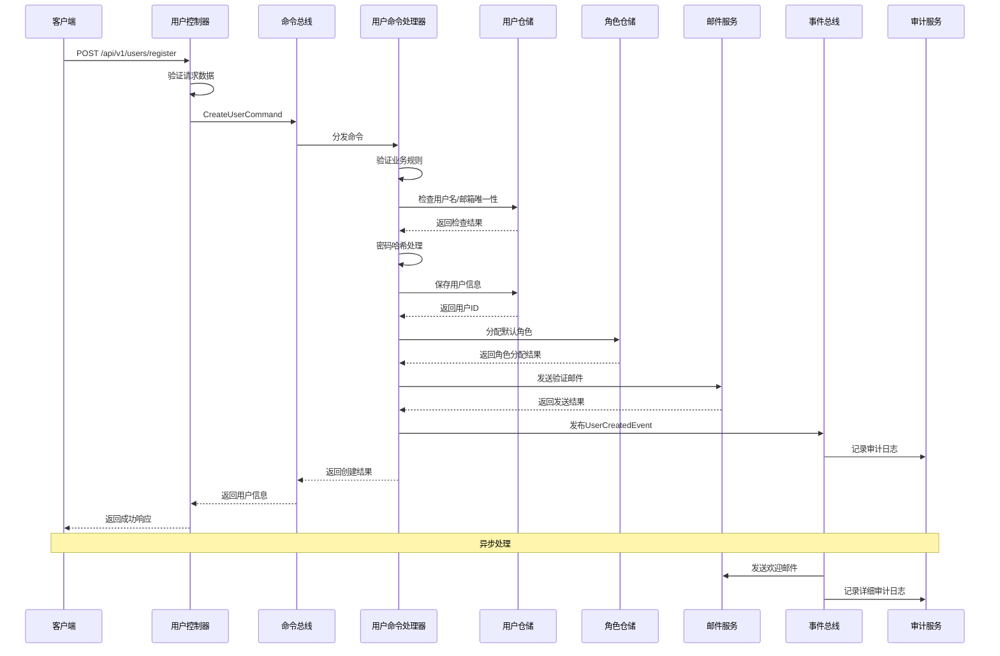
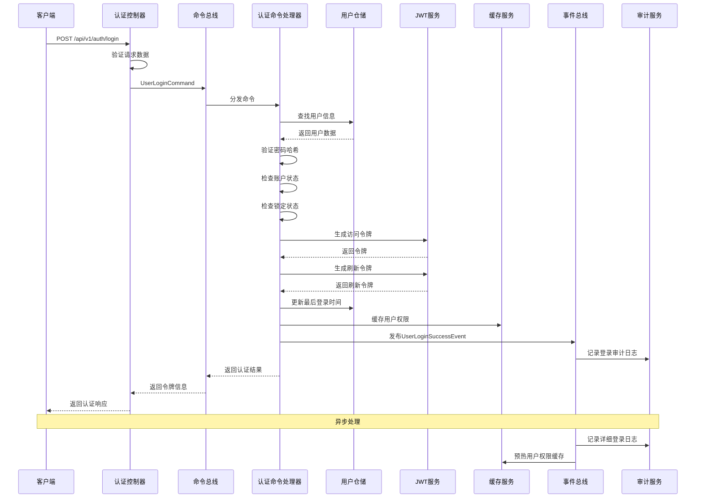
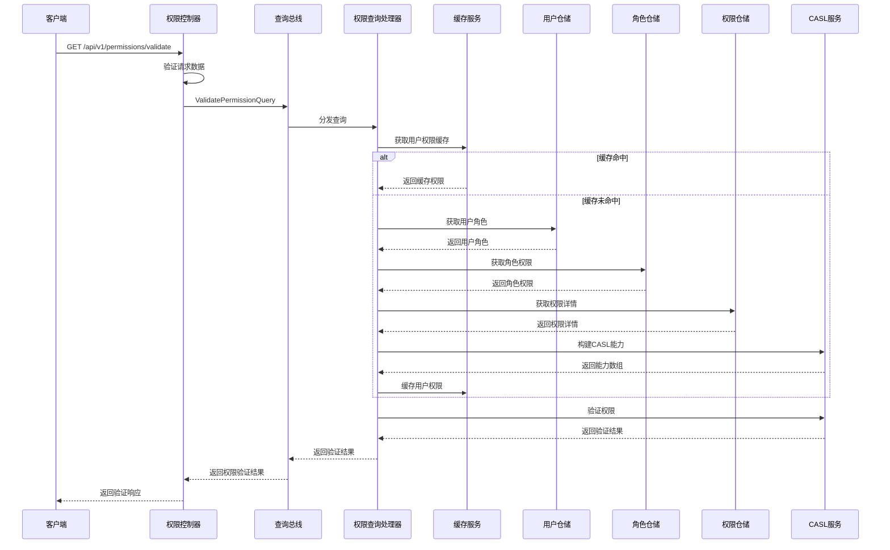
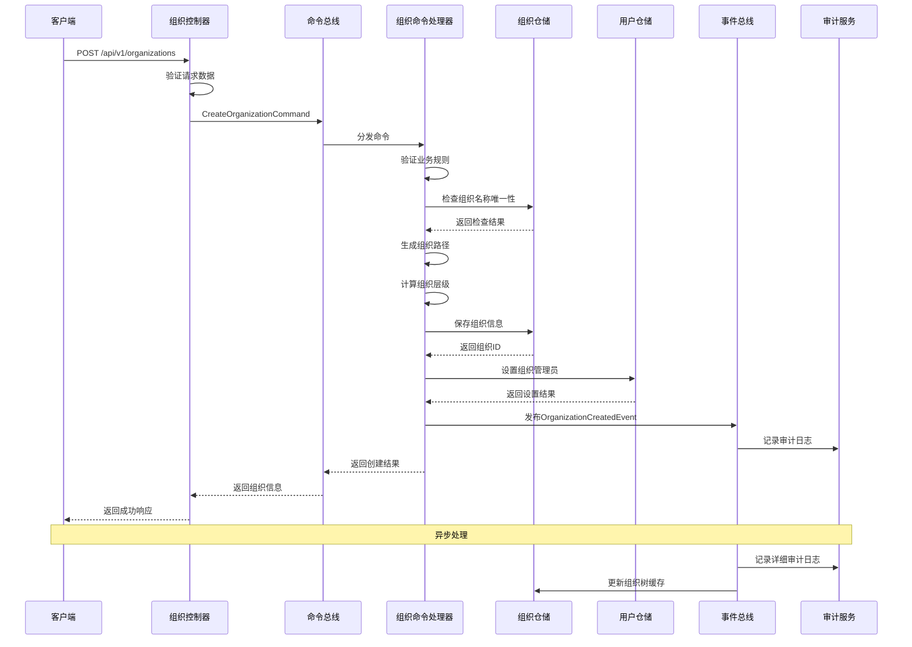

# 应用服务设计

## 文档概述

本文档详细描述IAM系统的应用层服务设计，基于CQRS模式实现命令查询职责分离，协调领域对象完成业务用例，确保业务逻辑的清晰性和可维护性。

---

## 一、应用层架构

### 1.1 整体架构

应用层位于表现层和领域层之间，负责协调领域对象完成业务用例：

```
┌─────────────────────────────────────────────────────────────┐
│                    表现层 (Presentation Layer)              │
│  ┌─────────────┐ ┌─────────────┐ ┌─────────────┐         │
│  │ Controllers │ │ Middlewares │ │   Filters   │         │
│  └─────────────┘ └─────────────┘ └─────────────┘         │
└─────────────────────────────────────────────────────────────┘
┌─────────────────────────────────────────────────────────────┐
│                    应用层 (Application Layer)               │
│  ┌─────────────┐ ┌─────────────┐ ┌─────────────┐         │
│  │ Commands    │ │   Queries   │ │   Handlers  │         │
│  └─────────────┘ └─────────────┘ └─────────────┘         │
│  ┌─────────────┐ ┌─────────────┐ ┌─────────────┐         │
│  │    DTOs     │ │ Validators  │ │   Services  │         │
│  └─────────────┘ └─────────────┘ └─────────────┘         │
│  ┌─────────────┐ ┌─────────────┐ ┌─────────────┐         │
│  │ Interfaces  │ │Abstract Base│ │Implementations│       │
│  └─────────────┘ └─────────────┘ └─────────────┘         │
└─────────────────────────────────────────────────────────────┘
┌─────────────────────────────────────────────────────────────┐
│                    领域层 (Domain Layer)                   │
│  ┌─────────────┐ ┌─────────────┐ ┌─────────────┐         │
│  │  Entities   │ │Value Objects│ │ Repositories│         │
│  └─────────────┘ └─────────────┘ └─────────────┘         │
└─────────────────────────────────────────────────────────────┘
```

### 1.2 接口+抽象类设计模式

#### 1.2.1 设计原则
- **接口定义契约**：定义服务层的业务契约
- **抽象类提供通用实现**：减少重复代码，提供通用功能
- **具体实现类**：实现特定的业务逻辑

#### 1.2.2 分层架构
```
┌─────────────────────────────────────────────────────────────┐
│                    接口层 (Interface Layer)                │
│  ┌─────────────┐ ┌─────────────┐ ┌─────────────┐         │
│  │IUserService │ │ITenantService│ │IRoleService │         │
│  └─────────────┘ └─────────────┘ └─────────────┘         │
└─────────────────────────────────────────────────────────────┘
┌─────────────────────────────────────────────────────────────┐
│                  抽象类层 (Abstract Layer)                 │
│  ┌─────────────┐ ┌─────────────┐ ┌─────────────┐         │
│  │BaseUserService│ │BaseTenantService│ │BaseRoleService│   │
│  └─────────────┘ └─────────────┘ └─────────────┘         │
└─────────────────────────────────────────────────────────────┘
┌─────────────────────────────────────────────────────────────┐
│                  实现层 (Implementation Layer)             │
│  ┌─────────────┐ ┌─────────────┐ ┌─────────────┐         │
│  │UserService  │ │TenantService│ │RoleService  │         │
│  └─────────────┘ └─────────────┘ └─────────────┘         │
└─────────────────────────────────────────────────────────────┘
```

### 1.2 分层职责

#### 1.2.1 命令端（Command Side）
- **职责**：处理写操作，修改系统状态
- **组件**：
  - Commands：命令对象
  - CommandHandlers：命令处理器
  - CommandBus：命令总线
  - EventBus：事件总线

#### 1.2.2 查询端（Query Side）
- **职责**：处理读操作，查询系统状态
- **组件**：
  - Queries：查询对象
  - QueryHandlers：查询处理器
  - QueryBus：查询总线
  - ReadModels：读模型

#### 1.2.3 数据传输对象（DTOs）
- **职责**：定义输入输出数据结构
- **组件**：
  - RequestDTOs：请求数据传输对象
  - ResponseDTOs：响应数据传输对象
  - CommandDTOs：命令数据传输对象
  - QueryDTOs：查询数据传输对象

#### 1.2.4 校验器（Validators）
- **职责**：验证输入数据的有效性
- **组件**：
  - CommandValidators：命令校验器
  - QueryValidators：查询校验器
  - DTOValidators：DTO校验器

### 1.3 CQRS实现

#### 1.3.1 命令端实现
```
┌─────────────┐    ┌─────────────┐    ┌─────────────┐
│   Command   │───▶│   Handler   │───▶│  Aggregate  │
└─────────────┘    └─────────────┘    └─────────────┘
                           │                   │
                           ▼                   ▼
                    ┌─────────────┐    ┌─────────────┐
                    │ Repository  │    │   Events    │
                    └─────────────┘    └─────────────┘
```

#### 1.3.2 查询端实现
```
┌─────────────┐    ┌─────────────┐    ┌─────────────┐
│   Query     │───▶│   Handler   │───▶│  Read Model │
└─────────────┘    └─────────────┘    └─────────────┘
                           │
                           ▼
                    ┌─────────────┐
                    │ Repository  │
                    └─────────────┘
```

---

## 二、服务接口设计

### 2.1 用户服务接口

#### 2.1.1 用户服务接口定义
```typescript
/**
 * @interface IUserService
 * @description
 * 用户服务接口，定义用户相关的业务操作契约。该接口采用依赖倒置原则，
 * 确保应用层不依赖具体的服务实现，而是依赖抽象。
 * 
 * 主要原理与机制：
 * 1. 业务契约：定义用户管理的核心业务操作
 * 2. 多租户支持：所有操作都包含租户上下文
 * 3. 安全控制：集成权限验证和安全检查
 * 4. 事务管理：确保业务操作的原子性
 * 5. 事件发布：业务操作完成后发布领域事件
 */
export interface IUserService {
  // 用户创建和管理
  createUser(command: CreateUserCommand): Promise<CreateUserResult>;
  updateUser(command: UpdateUserCommand): Promise<UpdateUserResult>;
  deleteUser(command: DeleteUserCommand): Promise<DeleteUserResult>;
  activateUser(command: ActivateUserCommand): Promise<ActivateUserResult>;
  suspendUser(command: SuspendUserCommand): Promise<SuspendUserResult>;
  
  // 用户查询
  getUserById(query: GetUserByIdQuery): Promise<GetUserByIdResult>;
  searchUsers(query: SearchUsersQuery): Promise<SearchUsersResult>;
  getUsersByTenant(query: GetUsersByTenantQuery): Promise<GetUsersByTenantResult>;
  
  // 用户认证
  authenticateUser(command: AuthenticateUserCommand): Promise<AuthenticateUserResult>;
  changePassword(command: ChangePasswordCommand): Promise<ChangePasswordResult>;
  resetPassword(command: ResetPasswordCommand): Promise<ResetPasswordResult>;
  
  // 用户权限
  assignRoleToUser(command: AssignRoleToUserCommand): Promise<AssignRoleToUserResult>;
  removeRoleFromUser(command: RemoveRoleFromUserCommand): Promise<RemoveRoleFromUserResult>;
  getUserPermissions(query: GetUserPermissionsQuery): Promise<GetUserPermissionsResult>;
}
```

#### 2.1.2 用户服务抽象类
```typescript
/**
 * @abstract class BaseUserService
 * @description
 * 用户服务抽象类，提供用户服务接口的通用实现。该抽象类实现了
 * 用户服务接口的通用逻辑，具体服务类可以继承此类并实现特定的业务逻辑。
 * 
 * 主要原理与机制：
 * 1. 模板方法模式：定义业务操作骨架，子类实现具体步骤
 * 2. 依赖注入：通过构造函数注入必要的依赖服务
 * 3. 事务管理：统一的事务管理机制
 * 4. 事件发布：统一的领域事件发布机制
 * 5. 审计日志：统一的审计日志记录
 * 6. 权限验证：统一的权限验证机制
 */
export abstract class BaseUserService implements IUserService {
  constructor(
    protected readonly userRepository: IUserRepository,
    protected readonly roleRepository: IRoleRepository,
    protected readonly permissionRepository: IPermissionRepository,
    protected readonly passwordService: IPasswordService,
    protected readonly eventBus: IEventBus,
    protected readonly auditService: IAuditService,
    protected readonly logger: Logger,
  ) {}

  /**
   * @method createUser
   * @description 创建用户，包含完整的业务逻辑
   */
  async createUser(command: CreateUserCommand): Promise<CreateUserResult> {
    try {
      // 1. 验证输入
      await this.validateCreateUserCommand(command);
      
      // 2. 检查业务规则
      await this.checkCreateUserBusinessRules(command);
      
      // 3. 创建用户实体
      const user = await this.createUserEntity(command);
      
      // 4. 保存用户
      await this.saveUser(user);
      
      // 5. 分配默认角色
      await this.assignDefaultRoles(user);
      
      // 6. 发布事件
      await this.publishUserCreatedEvent(user);
      
      // 7. 记录审计日志
      await this.auditUserCreation(user, command);
      
      return {
        success: true,
        userId: user.id,
        message: 'User created successfully',
      };
    } catch (error) {
      this.logger.error('Failed to create user', error);
      return {
        success: false,
        error: error.message,
      };
    }
  }

  /**
   * @method updateUser
   * @description 更新用户信息
   */
  async updateUser(command: UpdateUserCommand): Promise<UpdateUserResult> {
    try {
      // 1. 验证输入
      await this.validateUpdateUserCommand(command);
      
      // 2. 获取用户
      const user = await this.getUserById(command.userId);
      if (!user) {
        throw new EntityNotFoundException(`User not found: ${command.userId}`);
      }
      
      // 3. 检查权限
      await this.checkUpdateUserPermission(user, command);
      
      // 4. 更新用户
      await this.updateUserEntity(user, command);
      
      // 5. 保存用户
      await this.saveUser(user);
      
      // 6. 发布事件
      await this.publishUserUpdatedEvent(user);
      
      // 7. 记录审计日志
      await this.auditUserUpdate(user, command);
      
      return {
        success: true,
        userId: user.id,
        message: 'User updated successfully',
      };
    } catch (error) {
      this.logger.error('Failed to update user', error);
      return {
        success: false,
        error: error.message,
      };
    }
  }

  /**
   * @method authenticateUser
   * @description 用户认证
   */
  async authenticateUser(command: AuthenticateUserCommand): Promise<AuthenticateUserResult> {
    try {
      // 1. 查找用户
      const user = await this.findUserByCredentials(command);
      if (!user) {
        return {
          success: false,
          error: 'Invalid credentials',
        };
      }
      
      // 2. 验证密码
      const isPasswordValid = await this.validatePassword(user, command.password);
      if (!isPasswordValid) {
        await this.handleFailedLogin(user);
        return {
          success: false,
          error: 'Invalid credentials',
        };
      }
      
      // 3. 检查用户状态
      if (!user.isActive()) {
        return {
          success: false,
          error: 'User account is not active',
        };
      }
      
      // 4. 更新登录信息
      await this.updateLoginInfo(user);
      
      // 5. 生成认证令牌
      const token = await this.generateAuthToken(user);
      
      // 6. 发布事件
      await this.publishUserAuthenticatedEvent(user);
      
      return {
        success: true,
        token,
        user: this.mapUserToDto(user),
      };
    } catch (error) {
      this.logger.error('Failed to authenticate user', error);
      return {
        success: false,
        error: error.message,
      };
    }
  }

  // 抽象方法，由子类实现
  protected abstract validateCreateUserCommand(command: CreateUserCommand): Promise<void>;
  protected abstract checkCreateUserBusinessRules(command: CreateUserCommand): Promise<void>;
  protected abstract createUserEntity(command: CreateUserCommand): Promise<User>;
  protected abstract saveUser(user: User): Promise<void>;
  protected abstract assignDefaultRoles(user: User): Promise<void>;
  protected abstract publishUserCreatedEvent(user: User): Promise<void>;
  protected abstract auditUserCreation(user: User, command: CreateUserCommand): Promise<void>;
  
  protected abstract validateUpdateUserCommand(command: UpdateUserCommand): Promise<void>;
  protected abstract getUserById(userId: string): Promise<User | null>;
  protected abstract checkUpdateUserPermission(user: User, command: UpdateUserCommand): Promise<void>;
  protected abstract updateUserEntity(user: User, command: UpdateUserCommand): Promise<void>;
  protected abstract publishUserUpdatedEvent(user: User): Promise<void>;
  protected abstract auditUserUpdate(user: User, command: UpdateUserCommand): Promise<void>;
  
  protected abstract findUserByCredentials(command: AuthenticateUserCommand): Promise<User | null>;
  protected abstract validatePassword(user: User, password: string): Promise<boolean>;
  protected abstract handleFailedLogin(user: User): Promise<void>;
  protected abstract updateLoginInfo(user: User): Promise<void>;
  protected abstract generateAuthToken(user: User): Promise<string>;
  protected abstract publishUserAuthenticatedEvent(user: User): Promise<void>;
  protected abstract mapUserToDto(user: User): UserDto;

  // 其他方法的默认实现...
  async deleteUser(command: DeleteUserCommand): Promise<DeleteUserResult> {
    // 实现删除用户的通用逻辑
    return { success: true };
  }

  async activateUser(command: ActivateUserCommand): Promise<ActivateUserResult> {
    // 实现激活用户的通用逻辑
    return { success: true };
  }

  async suspendUser(command: SuspendUserCommand): Promise<SuspendUserResult> {
    // 实现禁用用户的通用逻辑
    return { success: true };
  }

  async getUserById(query: GetUserByIdQuery): Promise<GetUserByIdResult> {
    // 实现根据ID查询用户的通用逻辑
    return { success: true };
  }

  async searchUsers(query: SearchUsersQuery): Promise<SearchUsersResult> {
    // 实现搜索用户的通用逻辑
    return { success: true };
  }

  async getUsersByTenant(query: GetUsersByTenantQuery): Promise<GetUsersByTenantResult> {
    // 实现根据租户查询用户的通用逻辑
    return { success: true };
  }

  async changePassword(command: ChangePasswordCommand): Promise<ChangePasswordResult> {
    // 实现修改密码的通用逻辑
    return { success: true };
  }

  async resetPassword(command: ResetPasswordCommand): Promise<ResetPasswordResult> {
    // 实现重置密码的通用逻辑
    return { success: true };
  }

  async assignRoleToUser(command: AssignRoleToUserCommand): Promise<AssignRoleToUserResult> {
    // 实现分配角色的通用逻辑
    return { success: true };
  }

  async removeRoleFromUser(command: RemoveRoleFromUserCommand): Promise<RemoveRoleFromUserResult> {
    // 实现移除角色的通用逻辑
    return { success: true };
  }

  async getUserPermissions(query: GetUserPermissionsQuery): Promise<GetUserPermissionsResult> {
    // 实现获取用户权限的通用逻辑
    return { success: true };
  }
}
```

### 2.2 租户服务接口

#### 2.2.1 租户服务接口定义
```typescript
/**
 * @interface ITenantService
 * @description
 * 租户服务接口，定义租户相关的业务操作契约。
 * 
 * 主要原理与机制：
 * 1. 租户生命周期管理：创建、激活、禁用、删除
 * 2. 租户配置管理：设置、更新、查询租户配置
 * 3. 租户统计信息：获取租户使用统计
 * 4. 多租户隔离：确保租户间数据隔离
 */
export interface ITenantService {
  // 租户生命周期管理
  createTenant(command: CreateTenantCommand): Promise<CreateTenantResult>;
  activateTenant(command: ActivateTenantCommand): Promise<ActivateTenantResult>;
  suspendTenant(command: SuspendTenantCommand): Promise<SuspendTenantResult>;
  deleteTenant(command: DeleteTenantCommand): Promise<DeleteTenantResult>;
  
  // 租户查询
  getTenantById(query: GetTenantByIdQuery): Promise<GetTenantByIdResult>;
  searchTenants(query: SearchTenantsQuery): Promise<SearchTenantsResult>;
  getAllTenants(query: GetAllTenantsQuery): Promise<GetAllTenantsResult>;
  
  // 租户配置管理
  updateTenantSettings(command: UpdateTenantSettingsCommand): Promise<UpdateTenantSettingsResult>;
  getTenantSettings(query: GetTenantSettingsQuery): Promise<GetTenantSettingsResult>;
  
  // 租户统计
  getTenantStatistics(query: GetTenantStatisticsQuery): Promise<GetTenantStatisticsResult>;
}
```

---

## 三、命令设计

### 3.1 租户管理命令

#### 2.1.1 创建租户命令（CreateTenantCommand）
- **输入参数**：
  - name：租户名称
  - code：租户编码
  - description：租户描述
  - adminUserInfo：管理员用户信息
- **输出结果**：租户ID和管理员用户ID
- **业务规则**：
  - 验证租户名称和编码唯一性
  - 自动创建租户管理员用户
  - 分配系统默认角色
  - 发送租户创建确认邮件
  - 记录租户创建审计日志

#### 2.1.2 激活租户命令（ActivateTenantCommand）
- **输入参数**：
  - tenantId：租户ID
  - reason：激活原因
- **输出结果**：激活后的租户状态
- **业务规则**：
  - 验证租户存在且状态为PENDING
  - 启用租户内所有用户登录
  - 发送激活通知
  - 记录激活审计日志

#### 2.1.3 禁用租户命令（SuspendTenantCommand）
- **输入参数**：
  - tenantId：租户ID
  - reason：禁用原因
- **输出结果**：禁用后的租户状态
- **业务规则**：
  - 验证租户存在且状态为ACTIVE
  - 禁用租户内所有用户登录
  - 发送禁用通知
  - 记录禁用审计日志

### 2.2 用户管理命令

#### 2.2.1 创建用户命令（CreateUserCommand）
- **输入参数**：
  - username：用户名
  - email：邮箱地址
  - password：密码
  - firstName：名
  - lastName：姓
  - tenantId：租户ID
- **输出结果**：用户ID
- **业务规则**：
  - 验证用户名和邮箱在租户内唯一
  - 验证密码强度符合安全策略
  - 自动分配默认角色
  - 发送邮箱验证邮件
  - 记录用户创建审计日志

#### 2.2.2 用户登录命令（UserLoginCommand）
- **输入参数**：
  - username：用户名或邮箱
  - password：密码
  - tenantId：租户ID
  - ipAddress：IP地址
  - userAgent：用户代理
- **输出结果**：JWT令牌和用户信息
- **业务规则**：
  - 验证用户状态（非禁用、非删除）
  - 验证密码哈希
  - 检查账户锁定状态
  - 支持二步验证
  - 更新最后登录时间和失败次数
  - 记录登录审计日志

#### 2.2.3 更新用户信息命令（UpdateUserCommand）
- **输入参数**：
  - userId：用户ID
  - firstName：名
  - lastName：姓
  - displayName：显示名称
  - avatar：头像URL
- **输出结果**：更新后的用户信息
- **业务规则**：
  - 验证用户存在且属于当前租户
  - 验证更新权限
  - 记录信息变更审计日志

### 2.3 角色管理命令

#### 2.3.1 创建角色命令（CreateRoleCommand）
- **输入参数**：
  - name：角色名称
  - code：角色编码
  - description：角色描述
  - tenantId：租户ID
  - organizationId：组织ID（可选）
  - priority：角色优先级
- **输出结果**：角色ID
- **业务规则**：
  - 验证角色名称和编码在租户内唯一
  - 支持角色继承关系
  - 可设置最大用户数限制
  - 记录角色创建审计日志

#### 2.3.2 分配权限命令（AssignPermissionCommand）
- **输入参数**：
  - roleId：角色ID
  - permissionIds：权限ID列表
  - tenantId：租户ID
- **输出结果**：分配结果
- **业务规则**：
  - 验证角色和权限属于同一租户
  - 权限变更实时生效
  - 支持权限继承
  - 记录权限分配审计日志

#### 2.3.3 分配用户命令（AssignUserCommand）
- **输入参数**：
  - roleId：角色ID
  - userIds：用户ID列表
  - tenantId：租户ID
- **输出结果**：分配结果
- **业务规则**：
  - 验证角色和用户属于同一租户
  - 检查角色最大用户数限制
  - 用户分配实时生效
  - 记录用户分配审计日志

### 2.4 权限管理命令

#### 2.4.1 创建权限命令（CreatePermissionCommand）
- **输入参数**：
  - name：权限名称
  - code：权限编码
  - description：权限描述
  - type：权限类型
  - action：权限操作
  - tenantId：租户ID
  - conditions：权限条件（可选）
  - fields：字段权限（可选）
- **输出结果**：权限ID
- **业务规则**：
  - 验证权限编码在租户内唯一
  - 支持CASL条件权限和字段级权限
  - 支持权限继承
  - 自动生成CASL能力定义
  - 记录权限创建审计日志

#### 2.4.2 验证权限命令（ValidatePermissionCommand）
- **输入参数**：
  - userId：用户ID
  - resource：资源
  - action：操作
  - resourceAttributes：资源属性（可选）
  - tenantId：租户ID
- **输出结果**：权限验证结果（布尔值）
- **业务规则**：
  - 检查用户角色
  - 检查角色权限
  - 支持权限继承
  - 支持CASL条件权限评估
  - 支持字段级权限控制
  - 缓存权限验证结果

### 2.5 组织管理命令

#### 2.5.1 创建组织命令（CreateOrganizationCommand）
- **输入参数**：
  - name：组织名称
  - code：组织编码
  - description：组织描述
  - type：组织类型
  - parentId：父组织ID（可选）
  - tenantId：租户ID
- **输出结果**：组织ID
- **业务规则**：
  - 验证组织名称和编码在租户内唯一
  - 自动生成组织路径和层级
  - 支持组织继承权限
  - 记录组织创建审计日志

#### 2.5.2 调整组织层级命令（MoveOrganizationCommand）
- **输入参数**：
  - organizationId：组织ID
  - newParentId：新父组织ID
  - tenantId：租户ID
- **输出结果**：调整结果
- **业务规则**：
  - 验证不会形成循环引用
  - 自动更新组织路径
  - 更新子组织层级
  - 记录层级变更审计日志

#### 2.5.3 分配用户到组织命令（AssignUserToOrganizationCommand）
- **输入参数**：
  - userId：用户ID
  - organizationId：组织ID
  - role：组织角色
  - isPrimary：是否主要组织
  - tenantId：租户ID
- **输出结果**：分配结果
- **业务规则**：
  - 验证用户和组织属于同一租户
  - 支持多组织关联
  - 支持设置主要组织
  - 记录组织关联变更审计日志

---

## 三、查询设计

### 3.1 租户查询

#### 3.1.1 查询租户列表（GetTenantsQuery）
- **输入参数**：
  - page：页码
  - size：页大小
  - status：状态过滤
  - search：搜索关键词
- **输出结果**：租户列表和分页信息
- **查询逻辑**：
  - 支持分页查询
  - 支持状态过滤
  - 支持关键词搜索
  - 返回租户基本信息

#### 3.1.2 查询租户详情（GetTenantQuery）
- **输入参数**：
  - tenantId：租户ID
- **输出结果**：租户详细信息
- **查询逻辑**：
  - 返回租户完整信息
  - 包含管理员用户信息
  - 包含租户配置信息
  - 包含租户统计信息

### 3.2 用户查询

#### 3.2.1 查询用户列表（GetUsersQuery）
- **输入参数**：
  - tenantId：租户ID
  - page：页码
  - size：页大小
  - status：状态过滤
  - organizationId：组织过滤
  - roleId：角色过滤
  - search：搜索关键词
- **输出结果**：用户列表和分页信息
- **查询逻辑**：
  - 基于租户ID过滤
  - 支持多条件组合查询
  - 支持分页和排序
  - 返回用户基本信息

#### 3.2.2 查询用户详情（GetUserQuery）
- **输入参数**：
  - userId：用户ID
  - tenantId：租户ID
- **输出结果**：用户详细信息
- **查询逻辑**：
  - 返回用户完整信息
  - 包含用户角色信息
  - 包含用户组织信息
  - 包含用户权限信息

#### 3.2.3 查询用户权限（GetUserPermissionsQuery）
- **输入参数**：
  - userId：用户ID
  - tenantId：租户ID
  - resourceType：资源类型（可选）
- **输出结果**：用户权限列表
- **查询逻辑**：
  - 聚合用户所有角色的权限
  - 处理权限冲突（按角色优先级）
  - 支持权限继承计算
  - 支持CASL条件权限评估
  - 生成CASL能力数组

### 3.3 角色与权限查询

#### 3.3.1 查询角色列表（GetRolesQuery）
- **输入参数**：
  - tenantId：租户ID
  - page：页码
  - size：页大小
  - search：搜索关键词（可选）
- **输出结果**：角色列表和分页信息
- **查询逻辑**：
  - 基于租户ID过滤
  - 支持名称、编码等模糊搜索
  - 支持分页和排序
  - 返回角色基本信息

#### 3.3.2 查询角色详情（GetRoleQuery）
- **输入参数**：
  - roleId：角色ID
  - tenantId：租户ID
- **输出结果**：角色详细信息
- **查询逻辑**：
  - 返回角色完整信息
  - 包含角色权限列表
  - 包含角色继承关系
  - 包含角色下属用户数量

#### 3.3.3 查询权限列表（GetPermissionsQuery）
- **输入参数**：
  - tenantId：租户ID
  - resourceType：资源类型（可选）
- **输出结果**：权限列表
- **查询逻辑**：
  - 基于租户ID过滤
  - 支持按资源类型筛选
  - 返回权限基本信息

#### 3.3.4 查询权限详情（GetPermissionQuery）
- **输入参数**：
  - permissionId：权限ID
  - tenantId：租户ID
- **输出结果**：权限详细信息对象，包括但不限于以下字段：
  - id：权限ID
  - name：权限名称
  - code：权限编码
  - resourceType：所属资源类型
  - action：操作类型（如read、write、delete等）
  - description：权限描述
  - createdAt：创建时间
  - updatedAt：更新时间
  - inheritedFrom：继承来源（如有）
- **查询逻辑**：
  - 校验tenantId和permissionId的有效性，确保权限属于指定租户
  - 查询并返回权限的完整信息
  - 包含权限所属资源、操作、描述等详细字段
  - 若权限存在继承关系，需返回继承来源信息
  - 记录查询操作的审计日志（如有合规要求）
### 3.4 用户与组织查询

#### 3.4.1 查询用户列表（GetUsersQuery）
- **输入参数**：
  - tenantId：租户ID
  - orgId：组织ID（可选，支持查询指定组织下的用户）
  - page：页码
  - size：页大小
  - search：搜索关键词（可选，支持用户名、邮箱、手机号模糊搜索）
- **输出结果**：用户列表及分页信息
- **查询逻辑**：
  - 基于租户ID过滤
  - 可选按组织ID过滤
  - 支持用户名、邮箱、手机号等模糊搜索
  - 支持分页和排序
  - 返回用户基本信息（如id、username、email、status、orgId等）

#### 3.4.2 查询用户详情（GetUserQuery）
- **输入参数**：
  - userId：用户ID
  - tenantId：租户ID
- **输出结果**：用户详细信息
- **查询逻辑**：
  - 校验userId和tenantId的有效性
  - 返回用户完整信息（含基本信息、所属组织、角色、权限等）
  - 可包含用户扩展属性

#### 3.4.3 查询组织结构树（GetOrgTreeQuery）
- **输入参数**：
  - tenantId：租户ID
  - parentOrgId：父组织ID（可选，默认查询整个租户的组织树）
- **输出结果**：组织结构树（树形结构，包含子组织和用户数量等信息）
- **查询逻辑**：
  - 基于租户ID查询组织结构
  - 支持递归查询子组织
  - 每个组织节点可包含下属用户数量、组织属性等

#### 3.4.4 查询组织详情（GetOrgQuery）
- **输入参数**：
  - orgId：组织ID
  - tenantId：租户ID
- **输出结果**：组织详细信息
- **查询逻辑**：
  - 校验orgId和tenantId的有效性
  - 返回组织完整信息（如名称、编码、描述、父组织、下属组织、用户数量等）
### 3.5 审计日志与安全事件查询（AuditLog & SecurityEvent Query）

- **输入参数**：
  - tenantId：租户ID
  - page：页码
  - size：页大小
  - eventType：事件类型（可选，支持按登录、权限变更、数据访问等类型筛选）
  - userId：用户ID（可选，支持查询指定用户的操作记录）
  - startTime/endTime：时间范围（可选，支持按时间区间筛选）
  - keyword：关键词（可选，支持模糊搜索事件内容）

- **输出结果**：审计日志或安全事件列表及分页信息

- **查询逻辑**：
  - 基于租户ID过滤，确保数据隔离
  - 支持多条件组合筛选（事件类型、用户、时间区间、关键词等）
  - 支持分页和排序（如按时间倒序）
  - 返回事件基本信息（如id、eventType、userId、username、ip、发生时间、事件内容等）
  - 可扩展返回事件详情（如变更前后数据、关联资源等）
---
## 四、
#### 4. 应用服务实现机制说明

本节说明IAM系统应用层服务的核心实现机制，重点包括CQRS模式、命令/查询处理流程、事件发布与订阅等。

##### 4.1 CQRS模式实现

- **命令（Command）**：用于变更系统状态的操作，如创建、更新、删除等。每个命令由对应的命令对象（Command）和命令处理器（CommandHandler）实现。
- **查询（Query）**：用于读取系统状态的操作，如获取详情、列表等。每个查询由查询对象（Query）和查询处理器（QueryHandler）实现。
- **命令总线（CommandBus）/查询总线（QueryBus）**：负责分发命令和查询到对应的处理器，实现解耦。
- **事件总线（EventBus）**：用于在命令处理后发布领域事件，实现跨模块解耦和扩展。

##### 4.2 命令/查询处理流程

- **命令处理流程**：
  1. 表现层（Controller）接收请求，组装命令对象（Command）。
  2. 命令对象通过CommandBus分发到对应的CommandHandler。
  3. CommandHandler协调领域对象执行业务逻辑，变更系统状态。
  4. 处理完成后可发布领域事件（如UserCreatedEvent）。
  5. 返回处理结果或错误信息。

- **查询处理流程**：
  1. 表现层（Controller）接收请求，组装查询对象（Query）。
  2. 查询对象通过QueryBus分发到对应的QueryHandler。
  3. QueryHandler从只读数据源（如ReadModel、数据库）查询数据。
  4. 返回查询结果。

##### 4.3 事件发布与订阅

- **领域事件**：如用户注册、角色变更、权限分配等，命令处理后通过EventBus发布。
- **事件订阅者**：监听特定事件，执行后续操作（如发送通知、写入审计日志、同步外部系统等）。
- **事件溯源**：关键业务事件可持久化，支持系统追溯和审计。

---
## 五、典型用例流程设计

### 5.1 用户注册流程

#### 5.1.1 用户注册时序图



#### 5.1.2 用户注册业务规则
- **数据验证**：用户名、邮箱在租户内唯一
- **密码安全**：密码强度符合安全策略
- **默认角色**：自动分配系统默认角色
- **邮箱验证**：发送邮箱验证邮件
- **审计记录**：记录用户创建审计日志

### 5.2 用户登录流程

#### 5.2.1 用户登录时序图



#### 5.2.2 用户登录业务规则
- **状态检查**：用户状态必须为ACTIVE
- **锁定检查**：检查账户是否被锁定
- **密码验证**：验证密码哈希
- **令牌生成**：生成JWT访问令牌和刷新令牌
- **权限缓存**：缓存用户权限信息
- **审计记录**：记录登录审计日志

### 5.3 权限验证流程

#### 5.3.1 权限验证时序图



#### 5.3.2 权限验证业务规则
- **缓存优先**：优先从缓存获取用户权限
- **角色聚合**：聚合用户所有角色的权限
- **权限继承**：处理角色和权限的继承关系
- **CASL集成**：使用CASL进行权限验证
- **字段级权限**：支持字段级权限控制
- **条件权限**：支持基于条件的动态权限

### 5.4 组织管理流程

#### 5.4.1 创建组织时序图



#### 5.4.2 组织管理业务规则
- **名称唯一性**：组织名称在租户内唯一
- **层级管理**：自动生成组织路径和层级
- **管理员设置**：设置组织管理员
- **权限继承**：支持组织级权限继承
- **审计记录**：记录组织变更审计日志

---

## 六、应用服务最佳实践

### 6.1 命令设计最佳实践

#### 6.1.1 命令命名规范
- **动词+名词**：如CreateUserCommand、UpdateRoleCommand
- **明确意图**：命令名称应明确表达业务意图
- **单一职责**：每个命令只负责一个业务操作
- **不可变对象**：命令对象应为不可变对象

#### 6.1.2 命令验证策略
- **输入验证**：在命令处理器中进行输入验证
- **业务规则验证**：验证业务规则和约束条件
- **权限验证**：验证操作权限
- **数据一致性验证**：确保数据一致性

#### 6.1.3 命令处理最佳实践
- **事务管理**：在命令处理器中管理事务
- **异常处理**：统一的异常处理机制
- **事件发布**：命令成功后发布领域事件
- **审计记录**：记录关键操作的审计日志

### 6.2 查询设计最佳实践

#### 6.2.1 查询命名规范
- **Get+名词**：如GetUserQuery、GetRoleListQuery
- **明确查询意图**：查询名称应明确表达查询意图
- **参数设计**：查询参数应支持灵活的查询条件
- **分页支持**：查询应支持分页和排序

#### 6.2.2 查询优化策略
- **缓存利用**：合理利用缓存提升查询性能
- **索引优化**：确保查询使用合适的索引
- **查询优化**：优化复杂查询的性能
- **数据投影**：只返回必要的字段

#### 6.2.3 查询处理最佳实践
- **只读操作**：查询处理器应为只读操作
- **性能监控**：监控查询性能
- **错误处理**：统一的错误处理机制
- **结果缓存**：缓存查询结果

### 6.3 事件设计最佳实践

#### 6.3.1 事件命名规范
- **名词+过去时**：如UserCreatedEvent、RoleUpdatedEvent
- **明确事件含义**：事件名称应明确表达事件含义
- **包含必要信息**：事件应包含必要的业务信息
- **版本管理**：支持事件版本管理

#### 6.3.2 事件发布策略
- **异步发布**：事件发布应为异步操作
- **幂等性**：事件处理应支持幂等性
- **错误处理**：事件处理失败时的重试机制
- **监控告警**：事件处理的监控和告警

#### 6.3.3 事件订阅最佳实践
- **单一职责**：每个事件订阅者只处理一个事件
- **错误隔离**：事件处理错误不应影响其他订阅者
- **性能优化**：优化事件处理性能
- **监控告警**：监控事件处理状态

### 6.4 性能优化最佳实践

#### 6.4.1 缓存策略
- **多级缓存**：实现多级缓存架构
- **缓存预热**：系统启动时预热关键缓存
- **缓存失效**：合理的缓存失效策略
- **缓存监控**：监控缓存命中率和性能

#### 6.4.2 数据库优化
- **连接池优化**：优化数据库连接池配置
- **查询优化**：优化数据库查询性能
- **索引优化**：合理设计数据库索引
- **分页优化**：优化大数据量的分页查询

#### 6.4.3 异步处理
- **异步命令**：将耗时操作异步化
- **批量处理**：支持批量操作提升性能
- **并发控制**：合理的并发控制策略
- **资源管理**：合理管理系统资源

---

## 七、总结

### 7.1 设计亮点

#### 7.1.1 架构设计亮点
- **CQRS模式**：清晰的命令查询职责分离
- **事件驱动**：基于领域事件的解耦设计
- **模块化设计**：高度模块化的应用服务设计
- **可扩展性**：支持功能扩展和定制

#### 7.1.2 技术实现亮点
- **统一接口**：统一的命令和查询接口设计
- **性能优化**：多层次的性能优化策略
- **错误处理**：完善的错误处理和恢复机制
- **监控告警**：全面的监控和告警体系

#### 7.1.3 业务支持亮点
- **多租户支持**：完整的多租户业务支持
- **权限管理**：细粒度的权限控制
- **审计合规**：完整的审计和合规支持
- **用户体验**：优秀的用户体验设计

### 7.2 技术优势

#### 7.2.1 性能优势
- **高并发支持**：支持高并发访问
- **低延迟响应**：优化的响应时间
- **高吞吐量**：支持高吞吐量处理
- **资源效率**：高效的资源利用

#### 7.2.2 可维护性优势
- **代码清晰**：清晰的代码结构和命名
- **文档完善**：完善的文档和注释
- **测试覆盖**：全面的测试覆盖
- **版本管理**：完善的版本管理

#### 7.2.3 可扩展性优势
- **模块化扩展**：支持模块化功能扩展
- **插件机制**：支持插件机制扩展
- **API扩展**：支持API接口扩展
- **业务扩展**：支持业务功能扩展

### 7.3 实施建议

#### 7.3.1 开发阶段建议
- **渐进式开发**：按模块逐步实现功能
- **测试驱动**：采用测试驱动开发
- **代码审查**：建立代码审查机制
- **文档同步**：保持代码和文档同步

#### 7.3.2 部署阶段建议
- **环境隔离**：确保环境完全隔离
- **自动化部署**：建立自动化部署流程
- **监控告警**：部署完善的监控告警
- **备份恢复**：建立备份恢复机制

#### 7.3.3 运维阶段建议
- **性能监控**：持续监控系统性能
- **容量规划**：根据业务增长进行容量规划
- **安全防护**：定期进行安全检查和更新
- **持续优化**：根据监控数据持续优化

这个应用服务设计为IAM系统提供了完整的应用层实现方案，确保系统能够满足复杂的业务需求，同时保持技术先进性和可维护性。通过CQRS模式、事件驱动架构、性能优化等设计，为系统的长期稳定运行提供了坚实的技术基础。
