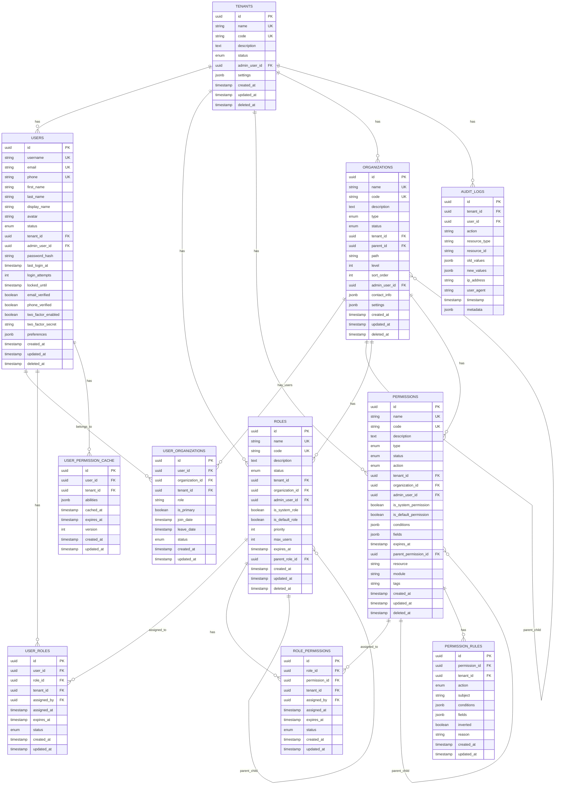

# 基础设施设计

## 文档概述

本文档详细描述IAM系统的基础设施层设计，包括数据库设计、仓储实现、外部服务集成等，确保系统的技术实现细节与领域层解耦。

## 基础设施架构图

```mermaid
graph TB
    subgraph "表现层 (Presentation Layer)"
        A[API Gateway] --> B[Load Balancer]
        B --> C1[Web Server 1]
        B --> C2[Web Server 2]
        B --> C3[Web Server N]
    end
    
    subgraph "应用层 (Application Layer)"
        D1[App Instance 1]
        D2[App Instance 2]
        D3[App Instance N]
    end
    
    subgraph "基础设施层 (Infrastructure Layer)"
        subgraph "数据存储"
            E1[(PostgreSQL Master)]
            E2[(PostgreSQL Slave)]
            E3[(Redis Cluster)]
            E4[(RabbitMQ)]
        end
        
        subgraph "外部服务"
            F1[Email Service]
            F2[SMS Service]
            F3[File Storage]
            F4[Third-party Auth]
        end
        
        subgraph "监控运维"
            G1[Prometheus]
            G2[Grafana]
            G3[ELK Stack]
            G4[AlertManager]
        end
    end
    
    subgraph "安全基础设施"
        H1[JWT Service]
        H2[Encryption Service]
        H3[Security Monitoring]
        H4[Audit Logging]
    end
    
    subgraph "部署基础设施"
        I1[Docker Registry]
        I2[Kubernetes Cluster]
        I3[CI/CD Pipeline]
        I4[Monitoring Stack]
    end
    
    C1 --> D1
    C2 --> D2
    C3 --> D3
    
    D1 --> E1
    D2 --> E1
    D3 --> E1
    
    D1 --> E3
    D2 --> E3
    D3 --> E3
    
    D1 --> E4
    D2 --> E4
    D3 --> E4
    
    D1 --> F1
    D2 --> F2
    D3 --> F3
    D3 --> F4
    
    D1 --> G1
    D2 --> G2
    D3 --> G3
    
    D1 --> H1
    D2 --> H2
    D3 --> H3
    D3 --> H4
    
    I1 --> I2
    I2 --> I3
    I3 --> I4
    
    classDef presentation fill:#e3f2fd,stroke:#1565c0,stroke-width:2px,color:#0d47a1
    classDef application fill:#f3e5f5,stroke:#6a1b9a,stroke-width:2px,color:#4a148c
    classDef infrastructure fill:#e8f5e8,stroke:#2e7d32,stroke-width:2px,color:#1b5e20
    classDef security fill:#fff3e0,stroke:#ef6c00,stroke-width:2px,color:#e65100
    classDef deployment fill:#fce4ec,stroke:#c2185b,stroke-width:2px,color:#880e4f
    
    class A,B,C1,C2,C3 presentation
    class D1,D2,D3 application
    class E1,E2,E3,E4,F1,F2,F3,F4,G1,G2,G3,G4 infrastructure
    class H1,H2,H3,H4 security
    class I1,I2,I3,I4 deployment
```

---

## 一、数据库设计

### 1.1 数据库架构设计

#### 1.1.1 数据库选型
- **主数据库**：PostgreSQL 15+
  - 支持复杂查询和事务
  - 强大的JSON支持
  - 优秀的并发性能
  - 丰富的索引类型
- **缓存数据库**：Redis 7+
  - 高性能内存数据库
  - 支持多种数据结构
  - 支持持久化和集群
- **消息队列**：RabbitMQ 3.x
  - 可靠的消息传递
  - 支持多种消息模式
  - 支持集群和高可用

#### 1.1.2 数据库架构
- **主从架构**：主库负责写操作，从库负责读操作
- **读写分离**：通过连接池实现读写分离
- **分库分表**：支持按租户分库，按时间分表
- **备份策略**：定期全量备份，实时增量备份

#### 1.1.3 多租户数据隔离策略
- **软隔离**：通过租户ID字段实现数据隔离
  - 所有表都包含tenant_id字段
  - 查询时自动添加租户过滤条件
  - 支持跨租户数据共享（系统级数据）
- **硬隔离**：支持数据库级别的租户隔离
  - 每个租户独立数据库
  - 支持动态创建租户数据库
  - 支持租户数据迁移
- **混合隔离**：根据业务需求选择隔离策略
  - 核心数据采用硬隔离
  - 共享数据采用软隔离
  - 支持隔离策略动态切换

#### 1.1.4 数据库性能优化
- **连接池优化**：配置合适的连接池大小
- **查询优化**：使用查询计划分析工具
- **索引优化**：根据查询模式设计索引
- **分区优化**：对大表进行分区

### 1.2 数据库表结构设计

#### 1.2.1 数据库ER图

#### 1.2.2 表结构详细说明

##### 1.2.2.1 租户表（tenants）
- **id**：UUID主键，租户唯一标识
- **name**：租户名称，系统内唯一，支持中文、英文、数字
- **code**：租户编码，系统内唯一，用于API路径和数据库分区
- **description**：租户描述，可选字段
- **status**：租户状态枚举（PENDING、ACTIVE、SUSPENDED、DELETED）
- **admin_user_id**：租户管理员用户ID，关联users表
- **settings**：租户配置JSON对象，包含功能开关、权限策略等
- **created_at**：创建时间戳
- **updated_at**：更新时间戳
- **deleted_at**：软删除时间戳，支持数据恢复

##### 1.2.2.2 用户表（users）
- **id**：UUID主键，用户唯一标识
- **username**：用户名，租户内唯一，支持英文、数字、下划线
- **email**：邮箱地址，租户内唯一，支持国际化邮箱
- **phone**：手机号码，租户内唯一，支持国际格式
- **first_name**：用户名字，必填字段
- **last_name**：用户姓氏，必填字段
- **display_name**：显示名称，可选，默认firstName + lastName
- **avatar**：头像URL，可选字段
- **status**：用户状态枚举（PENDING、ACTIVE、SUSPENDED、DELETED）
- **tenant_id**：所属租户ID，实现数据隔离
- **admin_user_id**：创建该用户的管理员ID
- **password_hash**：密码哈希值，使用bcrypt/Argon2算法
- **last_login_at**：最后登录时间戳
- **login_attempts**：登录失败次数，用于账户锁定
- **locked_until**：账户锁定截止时间
- **email_verified**：邮箱验证状态布尔值
- **phone_verified**：手机验证状态布尔值
- **two_factor_enabled**：二步验证启用状态布尔值
- **two_factor_secret**：二步验证密钥，加密存储
- **preferences**：用户偏好设置JSON对象
- **created_at**：创建时间戳
- **updated_at**：更新时间戳
- **deleted_at**：软删除时间戳

##### 1.2.2.3 角色表（roles）
- **id**：UUID主键，角色唯一标识
- **name**：角色名称，租户内唯一
- **code**：角色编码，租户内唯一，用于API权限标识
- **description**：角色描述，可选字段
- **status**：角色状态枚举（ACTIVE、SUSPENDED、DELETED）
- **tenant_id**：所属租户ID，实现数据隔离
- **organization_id**：组织级角色，关联organizations表
- **admin_user_id**：创建该角色的管理员ID
- **is_system_role**：是否系统角色布尔值，系统角色不可删除
- **is_default_role**：是否默认角色布尔值
- **priority**：角色优先级，1-100，数字越大优先级越高
- **max_users**：最大用户数限制，可选
- **expires_at**：角色过期时间，可选
- **parent_role_id**：父角色ID，支持角色继承
- **created_at**：创建时间戳
- **updated_at**：更新时间戳
- **deleted_at**：软删除时间戳

##### 1.2.2.4 权限表（permissions）
- **id**：UUID主键，权限唯一标识
- **name**：权限名称，租户内唯一
- **code**：权限编码，租户内唯一，格式为"模块:资源:操作"
- **description**：权限描述，可选字段
- **type**：权限类型枚举（PAGE、OPERATION、DATA、FIELD）
- **status**：权限状态枚举（ACTIVE、SUSPENDED、DELETED）
- **action**：权限操作枚举（CREATE、READ、UPDATE、DELETE、MANAGE、EXPORT、IMPORT）
- **tenant_id**：所属租户ID，实现数据隔离
- **organization_id**：组织级权限，关联organizations表
- **admin_user_id**：创建该权限的管理员ID
- **is_system_permission**：是否系统权限布尔值
- **is_default_permission**：是否默认权限布尔值
- **conditions**：权限条件JSON对象，CASL条件表达式
- **fields**：字段级权限JSON数组，指定允许访问的字段
- **expires_at**：权限过期时间，可选
- **parent_permission_id**：父权限ID，支持权限继承
- **resource**：资源标识，CASL资源标识
- **module**：模块标识，CASL模块标识
- **tags**：标签字符串，用于权限分类
- **created_at**：创建时间戳
- **updated_at**：更新时间戳
- **deleted_at**：软删除时间戳

##### 1.2.2.5 组织表（organizations）
- **id**：UUID主键，组织唯一标识
- **name**：组织名称，租户内唯一
- **code**：组织编码，租户内唯一，用于组织标识
- **description**：组织描述，可选字段
- **type**：组织类型枚举（DEPARTMENT、SUBSIDIARY、PROJECT、TEAM、DIVISION、BRANCH）
- **status**：组织状态枚举（ACTIVE、SUSPENDED、DELETED）
- **tenant_id**：所属租户ID，实现数据隔离
- **parent_id**：父组织ID，支持树状结构
- **path**：组织路径，如"/总公司/技术部/前端组"
- **level**：组织层级，从0开始，顶级组织为0
- **sort_order**：排序字段，同级组织间的显示顺序
- **admin_user_id**：组织管理员ID，负责该组织的管理
- **contact_info**：联系信息JSON对象，包含地址、电话、邮箱等
- **settings**：组织设置JSON对象，扩展字段
- **created_at**：创建时间戳
- **updated_at**：更新时间戳
- **deleted_at**：软删除时间戳

##### 1.2.2.6 用户组织关联表（user_organizations）
- **id**：UUID主键，关联唯一标识
- **user_id**：用户ID，关联users表
- **organization_id**：组织ID，关联organizations表
- **tenant_id**：所属租户ID，实现数据隔离
- **role**：在组织中的角色字符串，如"成员"、"主管"、"管理员"
- **is_primary**：是否为主要组织布尔值，用户可能有多个组织，但通常有一个主要组织
- **join_date**：加入组织时间戳
- **leave_date**：离开组织时间戳，可选
- **status**：关联状态枚举（ACTIVE、INACTIVE、PENDING）
- **created_at**：创建时间戳
- **updated_at**：更新时间戳

##### 1.2.2.7 用户角色关联表（user_roles）
- **id**：UUID主键，关联唯一标识
- **user_id**：用户ID，关联users表
- **role_id**：角色ID，关联roles表
- **tenant_id**：所属租户ID，实现数据隔离
- **assigned_by**：分配人ID，关联users表
- **assigned_at**：分配时间戳
- **expires_at**：过期时间戳，可选
- **status**：关联状态枚举（ACTIVE、INACTIVE、EXPIRED）
- **created_at**：创建时间戳
- **updated_at**：更新时间戳

##### 1.2.2.8 角色权限关联表（role_permissions）
- **id**：UUID主键，关联唯一标识
- **role_id**：角色ID，关联roles表
- **permission_id**：权限ID，关联permissions表
- **tenant_id**：所属租户ID，实现数据隔离
- **assigned_by**：分配人ID，关联users表
- **assigned_at**：分配时间戳
- **expires_at**：过期时间戳，可选
- **status**：关联状态枚举（ACTIVE、INACTIVE、EXPIRED）
- **created_at**：创建时间戳
- **updated_at**：更新时间戳

##### 1.2.2.9 审计日志表（audit_logs）
- **id**：UUID主键，日志唯一标识
- **tenant_id**：所属租户ID，实现数据隔离
- **user_id**：操作用户ID，关联users表
- **action**：操作类型字符串，如"CREATE"、"UPDATE"、"DELETE"
- **resource_type**：资源类型字符串，如"USER"、"ROLE"、"PERMISSION"
- **resource_id**：资源ID字符串
- **old_values**：变更前值JSON对象，可选
- **new_values**：变更后值JSON对象，可选
- **ip_address**：IP地址字符串，可选
- **user_agent**：用户代理字符串，可选
- **timestamp**：操作时间戳
- **metadata**：额外元数据JSON对象，可选

##### 1.2.2.10 权限规则表（permission_rules）
- **id**：UUID主键，规则唯一标识
- **permission_id**：关联权限ID，关联permissions表
- **tenant_id**：所属租户ID，实现数据隔离
- **action**：操作类型枚举，如"CREATE"、"READ"、"UPDATE"、"DELETE"
- **subject**：资源类型字符串，如"User"、"Role"、"Permission"
- **conditions**：CASL条件对象JSON，定义权限规则条件
- **fields**：允许访问的字段JSON数组，字段级权限控制
- **inverted**：是否为否定规则布尔值
- **reason**：规则原因字符串，用于说明规则用途
- **created_at**：创建时间戳
- **updated_at**：更新时间戳

##### 1.2.2.11 用户权限缓存表（user_permission_cache）
- **id**：UUID主键，缓存唯一标识
- **user_id**：用户ID，关联users表
- **tenant_id**：所属租户ID，实现数据隔离
- **abilities**：CASL能力数组JSON，用户的所有权限能力
- **cached_at**：缓存时间戳
- **expires_at**：过期时间戳，缓存失效时间
- **version**：缓存版本号，用于缓存更新
- **created_at**：创建时间戳
- **updated_at**：更新时间戳

### 1.3 索引设计

#### 1.3.1 主键索引
- 所有表的主键都使用UUID类型
- 主键索引自动创建，无需额外配置

#### 1.3.2 唯一索引
- **租户表**：name、code
- **用户表**：tenant_id + username、tenant_id + email、tenant_id + phone
- **角色表**：tenant_id + name、tenant_id + code
- **权限表**：tenant_id + name、tenant_id + code
- **组织表**：tenant_id + name、tenant_id + code

#### 1.3.3 复合索引
- **用户表**：tenant_id + status、tenant_id + created_at
- **角色表**：tenant_id + status、tenant_id + organization_id
- **权限表**：tenant_id + type、tenant_id + action
- **组织表**：tenant_id + parent_id、tenant_id + level
- **关联表**：tenant_id + user_id、tenant_id + role_id、tenant_id + organization_id
- **审计日志表**：tenant_id + user_id、tenant_id + resource_type、tenant_id + timestamp

#### 1.3.4 全文索引
- **用户表**：username、email、display_name
- **角色表**：name、description
- **权限表**：name、description
- **组织表**：name、description

### 1.4 数据迁移设计

#### 1.4.1 迁移策略
- **版本化迁移**：使用MikroORM的迁移功能
- **渐进式迁移**：支持大表的分批迁移
- **零停机迁移**：支持在线迁移，不影响业务

#### 1.4.2 版本管理
- **迁移文件命名**：YYYYMMDD_HHMMSS_description.sql
- **迁移记录表**：migrations表记录已执行的迁移
- **回滚支持**：每个迁移都支持回滚操作

#### 1.4.3 回滚机制
- **自动回滚**：迁移失败时自动回滚
- **手动回滚**：支持手动执行回滚操作
- **数据备份**：迁移前自动备份数据

---

## 二、仓储实现

### 2.1 仓储接口设计

#### 2.1.1 基础仓储接口
- **BaseRepository**：提供通用的CRUD操作
- **QueryRepository**：提供复杂的查询操作
- **CommandRepository**：提供写操作和事务管理

#### 2.1.2 查询仓储接口
- **支持分页查询**：limit、offset、cursor分页
- **支持排序查询**：多字段排序
- **支持过滤查询**：动态条件过滤
- **支持聚合查询**：统计和分组查询

#### 2.1.3 命令仓储接口
- **事务支持**：自动事务管理
- **批量操作**：批量插入、更新、删除
- **乐观锁**：版本号控制并发
- **事件发布**：聚合根变更时发布事件

### 2.2 租户仓储实现

#### 2.2.1 租户仓储接口
- **findById(id)**：根据ID查找租户
- **findByCode(code)**：根据编码查找租户
- **findByName(name)**：根据名称查找租户
- **findByStatus(status)**：根据状态查找租户
- **findByAdminUserId(adminUserId)**：根据管理员查找租户
- **findAll()**：查找所有租户
- **countByStatus(status)**：统计租户数量
- **getTenantStatistics()**：获取租户统计信息

#### 2.2.2 租户仓储实现
- **MikroORM集成**：使用MikroORM的EntityManager
- **缓存支持**：Redis缓存租户信息
- **多租户过滤**：自动添加租户过滤条件
- **软删除支持**：支持软删除查询

#### 2.2.3 租户查询仓储
- **复杂查询**：支持多条件组合查询
- **统计查询**：支持租户统计信息查询
- **性能优化**：使用索引优化查询性能

### 2.3 用户仓储实现

#### 2.3.1 用户仓储接口
- **findById(id, tenantId)**：根据ID查找用户
- **findByUsername(username, tenantId)**：根据用户名查找用户
- **findByEmail(email, tenantId)**：根据邮箱查找用户
- **findByPhone(phone, tenantId)**：根据手机号查找用户
- **findByStatus(status, tenantId)**：根据状态查找用户
- **findByOrganizationId(organizationId, tenantId)**：根据组织查找用户
- **findByRoleId(roleId, tenantId)**：根据角色查找用户
- **searchUsers(criteria)**：搜索用户
- **countByStatus(status, tenantId)**：统计用户数量
- **getUserStatistics(tenantId)**：获取用户统计信息

#### 2.3.2 用户仓储实现
- **密码安全**：密码哈希存储和验证
- **状态管理**：用户状态变更和锁定
- **关联查询**：支持用户组织和角色关联查询
- **批量操作**：支持批量用户操作

#### 2.3.3 用户查询仓储
- **全文搜索**：支持用户名、邮箱、姓名搜索
- **高级过滤**：支持多条件组合过滤
- **分页查询**：支持大用户量的分页查询
- **导出功能**：支持用户数据导出

### 2.4 角色仓储实现

#### 2.4.1 角色仓储接口
- **findById(id, tenantId)**：根据ID查找角色
- **findByCode(code, tenantId)**：根据编码查找角色
- **findByName(name, tenantId)**：根据名称查找角色
- **findByStatus(status, tenantId)**：根据状态查找角色
- **findByOrganizationId(organizationId, tenantId)**：根据组织查找角色
- **findSystemRoles(tenantId)**：查找系统角色
- **findDefaultRoles(tenantId)**：查找默认角色
- **findByUserId(userId, tenantId)**：根据用户查找角色
- **findByPermissionId(permissionId, tenantId)**：根据权限查找角色
- **countByStatus(status, tenantId)**：统计角色数量
- **getRoleStatistics(tenantId)**：获取角色统计信息

#### 2.4.2 角色仓储实现
- **权限管理**：角色权限分配和移除
- **用户管理**：角色用户分配和移除
- **继承关系**：角色继承关系管理
- **优先级处理**：角色优先级管理

#### 2.4.3 角色查询仓储
- **权限查询**：查询角色的权限列表
- **用户查询**：查询角色的用户列表
- **继承查询**：查询角色的继承关系
- **统计查询**：角色使用统计

### 2.5 权限仓储实现

#### 2.5.1 权限仓储接口
- **findById(id, tenantId)**：根据ID查找权限
- **findByCode(code, tenantId)**：根据编码查找权限
- **findByName(name, tenantId)**：根据名称查找权限
- **findByType(type, tenantId)**：根据类型查找权限
- **findByAction(action, tenantId)**：根据操作查找权限
- **findSystemPermissions(tenantId)**：查找系统权限
- **findByModule(module, tenantId)**：根据模块查找权限
- **findByResource(resource, tenantId)**：根据资源查找权限
- **findByRoleId(roleId, tenantId)**：根据角色查找权限
- **findByUserId(userId, tenantId)**：根据用户查找权限
- **countByType(type, tenantId)**：统计权限数量
- **getPermissionStatistics(tenantId)**：获取权限统计信息

#### 2.5.2 权限仓储实现
- **CASL集成**：权限规则和条件管理
- **字段权限**：字段级权限控制
- **动态权限**：运行时权限验证
- **缓存管理**：权限缓存更新和失效

#### 2.5.3 权限查询仓储
- **规则查询**：查询权限的CASL规则
- **条件查询**：查询权限的条件表达式
- **字段查询**：查询权限的字段限制
- **验证查询**：权限验证查询

### 2.6 组织仓储实现

#### 2.6.1 组织仓储接口
- **findById(id, tenantId)**：根据ID查找组织
- **findByCode(code, tenantId)**：根据编码查找组织
- **findByName(name, tenantId)**：根据名称查找组织
- **findByStatus(status, tenantId)**：根据状态查找组织
- **findByParentId(parentId, tenantId)**：根据父组织查找
- **findByPath(path, tenantId)**：根据路径查找组织
- **findByLevel(level, tenantId)**：根据层级查找组织
- **findAncestors(organizationId, tenantId)**：查找祖先组织
- **findDescendants(organizationId, tenantId)**：查找后代组织
- **findSiblings(organizationId, tenantId)**：查找兄弟组织
- **countByStatus(status, tenantId)**：统计组织数量
- **getOrganizationStatistics(tenantId)**：获取组织统计信息

#### 2.6.2 组织仓储实现
- **层级管理**：组织层级关系管理
- **路径管理**：组织路径自动生成和维护
- **权限继承**：组织级权限继承管理
- **用户关联**：组织用户关联管理

#### 2.6.3 组织查询仓储
- **树形查询**：组织树形结构查询
- **层级查询**：组织层级关系查询
- **路径查询**：组织路径查询
- **统计查询**：组织统计信息查询

### 2.7 关联实体仓储实现

#### 2.7.1 用户组织关联仓储
- **findByUserId(userId, tenantId)**：根据用户查找组织关联
- **findByOrganizationId(organizationId, tenantId)**：根据组织查找用户关联
- **findPrimaryOrganization(userId, tenantId)**：查找用户主要组织
- **findByStatus(status, tenantId)**：根据状态查找关联
- **countByOrganizationId(organizationId, tenantId)**：统计组织用户数量
- **getUserOrganizationStatistics(tenantId)**：获取用户组织关联统计

#### 2.7.2 用户角色关联仓储
- **findByUserId(userId, tenantId)**：根据用户查找角色关联
- **findByRoleId(roleId, tenantId)**：根据角色查找用户关联
- **findExpiredAssignments(tenantId)**：查找过期的角色分配
- **findByStatus(status, tenantId)**：根据状态查找关联
- **countByRoleId(roleId, tenantId)**：统计角色用户数量
- **getUserRoleStatistics(tenantId)**：获取用户角色关联统计

#### 2.7.3 角色权限关联仓储
- **findByRoleId(roleId, tenantId)**：根据角色查找权限关联
- **findByPermissionId(permissionId, tenantId)**：根据权限查找角色关联
- **findExpiredAssignments(tenantId)**：查找过期的权限分配
- **findByStatus(status, tenantId)**：根据状态查找关联
- **countByRoleId(roleId, tenantId)**：统计角色权限数量
- **getRolePermissionStatistics(tenantId)**：获取角色权限关联统计

### 2.8 审计日志仓储实现

#### 2.8.1 审计日志仓储接口
- **findByUserId(userId, tenantId)**：根据用户查找审计日志
- **findByResourceType(resourceType, tenantId)**：根据资源类型查找审计日志
- **findByResourceId(resourceId, tenantId)**：根据资源ID查找审计日志
- **findByAction(action, tenantId)**：根据操作类型查找审计日志
- **findByTimeRange(startTime, endTime, tenantId)**：根据时间范围查找审计日志
- **findByDate(date, tenantId)**：根据日期查找审计日志
- **findRecentLogs(days, tenantId)**：查找最近的审计日志
- **countByAction(action, tenantId)**：统计操作数量
- **getAuditStatistics(tenantId)**：获取审计统计信息

#### 2.8.2 审计日志仓储实现
- **日志记录**：自动记录关键操作
- **数据完整性**：确保审计日志不可篡改
- **性能优化**：支持大日志量的查询
- **导出功能**：支持审计日志导出

#### 2.8.3 审计日志查询仓储
- **复杂查询**：支持多条件组合查询
- **时间查询**：支持时间范围查询
- **统计查询**：支持审计统计查询
- **合规查询**：支持合规要求的查询

---

## 三、缓存设计

### 3.1 缓存架构

#### 3.1.1 缓存策略
- **多级缓存**：本地缓存 + 分布式缓存
- **缓存策略**：LRU、TTL、缓存预热
- **缓存失效**：主动失效、被动失效
- **缓存穿透**：布隆过滤器、空值缓存

#### 3.1.2 缓存层级
- **L1缓存**：应用本地缓存（内存）
- **L2缓存**：分布式缓存（Redis）
- **L3缓存**：数据库缓存（查询缓存）

#### 3.1.3 缓存一致性
- **最终一致性**：通过事件驱动实现最终一致性
- **缓存更新**：写操作时同步更新缓存
- **缓存失效**：数据变更时主动失效缓存
- **缓存预热**：系统启动时预热关键缓存

### 3.2 用户权限缓存

#### 3.2.1 权限缓存设计
- **缓存键**：user:{userId}:permissions
- **缓存内容**：用户的所有权限和CASL能力
- **缓存时间**：30分钟
- **缓存更新**：权限变更时立即失效

#### 3.2.2 缓存更新策略
- **权限分配**：用户角色分配时更新缓存
- **权限移除**：用户角色移除时更新缓存
- **角色变更**：角色权限变更时更新相关用户缓存
- **批量更新**：支持批量用户缓存更新

#### 3.2.3 缓存失效机制
- **主动失效**：权限变更时主动失效相关缓存
- **被动失效**：缓存过期时被动失效
- **批量失效**：支持批量缓存失效
- **全局失效**：系统配置变更时全局失效

### 3.3 组织树缓存

#### 3.3.1 组织树缓存设计
- **缓存键**：tenant:{tenantId}:organizations:tree
- **缓存内容**：租户的组织树结构
- **缓存时间**：1小时
- **缓存更新**：组织变更时更新缓存

#### 3.3.2 组织树更新策略
- **组织创建**：新组织创建时更新缓存
- **组织删除**：组织删除时更新缓存
- **组织移动**：组织层级变更时更新缓存
- **批量更新**：支持批量组织缓存更新

#### 3.3.3 组织树缓存失效
- **层级变更**：组织层级变更时失效缓存
- **路径变更**：组织路径变更时失效缓存
- **状态变更**：组织状态变更时失效缓存
- **全局失效**：租户配置变更时全局失效

### 3.4 租户配置缓存

#### 3.4.1 配置缓存设计
- **缓存键**：tenant:{tenantId}:config
- **缓存内容**：租户的配置信息
- **缓存时间**：2小时
- **缓存更新**：配置变更时更新缓存

#### 3.4.2 配置更新策略
- **配置变更**：租户配置变更时更新缓存
- **功能开关**：功能开关变更时更新缓存
- **权限策略**：权限策略变更时更新缓存
- **实时更新**：支持配置实时更新

#### 3.4.3 配置缓存失效
- **配置变更**：租户配置变更时失效缓存
- **系统变更**：系统配置变更时全局失效
- **手动失效**：支持手动失效缓存
- **定时失效**：支持定时失效缓存

---

## 四、外部服务集成

### 4.1 邮件服务集成

#### 4.1.1 邮件服务接口
- **发送邮件**：支持HTML和纯文本邮件
- **批量发送**：支持批量邮件发送
- **模板邮件**：支持邮件模板
- **邮件队列**：支持邮件队列处理

#### 4.1.2 邮件模板管理
- **模板引擎**：支持动态模板
- **多语言**：支持多语言邮件模板
- **品牌定制**：支持品牌定制邮件模板
- **模板版本**：支持模板版本管理

#### 4.1.3 邮件发送策略
- **重试机制**：邮件发送失败时重试
- **限流控制**：控制邮件发送频率
- **黑名单**：支持邮件黑名单
- **发送统计**：邮件发送统计和监控

### 4.2 短信服务集成

#### 4.2.1 短信服务接口
- **发送短信**：支持验证码和通知短信
- **批量发送**：支持批量短信发送
- **短信模板**：支持短信模板
- **短信队列**：支持短信队列处理

#### 4.2.2 短信验证码管理
- **验证码生成**：生成随机验证码
- **验证码验证**：验证用户输入的验证码
- **验证码过期**：验证码过期时间管理
- **验证码限制**：防止验证码滥用

#### 4.2.3 短信发送策略
- **重试机制**：短信发送失败时重试
- **限流控制**：控制短信发送频率
- **黑名单**：支持短信黑名单
- **发送统计**：短信发送统计和监控

### 4.3 第三方认证集成

#### 4.3.1 OAuth2.0集成
- **授权码模式**：支持授权码模式
- **密码模式**：支持密码模式
- **客户端模式**：支持客户端模式
- **刷新令牌**：支持令牌刷新

#### 4.3.2 SAML集成
- **SAML配置**：SAML服务提供商配置
- **单点登录**：支持SAML单点登录
- **属性映射**：用户属性映射
- **安全配置**：SAML安全配置

#### 4.3.3 LDAP/AD集成
- **LDAP连接**：LDAP服务器连接
- **用户同步**：LDAP用户同步
- **组同步**：LDAP组同步
- **认证代理**：LDAP认证代理

### 4.4 文件存储集成

#### 4.4.1 文件存储接口
- **文件上传**：支持文件上传
- **文件下载**：支持文件下载
- **文件删除**：支持文件删除
- **文件列表**：支持文件列表查询

#### 4.4.2 文件上传策略
- **文件类型**：支持多种文件类型
- **文件大小**：文件大小限制
- **文件命名**：文件命名策略
- **文件压缩**：文件压缩处理

#### 4.4.3 文件访问控制
- **权限控制**：文件访问权限控制
- **签名URL**：支持签名URL访问
- **防盗链**：防止文件盗链
- **CDN加速**：CDN文件加速

### 4.5 消息队列集成

#### 4.5.1 消息队列接口
- **消息发布**：发布消息到队列
- **消息消费**：消费队列消息
- **消息确认**：消息确认机制
- **消息重试**：消息重试机制

#### 4.5.2 事件发布策略
- **领域事件**：发布领域事件
- **集成事件**：发布集成事件
- **事件路由**：事件路由策略
- **事件过滤**：事件过滤机制

#### 4.5.3 消息处理策略
- **异步处理**：异步消息处理
- **批量处理**：批量消息处理
- **错误处理**：消息错误处理
- **死信队列**：死信队列处理

---

## 五、安全基础设施

### 5.1 加密服务

#### 5.1.1 密码哈希服务
- **哈希算法**：bcrypt、Argon2
- **盐值生成**：随机盐值生成
- **哈希验证**：密码哈希验证
- **哈希强度**：可配置的哈希强度

#### 5.1.2 数据加密服务
- **对称加密**：AES加密
- **非对称加密**：RSA加密
- **字段加密**：敏感字段加密
- **密钥管理**：加密密钥管理

#### 5.1.3 密钥管理服务
- **密钥生成**：加密密钥生成
- **密钥存储**：密钥安全存储
- **密钥轮换**：密钥定期轮换
- **密钥备份**：密钥备份和恢复

### 5.2 认证基础设施

#### 5.2.1 JWT服务
- **令牌生成**：JWT令牌生成
- **令牌验证**：JWT令牌验证
- **令牌刷新**：JWT令牌刷新
- **令牌撤销**：JWT令牌撤销

#### 5.2.2 会话管理服务
- **会话创建**：用户会话创建
- **会话验证**：会话有效性验证
- **会话更新**：会话信息更新
- **会话销毁**：会话销毁

#### 5.2.3 多因素认证服务
- **TOTP生成**：基于时间的一次性密码
- **二维码生成**：TOTP二维码生成
- **验证码验证**：TOTP验证码验证
- **备用码管理**：备用验证码管理

### 5.3 安全监控

#### 5.3.1 安全事件监控
- **异常检测**：异常行为检测
- **攻击检测**：攻击行为检测
- **风险评分**：用户风险评分
- **实时告警**：安全事件实时告警

#### 5.3.2 异常检测服务
- **登录异常**：异常登录检测
- **权限异常**：异常权限访问检测
- **数据异常**：异常数据访问检测
- **行为异常**：异常用户行为检测

#### 5.3.3 安全告警服务
- **告警规则**：安全告警规则配置
- **告警通知**：安全告警通知
- **告警升级**：安全告警升级机制
- **告警统计**：安全告警统计

---

## 六、性能优化

### 6.1 数据库优化

#### 6.1.1 查询优化
- **查询计划**：查询计划分析和优化
- **索引优化**：数据库索引优化
- **SQL优化**：SQL语句优化
- **连接优化**：数据库连接优化

#### 6.1.2 索引优化
- **复合索引**：复合索引设计
- **覆盖索引**：覆盖索引使用
- **索引维护**：索引维护和重建
- **索引监控**：索引使用情况监控

#### 6.1.3 连接池优化
- **连接池配置**：数据库连接池配置
- **连接监控**：连接池使用情况监控
- **连接泄漏**：连接泄漏检测
- **连接优化**：连接优化策略

### 6.2 缓存优化

#### 6.2.1 缓存策略优化
- **缓存命中率**：提高缓存命中率
- **缓存容量**：优化缓存容量配置
- **缓存更新**：优化缓存更新策略
- **缓存预热**：缓存预热策略

#### 6.2.2 缓存命中率优化
- **热点数据**：识别和缓存热点数据
- **缓存粒度**：优化缓存粒度
- **缓存时间**：优化缓存时间设置
- **缓存策略**：优化缓存策略

#### 6.2.3 缓存容量优化
- **内存使用**：优化缓存内存使用
- **存储策略**：优化缓存存储策略
- **清理策略**：优化缓存清理策略
- **容量监控**：缓存容量监控

### 6.3 应用优化

#### 6.3.1 异步处理优化
- **异步任务**：异步任务处理
- **任务队列**：任务队列管理
- **并发控制**：异步任务并发控制
- **错误处理**：异步任务错误处理

#### 6.3.2 批量操作优化
- **批量插入**：批量数据插入
- **批量更新**：批量数据更新
- **批量删除**：批量数据删除
- **批量查询**：批量数据查询

#### 6.3.3 并发控制优化
- **锁机制**：并发锁机制
- **事务控制**：事务并发控制
- **资源竞争**：资源竞争处理
- **死锁预防**：死锁预防机制

---

## 七、监控和运维

### 7.1 应用监控

#### 7.1.1 性能监控
- **响应时间**：API响应时间监控
- **吞吐量**：系统吞吐量监控
- **错误率**：系统错误率监控
- **资源使用**：系统资源使用监控

#### 7.1.2 错误监控
- **异常捕获**：系统异常捕获
- **错误分类**：错误分类和统计
- **错误追踪**：错误追踪和分析
- **错误告警**：错误告警机制

#### 7.1.3 业务监控

- **业务指标**：关键业务指标监控
  - 用户注册率、活跃用户数、登录成功率
  - 权限分配统计、角色使用情况
  - 组织层级深度、用户组织分布
  - 租户增长趋势、系统使用率
- **用户行为**：用户行为监控
  - 用户操作路径分析
  - 功能使用频率统计
  - 异常操作行为检测
  - 用户满意度指标
- **功能使用**：功能使用情况监控
  - 各模块功能使用率
  - 权限验证频率统计
  - 组织管理操作统计
  - 审计日志生成量
- **业务告警**：业务异常监控与自动告警
  - 用户注册异常告警
  - 权限分配异常告警
  - 组织变更异常告警
  - 系统性能异常告警

### 7.2 基础设施监控

#### 7.2.1 数据库监控
- **连接池监控**：数据库连接池使用情况
  - 活跃连接数、空闲连接数
  - 连接等待时间、连接获取时间
  - 连接泄漏检测、连接池容量
- **查询性能监控**：数据库查询性能
  - 慢查询识别和统计
  - 查询执行时间分布
  - 索引使用情况分析
  - 查询计划变化监控
- **存储监控**：数据库存储情况
  - 表大小增长趋势
  - 索引大小和碎片情况
  - 存储空间使用率
  - 备份和恢复状态
- **事务监控**：数据库事务处理
  - 事务提交和回滚统计
  - 死锁检测和处理
  - 长事务识别和告警
  - 事务并发度监控

#### 7.2.2 缓存监控
- **Redis监控**：Redis服务监控
  - 内存使用情况和趋势
  - 连接数和客户端数量
  - 命令执行统计
  - 键空间统计和分布
- **缓存性能监控**：缓存性能指标
  - 缓存命中率和未命中率
  - 缓存响应时间分布
  - 缓存更新频率统计
  - 缓存失效模式分析
- **缓存容量监控**：缓存容量管理
  - 内存使用率监控
  - 键数量统计和趋势
  - 过期键清理情况
  - 内存碎片化程度
- **缓存一致性监控**：缓存一致性保证
  - 缓存与数据库一致性检查
  - 缓存更新延迟监控
  - 缓存失效及时性监控
  - 缓存同步状态监控

#### 7.2.3 外部服务监控
- **邮件服务监控**：邮件服务状态监控
  - 邮件发送成功率
  - 邮件发送延迟统计
  - 邮件队列积压情况
  - 邮件服务可用性
- **短信服务监控**：短信服务状态监控
  - 短信发送成功率
  - 短信发送延迟统计
  - 短信验证码使用情况
  - 短信服务可用性
- **第三方认证监控**：第三方认证服务监控
  - OAuth2.0服务状态
  - SAML服务可用性
  - LDAP连接状态
  - 认证成功率统计
- **文件存储监控**：文件存储服务监控
  - 文件上传成功率
  - 文件访问响应时间
  - 存储空间使用率
  - CDN加速效果监控

### 7.3 日志管理

#### 7.3.1 日志收集
- **结构化日志**：使用结构化日志格式
  - JSON格式日志输出
  - 统一的日志字段定义
  - 日志级别分类管理
  - 日志上下文信息收集
- **日志聚合**：集中化日志收集
  - 多实例日志聚合
  - 实时日志流处理
  - 日志缓冲和批量传输
  - 日志压缩和存储优化
- **日志路由**：智能日志路由
  - 按日志级别路由
  - 按业务模块路由
  - 按租户隔离路由
  - 按时间范围路由
- **日志过滤**：日志过滤和清洗
  - 敏感信息脱敏处理
  - 重复日志去重
  - 无效日志过滤
  - 日志格式标准化

#### 7.3.2 日志分析
- **实时分析**：实时日志分析
  - 实时错误检测
  - 性能异常识别
  - 安全事件监控
  - 业务指标统计
- **历史分析**：历史日志分析
  - 趋势分析和预测
  - 异常模式识别
  - 用户行为分析
  - 系统性能分析
- **关联分析**：多维度日志关联
  - 用户操作链路追踪
  - 系统调用链分析
  - 错误传播路径分析
  - 性能瓶颈定位
- **智能分析**：AI驱动的日志分析
  - 异常模式自动识别
  - 智能告警生成
  - 根因分析建议
  - 预测性维护

#### 7.3.3 日志存储
- **存储策略**：分层存储策略
  - 热数据快速存储
  - 温数据压缩存储
  - 冷数据归档存储
  - 存储成本优化
- **索引优化**：日志索引优化
  - 全文索引支持
  - 时间范围索引
  - 业务字段索引
  - 复合索引优化
- **数据生命周期**：日志数据生命周期管理
  - 数据保留策略
  - 自动清理机制
  - 数据备份策略
  - 合规性要求满足
- **存储扩展**：存储容量扩展
  - 水平扩展支持
  - 分片存储策略
  - 存储性能优化
  - 存储成本控制

---

## 八、部署和配置

### 8.1 环境配置

#### 8.1.1 开发环境配置
- **本地开发环境**：开发人员本地环境
  - 本地数据库配置（PostgreSQL、Redis）
  - 本地服务配置（邮件、短信模拟）
  - 开发工具配置（IDE、调试工具）
  - 本地测试数据准备
- **开发环境变量**：开发环境配置管理
  - 数据库连接配置
  - 外部服务配置
  - 日志级别配置
  - 功能开关配置
- **开发工具链**：开发工具集成
  - 代码格式化工具（Biome）
  - 代码质量检查（ESLint）
  - 单元测试工具（Jest）
  - 调试工具配置
- **开发数据管理**：开发数据管理
  - 测试数据生成
  - 数据迁移脚本
  - 数据清理工具
  - 数据备份恢复

#### 8.1.2 测试环境配置
- **测试环境隔离**：测试环境数据隔离
  - 独立的测试数据库
  - 测试租户数据隔离
  - 测试外部服务配置
  - 测试用户数据管理
- **自动化测试配置**：自动化测试环境
  - 单元测试环境配置
  - 集成测试环境配置
  - 端到端测试环境配置
  - 性能测试环境配置
- **测试数据管理**：测试数据管理策略
  - 测试数据初始化
  - 测试数据重置机制
  - 测试数据版本管理
  - 测试数据清理策略
- **测试监控配置**：测试环境监控
  - 测试执行监控
  - 测试结果分析
  - 测试覆盖率统计
  - 测试性能监控

#### 8.1.3 生产环境配置
- **生产环境安全**：生产环境安全配置
  - 敏感信息加密存储
  - 访问权限严格控制
  - 网络安全配置
  - 数据备份策略
- **生产环境性能**：生产环境性能优化
  - 数据库性能调优
  - 缓存策略优化
  - 负载均衡配置
  - 监控告警配置
- **生产环境高可用**：生产环境高可用配置
  - 多实例部署配置
  - 故障转移机制
  - 数据同步策略
  - 灾难恢复计划
- **生产环境监控**：生产环境监控配置
  - 应用性能监控
  - 基础设施监控
  - 业务指标监控
  - 告警通知配置

### 8.2 容器化部署

#### 8.2.1 Docker配置
- **应用容器化**：应用Docker镜像构建
  - 多阶段构建优化
  - 镜像大小优化
  - 安全漏洞扫描
  - 镜像版本管理
- **数据库容器化**：数据库容器配置
  - PostgreSQL容器配置
  - Redis容器配置
  - 数据持久化配置
  - 容器间网络配置
- **外部服务容器化**：外部服务容器配置
  - RabbitMQ容器配置
  - 邮件服务容器配置
  - 文件存储容器配置
  - 监控服务容器配置
- **容器编排配置**：容器编排管理
  - 服务依赖关系配置
  - 资源限制配置
  - 健康检查配置
  - 日志收集配置

#### 8.2.2 Docker Compose配置
- **开发环境编排**：开发环境服务编排
  - 本地开发服务栈
  - 开发数据持久化
  - 开发工具集成
  - 开发环境网络配置
- **测试环境编排**：测试环境服务编排
  - 测试服务栈配置
  - 测试数据隔离
  - 测试监控配置
  - 测试环境网络配置
- **生产环境编排**：生产环境服务编排
  - 生产服务栈配置
  - 生产数据持久化
  - 生产监控配置
  - 生产环境网络配置
- **环境变量管理**：环境变量配置管理
  - 开发环境变量
  - 测试环境变量
  - 生产环境变量
  - 敏感信息管理

#### 8.2.3 Kubernetes配置
- **应用部署配置**：Kubernetes应用部署
  - Deployment配置
  - Service配置
  - Ingress配置
  - ConfigMap和Secret配置
- **数据库部署配置**：数据库Kubernetes部署
  - StatefulSet配置
  - PersistentVolume配置
  - 数据库集群配置
  - 数据备份配置
- **监控部署配置**：监控服务Kubernetes部署
  - Prometheus配置
  - Grafana配置
  - AlertManager配置
  - 日志收集配置
- **自动扩缩容配置**：自动扩缩容策略
  - HorizontalPodAutoscaler配置
  - 资源限制配置
  - 扩缩容策略配置
  - 性能监控配置

### 8.3 自动化部署

#### 8.3.1 CI/CD流水线
- **代码构建流水线**：代码构建和测试
  - 代码质量检查
  - 单元测试执行
  - 集成测试执行
  - 安全漏洞扫描
- **镜像构建流水线**：Docker镜像构建
  - 多环境镜像构建
  - 镜像安全扫描
  - 镜像推送和版本管理
  - 镜像部署验证
- **部署流水线**：自动化部署流程
  - 环境部署验证
  - 数据库迁移执行
  - 应用部署和验证
  - 回滚机制配置
- **监控流水线**：部署后监控
  - 部署状态监控
  - 应用健康检查
  - 性能指标监控
  - 告警通知配置

#### 8.3.2 自动化测试
- **单元测试自动化**：单元测试执行
  - 测试覆盖率统计
  - 测试结果分析
  - 测试报告生成
  - 测试失败处理
- **集成测试自动化**：集成测试执行
  - 数据库集成测试
  - 外部服务集成测试
  - API接口测试
  - 端到端测试
- **性能测试自动化**：性能测试执行
  - 负载测试执行
  - 压力测试执行
  - 性能指标收集
  - 性能报告生成
- **安全测试自动化**：安全测试执行
  - 安全漏洞扫描
  - 渗透测试执行
  - 安全合规检查
  - 安全报告生成

#### 8.3.3 自动化部署
- **蓝绿部署**：蓝绿部署策略
  - 新版本部署到绿环境
  - 流量切换策略
  - 回滚机制配置
  - 部署验证流程
- **滚动更新**：滚动更新策略
  - 分批更新配置
  - 健康检查配置
  - 更新失败处理
  - 回滚策略配置
- **金丝雀发布**：金丝雀发布策略
  - 小流量测试配置
  - 监控指标配置
  - 流量比例调整
  - 发布决策机制
- **零停机部署**：零停机部署策略
  - 负载均衡配置
  - 会话保持配置
  - 数据库迁移策略
  - 服务发现配置

---

## 九、总结

### 9.1 设计亮点

#### 9.1.1 架构设计亮点
- **分层架构清晰**：基础设施层与领域层完全解耦，通过接口进行交互
- **多租户支持完善**：支持软隔离、硬隔离和混合隔离策略，满足不同业务需求
- **缓存策略优化**：多级缓存架构，支持权限缓存、组织树缓存等关键数据缓存
- **安全基础设施完备**：包含加密服务、认证基础设施、安全监控等完整安全体系

#### 9.1.2 技术实现亮点
- **数据库设计优化**：合理的表结构设计、索引优化、查询性能优化
- **仓储模式实现**：统一的仓储接口设计，支持复杂查询和批量操作
- **外部服务集成**：完善的邮件、短信、文件存储等外部服务集成
- **监控运维体系**：完整的应用监控、基础设施监控、日志管理体系

#### 9.1.3 部署运维亮点
- **容器化部署**：支持Docker、Docker Compose、Kubernetes等多种部署方式
- **自动化部署**：完整的CI/CD流水线，支持蓝绿部署、滚动更新等策略
- **环境管理**：开发、测试、生产环境的完整配置管理
- **监控告警**：多层次监控体系，支持实时告警和智能分析

### 9.2 技术优势

#### 9.2.1 性能优势
- **数据库性能优化**：通过索引优化、查询优化、连接池优化提升数据库性能
- **缓存性能优化**：多级缓存架构，提高数据访问速度
- **应用性能优化**：异步处理、批量操作、并发控制等优化措施
- **监控性能优化**：实时监控和智能分析，快速定位性能问题

#### 9.2.2 安全优势
- **多层次安全防护**：从基础设施到应用层的完整安全体系
- **数据安全保护**：敏感数据加密、访问权限控制、审计日志记录
- **网络安全防护**：防火墙、入侵检测、DDoS防护等网络安全措施
- **合规性支持**：满足数据保护法规、行业标准等合规要求

#### 9.2.3 可扩展性优势
- **水平扩展能力**：支持多实例部署、负载均衡、自动扩缩容
- **垂直扩展能力**：支持资源动态调整、性能优化、容量规划
- **功能扩展能力**：模块化设计、插件机制、API扩展等
- **业务扩展能力**：多租户支持、组织层级、权限继承等业务扩展

#### 9.2.4 可维护性优势
- **代码质量保证**：统一的编码规范、代码审查、自动化测试
- **文档体系完善**：详细的技术文档、API文档、运维文档
- **监控运维体系**：完整的监控、日志、告警、故障处理体系
- **团队协作支持**：版本控制、CI/CD、自动化部署等协作工具

### 9.3 实施建议

#### 9.3.1 开发阶段建议
- **渐进式实施**：按照模块逐步实施，先核心功能后扩展功能
- **测试驱动开发**：重视单元测试、集成测试、端到端测试
- **代码质量保证**：建立代码审查机制，确保代码质量
- **文档同步更新**：保持代码和文档的同步更新

#### 9.3.2 部署阶段建议
- **环境隔离**：确保开发、测试、生产环境的完全隔离
- **自动化部署**：建立完整的CI/CD流水线，减少人工干预
- **监控告警**：部署完善的监控告警体系，及时发现和处理问题
- **备份恢复**：建立数据备份和灾难恢复机制

#### 9.3.3 运维阶段建议
- **性能监控**：持续监控系统性能，及时发现性能瓶颈
- **安全防护**：定期进行安全检查和漏洞修复
- **容量规划**：根据业务增长进行容量规划和资源调整
- **持续优化**：根据监控数据和用户反馈持续优化系统

#### 9.3.4 团队协作建议
- **技术培训**：定期进行技术培训和知识分享
- **文档维护**：建立文档维护机制，确保文档的及时更新
- **问题跟踪**：建立问题跟踪和解决机制
- **经验总结**：定期总结项目经验，形成最佳实践

### 9.4 未来演进方向

#### 9.4.1 技术演进
- **云原生架构**：向云原生架构演进，充分利用云服务能力
- **微服务架构**：考虑向微服务架构演进，提高系统灵活性
- **AI/ML集成**：集成人工智能和机器学习能力，提供智能化服务
- **边缘计算**：支持边缘计算部署，降低延迟提升用户体验

#### 9.4.2 功能演进
- **多因素认证增强**：支持更多认证方式，如生物识别、硬件令牌等
- **权限模型扩展**：支持更复杂的权限模型，如基于时间的权限、基于上下文的权限等
- **审计能力增强**：提供更详细的审计分析能力，支持合规性报告
- **集成能力扩展**：支持更多第三方系统集成，如ERP、CRM等

#### 9.4.3 性能演进
- **分布式架构**：向分布式架构演进，提高系统可扩展性
- **缓存策略优化**：优化缓存策略，提高缓存命中率
- **数据库优化**：持续优化数据库性能，支持更大规模数据
- **监控智能化**：向智能化监控演进，提供预测性维护能力

这个基础设施设计为IAM系统提供了完整的技术实现方案，确保系统能够满足复杂的业务需求，同时保持技术先进性和可维护性。通过合理的架构设计、完善的监控运维体系、灵活的部署策略，为系统的长期稳定运行提供了坚实的技术基础。 