# 安全与合规设计

## 文档概述

本文档详细描述IAM系统的安全架构设计、数据保护策略、审计日志机制和合规性要求，确保系统满足企业级安全标准和法规要求，为多租户SaaS平台提供完整的安全防护和合规支持。

---

## 一、安全架构设计

### 1.1 安全架构概览

#### 1.1.1 安全架构图

```mermaid
graph TB
    subgraph "网络安全层"
        A1[防火墙]
        A2[负载均衡器]
        A3[WAF]
        A4[DDoS防护]
    end
    
    subgraph "传输安全层"
        B1[HTTPS/TLS]
        B2[VPN]
        B3[API网关]
        B4[CDN]
    end
    
    subgraph "应用安全层"
        C1[认证服务]
        C2[授权服务]
        C3[会话管理]
        C4[输入验证]
    end
    
    subgraph "数据安全层"
        D1[数据加密]
        D2[密钥管理]
        D3[数据脱敏]
        D4[备份加密]
    end
    
    subgraph "监控审计层"
        E1[安全监控]
        E2[审计日志]
        E3[威胁检测]
        E4[合规报告]
    end
    
    A1 --> A2
    A2 --> A3
    A3 --> A4
    
    A4 --> B1
    B1 --> B2
    B2 --> B3
    B3 --> B4
    
    B4 --> C1
    C1 --> C2
    C2 --> C3
    C3 --> C4
    
    C4 --> D1
    D1 --> D2
    D2 --> D3
    D3 --> D4
    
    D4 --> E1
    E1 --> E2
    E2 --> E3
    E3 --> E4
    
    classDef network fill:#e3f2fd,stroke:#1565c0,stroke-width:2px,color:#0d47a1
    classDef transport fill:#f3e5f5,stroke:#6a1b9a,stroke-width:2px,color:#4a148c
    classDef application fill:#e8f5e8,stroke:#2e7d32,stroke-width:2px,color:#1b5e20
    classDef data fill:#fff3e0,stroke:#ef6c00,stroke-width:2px,color:#e65100
    classDef monitoring fill:#fce4ec,stroke:#c2185b,stroke-width:2px,color:#880e4f
    
    class A1,A2,A3,A4 network
    class B1,B2,B3,B4 transport
    class C1,C2,C3,C4 application
    class D1,D2,D3,D4 data
    class E1,E2,E3,E4 monitoring
```



#### 1.1.2 安全设计原则
- **纵深防御**：多层安全防护，单一防线失效不影响整体安全
- **最小权限**：用户和系统只拥有必要的权限
- **零信任**：不信任任何内部或外部实体，持续验证
- **安全默认**：系统默认采用安全配置
- **透明审计**：所有安全事件可追踪和审计

### 1.2 网络安全设计

#### 1.2.1 网络隔离策略
- **DMZ区域**：部署Web服务器和API网关
- **应用区域**：部署应用服务器和数据库
- **管理区域**：部署管理工具和监控系统
- **数据区域**：部署数据库和存储系统

#### 1.2.2 防火墙配置
- **边界防火墙**：保护网络边界
- **内部防火墙**：隔离不同安全区域
- **应用防火墙**：防护应用层攻击
- **数据库防火墙**：保护数据库安全

#### 1.2.3 DDoS防护
- **流量清洗**：识别和过滤恶意流量
- **CDN防护**：利用CDN分散攻击流量
- **限流机制**：限制异常访问频率
- **监控告警**：实时监控DDoS攻击

### 1.3 传输安全设计

#### 1.3.1 HTTPS/TLS配置
- **强制HTTPS**：所有通信使用HTTPS
- **TLS 1.3**：使用最新的TLS协议版本
- **证书管理**：自动化的SSL证书管理
- **HSTS**：HTTP严格传输安全

#### 1.3.2 API安全
- **API网关**：统一的API安全控制
- **速率限制**：防止API滥用
- **请求签名**：API请求签名验证
- **CORS配置**：跨域资源共享安全配置

### 1.4 应用安全设计

#### 1.4.1 认证安全
- **多因素认证**：支持TOTP、SMS、Email等MFA方式
- **密码策略**：强密码要求和定期更换
- **会话管理**：安全的会话创建和销毁
- **账户锁定**：防止暴力破解

#### 1.4.2 授权安全
- **基于角色**：RBAC权限控制
- **基于属性**：ABAC动态权限控制
- **细粒度权限**：字段级、数据级权限
- **权限继承**：角色和组织的权限继承

#### 1.4.3 输入验证
- **参数验证**：严格验证所有输入参数
- **类型检查**：确保参数类型正确
- **长度限制**：限制输入长度
- **格式验证**：验证输入格式

#### 1.4.4 输出编码
- **HTML编码**：防止XSS攻击
- **JSON编码**：安全处理JSON数据
- **URL编码**：安全处理URL参数
- **CSP策略**：内容安全策略

---

## 二、数据保护策略

### 2.1 数据分类和标记

#### 2.1.1 数据分类
- **公开数据**：可公开访问的数据
- **内部数据**：仅内部人员可访问的数据
- **敏感数据**：包含个人隐私的数据
- **机密数据**：高度敏感的商业机密数据

#### 2.1.2 数据标记
- **自动标记**：根据数据类型自动标记
- **手动标记**：支持用户手动标记
- **标记传播**：标记在数据处理过程中传播
- **标记验证**：验证数据标记的正确性

### 2.2 数据加密策略

#### 2.2.1 传输加密
- **HTTPS加密**：所有网络传输使用HTTPS
- **API加密**：API通信使用TLS加密
- **数据库连接**：数据库连接使用SSL/TLS
- **内部通信**：内部服务间通信加密

#### 2.2.2 存储加密
- **数据库加密**：数据库文件加密存储
- **文件加密**：敏感文件加密存储
- **备份加密**：备份数据加密存储
- **密钥管理**：加密密钥的安全管理

#### 2.2.3 字段级加密
- **敏感字段**：密码、密钥等敏感字段加密
- **个人数据**：身份证号、手机号等个人数据加密
- **业务数据**：重要的业务数据加密
- **审计数据**：审计日志中的敏感信息加密

### 2.3 数据脱敏策略

#### 2.3.1 脱敏规则
- **完全脱敏**：完全隐藏敏感信息
- **部分脱敏**：显示部分信息，隐藏关键部分
- **格式脱敏**：保持格式，替换内容
- **随机脱敏**：使用随机数据替换

#### 2.3.2 脱敏场景
- **开发测试**：开发测试环境数据脱敏
- **数据分析**：数据分析场景数据脱敏
- **日志记录**：日志中的敏感信息脱敏
- **API响应**：API响应中的敏感信息脱敏

### 2.4 数据备份和恢复

#### 2.4.1 备份策略
- **全量备份**：定期进行全量数据备份
- **增量备份**：定期进行增量数据备份
- **实时备份**：关键数据的实时备份
- **异地备份**：数据异地备份存储

#### 2.4.2 恢复策略
- **快速恢复**：支持快速数据恢复
- **点时间恢复**：支持恢复到指定时间点
- **选择性恢复**：支持选择性数据恢复
- **灾难恢复**：支持灾难场景的数据恢复

---

## 三、审计日志机制

### 3.1 审计日志设计

#### 3.1.1 审计范围
- **用户操作**：记录所有用户相关操作
- **系统操作**：记录所有系统配置操作
- **安全事件**：记录所有安全相关事件
- **数据变更**：记录所有数据创建、修改、删除

#### 3.1.2 审计内容
- **操作时间**：精确的操作时间戳
- **操作用户**：执行操作的用户信息
- **操作类型**：具体的操作类型
- **操作对象**：被操作的对象信息
- **操作结果**：操作的成功或失败结果
- **变更内容**：数据变更的前后对比

#### 3.1.3 审计格式
```typescript
interface AuditLogEntry {
  id: string;
  tenantId: string;
  userId: string;
  username: string;
  action: string;
  resourceType: string;
  resourceId: string;
  oldValues?: Record<string, any>;
  newValues?: Record<string, any>;
  ipAddress: string;
  userAgent: string;
  timestamp: string;
  metadata?: Record<string, any>;
}
```

### 3.2 审计日志收集

#### 3.2.1 自动收集
- **应用层审计**：应用层面的操作审计
- **数据库审计**：数据库层面的操作审计
- **系统审计**：系统层面的操作审计
- **网络审计**：网络层面的操作审计

#### 3.2.2 实时收集
- **实时写入**：审计日志实时写入存储
- **异步处理**：审计日志异步处理和分析
- **批量写入**：支持批量写入提高性能
- **容错机制**：审计日志收集的容错机制

### 3.3 审计日志存储

#### 3.3.1 存储策略
- **热数据存储**：近期审计日志快速访问存储
- **温数据存储**：中期审计日志压缩存储
- **冷数据存储**：长期审计日志归档存储
- **备份存储**：审计日志的备份存储

#### 3.3.2 存储优化
- **索引优化**：审计日志查询索引优化
- **分区存储**：按时间分区的存储策略
- **压缩存储**：审计日志压缩存储
- **清理策略**：过期审计日志的清理策略

### 3.4 审计日志分析

#### 3.4.1 实时分析
- **异常检测**：实时检测异常操作
- **安全告警**：安全事件的实时告警
- **行为分析**：用户行为的实时分析
- **趋势分析**：操作趋势的实时分析

#### 3.4.2 离线分析
- **合规报告**：生成合规性报告
- **安全分析**：深度安全分析
- **行为挖掘**：用户行为模式挖掘
- **风险评估**：基于审计日志的风险评估

---

## 四、安全监控和告警

### 4.1 安全监控体系

#### 4.1.1 监控范围
- **系统监控**：操作系统和基础设施监控
- **应用监控**：应用程序性能和安全监控
- **网络监控**：网络流量和安全监控
- **数据监控**：数据访问和变更监控

#### 4.1.2 监控指标
- **性能指标**：响应时间、吞吐量、错误率
- **安全指标**：登录失败、权限拒绝、异常访问
- **业务指标**：用户活跃度、功能使用率
- **系统指标**：CPU、内存、磁盘、网络使用率

### 4.2 威胁检测

#### 4.2.1 异常检测
- **登录异常**：异常登录时间和地点
- **权限异常**：异常的权限访问
- **数据异常**：异常的数据访问模式
- **行为异常**：异常的用户行为模式

#### 4.2.2 攻击检测
- **暴力破解**：检测密码暴力破解攻击
- **SQL注入**：检测SQL注入攻击
- **XSS攻击**：检测跨站脚本攻击
- **CSRF攻击**：检测跨站请求伪造攻击

### 4.3 安全告警

#### 4.3.1 告警级别
- **低级别**：一般安全事件告警
- **中级别**：重要安全事件告警
- **高级别**：严重安全事件告警
- **紧急级别**：紧急安全事件告警

#### 4.3.2 告警方式
- **邮件告警**：通过邮件发送安全告警
- **短信告警**：通过短信发送紧急告警
- **钉钉告警**：通过钉钉发送安全告警
- **Webhook告警**：通过Webhook发送告警

### 4.4 安全响应

#### 4.4.1 自动响应
- **账户锁定**：异常登录自动锁定账户
- **权限撤销**：异常权限访问自动撤销
- **会话终止**：异常会话自动终止
- **IP封禁**：恶意IP自动封禁

#### 4.4.2 人工响应
- **事件分析**：安全事件的人工分析
- **响应决策**：基于分析结果做出响应决策
- **措施执行**：执行相应的安全措施
- **效果评估**：评估安全措施的效果

---

## 五、合规性要求

### 5.1 数据保护法规

#### 5.1.1 GDPR合规
- **数据主体权利**：支持数据主体的各项权利
- **数据处理原则**：遵循数据处理的基本原则
- **数据保护影响评估**：进行DPIA评估
- **数据泄露通知**：及时报告数据泄露事件

#### 5.1.2 个人信息保护法
- **个人信息处理**：合规的个人信息处理
- **知情同意**：获得用户的明确同意
- **数据最小化**：只收集必要的个人信息
- **数据安全**：确保个人信息安全

#### 5.1.3 网络安全法
- **网络安全等级保护**：满足等保要求
- **关键信息基础设施保护**：保护关键信息基础设施
- **网络安全审查**：通过网络安全审查
- **数据本地化**：重要数据本地化存储

### 5.2 行业标准合规

#### 5.2.1 ISO 27001
- **信息安全管理体系**：建立ISMS
- **风险评估**：定期进行信息安全风险评估
- **安全控制**：实施必要的安全控制措施
- **持续改进**：持续改进信息安全

#### 5.2.2 SOC 2
- **安全控制**：满足安全控制要求
- **可用性控制**：满足可用性控制要求
- **处理完整性**：满足处理完整性要求
- **保密性控制**：满足保密性控制要求

#### 5.2.3 PCI DSS
- **支付卡数据保护**：保护支付卡数据安全
- **网络安全**：建立和维护安全网络
- **漏洞管理**：实施漏洞管理程序
- **访问控制**：实施强访问控制

### 5.3 审计合规

#### 5.3.1 内部审计
- **定期审计**：定期进行内部安全审计
- **合规检查**：检查合规性要求
- **风险评估**：评估安全风险
- **改进建议**：提出改进建议

#### 5.3.2 外部审计
- **第三方审计**：接受第三方安全审计
- **认证审计**：通过安全认证审计
- **合规审计**：通过合规性审计
- **渗透测试**：定期进行渗透测试

### 5.4 报告和披露

#### 5.4.1 合规报告
- **定期报告**：定期生成合规性报告
- **事件报告**：及时报告安全事件
- **风险评估报告**：定期生成风险评估报告
- **改进报告**：生成安全改进报告

#### 5.4.2 信息披露
- **隐私政策**：透明的隐私政策
- **数据处理说明**：明确的数据处理说明
- **用户权利说明**：用户权利的详细说明
- **安全措施说明**：安全措施的公开说明

---

## 六、安全策略和流程

### 6.1 安全策略

#### 6.1.1 密码策略
- **密码复杂度**：要求强密码复杂度
- **密码长度**：最小密码长度要求
- **密码历史**：防止重复使用密码
- **密码过期**：定期更换密码

#### 6.1.2 访问控制策略
- **最小权限**：实施最小权限原则
- **职责分离**：实施职责分离原则
- **定期审查**：定期审查用户权限
- **临时权限**：临时权限的管理

#### 6.1.3 数据保护策略
- **数据分类**：对数据进行分类管理
- **加密要求**：敏感数据加密要求
- **备份策略**：数据备份和恢复策略
- **销毁策略**：数据销毁策略

### 6.2 安全流程

#### 6.2.1 事件响应流程
- **事件发现**：安全事件的发现和报告
- **事件评估**：事件严重程度的评估
- **事件响应**：安全事件的响应处理
- **事件恢复**：事件后的恢复和总结

#### 6.2.2 变更管理流程
- **变更申请**：安全变更的申请和审批
- **变更实施**：安全变更的实施
- **变更验证**：变更效果的验证
- **变更回滚**：变更失败的回滚

#### 6.2.3 应急响应流程
- **应急启动**：安全应急的启动
- **应急处理**：应急事件的处理
- **应急恢复**：应急后的恢复
- **应急总结**：应急处理的总结

### 6.3 安全培训

#### 6.3.1 员工培训
- **安全意识**：提高员工安全意识
- **安全技能**：培训安全技能
- **安全政策**：宣贯安全政策
- **应急演练**：进行安全应急演练

#### 6.3.2 技术培训
- **开发安全**：安全开发培训
- **运维安全**：安全运维培训
- **测试安全**：安全测试培训
- **管理安全**：安全管理培训

---

## 七、安全工具和技术

### 7.1 安全工具

#### 7.1.1 漏洞扫描
- **网络扫描**：网络漏洞扫描工具
- **应用扫描**：应用漏洞扫描工具
- **代码扫描**：代码安全扫描工具
- **配置扫描**：安全配置扫描工具

#### 7.1.2 渗透测试
- **网络渗透**：网络渗透测试
- **应用渗透**：应用渗透测试
- **社会工程**：社会工程学测试
- **物理安全**：物理安全测试

#### 7.1.3 安全监控
- **SIEM系统**：安全信息和事件管理
- **EDR系统**：终端检测和响应
- **NDR系统**：网络检测和响应
- **UEBA系统**：用户和实体行为分析

### 7.2 安全技术

#### 7.2.1 加密技术
- **对称加密**：AES、DES等对称加密
- **非对称加密**：RSA、ECC等非对称加密
- **哈希算法**：SHA、MD5等哈希算法
- **数字签名**：数字签名技术

#### 7.2.2 认证技术
- **多因素认证**：TOTP、SMS、Email等MFA
- **生物识别**：指纹、面部识别等
- **硬件令牌**：硬件安全令牌
- **智能卡**：智能卡认证

#### 7.2.3 防护技术
- **WAF**：Web应用防火墙
- **IPS/IDS**：入侵防护/检测系统
- **DLP**：数据泄露防护
- **CASB**：云访问安全代理

---

## 八、总结

### 8.1 设计亮点

#### 8.1.1 安全架构亮点
- **纵深防御**：多层安全防护体系
- **零信任**：基于零信任的安全模型
- **自适应安全**：根据威胁动态调整安全策略
- **透明审计**：完整的安全审计和追踪

#### 8.1.2 数据保护亮点
- **全生命周期保护**：数据从创建到销毁的全生命周期保护
- **多级加密**：传输、存储、字段级的多级加密
- **智能脱敏**：基于上下文的智能数据脱敏
- **合规支持**：满足多种法规和标准要求

#### 8.1.3 监控审计亮点
- **实时监控**：7x24小时实时安全监控
- **智能分析**：基于AI的安全事件智能分析
- **自动响应**：安全事件的自动响应和处理
- **合规报告**：自动生成合规性报告

### 8.2 技术优势

#### 8.2.1 安全性优势
- **多层次防护**：从网络到应用的多层安全防护
- **实时监控**：实时安全监控和告警
- **智能检测**：基于AI的威胁检测
- **自动响应**：安全事件的自动响应

#### 8.2.2 合规性优势
- **法规支持**：支持GDPR、个人信息保护法等法规
- **标准认证**：支持ISO 27001、SOC 2等标准
- **审计支持**：完整的审计和报告支持
- **透明管理**：透明的安全管理和披露

#### 8.2.3 可用性优势
- **高可用性**：安全措施不影响系统可用性
- **性能优化**：安全措施的性能优化
- **用户体验**：安全措施不影响用户体验
- **运维友好**：安全工具的运维友好性

### 8.3 实施建议

#### 8.3.1 建设阶段建议
- **分阶段实施**：分阶段实施安全措施
- **风险评估**：定期进行安全风险评估
- **技术选型**：选择成熟的安全技术
- **人员培训**：加强安全人员培训

#### 8.3.2 运营阶段建议
- **持续监控**：持续进行安全监控
- **定期评估**：定期评估安全效果
- **及时更新**：及时更新安全策略
- **持续改进**：持续改进安全措施

#### 8.3.3 合规阶段建议
- **法规跟踪**：跟踪相关法规变化
- **标准更新**：及时更新合规标准
- **审计准备**：做好合规审计准备
- **报告生成**：定期生成合规报告

这个安全与合规设计为IAM系统提供了完整的安全防护和合规支持，确保系统满足企业级安全标准和法规要求。通过多层次的安全防护、完善的数据保护、智能的监控审计等设计，为系统的长期安全运行提供了坚实的安全基础。 