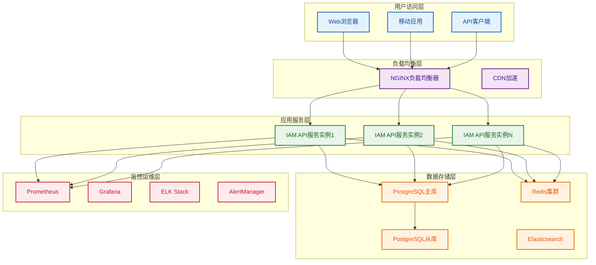

# 07-部署与运维设计

## 📋 文档概述

本文档详细描述了IAM系统的部署与运维设计方案，包括容器化部署、CI/CD流水线、监控告警、运维工具等各个方面，确保系统的高可用性、可维护性和可扩展性。

## 📚 目录结构

### 1. 部署架构设计
- 1.1 整体部署架构
- 1.2 容器化方案
- 1.3 环境管理策略
- 1.4 配置管理方案

### 2. CI/CD流水线设计
- 2.1 流水线架构
- 2.2 自动化测试
- 2.3 部署策略
- 2.4 回滚机制

### 3. 监控告警体系
- 3.1 监控架构设计
- 3.2 关键指标定义
- 3.3 告警规则配置
- 3.4 日志管理方案

### 4. 运维工具和流程
- 4.1 运维工具栈
- 4.2 运维流程设计
- 4.3 故障处理机制
- 4.4 容量规划策略

### 5. 高可用性设计
- 5.1 负载均衡方案
- 5.2 数据库高可用
- 5.3 缓存高可用
- 5.4 灾备恢复方案

### 6. 性能优化策略
- 6.1 应用性能优化
- 6.2 数据库性能优化
- 6.3 缓存性能优化
- 6.4 网络性能优化

### 7. 安全运维实践
- 7.1 安全配置管理
- 7.2 漏洞管理流程
- 7.3 安全监控告警
- 7.4 应急响应机制

### 8. 运维自动化
- 8.1 自动化运维工具
- 8.2 脚本和模板
- 8.3 自动化测试
- 8.4 自动化部署

---

## 🏗️ 部署架构概览

