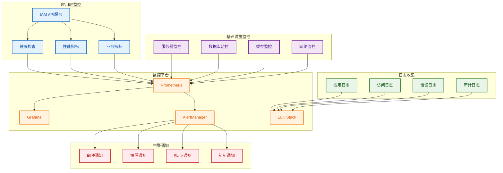

# 07-部署与运维设计之3

## 3. 监控告警体系

### 3.1 监控架构设计

#### 整体监控架构



#### Prometheus监控配置

```yaml
# prometheus/prometheus.yml
global:
  scrape_interval: 15s
  evaluation_interval: 15s

rule_files:
  - "rules/*.yml"

alerting:
  alertmanagers:
    - static_configs:
        - targets:
          - alertmanager:9093

scrape_configs:
  # IAM API服务监控
  - job_name: 'iam-api'
    static_configs:
      - targets: ['iam-api:3000']
    metrics_path: '/metrics'
    scrape_interval: 10s
    scrape_timeout: 5s
    honor_labels: true

  # PostgreSQL数据库监控
  - job_name: 'postgres'
    static_configs:
      - targets: ['postgres-exporter:9187']
    scrape_interval: 30s

  # Redis缓存监控
  - job_name: 'redis'
    static_configs:
      - targets: ['redis-exporter:9121']
    scrape_interval: 30s

  # Node.js应用监控
  - job_name: 'nodejs'
    static_configs:
      - targets: ['iam-api:3000']
    metrics_path: '/metrics'
    scrape_interval: 10s
    relabel_configs:
      - source_labels: [__address__]
        target_label: instance
        regex: '(.*)'
        replacement: '${1}'

  # 系统监控
  - job_name: 'node'
    static_configs:
      - targets: ['node-exporter:9100']
    scrape_interval: 30s
```

### 3.2 关键指标定义

#### 应用性能指标

```typescript
// monitoring/metrics.service.ts
import { Injectable } from '@nestjs/common';
import { register, Counter, Histogram, Gauge } from 'prom-client';

@Injectable()
export class MetricsService {
  // HTTP请求计数器
  private httpRequestsTotal = new Counter({
    name: 'http_requests_total',
    help: 'Total number of HTTP requests',
    labelNames: ['method', 'route', 'status_code'],
  });

  // HTTP请求持续时间
  private httpRequestDuration = new Histogram({
    name: 'http_request_duration_seconds',
    help: 'HTTP request duration in seconds',
    labelNames: ['method', 'route'],
    buckets: [0.1, 0.5, 1, 2, 5],
  });

  // 活跃用户数
  private activeUsers = new Gauge({
    name: 'active_users_total',
    help: 'Total number of active users',
    labelNames: ['tenant_id'],
  });

  // 数据库连接数
  private databaseConnections = new Gauge({
    name: 'database_connections_total',
    help: 'Total number of database connections',
  });

  // Redis连接数
  private redisConnections = new Gauge({
    name: 'redis_connections_total',
    help: 'Total number of Redis connections',
  });

  // 业务指标
  private userRegistrations = new Counter({
    name: 'user_registrations_total',
    help: 'Total number of user registrations',
    labelNames: ['tenant_id'],
  });

  private userLogins = new Counter({
    name: 'user_logins_total',
    help: 'Total number of user logins',
    labelNames: ['tenant_id', 'status'],
  });

  private permissionChecks = new Counter({
    name: 'permission_checks_total',
    help: 'Total number of permission checks',
    labelNames: ['resource', 'action', 'result'],
  });

  /**
   * 记录HTTP请求
   */
  recordHttpRequest(method: string, route: string, statusCode: number, duration: number): void {
    this.httpRequestsTotal.inc({ method, route, status_code: statusCode });
    this.httpRequestDuration.observe({ method, route }, duration);
  }

  /**
   * 更新活跃用户数
   */
  updateActiveUsers(tenantId: string, count: number): void {
    this.activeUsers.set({ tenant_id: tenantId }, count);
  }

  /**
   * 更新数据库连接数
   */
  updateDatabaseConnections(count: number): void {
    this.databaseConnections.set(count);
  }

  /**
   * 更新Redis连接数
   */
  updateRedisConnections(count: number): void {
    this.redisConnections.set(count);
  }

  /**
   * 记录用户注册
   */
  recordUserRegistration(tenantId: string): void {
    this.userRegistrations.inc({ tenant_id: tenantId });
  }

  /**
   * 记录用户登录
   */
  recordUserLogin(tenantId: string, status: 'success' | 'failed'): void {
    this.userLogins.inc({ tenant_id: tenantId, status });
  }

  /**
   * 记录权限检查
   */
  recordPermissionCheck(resource: string, action: string, result: 'allowed' | 'denied'): void {
    this.permissionChecks.inc({ resource, action, result });
  }

  /**
   * 获取指标数据
   */
  async getMetrics(): Promise<string> {
    return await register.metrics();
  }
}
```

#### 业务指标定义

```typescript
// monitoring/business-metrics.service.ts
import { Injectable } from '@nestjs/common';
import { MetricsService } from './metrics.service';

export interface BusinessMetrics {
  // 用户相关指标
  totalUsers: number;
  activeUsers: number;
  newUsersToday: number;
  userRetentionRate: number;
  
  // 认证相关指标
  loginSuccessRate: number;
  failedLoginAttempts: number;
  averageSessionDuration: number;
  
  // 权限相关指标
  permissionCheckSuccessRate: number;
  averagePermissionCheckTime: number;
  mostCheckedPermissions: string[];
  
  // 系统性能指标
  averageResponseTime: number;
  errorRate: number;
  throughput: number;
}

@Injectable()
export class BusinessMetricsService {
  constructor(private metricsService: MetricsService) {}

  /**
   * 计算业务指标
   */
  async calculateBusinessMetrics(): Promise<BusinessMetrics> {
    // 这里实现具体的业务指标计算逻辑
    // 可以从数据库、缓存、监控系统等获取数据
    
    return {
      totalUsers: await this.getTotalUsers(),
      activeUsers: await this.getActiveUsers(),
      newUsersToday: await this.getNewUsersToday(),
      userRetentionRate: await this.calculateUserRetentionRate(),
      loginSuccessRate: await this.calculateLoginSuccessRate(),
      failedLoginAttempts: await this.getFailedLoginAttempts(),
      averageSessionDuration: await this.calculateAverageSessionDuration(),
      permissionCheckSuccessRate: await this.calculatePermissionCheckSuccessRate(),
      averagePermissionCheckTime: await this.calculateAveragePermissionCheckTime(),
      mostCheckedPermissions: await this.getMostCheckedPermissions(),
      averageResponseTime: await this.calculateAverageResponseTime(),
      errorRate: await this.calculateErrorRate(),
      throughput: await this.calculateThroughput(),
    };
  }

  private async getTotalUsers(): Promise<number> {
    // 从数据库获取总用户数
    return 0;
  }

  private async getActiveUsers(): Promise<number> {
    // 从缓存获取活跃用户数
    return 0;
  }

  private async getNewUsersToday(): Promise<number> {
    // 获取今日新增用户数
    return 0;
  }

  private async calculateUserRetentionRate(): Promise<number> {
    // 计算用户留存率
    return 0;
  }

  private async calculateLoginSuccessRate(): Promise<number> {
    // 计算登录成功率
    return 0;
  }

  private async getFailedLoginAttempts(): Promise<number> {
    // 获取失败登录次数
    return 0;
  }

  private async calculateAverageSessionDuration(): Promise<number> {
    // 计算平均会话时长
    return 0;
  }

  private async calculatePermissionCheckSuccessRate(): Promise<number> {
    // 计算权限检查成功率
    return 0;
  }

  private async calculateAveragePermissionCheckTime(): Promise<number> {
    // 计算平均权限检查时间
    return 0;
  }

  private async getMostCheckedPermissions(): Promise<string[]> {
    // 获取最常检查的权限
    return [];
  }

  private async calculateAverageResponseTime(): Promise<number> {
    // 计算平均响应时间
    return 0;
  }

  private async calculateErrorRate(): Promise<number> {
    // 计算错误率
    return 0;
  }

  private async calculateThroughput(): Promise<number> {
    // 计算吞吐量
    return 0;
  }
}
```

### 3.3 告警规则配置

#### Prometheus告警规则

```yaml
# prometheus/rules/alerts.yml
groups:
  - name: iam-system-alerts
    rules:
      # 高错误率告警
      - alert: HighErrorRate
        expr: rate(http_requests_total{status_code=~"5.."}[5m]) / rate(http_requests_total[5m]) > 0.05
        for: 2m
        labels:
          severity: critical
        annotations:
          summary: "High error rate detected"
          description: "Error rate is {{ $value | humanizePercentage }} for the last 5 minutes"

      # 高响应时间告警
      - alert: HighResponseTime
        expr: histogram_quantile(0.95, rate(http_request_duration_seconds_bucket[5m])) > 2
        for: 2m
        labels:
          severity: warning
        annotations:
          summary: "High response time detected"
          description: "95th percentile response time is {{ $value }}s"

      # 数据库连接数告警
      - alert: HighDatabaseConnections
        expr: database_connections_total > 80
        for: 1m
        labels:
          severity: warning
        annotations:
          summary: "High database connections"
          description: "Database connections: {{ $value }}"

      # Redis连接数告警
      - alert: HighRedisConnections
        expr: redis_connections_total > 100
        for: 1m
        labels:
          severity: warning
        annotations:
          summary: "High Redis connections"
          description: "Redis connections: {{ $value }}"

      # 服务不可用告警
      - alert: ServiceDown
        expr: up{job="iam-api"} == 0
        for: 30s
        labels:
          severity: critical
        annotations:
          summary: "IAM API service is down"
          description: "IAM API service has been down for more than 30 seconds"

      # 内存使用率告警
      - alert: HighMemoryUsage
        expr: (node_memory_MemTotal_bytes - node_memory_MemAvailable_bytes) / node_memory_MemTotal_bytes > 0.85
        for: 5m
        labels:
          severity: warning
        annotations:
          summary: "High memory usage"
          description: "Memory usage is {{ $value | humanizePercentage }}"

      # CPU使用率告警
      - alert: HighCPUUsage
        expr: 100 - (avg by(instance) (irate(node_cpu_seconds_total{mode="idle"}[5m])) * 100) > 80
        for: 5m
        labels:
          severity: warning
        annotations:
          summary: "High CPU usage"
          description: "CPU usage is {{ $value }}%"

      # 磁盘使用率告警
      - alert: HighDiskUsage
        expr: (node_filesystem_size_bytes - node_filesystem_free_bytes) / node_filesystem_size_bytes > 0.85
        for: 5m
        labels:
          severity: warning
        annotations:
          summary: "High disk usage"
          description: "Disk usage is {{ $value | humanizePercentage }}"

      # 登录失败率告警
      - alert: HighLoginFailureRate
        expr: rate(user_logins_total{status="failed"}[5m]) / rate(user_logins_total[5m]) > 0.1
        for: 2m
        labels:
          severity: critical
        annotations:
          summary: "High login failure rate"
          description: "Login failure rate is {{ $value | humanizePercentage }}"

      # 权限检查失败率告警
      - alert: HighPermissionCheckFailureRate
        expr: rate(permission_checks_total{result="denied"}[5m]) / rate(permission_checks_total[5m]) > 0.2
        for: 2m
        labels:
          severity: warning
        annotations:
          summary: "High permission check failure rate"
          description: "Permission check failure rate is {{ $value | humanizePercentage }}"
```

#### AlertManager配置

```yaml
# alertmanager/alertmanager.yml
global:
  resolve_timeout: 5m
  slack_api_url: 'https://hooks.slack.com/services/YOUR_SLACK_WEBHOOK'

route:
  group_by: ['alertname', 'severity']
  group_wait: 30s
  group_interval: 5m
  repeat_interval: 4h
  receiver: 'slack-notifications'
  routes:
    - match:
        severity: critical
      receiver: 'pager-duty-critical'
      continue: true
    - match:
        severity: warning
      receiver: 'slack-notifications'

receivers:
  - name: 'slack-notifications'
    slack_configs:
      - channel: '#iam-alerts'
        title: '{{ template "slack.title" . }}'
        text: '{{ template "slack.text" . }}'
        send_resolved: true

  - name: 'pager-duty-critical'
    pagerduty_configs:
      - routing_key: YOUR_PAGERDUTY_KEY
        description: '{{ template "pagerduty.description" . }}'
        severity: '{{ if eq .CommonLabels.severity "critical" }}critical{{ else }}warning{{ end }}'
        client: 'IAM System'
        client_url: '{{ template "pagerduty.clientURL" . }}'

templates:
  - '/etc/alertmanager/template/*.tmpl'

inhibit_rules:
  - source_match:
      severity: 'critical'
    target_match:
      severity: 'warning'
    equal: ['alertname', 'instance']
```

### 3.4 日志管理方案

#### 结构化日志配置

```typescript
// logging/logger.service.ts
import { Injectable, LoggerService } from '@nestjs/common';
import * as winston from 'winston';
import * as DailyRotateFile from 'winston-daily-rotate-file';

export interface LogContext {
  requestId?: string;
  userId?: string;
  tenantId?: string;
  action?: string;
  resource?: string;
  ip?: string;
  userAgent?: string;
}

@Injectable()
export class CustomLoggerService implements LoggerService {
  private logger: winston.Logger;

  constructor() {
    this.logger = winston.createLogger({
      level: process.env.LOG_LEVEL || 'info',
      format: winston.format.combine(
        winston.format.timestamp(),
        winston.format.errors({ stack: true }),
        winston.format.json(),
      ),
      defaultMeta: { service: 'iam-api' },
      transports: [
        // 控制台输出
        new winston.transports.Console({
          format: winston.format.combine(
            winston.format.colorize(),
            winston.format.simple(),
          ),
        }),
        
        // 应用日志文件
        new DailyRotateFile({
          filename: 'logs/application-%DATE%.log',
          datePattern: 'YYYY-MM-DD',
          zippedArchive: true,
          maxSize: '20m',
          maxFiles: '14d',
          level: 'info',
        }),
        
        // 错误日志文件
        new DailyRotateFile({
          filename: 'logs/error-%DATE%.log',
          datePattern: 'YYYY-MM-DD',
          zippedArchive: true,
          maxSize: '20m',
          maxFiles: '30d',
          level: 'error',
        }),
        
        // 审计日志文件
        new DailyRotateFile({
          filename: 'logs/audit-%DATE%.log',
          datePattern: 'YYYY-MM-DD',
          zippedArchive: true,
          maxSize: '20m',
          maxFiles: '90d',
          level: 'info',
        }),
      ],
    });
  }

  log(message: string, context?: LogContext): void {
    this.logger.info(message, context);
  }

  error(message: string, trace?: string, context?: LogContext): void {
    this.logger.error(message, { trace, ...context });
  }

  warn(message: string, context?: LogContext): void {
    this.logger.warn(message, context);
  }

  debug(message: string, context?: LogContext): void {
    this.logger.debug(message, context);
  }

  verbose(message: string, context?: LogContext): void {
    this.logger.verbose(message, context);
  }

  /**
   * 记录审计日志
   */
  audit(message: string, context: LogContext): void {
    this.logger.info(message, { ...context, logType: 'audit' });
  }

  /**
   * 记录安全事件
   */
  security(message: string, context: LogContext): void {
    this.logger.warn(message, { ...context, logType: 'security' });
  }

  /**
   * 记录性能指标
   */
  performance(message: string, metrics: any, context?: LogContext): void {
    this.logger.info(message, { ...context, logType: 'performance', metrics });
  }
}
```

#### ELK Stack配置

```yaml
# docker-compose.logging.yml
version: '3.8'

services:
  # Elasticsearch
  elasticsearch:
    image: docker.elastic.co/elasticsearch/elasticsearch:8.11.0
    container_name: elasticsearch
    environment:
      - discovery.type=single-node
      - xpack.security.enabled=false
      - "ES_JAVA_OPTS=-Xms512m -Xmx512m"
    ulimits:
      memlock:
        soft: -1
        hard: -1
    volumes:
      - elasticsearch_data:/usr/share/elasticsearch/data
    ports:
      - "9200:9200"
    networks:
      - logging

  # Logstash
  logstash:
    image: docker.elastic.co/logstash/logstash:8.11.0
    container_name: logstash
    volumes:
      - ./logstash/pipeline:/usr/share/logstash/pipeline
      - ./logstash/config/logstash.yml:/usr/share/logstash/config/logstash.yml
    ports:
      - "5044:5044"
      - "5000:5000/tcp"
      - "5000:5000/udp"
      - "9600:9600"
    environment:
      LS_JAVA_OPTS: "-Xmx256m -Xms256m"
    networks:
      - logging
    depends_on:
      - elasticsearch

  # Kibana
  kibana:
    image: docker.elastic.co/kibana/kibana:8.11.0
    container_name: kibana
    ports:
      - "5601:5601"
    environment:
      ELASTICSEARCH_HOSTS: http://elasticsearch:9200
    networks:
      - logging
    depends_on:
      - elasticsearch

  # Filebeat
  filebeat:
    image: docker.elastic.co/beats/filebeat:8.11.0
    container_name: filebeat
    user: root
    volumes:
      - ./filebeat/filebeat.yml:/usr/share/filebeat/filebeat.yml:ro
      - ./logs:/var/log/iam:ro
      - /var/lib/docker/containers:/var/lib/docker/containers:ro
      - /var/run/docker.sock:/var/run/docker.sock:ro
    networks:
      - logging
    depends_on:
      - logstash

volumes:
  elasticsearch_data:

networks:
  logging:
    driver: bridge
```
