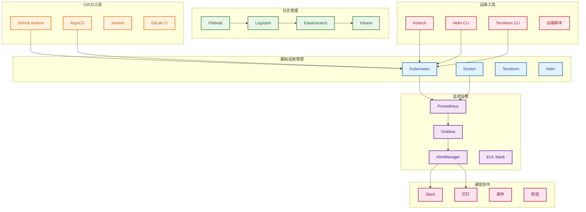
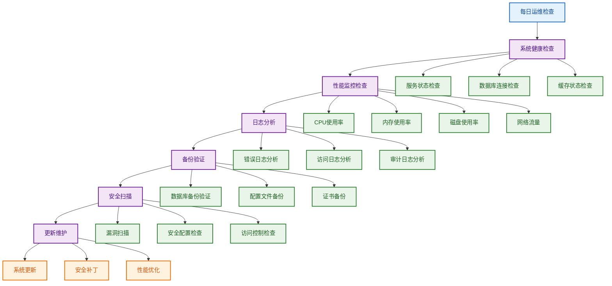

# 07-部署与运维设计之4

## 4. 运维工具和流程

### 4.1 运维工具栈

#### 工具栈架构



#### 运维脚本工具

```bash
#!/bin/bash
# scripts/ops-tools.sh

# 运维工具集合
set -e

# 颜色定义
RED='\033[0;31m'
GREEN='\033[0;32m'
YELLOW='\033[1;33m'
BLUE='\033[0;34m'
NC='\033[0m' # No Color

# 日志函数
log_info() {
    echo -e "${BLUE}[INFO]${NC} $1"
}

log_success() {
    echo -e "${GREEN}[SUCCESS]${NC} $1"
}

log_warning() {
    echo -e "${YELLOW}[WARNING]${NC} $1"
}

log_error() {
    echo -e "${RED}[ERROR]${NC} $1"
}

# 健康检查函数
check_service_health() {
    local service_name=$1
    local health_endpoint=$2
    
    log_info "Checking health of $service_name..."
    
    if curl -f -s "$health_endpoint" > /dev/null; then
        log_success "$service_name is healthy"
        return 0
    else
        log_error "$service_name is unhealthy"
        return 1
    fi
}

# 数据库备份函数
backup_database() {
    local db_name=$1
    local backup_dir=$2
    local timestamp=$(date +%Y%m%d_%H%M%S)
    
    log_info "Starting database backup for $db_name..."
    
    mkdir -p "$backup_dir"
    
    if pg_dump "$db_name" > "$backup_dir/${db_name}_${timestamp}.sql"; then
        log_success "Database backup completed: ${db_name}_${timestamp}.sql"
        
        # 压缩备份文件
        gzip "$backup_dir/${db_name}_${timestamp}.sql"
        log_info "Backup file compressed"
        
        # 清理旧备份文件（保留7天）
        find "$backup_dir" -name "*.sql.gz" -mtime +7 -delete
        log_info "Old backup files cleaned up"
    else
        log_error "Database backup failed"
        return 1
    fi
}

# 日志清理函数
cleanup_logs() {
    local log_dir=$1
    local days_to_keep=$2
    
    log_info "Cleaning up logs older than $days_to_keep days in $log_dir..."
    
    if find "$log_dir" -name "*.log" -mtime +$days_to_keep -delete; then
        log_success "Log cleanup completed"
    else
        log_error "Log cleanup failed"
        return 1
    fi
}

# 性能监控函数
monitor_performance() {
    local service_name=$1
    
    log_info "Monitoring performance for $service_name..."
    
    # CPU使用率
    local cpu_usage=$(top -bn1 | grep "Cpu(s)" | awk '{print $2}' | cut -d'%' -f1)
    log_info "CPU Usage: ${cpu_usage}%"
    
    # 内存使用率
    local memory_usage=$(free | grep Mem | awk '{printf("%.2f", $3/$2 * 100.0)}')
    log_info "Memory Usage: ${memory_usage}%"
    
    # 磁盘使用率
    local disk_usage=$(df / | tail -1 | awk '{print $5}' | cut -d'%' -f1)
    log_info "Disk Usage: ${disk_usage}%"
    
    # 检查阈值
    if (( $(echo "$cpu_usage > 80" | bc -l) )); then
        log_warning "High CPU usage detected: ${cpu_usage}%"
    fi
    
    if (( $(echo "$memory_usage > 85" | bc -l) )); then
        log_warning "High memory usage detected: ${memory_usage}%"
    fi
    
    if (( disk_usage > 85 )); then
        log_warning "High disk usage detected: ${disk_usage}%"
    fi
}

# 服务重启函数
restart_service() {
    local service_name=$1
    
    log_info "Restarting service: $service_name..."
    
    if systemctl restart "$service_name"; then
        log_success "Service $service_name restarted successfully"
        
        # 等待服务启动
        sleep 5
        
        # 检查服务状态
        if systemctl is-active --quiet "$service_name"; then
            log_success "Service $service_name is running"
        else
            log_error "Service $service_name failed to start"
            return 1
        fi
    else
        log_error "Failed to restart service $service_name"
        return 1
    fi
}

# 证书更新函数
update_ssl_certificates() {
    local cert_dir=$1
    
    log_info "Updating SSL certificates..."
    
    # 检查证书有效期
    local cert_file="$cert_dir/cert.pem"
    if [ -f "$cert_file" ]; then
        local expiry_date=$(openssl x509 -enddate -noout -in "$cert_file" | cut -d= -f2)
        local expiry_timestamp=$(date -d "$expiry_date" +%s)
        local current_timestamp=$(date +%s)
        local days_until_expiry=$(( (expiry_timestamp - current_timestamp) / 86400 ))
        
        log_info "Certificate expires in $days_until_expiry days"
        
        if [ $days_until_expiry -lt 30 ]; then
            log_warning "Certificate will expire soon"
            # 这里可以集成自动证书更新逻辑
        fi
    else
        log_error "Certificate file not found: $cert_file"
        return 1
    fi
}

# 主函数
main() {
    case "$1" in
        "health")
            check_service_health "$2" "$3"
            ;;
        "backup")
            backup_database "$2" "$3"
            ;;
        "cleanup")
            cleanup_logs "$2" "$3"
            ;;
        "monitor")
            monitor_performance "$2"
            ;;
        "restart")
            restart_service "$2"
            ;;
        "ssl")
            update_ssl_certificates "$2"
            ;;
        *)
            echo "Usage: $0 {health|backup|cleanup|monitor|restart|ssl} [args...]"
            echo "  health <service_name> <endpoint> - Check service health"
            echo "  backup <db_name> <backup_dir> - Backup database"
            echo "  cleanup <log_dir> <days> - Clean up old logs"
            echo "  monitor <service_name> - Monitor performance"
            echo "  restart <service_name> - Restart service"
            echo "  ssl <cert_dir> - Update SSL certificates"
            exit 1
            ;;
    esac
}

# 执行主函数
main "$@"
```

### 4.2 运维流程设计

#### 日常运维流程



### 4.3 故障处理机制

#### 故障分类和处理策略

```typescript
// operations/fault-classification.service.ts
import { Injectable } from '@nestjs/common';

export interface FaultCategory {
  id: string;
  name: string;
  description: string;
  severity: 'low' | 'medium' | 'high' | 'critical';
  responseTime: number; // 响应时间（分钟）
  resolutionTime: number; // 解决时间（分钟）
  escalationLevel: number; // 升级级别
  autoActions: string[]; // 自动处理动作
  manualActions: string[]; // 手动处理动作
}

@Injectable()
export class FaultClassificationService {
  private readonly faultCategories: FaultCategory[] = [
    {
      id: 'service-unavailable',
      name: '服务不可用',
      description: 'IAM API服务完全不可用',
      severity: 'critical',
      responseTime: 5,
      resolutionTime: 30,
      escalationLevel: 1,
      autoActions: [
        'restart-service',
        'check-health',
        'notify-team',
      ],
      manualActions: [
        'investigate-root-cause',
        'implement-fix',
        'verify-resolution',
      ],
    },
    {
      id: 'high-error-rate',
      name: '高错误率',
      description: 'API错误率超过阈值',
      severity: 'high',
      responseTime: 15,
      resolutionTime: 60,
      escalationLevel: 2,
      autoActions: [
        'check-logs',
        'monitor-metrics',
        'notify-developers',
      ],
      manualActions: [
        'analyze-error-patterns',
        'deploy-hotfix',
        'update-monitoring',
      ],
    },
    {
      id: 'performance-degradation',
      name: '性能下降',
      description: '响应时间超过正常范围',
      severity: 'medium',
      responseTime: 30,
      resolutionTime: 120,
      escalationLevel: 3,
      autoActions: [
        'check-resources',
        'analyze-metrics',
        'notify-ops',
      ],
      manualActions: [
        'optimize-performance',
        'scale-resources',
        'update-configuration',
      ],
    },
    {
      id: 'database-issues',
      name: '数据库问题',
      description: '数据库连接或性能问题',
      severity: 'high',
      responseTime: 10,
      resolutionTime: 45,
      escalationLevel: 2,
      autoActions: [
        'check-db-connections',
        'restart-db-service',
        'notify-dba',
      ],
      manualActions: [
        'analyze-db-performance',
        'optimize-queries',
        'update-db-config',
      ],
    },
    {
      id: 'cache-issues',
      name: '缓存问题',
      description: 'Redis缓存连接或性能问题',
      severity: 'medium',
      responseTime: 20,
      resolutionTime: 60,
      escalationLevel: 3,
      autoActions: [
        'check-cache-status',
        'restart-cache-service',
        'notify-ops',
      ],
      manualActions: [
        'analyze-cache-performance',
        'optimize-cache-config',
        'update-cache-strategy',
      ],
    },
    {
      id: 'security-incident',
      name: '安全事件',
      description: '检测到安全威胁或异常访问',
      severity: 'critical',
      responseTime: 5,
      resolutionTime: 30,
      escalationLevel: 1,
      autoActions: [
        'block-suspicious-ips',
        'increase-logging',
        'notify-security-team',
      ],
      manualActions: [
        'investigate-security-breach',
        'implement-security-fixes',
        'update-security-policies',
      ],
    },
  ];

  /**
   * 根据故障特征分类
   */
  classifyFault(symptoms: string[]): FaultCategory | null {
    // 简单的关键词匹配分类
    const symptomText = symptoms.join(' ').toLowerCase();
    
    for (const category of this.faultCategories) {
      if (this.matchesCategory(symptomText, category)) {
        return category;
      }
    }
    
    return null;
  }

  /**
   * 获取故障处理建议
   */
  getFaultHandlingRecommendations(category: FaultCategory): {
    immediate: string[];
    shortTerm: string[];
    longTerm: string[];
  } {
    return {
      immediate: [
        '立即通知相关人员',
        '启动自动修复流程',
        '开始故障调查',
      ],
      shortTerm: [
        '实施临时解决方案',
        '监控修复效果',
        '准备详细报告',
      ],
      longTerm: [
        '分析根本原因',
        '实施永久性修复',
        '更新监控和告警',
        '完善故障处理流程',
      ],
    };
  }

  /**
   * 检查是否需要升级
   */
  shouldEscalate(fault: FaultCategory, timeSinceDetection: number): boolean {
    return timeSinceDetection > fault.responseTime;
  }

  /**
   * 获取升级路径
   */
  getEscalationPath(fault: FaultCategory): string[] {
    const escalationPaths = {
      1: ['Team Lead', 'Engineering Manager', 'CTO'],
      2: ['Senior Developer', 'Team Lead', 'Engineering Manager'],
      3: ['Developer', 'Senior Developer', 'Team Lead'],
    };
    
    return escalationPaths[fault.escalationLevel] || [];
  }

  private matchesCategory(symptomText: string, category: FaultCategory): boolean {
    const keywords = {
      'service-unavailable': ['service down', 'unavailable', 'not responding'],
      'high-error-rate': ['error rate', 'high errors', 'failed requests'],
      'performance-degradation': ['slow', 'performance', 'response time'],
      'database-issues': ['database', 'db', 'connection', 'query'],
      'cache-issues': ['cache', 'redis', 'memory'],
      'security-incident': ['security', 'breach', 'unauthorized', 'suspicious'],
    };
    
    const categoryKeywords = keywords[category.id] || [];
    return categoryKeywords.some(keyword => symptomText.includes(keyword));
  }
}
```

### 4.4 容量规划策略

#### 容量规划模型

```typescript
// operations/capacity-planning.service.ts
import { Injectable } from '@nestjs/common';

export interface CapacityMetrics {
  // 用户相关指标
  totalUsers: number;
  activeUsers: number;
  concurrentUsers: number;
  userGrowthRate: number;
  
  // 系统性能指标
  requestsPerSecond: number;
  averageResponseTime: number;
  peakLoadFactor: number;
  
  // 资源使用指标
  cpuUsage: number;
  memoryUsage: number;
  diskUsage: number;
  networkUsage: number;
  
  // 业务指标
  transactionsPerSecond: number;
  dataVolume: number;
  storageGrowth: number;
}

export interface CapacityForecast {
  period: '1month' | '3months' | '6months' | '1year';
  metrics: CapacityMetrics;
  recommendations: string[];
  risks: string[];
}

@Injectable()
export class CapacityPlanningService {
  /**
   * 分析当前容量使用情况
   */
  async analyzeCurrentCapacity(): Promise<CapacityMetrics> {
    // 收集当前容量指标
    const metrics = await this.collectCurrentMetrics();
    
    // 计算关键指标
    const capacityMetrics: CapacityMetrics = {
      totalUsers: await this.getTotalUsers(),
      activeUsers: await this.getActiveUsers(),
      concurrentUsers: await this.getConcurrentUsers(),
      userGrowthRate: await this.calculateUserGrowthRate(),
      requestsPerSecond: await this.getRequestsPerSecond(),
      averageResponseTime: await this.getAverageResponseTime(),
      peakLoadFactor: await this.calculatePeakLoadFactor(),
      cpuUsage: await this.getCpuUsage(),
      memoryUsage: await this.getMemoryUsage(),
      diskUsage: await this.getDiskUsage(),
      networkUsage: await this.getNetworkUsage(),
      transactionsPerSecond: await this.getTransactionsPerSecond(),
      dataVolume: await this.getDataVolume(),
      storageGrowth: await this.calculateStorageGrowth(),
    };
    
    return capacityMetrics;
  }

  /**
   * 预测未来容量需求
   */
  async forecastCapacity(period: '1month' | '3months' | '6months' | '1year'): Promise<CapacityForecast> {
    const currentMetrics = await this.analyzeCurrentCapacity();
    
    // 基于历史数据预测增长
    const growthFactors = await this.calculateGrowthFactors();
    
    // 预测未来指标
    const forecastedMetrics = this.predictMetrics(currentMetrics, growthFactors, period);
    
    // 生成建议
    const recommendations = this.generateRecommendations(forecastedMetrics);
    
    // 识别风险
    const risks = this.identifyRisks(forecastedMetrics);
    
    return {
      period,
      metrics: forecastedMetrics,
      recommendations,
      risks,
    };
  }

  /**
   * 生成扩容建议
   */
  generateScalingRecommendations(forecast: CapacityForecast): {
    immediate: string[];
    shortTerm: string[];
    longTerm: string[];
  } {
    const { metrics } = forecast;
    
    const recommendations = {
      immediate: [] as string[],
      shortTerm: [] as string[],
      longTerm: [] as string[],
    };
    
    // 立即扩容建议
    if (metrics.cpuUsage > 80) {
      recommendations.immediate.push('增加CPU资源');
    }
    
    if (metrics.memoryUsage > 85) {
      recommendations.immediate.push('增加内存资源');
    }
    
    if (metrics.diskUsage > 90) {
      recommendations.immediate.push('扩展存储空间');
    }
    
    // 短期扩容建议
    if (metrics.userGrowthRate > 0.1) {
      recommendations.shortTerm.push('增加应用实例数量');
    }
    
    if (metrics.requestsPerSecond > 1000) {
      recommendations.shortTerm.push('优化数据库查询');
      recommendations.shortTerm.push('增加缓存层');
    }
    
    // 长期扩容建议
    if (metrics.totalUsers > 10000) {
      recommendations.longTerm.push('考虑微服务架构');
      recommendations.longTerm.push('实施数据库分片');
    }
    
    if (metrics.dataVolume > 1000000) {
      recommendations.longTerm.push('实施数据归档策略');
      recommendations.longTerm.push('考虑数据湖架构');
    }
    
    return recommendations;
  }

  /**
   * 计算成本效益分析
   */
  async calculateCostBenefitAnalysis(recommendations: string[]): Promise<{
    implementationCost: number;
    operationalCost: number;
    expectedBenefits: string[];
    roi: number;
  }> {
    // 这里实现具体的成本效益分析逻辑
    return {
      implementationCost: 0,
      operationalCost: 0,
      expectedBenefits: [],
      roi: 0,
    };
  }

  private async collectCurrentMetrics(): Promise<any> {
    // 收集当前指标
    return {};
  }

  private async getTotalUsers(): Promise<number> {
    // 获取总用户数
    return 0;
  }

  private async getActiveUsers(): Promise<number> {
    // 获取活跃用户数
    return 0;
  }

  private async getConcurrentUsers(): Promise<number> {
    // 获取并发用户数
    return 0;
  }

  private async calculateUserGrowthRate(): Promise<number> {
    // 计算用户增长率
    return 0;
  }

  private async getRequestsPerSecond(): Promise<number> {
    // 获取每秒请求数
    return 0;
  }

  private async getAverageResponseTime(): Promise<number> {
    // 获取平均响应时间
    return 0;
  }

  private async calculatePeakLoadFactor(): Promise<number> {
    // 计算峰值负载因子
    return 0;
  }

  private async getCpuUsage(): Promise<number> {
    // 获取CPU使用率
    return 0;
  }

  private async getMemoryUsage(): Promise<number> {
    // 获取内存使用率
    return 0;
  }

  private async getDiskUsage(): Promise<number> {
    // 获取磁盘使用率
    return 0;
  }

  private async getNetworkUsage(): Promise<number> {
    // 获取网络使用率
    return 0;
  }

  private async getTransactionsPerSecond(): Promise<number> {
    // 获取每秒事务数
    return 0;
  }

  private async getDataVolume(): Promise<number> {
    // 获取数据量
    return 0;
  }

  private async calculateStorageGrowth(): Promise<number> {
    // 计算存储增长率
    return 0;
  }

  private async calculateGrowthFactors(): Promise<any> {
    // 计算增长因子
    return {};
  }

  private predictMetrics(current: CapacityMetrics, growthFactors: any, period: string): CapacityMetrics {
    // 预测指标
    return current;
  }

  private generateRecommendations(metrics: CapacityMetrics): string[] {
    // 生成建议
    return [];
  }

  private identifyRisks(metrics: CapacityMetrics): string[] {
    // 识别风险
    return [];
  }
}
```
