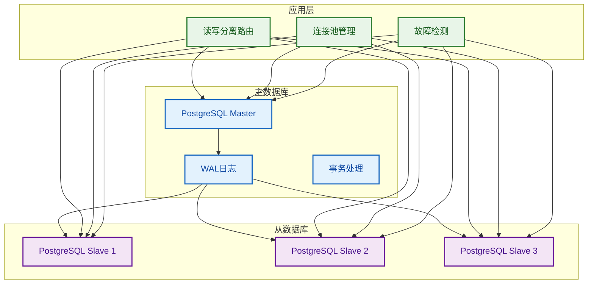
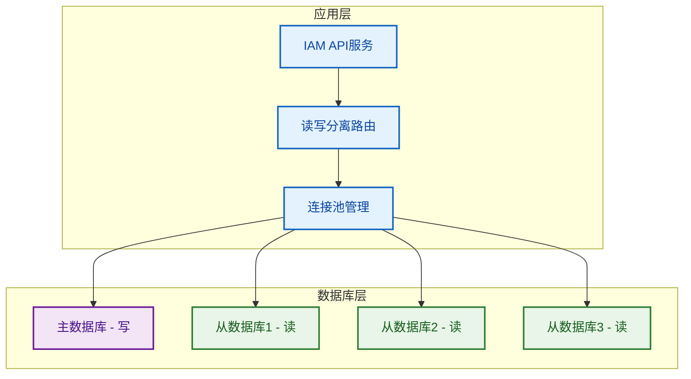
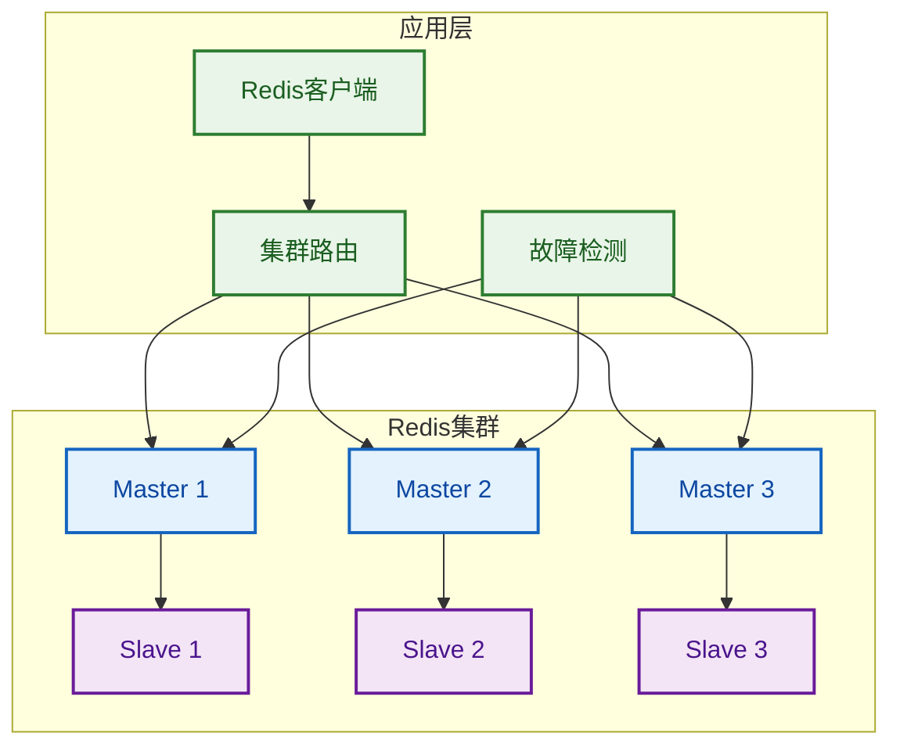
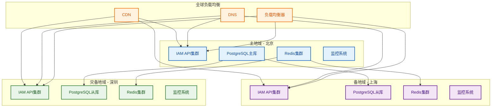
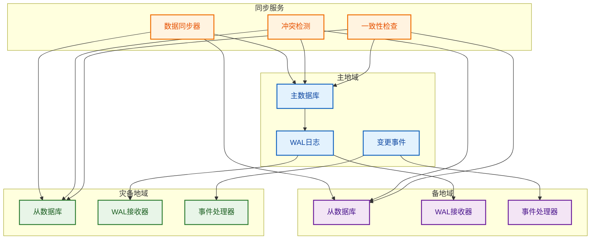
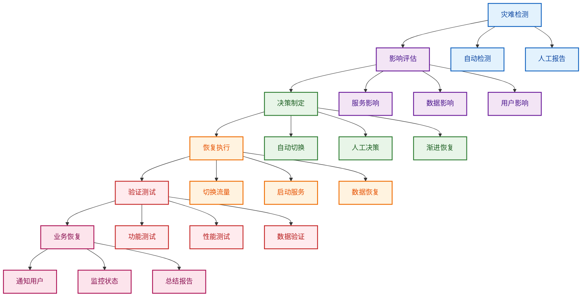

# 07-部署与运维设计之5

## 5. 高可用性设计

### 5.1 负载均衡方案

#### 5.1.1 NGINX负载均衡配置

**NGINX配置文件**

```nginx
# nginx/nginx.conf
user nginx;
worker_processes auto;
error_log /var/log/nginx/error.log warn;
pid /var/run/nginx.pid;

events {
    worker_connections 1024;
    use epoll;
    multi_accept on;
}

http {
    include /etc/nginx/mime.types;
    default_type application/octet-stream;

    # 日志格式
    log_format main '$remote_addr - $remote_user [$time_local] "$request" '
                    '$status $body_bytes_sent "$http_referer" '
                    '"$http_user_agent" "$http_x_forwarded_for" '
                    'rt=$request_time uct="$upstream_connect_time" '
                    'uht="$upstream_header_time" urt="$upstream_response_time"';

    access_log /var/log/nginx/access.log main;

    # 基础配置
    sendfile on;
    tcp_nopush on;
    tcp_nodelay on;
    keepalive_timeout 65;
    types_hash_max_size 2048;
    client_max_body_size 10M;

    # Gzip压缩
    gzip on;
    gzip_vary on;
    gzip_min_length 1024;
    gzip_proxied any;
    gzip_comp_level 6;
    gzip_types
        text/plain
        text/css
        text/xml
        text/javascript
        application/json
        application/javascript
        application/xml+rss
        application/atom+xml
        image/svg+xml;

    # 上游服务器配置
    upstream iam_api_backend {
        # 最少连接数负载均衡
        least_conn;
        
        # 应用服务器
        server iam-api-1:3000 max_fails=3 fail_timeout=30s;
        server iam-api-2:3000 max_fails=3 fail_timeout=30s;
        server iam-api-3:3000 max_fails=3 fail_timeout=30s;
        
        # 健康检查
        keepalive 32;
    }

    # 限流配置
    limit_req_zone $binary_remote_addr zone=api_limit:10m rate=10r/s;
    limit_req_zone $binary_remote_addr zone=login_limit:10m rate=5r/s;

    # 服务器配置
    server {
        listen 80;
        server_name iam.example.com;
        
        # 重定向到HTTPS
        return 301 https://$server_name$request_uri;
    }

    server {
        listen 443 ssl http2;
        server_name iam.example.com;

        # SSL配置
        ssl_certificate /etc/nginx/ssl/cert.pem;
        ssl_certificate_key /etc/nginx/ssl/key.pem;
        ssl_protocols TLSv1.2 TLSv1.3;
        ssl_ciphers ECDHE-RSA-AES128-GCM-SHA256:ECDHE-RSA-AES256-GCM-SHA384;
        ssl_prefer_server_ciphers off;
        ssl_session_cache shared:SSL:10m;
        ssl_session_timeout 10m;

        # 安全头
        add_header X-Frame-Options DENY;
        add_header X-Content-Type-Options nosniff;
        add_header X-XSS-Protection "1; mode=block";
        add_header Strict-Transport-Security "max-age=31536000; includeSubDomains" always;

        # 健康检查端点
        location /health {
            access_log off;
            return 200 "healthy\n";
            add_header Content-Type text/plain;
        }

        # API限流
        location /api/ {
            limit_req zone=api_limit burst=20 nodelay;
            
            proxy_pass http://iam_api_backend;
            proxy_set_header Host $host;
            proxy_set_header X-Real-IP $remote_addr;
            proxy_set_header X-Forwarded-For $proxy_add_x_forwarded_for;
            proxy_set_header X-Forwarded-Proto $scheme;
            
            # 超时配置
            proxy_connect_timeout 5s;
            proxy_send_timeout 60s;
            proxy_read_timeout 60s;
            
            # 缓冲配置
            proxy_buffering on;
            proxy_buffer_size 4k;
            proxy_buffers 8 4k;
            
            # 错误处理
            proxy_intercept_errors on;
            error_page 502 503 504 /50x.html;
        }

        # 登录接口特殊限流
        location /api/auth/login {
            limit_req zone=login_limit burst=10 nodelay;
            
            proxy_pass http://iam_api_backend;
            proxy_set_header Host $host;
            proxy_set_header X-Real-IP $remote_addr;
            proxy_set_header X-Forwarded-For $proxy_add_x_forwarded_for;
            proxy_set_header X-Forwarded-Proto $scheme;
        }

        # 静态文件
        location /static/ {
            expires 1y;
            add_header Cache-Control "public, immutable";
            proxy_pass http://iam_api_backend;
        }

        # 错误页面
        location = /50x.html {
            root /usr/share/nginx/html;
        }
    }
}
```

#### 5.1.2 健康检查机制

```typescript
// health/health-check.service.ts
import { Injectable, Logger } from '@nestjs/common';
import { HttpService } from '@nestjs/axios';
import { firstValueFrom } from 'rxjs';

export interface HealthCheckResult {
  service: string;
  status: 'healthy' | 'unhealthy' | 'degraded';
  responseTime: number;
  lastCheck: Date;
  details: any;
}

@Injectable()
export class HealthCheckService {
  private readonly logger = new Logger(HealthCheckService.name);
  private readonly httpService = new HttpService();

  /**
   * 执行健康检查
   */
  async performHealthCheck(): Promise<HealthCheckResult[]> {
    const results: HealthCheckResult[] = [];
    
    // 检查各个服务
    results.push(await this.checkApiService());
    results.push(await this.checkDatabase());
    results.push(await this.checkRedis());
    results.push(await this.checkExternalServices());
    
    return results;
  }

  /**
   * 检查API服务健康状态
   */
  private async checkApiService(): Promise<HealthCheckResult> {
    const startTime = Date.now();
    
    try {
      const response = await firstValueFrom(
        this.httpService.get('http://localhost:3000/health', {
          timeout: 5000,
        })
      );
      
      const responseTime = Date.now() - startTime;
      
      return {
        service: 'iam-api',
        status: response.status === 200 ? 'healthy' : 'unhealthy',
        responseTime,
        lastCheck: new Date(),
        details: {
          statusCode: response.status,
          responseData: response.data,
        },
      };
    } catch (error) {
      this.logger.error('API service health check failed', error);
      
      return {
        service: 'iam-api',
        status: 'unhealthy',
        responseTime: Date.now() - startTime,
        lastCheck: new Date(),
        details: {
          error: error.message,
        },
      };
    }
  }

  /**
   * 检查数据库健康状态
   */
  private async checkDatabase(): Promise<HealthCheckResult> {
    const startTime = Date.now();
    
    try {
      // 这里应该调用数据库健康检查接口
      const response = await firstValueFrom(
        this.httpService.get('http://localhost:3000/health/db', {
          timeout: 3000,
        })
      );
      
      const responseTime = Date.now() - startTime;
      
      return {
        service: 'database',
        status: response.status === 200 ? 'healthy' : 'unhealthy',
        responseTime,
        lastCheck: new Date(),
        details: {
          statusCode: response.status,
          responseData: response.data,
        },
      };
    } catch (error) {
      this.logger.error('Database health check failed', error);
      
      return {
        service: 'database',
        status: 'unhealthy',
        responseTime: Date.now() - startTime,
        lastCheck: new Date(),
        details: {
          error: error.message,
        },
      };
    }
  }

  /**
   * 检查Redis健康状态
   */
  private async checkRedis(): Promise<HealthCheckResult> {
    const startTime = Date.now();
    
    try {
      const response = await firstValueFrom(
        this.httpService.get('http://localhost:3000/health/redis', {
          timeout: 3000,
        })
      );
      
      const responseTime = Date.now() - startTime;
      
      return {
        service: 'redis',
        status: response.status === 200 ? 'healthy' : 'unhealthy',
        responseTime,
        lastCheck: new Date(),
        details: {
          statusCode: response.status,
          responseData: response.data,
        },
      };
    } catch (error) {
      this.logger.error('Redis health check failed', error);
      
      return {
        service: 'redis',
        status: 'unhealthy',
        responseTime: Date.now() - startTime,
        lastCheck: new Date(),
        details: {
          error: error.message,
        },
      };
    }
  }

  /**
   * 检查外部服务健康状态
   */
  private async checkExternalServices(): Promise<HealthCheckResult> {
    const startTime = Date.now();
    
    try {
      // 检查外部依赖服务
      const externalServices = [
        'https://api.external-service.com/health',
        'https://auth.external-service.com/health',
      ];
      
      const results = await Promise.allSettled(
        externalServices.map(url =>
          firstValueFrom(
            this.httpService.get(url, { timeout: 5000 })
          )
        )
      );
      
      const healthyCount = results.filter(
        result => result.status === 'fulfilled' && result.value.status === 200
      ).length;
      
      const responseTime = Date.now() - startTime;
      
      return {
        service: 'external-services',
        status: healthyCount === externalServices.length ? 'healthy' : 'degraded',
        responseTime,
        lastCheck: new Date(),
        details: {
          totalServices: externalServices.length,
          healthyServices: healthyCount,
          results,
        },
      };
    } catch (error) {
      this.logger.error('External services health check failed', error);
      
      return {
        service: 'external-services',
        status: 'unhealthy',
        responseTime: Date.now() - startTime,
        lastCheck: new Date(),
        details: {
          error: error.message,
        },
      };
    }
  }
}
```

#### 5.1.3 会话保持策略

```typescript
// session/session-sticky.service.ts
import { Injectable } from '@nestjs/common';
import { RedisService } from '../shared/infrastructure/redis/redis.service';

export interface SessionInfo {
  sessionId: string;
  userId: string;
  tenantId: string;
  serverId: string;
  createdAt: Date;
  lastAccessed: Date;
  expiresAt: Date;
}

@Injectable()
export class SessionStickyService {
  constructor(private redisService: RedisService) {}

  /**
   * 创建会话并绑定到服务器
   */
  async createSession(
    userId: string,
    tenantId: string,
    serverId: string,
    ttl: number = 3600
  ): Promise<SessionInfo> {
    const sessionId = this.generateSessionId();
    const now = new Date();
    const expiresAt = new Date(now.getTime() + ttl * 1000);
    
    const sessionInfo: SessionInfo = {
      sessionId,
      userId,
      tenantId,
      serverId,
      createdAt: now,
      lastAccessed: now,
      expiresAt,
    };
    
    // 存储会话信息
    await this.redisService.set(
      `session:${sessionId}`,
      JSON.stringify(sessionInfo),
      ttl
    );
    
    // 存储用户会话映射
    await this.redisService.set(
      `user_session:${userId}`,
      sessionId,
      ttl
    );
    
    // 存储服务器会话列表
    await this.redisService.sadd(
      `server_sessions:${serverId}`,
      sessionId
    );
    
    return sessionInfo;
  }

  /**
   * 获取会话信息
   */
  async getSession(sessionId: string): Promise<SessionInfo | null> {
    const sessionData = await this.redisService.get(`session:${sessionId}`);
    
    if (!sessionData) {
      return null;
    }
    
    const sessionInfo: SessionInfo = JSON.parse(sessionData);
    
    // 更新最后访问时间
    sessionInfo.lastAccessed = new Date();
    await this.redisService.set(
      `session:${sessionId}`,
      JSON.stringify(sessionInfo),
      3600
    );
    
    return sessionInfo;
  }

  /**
   * 验证会话并返回服务器ID
   */
  async validateSession(sessionId: string): Promise<string | null> {
    const sessionInfo = await this.getSession(sessionId);
    
    if (!sessionInfo) {
      return null;
    }
    
    // 检查会话是否过期
    if (new Date() > sessionInfo.expiresAt) {
      await this.removeSession(sessionId);
      return null;
    }
    
    return sessionInfo.serverId;
  }

  /**
   * 移除会话
   */
  async removeSession(sessionId: string): Promise<void> {
    const sessionInfo = await this.getSession(sessionId);
    
    if (sessionInfo) {
      // 移除会话信息
      await this.redisService.del(`session:${sessionId}`);
      
      // 移除用户会话映射
      await this.redisService.del(`user_session:${sessionInfo.userId}`);
      
      // 从服务器会话列表中移除
      await this.redisService.srem(
        `server_sessions:${sessionInfo.serverId}`,
        sessionId
      );
    }
  }

  /**
   * 获取服务器上的所有会话
   */
  async getServerSessions(serverId: string): Promise<string[]> {
    return await this.redisService.smembers(`server_sessions:${serverId}`);
  }

  /**
   * 迁移会话到新服务器
   */
  async migrateSession(
    sessionId: string,
    newServerId: string
  ): Promise<boolean> {
    const sessionInfo = await this.getSession(sessionId);
    
    if (!sessionInfo) {
      return false;
    }
    
    // 更新服务器ID
    sessionInfo.serverId = newServerId;
    sessionInfo.lastAccessed = new Date();
    
    // 更新会话信息
    await this.redisService.set(
      `session:${sessionId}`,
      JSON.stringify(sessionInfo),
      3600
    );
    
    // 从旧服务器移除
    await this.redisService.srem(
      `server_sessions:${sessionInfo.serverId}`,
      sessionId
    );
    
    // 添加到新服务器
    await this.redisService.sadd(
      `server_sessions:${newServerId}`,
      sessionId
    );
    
    return true;
  }

  /**
   * 生成会话ID
   */
  private generateSessionId(): string {
    return `sess_${Date.now()}_${Math.random().toString(36).substr(2, 9)}`;
  }
}
```

#### 5.1.4 故障转移机制

```typescript
// failover/failover.service.ts
import { Injectable, Logger } from '@nestjs/common';
import { EventEmitter2 } from '@nestjs/event-emitter';

export interface ServerNode {
  id: string;
  host: string;
  port: number;
  status: 'active' | 'standby' | 'failed';
  healthScore: number;
  lastHealthCheck: Date;
  load: number;
}

export interface FailoverConfig {
  healthCheckInterval: number;
  failoverThreshold: number;
  recoveryThreshold: number;
  maxRetries: number;
}

@Injectable()
export class FailoverService {
  private readonly logger = new Logger(FailoverService.name);
  private readonly nodes: Map<string, ServerNode> = new Map();
  private readonly config: FailoverConfig = {
    healthCheckInterval: 30000, // 30秒
    failoverThreshold: 3, // 3次失败后转移
    recoveryThreshold: 5, // 5次成功后恢复
    maxRetries: 3,
  };

  constructor(private eventEmitter: EventEmitter2) {
    this.initializeNodes();
    this.startHealthCheck();
  }

  /**
   * 初始化服务器节点
   */
  private initializeNodes(): void {
    const nodeConfigs = [
      { id: 'node-1', host: 'iam-api-1', port: 3000 },
      { id: 'node-2', host: 'iam-api-2', port: 3000 },
      { id: 'node-3', host: 'iam-api-3', port: 3000 },
    ];

    nodeConfigs.forEach(config => {
      this.nodes.set(config.id, {
        ...config,
        status: 'active',
        healthScore: 100,
        lastHealthCheck: new Date(),
        load: 0,
      });
    });
  }

  /**
   * 启动健康检查
   */
  private startHealthCheck(): void {
    setInterval(() => {
      this.performHealthChecks();
    }, this.config.healthCheckInterval);
  }

  /**
   * 执行健康检查
   */
  private async performHealthChecks(): Promise<void> {
    const healthChecks = Array.from(this.nodes.values()).map(node =>
      this.checkNodeHealth(node)
    );

    await Promise.allSettled(healthChecks);
    this.updateFailoverStatus();
  }

  /**
   * 检查节点健康状态
   */
  private async checkNodeHealth(node: ServerNode): Promise<void> {
    try {
      const response = await fetch(
        `http://${node.host}:${node.port}/health`,
        { timeout: 5000 }
      );

      if (response.ok) {
        await this.handleHealthyNode(node);
      } else {
        await this.handleUnhealthyNode(node);
      }
    } catch (error) {
      this.logger.error(`Health check failed for node ${node.id}`, error);
      await this.handleUnhealthyNode(node);
    }
  }

  /**
   * 处理健康节点
   */
  private async handleHealthyNode(node: ServerNode): Promise<void> {
    const currentNode = this.nodes.get(node.id);
    if (!currentNode) return;

    currentNode.lastHealthCheck = new Date();
    currentNode.healthScore = Math.min(100, currentNode.healthScore + 20);

    // 如果节点从失败状态恢复
    if (currentNode.status === 'failed' && currentNode.healthScore >= this.config.recoveryThreshold * 20) {
      currentNode.status = 'active';
      this.logger.log(`Node ${node.id} recovered and is now active`);
      this.eventEmitter.emit('node.recovered', { nodeId: node.id });
    }
  }

  /**
   * 处理不健康节点
   */
  private async handleUnhealthyNode(node: ServerNode): Promise<void> {
    const currentNode = this.nodes.get(node.id);
    if (!currentNode) return;

    currentNode.lastHealthCheck = new Date();
    currentNode.healthScore = Math.max(0, currentNode.healthScore - 20);

    // 如果节点健康分数过低，标记为失败
    if (currentNode.healthScore <= 0) {
      currentNode.status = 'failed';
      this.logger.warn(`Node ${node.id} marked as failed`);
      this.eventEmitter.emit('node.failed', { nodeId: node.id });
    }
  }

  /**
   * 更新故障转移状态
   */
  private updateFailoverStatus(): void {
    const activeNodes = Array.from(this.nodes.values()).filter(
      node => node.status === 'active'
    );

    const failedNodes = Array.from(this.nodes.values()).filter(
      node => node.status === 'failed'
    );

    // 如果没有活跃节点，启动故障转移
    if (activeNodes.length === 0 && failedNodes.length > 0) {
      this.activateFailover();
    }

    // 如果有活跃节点，尝试恢复
    if (activeNodes.length > 0 && failedNodes.length > 0) {
      this.attemptRecovery();
    }
  }

  /**
   * 激活故障转移
   */
  private activateFailover(): void {
    this.logger.error('No active nodes available, activating failover');
    
    // 选择备用节点
    const standbyNodes = Array.from(this.nodes.values()).filter(
      node => node.status === 'standby'
    );

    if (standbyNodes.length > 0) {
      const selectedNode = standbyNodes[0];
      selectedNode.status = 'active';
      
      this.logger.log(`Activated standby node ${selectedNode.id}`);
      this.eventEmitter.emit('failover.activated', { nodeId: selectedNode.id });
    } else {
      this.logger.error('No standby nodes available for failover');
      this.eventEmitter.emit('failover.failed', { reason: 'no_standby_nodes' });
    }
  }

  /**
   * 尝试恢复
   */
  private attemptRecovery(): void {
    const failedNodes = Array.from(this.nodes.values()).filter(
      node => node.status === 'failed'
    );

    failedNodes.forEach(node => {
      if (node.healthScore >= this.config.recoveryThreshold * 20) {
        node.status = 'active';
        this.logger.log(`Node ${node.id} recovered automatically`);
        this.eventEmitter.emit('node.auto_recovered', { nodeId: node.id });
      }
    });
  }

  /**
   * 获取当前可用节点
   */
  getAvailableNodes(): ServerNode[] {
    return Array.from(this.nodes.values()).filter(
      node => node.status === 'active'
    );
  }

  /**
   * 获取节点状态
   */
  getNodeStatus(nodeId: string): ServerNode | null {
    return this.nodes.get(nodeId) || null;
  }

  /**
   * 手动切换节点状态
   */
  async switchNodeStatus(nodeId: string, status: 'active' | 'standby' | 'failed'): Promise<boolean> {
    const node = this.nodes.get(nodeId);
    if (!node) {
      return false;
    }

    const previousStatus = node.status;
    node.status = status;

    this.logger.log(`Manually switched node ${nodeId} from ${previousStatus} to ${status}`);
    this.eventEmitter.emit('node.status_changed', {
      nodeId,
      previousStatus,
      newStatus: status,
    });

    return true;
  }
}
```

---

### 5.2 数据库高可用

#### 5.2.1 PostgreSQL主从复制

**主从复制架构**



**PostgreSQL主从配置**

```sql
-- 主数据库配置 (postgresql.conf)
# 复制相关配置
wal_level = replica
max_wal_senders = 10
max_replication_slots = 10
hot_standby = on

# 日志配置
log_destination = 'stderr'
logging_collector = on
log_directory = 'log'
log_filename = 'postgresql-%Y-%m-%d_%H%M%S.log'
log_rotation_age = 1d
log_rotation_size = 100MB

# 连接配置
max_connections = 200
shared_buffers = 256MB
effective_cache_size = 1GB
work_mem = 4MB
maintenance_work_mem = 64MB

# 性能配置
checkpoint_completion_target = 0.9
wal_buffers = 16MB
default_statistics_target = 100
random_page_cost = 1.1
effective_io_concurrency = 200
```

```sql
-- 从数据库配置 (postgresql.conf)
# 复制相关配置
hot_standby = on
max_standby_archive_delay = 30s
max_standby_streaming_delay = 30s
wal_receiver_status_interval = 10s
hot_standby_feedback = on

# 只读模式
default_transaction_read_only = on

# 连接配置
max_connections = 200
shared_buffers = 256MB
effective_cache_size = 1GB
work_mem = 4MB
maintenance_work_mem = 64MB
```

**复制槽配置**

```sql
-- 在主数据库上创建复制槽
SELECT pg_create_physical_replication_slot('iam_replica_slot');

-- 查看复制槽状态
SELECT slot_name, plugin, slot_type, database, active, restart_lsn
FROM pg_replication_slots;

-- 查看复制连接
SELECT pid, usename, application_name, client_addr, state, sent_lsn, write_lsn, flush_lsn
FROM pg_stat_replication;
```

**从数据库恢复配置**

```bash
# 从数据库恢复脚本
#!/bin/bash

# 配置变量
MASTER_HOST="postgres-master"
MASTER_PORT="5432"
MASTER_USER="replica_user"
MASTER_PASSWORD="replica_password"
SLAVE_DATA_DIR="/var/lib/postgresql/data"
BACKUP_DIR="/var/lib/postgresql/backup"

# 停止从数据库
pg_ctl stop -D $SLAVE_DATA_DIR

# 清理数据目录
rm -rf $SLAVE_DATA_DIR/*

# 从主数据库获取基础备份
pg_basebackup \
    -h $MASTER_HOST \
    -p $MASTER_PORT \
    -U $MASTER_USER \
    -D $SLAVE_DATA_DIR \
    -v \
    -P \
    -X stream \
    --slot=iam_replica_slot

# 配置恢复
cat > $SLAVE_DATA_DIR/recovery.conf << EOF
standby_mode = 'on'
primary_conninfo = 'host=$MASTER_HOST port=$MASTER_PORT user=$MASTER_USER password=$MASTER_PASSWORD'
primary_slot_name = 'iam_replica_slot'
restore_command = 'cp $BACKUP_DIR/%f %p'
recovery_target_timeline = 'latest'
EOF

# 启动从数据库
pg_ctl start -D $SLAVE_DATA_DIR

echo "Replica setup completed"
```

**复制监控查询**

```sql
-- 检查复制延迟
SELECT 
    client_addr,
    application_name,
    state,
    sent_lsn,
    write_lsn,
    flush_lsn,
    replay_lsn,
    pg_wal_lsn_diff(sent_lsn, replay_lsn) as lag_bytes,
    pg_wal_lsn_diff(sent_lsn, replay_lsn) / 1024 / 1024 as lag_mb
FROM pg_stat_replication;

-- 检查复制槽状态
SELECT 
    slot_name,
    plugin,
    slot_type,
    database,
    active,
    restart_lsn,
    confirmed_flush_lsn
FROM pg_replication_slots;

-- 检查WAL文件状态
SELECT 
    name,
    size,
    modification
FROM pg_ls_waldir()
ORDER BY modification DESC
LIMIT 10;
```

---

#### 5.2.2 读写分离策略

**读写分离架构**



**读写分离路由服务**

```typescript
// database/read-write-router.service.ts
import { Injectable, Logger } from '@nestjs/common';
import { DataSource } from 'typeorm';

export interface DatabaseNode {
  id: string;
  host: string;
  port: number;
  type: 'master' | 'slave';
  status: 'active' | 'inactive' | 'failed';
  load: number;
  lastHealthCheck: Date;
}

@Injectable()
export class ReadWriteRouterService {
  private readonly logger = new Logger(ReadWriteRouterService.name);
  private readonly masterNode: DatabaseNode;
  private readonly slaveNodes: DatabaseNode[] = [];
  private currentSlaveIndex = 0;

  constructor() {
    // 初始化数据库节点
    this.masterNode = {
      id: 'master-1',
      host: 'postgres-master',
      port: 5432,
      type: 'master',
      status: 'active',
      load: 0,
      lastHealthCheck: new Date(),
    };

    this.slaveNodes = [
      {
        id: 'slave-1',
        host: 'postgres-slave-1',
        port: 5432,
        type: 'slave',
        status: 'active',
        load: 0,
        lastHealthCheck: new Date(),
      },
      {
        id: 'slave-2',
        host: 'postgres-slave-2',
        port: 5432,
        type: 'slave',
        status: 'active',
        load: 0,
        lastHealthCheck: new Date(),
      },
      {
        id: 'slave-3',
        host: 'postgres-slave-3',
        port: 5432,
        type: 'slave',
        status: 'active',
        load: 0,
        lastHealthCheck: new Date(),
      },
    ];
  }

  /**
   * 获取写数据库连接
   */
  getWriteConnection(): DatabaseNode {
    if (this.masterNode.status !== 'active') {
      throw new Error('Master database is not available');
    }
    return this.masterNode;
  }

  /**
   * 获取读数据库连接（轮询）
   */
  getReadConnection(): DatabaseNode {
    const activeSlaves = this.slaveNodes.filter(node => node.status === 'active');
    
    if (activeSlaves.length === 0) {
      this.logger.warn('No active slave nodes, falling back to master');
      return this.masterNode;
    }

    // 轮询选择从节点
    const selectedSlave = activeSlaves[this.currentSlaveIndex % activeSlaves.length];
    this.currentSlaveIndex = (this.currentSlaveIndex + 1) % activeSlaves.length;
    
    return selectedSlave;
  }

  /**
   * 获取读数据库连接（负载均衡）
   */
  getReadConnectionByLoad(): DatabaseNode {
    const activeSlaves = this.slaveNodes.filter(node => node.status === 'active');
    
    if (activeSlaves.length === 0) {
      this.logger.warn('No active slave nodes, falling back to master');
      return this.masterNode;
    }

    // 选择负载最低的从节点
    const selectedSlave = activeSlaves.reduce((min, current) => 
      current.load < min.load ? current : min
    );
    
    return selectedSlave;
  }

  /**
   * 更新节点状态
   */
  updateNodeStatus(nodeId: string, status: 'active' | 'inactive' | 'failed'): void {
    if (nodeId === this.masterNode.id) {
      this.masterNode.status = status;
      this.masterNode.lastHealthCheck = new Date();
    } else {
      const slaveNode = this.slaveNodes.find(node => node.id === nodeId);
      if (slaveNode) {
        slaveNode.status = status;
        slaveNode.lastHealthCheck = new Date();
      }
    }
  }

  /**
   * 更新节点负载
   */
  updateNodeLoad(nodeId: string, load: number): void {
    if (nodeId === this.masterNode.id) {
      this.masterNode.load = load;
    } else {
      const slaveNode = this.slaveNodes.find(node => node.id === nodeId);
      if (slaveNode) {
        slaveNode.load = load;
      }
    }
  }

  /**
   * 获取所有节点状态
   */
  getAllNodes(): DatabaseNode[] {
    return [this.masterNode, ...this.slaveNodes];
  }

  /**
   * 获取活跃节点数量
   */
  getActiveNodeCount(): { master: number; slave: number } {
    const activeMaster = this.masterNode.status === 'active' ? 1 : 0;
    const activeSlaves = this.slaveNodes.filter(node => node.status === 'active').length;
    
    return { master: activeMaster, slave: activeSlaves };
  }
}
```

**数据库连接池配置**

```typescript
// database/connection-pool.service.ts
import { Injectable, Logger } from '@nestjs/common';
import { DataSource, DataSourceOptions } from 'typeorm';
import { ReadWriteRouterService } from './read-write-router.service';

@Injectable()
export class ConnectionPoolService {
  private readonly logger = new Logger(ConnectionPoolService.name);
  private readonly writeDataSource: DataSource;
  private readonly readDataSources: DataSource[] = [];

  constructor(private routerService: ReadWriteRouterService) {
    // 初始化写连接池
    this.writeDataSource = this.createDataSource(this.routerService.getWriteConnection(), 'write');
    
    // 初始化读连接池
    this.routerService.getAllNodes()
      .filter(node => node.type === 'slave')
      .forEach(node => {
        this.readDataSources.push(this.createDataSource(node, 'read'));
      });
  }

  /**
   * 创建数据源
   */
  private createDataSource(node: any, type: 'read' | 'write'): DataSource {
    const config: DataSourceOptions = {
      type: 'postgres',
      host: node.host,
      port: node.port,
      username: process.env.DB_USERNAME,
      password: process.env.DB_PASSWORD,
      database: process.env.DB_NAME,
      entities: [__dirname + '/../**/*.entity{.ts,.js}'],
      synchronize: false,
      logging: process.env.NODE_ENV === 'development',
      poolSize: type === 'write' ? 10 : 20,
      extra: {
        max: type === 'write' ? 10 : 20,
        min: type === 'write' ? 2 : 5,
        acquireTimeoutMillis: 30000,
        createTimeoutMillis: 30000,
        destroyTimeoutMillis: 5000,
        idleTimeoutMillis: 30000,
        reapIntervalMillis: 1000,
        createRetryIntervalMillis: 200,
      },
    };

    const dataSource = new DataSource(config);
    
    dataSource.initialize()
      .then(() => {
        this.logger.log(`${type} connection pool initialized for ${node.host}:${node.port}`);
      })
      .catch(error => {
        this.logger.error(`Failed to initialize ${type} connection pool`, error);
      });

    return dataSource;
  }

  /**
   * 获取写数据源
   */
  getWriteDataSource(): DataSource {
    return this.writeDataSource;
  }

  /**
   * 获取读数据源（轮询）
   */
  getReadDataSource(): DataSource {
    const activeDataSources = this.readDataSources.filter(ds => ds.isInitialized);
    
    if (activeDataSources.length === 0) {
      this.logger.warn('No active read data sources, using write data source');
      return this.writeDataSource;
    }

    // 简单的轮询选择
    const index = Math.floor(Math.random() * activeDataSources.length);
    return activeDataSources[index];
  }

  /**
   * 获取所有数据源
   */
  getAllDataSources(): DataSource[] {
    return [this.writeDataSource, ...this.readDataSources];
  }

  /**
   * 关闭所有连接池
   */
  async closeAllPools(): Promise<void> {
    const allDataSources = this.getAllDataSources();
    
    for (const dataSource of allDataSources) {
      if (dataSource.isInitialized) {
        await dataSource.destroy();
      }
    }
    
    this.logger.log('All connection pools closed');
  }
}
```

---

#### 5.2.3 数据库连接池管理

**连接池监控服务**

```typescript
// database/connection-pool-monitor.service.ts
import { Injectable, Logger } from '@nestjs/common';
import { DataSource } from 'typeorm';

export interface PoolMetrics {
  totalConnections: number;
  activeConnections: number;
  idleConnections: number;
  waitingConnections: number;
  maxConnections: number;
  minConnections: number;
  connectionTimeout: number;
  acquireTimeout: number;
}

@Injectable()
export class ConnectionPoolMonitorService {
  private readonly logger = new Logger(ConnectionPoolMonitorService.name);

  /**
   * 获取连接池指标
   */
  async getPoolMetrics(dataSource: DataSource): Promise<PoolMetrics> {
    const driver = dataSource.driver as any;
    const pool = driver.pool;

    if (!pool) {
      throw new Error('Connection pool not available');
    }

    return {
      totalConnections: pool.totalCount || 0,
      activeConnections: pool.usedCount || 0,
      idleConnections: pool.freeCount || 0,
      waitingConnections: pool.pendingCount || 0,
      maxConnections: pool.max || 0,
      minConnections: pool.min || 0,
      connectionTimeout: pool.acquireTimeoutMillis || 0,
      acquireTimeout: pool.createTimeoutMillis || 0,
    };
  }

  /**
   * 监控连接池健康状态
   */
  async monitorPoolHealth(dataSource: DataSource): Promise<{
    isHealthy: boolean;
    issues: string[];
    recommendations: string[];
  }> {
    const metrics = await this.getPoolMetrics(dataSource);
    const issues: string[] = [];
    const recommendations: string[] = [];

    // 检查连接池使用率
    const usageRate = metrics.activeConnections / metrics.maxConnections;
    if (usageRate > 0.8) {
      issues.push(`High connection pool usage: ${(usageRate * 100).toFixed(1)}%`);
      recommendations.push('Consider increasing max connections or optimizing queries');
    }

    // 检查等待连接数
    if (metrics.waitingConnections > 0) {
      issues.push(`Connections waiting: ${metrics.waitingConnections}`);
      recommendations.push('Consider increasing pool size or optimizing slow queries');
    }

    // 检查空闲连接数
    const idleRate = metrics.idleConnections / metrics.maxConnections;
    if (idleRate > 0.7) {
      issues.push(`High idle connections: ${metrics.idleConnections}`);
      recommendations.push('Consider reducing min connections to save resources');
    }

    return {
      isHealthy: issues.length === 0,
      issues,
      recommendations,
    };
  }

  /**
   * 获取连接池统计信息
   */
  async getPoolStatistics(dataSource: DataSource): Promise<{
    totalQueries: number;
    averageQueryTime: number;
    slowQueries: number;
    failedQueries: number;
  }> {
    // 这里应该从数据库或监控系统获取统计信息
    return {
      totalQueries: 0,
      averageQueryTime: 0,
      slowQueries: 0,
      failedQueries: 0,
    };
  }
}
```

**连接池配置优化**

```typescript
// database/connection-pool-config.service.ts
import { Injectable, Logger } from '@nestjs/common';

export interface PoolConfig {
  max: number;
  min: number;
  acquireTimeoutMillis: number;
  createTimeoutMillis: number;
  destroyTimeoutMillis: number;
  idleTimeoutMillis: number;
  reapIntervalMillis: number;
  createRetryIntervalMillis: number;
}

@Injectable()
export class ConnectionPoolConfigService {
  private readonly logger = new Logger(ConnectionPoolConfigService.name);

  /**
   * 获取生产环境连接池配置
   */
  getProductionPoolConfig(): PoolConfig {
    return {
      max: 20,
      min: 5,
      acquireTimeoutMillis: 30000,
      createTimeoutMillis: 30000,
      destroyTimeoutMillis: 5000,
      idleTimeoutMillis: 30000,
      reapIntervalMillis: 1000,
      createRetryIntervalMillis: 200,
    };
  }

  /**
   * 获取开发环境连接池配置
   */
  getDevelopmentPoolConfig(): PoolConfig {
    return {
      max: 10,
      min: 2,
      acquireTimeoutMillis: 10000,
      createTimeoutMillis: 10000,
      destroyTimeoutMillis: 2000,
      idleTimeoutMillis: 10000,
      reapIntervalMillis: 1000,
      createRetryIntervalMillis: 100,
    };
  }

  /**
   * 根据负载动态调整连接池配置
   */
  getDynamicPoolConfig(currentLoad: number): PoolConfig {
    const baseConfig = this.getProductionPoolConfig();
    
    if (currentLoad > 0.8) {
      // 高负载时增加连接数
      return {
        ...baseConfig,
        max: Math.min(baseConfig.max * 1.5, 50),
        min: Math.min(baseConfig.min * 1.5, 10),
      };
    } else if (currentLoad < 0.3) {
      // 低负载时减少连接数
      return {
        ...baseConfig,
        max: Math.max(baseConfig.max * 0.8, 10),
        min: Math.max(baseConfig.min * 0.8, 2),
      };
    }
    
    return baseConfig;
  }

  /**
   * 验证连接池配置
   */
  validatePoolConfig(config: PoolConfig): {
    isValid: boolean;
    errors: string[];
  } {
    const errors: string[] = [];

    if (config.max < config.min) {
      errors.push('Max connections cannot be less than min connections');
    }

    if (config.max > 100) {
      errors.push('Max connections should not exceed 100');
    }

    if (config.min < 1) {
      errors.push('Min connections should be at least 1');
    }

    if (config.acquireTimeoutMillis < 1000) {
      errors.push('Acquire timeout should be at least 1000ms');
    }

    if (config.idleTimeoutMillis < 5000) {
      errors.push('Idle timeout should be at least 5000ms');
    }

    return {
      isValid: errors.length === 0,
      errors,
    };
  }
}
```

**连接池健康检查**

```typescript
// database/connection-pool-health.service.ts
import { Injectable, Logger } from '@nestjs/common';
import { DataSource } from 'typeorm';
import { ConnectionPoolMonitorService } from './connection-pool-monitor.service';

@Injectable()
export class ConnectionPoolHealthService {
  private readonly logger = new Logger(ConnectionPoolHealthService.name);

  constructor(private monitorService: ConnectionPoolMonitorService) {}

  /**
   * 执行连接池健康检查
   */
  async performHealthCheck(dataSource: DataSource): Promise<{
    isHealthy: boolean;
    metrics: any;
    issues: string[];
  }> {
    try {
      // 测试连接
      const connection = await dataSource.createQueryRunner();
      await connection.query('SELECT 1');
      await connection.release();

      // 获取指标
      const metrics = await this.monitorService.getPoolMetrics(dataSource);
      const health = await this.monitorService.monitorPoolHealth(dataSource);

      return {
        isHealthy: health.isHealthy,
        metrics,
        issues: health.issues,
      };
    } catch (error) {
      this.logger.error('Connection pool health check failed', error);
      
      return {
        isHealthy: false,
        metrics: null,
        issues: [`Health check failed: ${error.message}`],
      };
    }
  }

  /**
   * 定期健康检查
   */
  startPeriodicHealthCheck(dataSource: DataSource, intervalMs: number = 30000): void {
    setInterval(async () => {
      const health = await this.performHealthCheck(dataSource);
      
      if (!health.isHealthy) {
        this.logger.warn('Connection pool health issues detected', health.issues);
      }
    }, intervalMs);
  }
}
```

---

#### 5.2.4 数据备份和恢复

**备份策略配置**

```typescript
// backup/backup-strategy.service.ts
import { Injectable, Logger } from '@nestjs/common';

export interface BackupConfig {
  type: 'full' | 'incremental' | 'differential';
  frequency: 'hourly' | 'daily' | 'weekly' | 'monthly';
  retention: {
    days: number;
    weeks: number;
    months: number;
  };
  storage: {
    local: string;
    remote: string;
    cloud: string;
  };
  compression: boolean;
  encryption: boolean;
  encryptionKey?: string;
}

@Injectable()
export class BackupStrategyService {
  private readonly logger = new Logger(BackupStrategyService.name);

  getProductionBackupConfig(): BackupConfig {
    return {
      type: 'full',
      frequency: 'daily',
      retention: {
        days: 7,
        weeks: 4,
        months: 12,
      },
      storage: {
        local: '/var/backups/postgresql',
        remote: 's3://iam-backups/database',
        cloud: 'gs://iam-backups/database',
      },
      compression: true,
      encryption: true,
      encryptionKey: process.env.BACKUP_ENCRYPTION_KEY,
    };
  }
}
```

**数据库备份脚本**

```bash
#!/bin/bash
# scripts/backup-database.sh

# 配置变量
DB_HOST="postgres-master"
DB_PORT="5432"
DB_NAME="iam_db"
DB_USER="backup_user"
BACKUP_DIR="/var/backups/postgresql"
RETENTION_DAYS=7

# 创建备份目录
mkdir -p $BACKUP_DIR

# 生成备份文件名
BACKUP_FILE="backup_$(date +%Y%m%d_%H%M%S).sql.gz"

# 执行备份
pg_dump \
    -h $DB_HOST \
    -p $DB_PORT \
    -U $DB_USER \
    -d $DB_NAME \
    --verbose \
    --compress=9 \
    --file="$BACKUP_DIR/$BACKUP_FILE"

# 检查备份是否成功
if [ $? -eq 0 ]; then
    echo "Backup completed successfully: $BACKUP_FILE"
    
    # 清理旧备份
    find $BACKUP_DIR -name "backup_*.sql.gz" -mtime +$RETENTION_DAYS -delete
    
    # 上传到远程存储
    aws s3 cp "$BACKUP_DIR/$BACKUP_FILE" "s3://iam-backups/database/"
else
    echo "Backup failed"
    exit 1
fi
```

---

### 5.3 缓存高可用

#### 5.3.1 Redis集群配置

**Redis集群架构**



**Redis集群配置**

```yaml
# docker-compose.redis-cluster.yml
version: '3.8'

services:
  # Redis Master 1
  redis-master-1:
    image: redis:7-alpine
    container_name: redis-master-1
    command: redis-server --port 6379 --cluster-enabled yes --cluster-config-file nodes.conf --cluster-node-timeout 5000 --appendonly yes
    ports:
      - "6379:6379"
    volumes:
      - redis_master_1_data:/data
    networks:
      - redis-cluster

  # Redis Master 2
  redis-master-2:
    image: redis:7-alpine
    container_name: redis-master-2
    command: redis-server --port 6379 --cluster-enabled yes --cluster-config-file nodes.conf --cluster-node-timeout 5000 --appendonly yes
    ports:
      - "6380:6379"
    volumes:
      - redis_master_2_data:/data
    networks:
      - redis-cluster

  # Redis Master 3
  redis-master-3:
    image: redis:7-alpine
    container_name: redis-master-3
    command: redis-server --port 6379 --cluster-enabled yes --cluster-config-file nodes.conf --cluster-node-timeout 5000 --appendonly yes
    ports:
      - "6381:6379"
    volumes:
      - redis_master_3_data:/data
    networks:
      - redis-cluster

  # Redis Slave 1
  redis-slave-1:
    image: redis:7-alpine
    container_name: redis-slave-1
    command: redis-server --port 6379 --cluster-enabled yes --cluster-config-file nodes.conf --cluster-node-timeout 5000 --appendonly yes
    ports:
      - "6382:6379"
    volumes:
      - redis_slave_1_data:/data
    networks:
      - redis-cluster

  # Redis Slave 2
  redis-slave-2:
    image: redis:7-alpine
    container_name: redis-slave-2
    command: redis-server --port 6379 --cluster-enabled yes --cluster-config-file nodes.conf --cluster-node-timeout 5000 --appendonly yes
    ports:
      - "6383:6379"
    volumes:
      - redis_slave_2_data:/data
    networks:
      - redis-cluster

  # Redis Slave 3
  redis-slave-3:
    image: redis:7-alpine
    container_name: redis-slave-3
    command: redis-server --port 6379 --cluster-enabled yes --cluster-config-file nodes.conf --cluster-node-timeout 5000 --appendonly yes
    ports:
      - "6384:6379"
    volumes:
      - redis_slave_3_data:/data
    networks:
      - redis-cluster

volumes:
  redis_master_1_data:
  redis_master_2_data:
  redis_master_3_data:
  redis_slave_1_data:
  redis_slave_2_data:
  redis_slave_3_data:

networks:
  redis-cluster:
    driver: bridge
```

---

#### 5.3.2 缓存一致性保证

**缓存一致性策略**

```typescript
// cache/cache-consistency.service.ts
import { Injectable, Logger } from '@nestjs/common';
import { RedisService } from '../shared/infrastructure/redis/redis.service';

export interface CacheStrategy {
  type: 'write-through' | 'write-behind' | 'cache-aside';
  ttl: number;
  invalidation: 'immediate' | 'lazy' | 'time-based';
}

@Injectable()
export class CacheConsistencyService {
  private readonly logger = new Logger(CacheConsistencyService.name);

  constructor(private redisService: RedisService) {}

  /**
   * 写穿透策略 - 同时更新缓存和数据库
   */
  async writeThrough<T>(
    key: string,
    data: T,
    ttl: number = 3600
  ): Promise<void> {
    try {
      // 1. 更新数据库
      await this.updateDatabase(key, data);
      
      // 2. 更新缓存
      await this.redisService.set(key, JSON.stringify(data), ttl);
      
      this.logger.log(`Write-through completed for key: ${key}`);
    } catch (error) {
      this.logger.error(`Write-through failed for key: ${key}`, error);
      throw error;
    }
  }

  /**
   * 写回策略 - 先更新缓存，异步更新数据库
   */
  async writeBehind<T>(
    key: string,
    data: T,
    ttl: number = 3600
  ): Promise<void> {
    try {
      // 1. 立即更新缓存
      await this.redisService.set(key, JSON.stringify(data), ttl);
      
      // 2. 异步更新数据库
      setImmediate(async () => {
        try {
          await this.updateDatabase(key, data);
          this.logger.log(`Write-behind database update completed for key: ${key}`);
        } catch (error) {
          this.logger.error(`Write-behind database update failed for key: ${key}`, error);
        }
      });
      
      this.logger.log(`Write-behind cache update completed for key: ${key}`);
    } catch (error) {
      this.logger.error(`Write-behind failed for key: ${key}`, error);
      throw error;
    }
  }

  /**
   * 旁路缓存策略 - 应用层管理缓存
   */
  async cacheAside<T>(
    key: string,
    dataLoader: () => Promise<T>,
    ttl: number = 3600
  ): Promise<T> {
    try {
      // 1. 尝试从缓存获取
      const cachedData = await this.redisService.get(key);
      if (cachedData) {
        this.logger.log(`Cache hit for key: ${key}`);
        return JSON.parse(cachedData);
      }

      // 2. 缓存未命中，从数据源加载
      this.logger.log(`Cache miss for key: ${key}`);
      const data = await dataLoader();
      
      // 3. 更新缓存
      await this.redisService.set(key, JSON.stringify(data), ttl);
      
      return data;
    } catch (error) {
      this.logger.error(`Cache-aside failed for key: ${key}`, error);
      throw error;
    }
  }

  /**
   * 缓存失效策略
   */
  async invalidateCache(pattern: string): Promise<void> {
    try {
      const keys = await this.redisService.keys(pattern);
      if (keys.length > 0) {
        await this.redisService.del(...keys);
        this.logger.log(`Cache invalidation completed for pattern: ${pattern} (${keys.length} keys)`);
      }
    } catch (error) {
      this.logger.error(`Cache invalidation failed for pattern: ${pattern}`, error);
      throw error;
    }
  }

  /**
   * 缓存预热
   */
  async warmUpCache<T>(
    keys: string[],
    dataLoader: (key: string) => Promise<T>,
    ttl: number = 3600
  ): Promise<void> {
    this.logger.log(`Starting cache warm-up for ${keys.length} keys`);
    
    const promises = keys.map(async (key) => {
      try {
        const data = await dataLoader(key);
        await this.redisService.set(key, JSON.stringify(data), ttl);
        this.logger.log(`Cache warm-up completed for key: ${key}`);
      } catch (error) {
        this.logger.error(`Cache warm-up failed for key: ${key}`, error);
      }
    });

    await Promise.allSettled(promises);
    this.logger.log('Cache warm-up completed');
  }

  private async updateDatabase(key: string, data: any): Promise<void> {
    // 这里应该实现具体的数据库更新逻辑
    // 根据key的类型和业务需求来更新相应的数据库表
    this.logger.log(`Database update for key: ${key}`);
  }
}
```

---

#### 5.3.3 缓存失效策略

**缓存失效服务**

```typescript
// cache/cache-invalidation.service.ts
import { Injectable, Logger } from '@nestjs/common';
import { RedisService } from '../shared/infrastructure/redis/redis.service';
import { EventEmitter2 } from '@nestjs/event-emitter';

export interface InvalidationRule {
  pattern: string;
  strategy: 'immediate' | 'lazy' | 'time-based';
  ttl?: number;
  conditions?: string[];
}

@Injectable()
export class CacheInvalidationService {
  private readonly logger = new Logger(CacheInvalidationService.name);
  private readonly invalidationRules: Map<string, InvalidationRule> = new Map();

  constructor(
    private redisService: RedisService,
    private eventEmitter: EventEmitter2
  ) {
    this.initializeInvalidationRules();
  }

  /**
   * 初始化失效规则
   */
  private initializeInvalidationRules(): void {
    // 用户相关缓存失效规则
    this.invalidationRules.set('user', {
      pattern: 'user:*',
      strategy: 'immediate',
    });

    // 权限相关缓存失效规则
    this.invalidationRules.set('permission', {
      pattern: 'permission:*',
      strategy: 'immediate',
    });

    // 租户相关缓存失效规则
    this.invalidationRules.set('tenant', {
      pattern: 'tenant:*',
      strategy: 'immediate',
    });

    // 组织相关缓存失效规则
    this.invalidationRules.set('organization', {
      pattern: 'org:*',
      strategy: 'lazy',
      ttl: 300, // 5分钟后失效
    });

    // 会话相关缓存失效规则
    this.invalidationRules.set('session', {
      pattern: 'session:*',
      strategy: 'time-based',
      ttl: 3600, // 1小时后失效
    });
  }

  /**
   * 立即失效缓存
   */
  async invalidateImmediate(pattern: string): Promise<void> {
    try {
      const keys = await this.redisService.keys(pattern);
      if (keys.length > 0) {
        await this.redisService.del(...keys);
        this.logger.log(`Immediate invalidation completed for pattern: ${pattern} (${keys.length} keys)`);
        
        // 发送失效事件
        this.eventEmitter.emit('cache.invalidated', {
          pattern,
          strategy: 'immediate',
          keysCount: keys.length,
        });
      }
    } catch (error) {
      this.logger.error(`Immediate invalidation failed for pattern: ${pattern}`, error);
      throw error;
    }
  }

  /**
   * 延迟失效缓存
   */
  async invalidateLazy(pattern: string, delayMs: number = 5000): Promise<void> {
    setTimeout(async () => {
      try {
        await this.invalidateImmediate(pattern);
        this.logger.log(`Lazy invalidation completed for pattern: ${pattern}`);
      } catch (error) {
        this.logger.error(`Lazy invalidation failed for pattern: ${pattern}`, error);
      }
    }, delayMs);
  }

  /**
   * 基于时间的失效
   */
  async invalidateTimeBased(pattern: string, ttl: number): Promise<void> {
    try {
      const keys = await this.redisService.keys(pattern);
      if (keys.length > 0) {
        // 为所有匹配的key设置TTL
        const promises = keys.map(key => this.redisService.expire(key, ttl));
        await Promise.all(promises);
        
        this.logger.log(`Time-based invalidation set for pattern: ${pattern} (${keys.length} keys, TTL: ${ttl}s)`);
      }
    } catch (error) {
      this.logger.error(`Time-based invalidation failed for pattern: ${pattern}`, error);
      throw error;
    }
  }

  /**
   * 根据业务事件失效缓存
   */
  async invalidateByBusinessEvent(event: string, data: any): Promise<void> {
    try {
      switch (event) {
        case 'user.updated':
          await this.invalidateUserCache(data.userId);
          break;
        case 'permission.changed':
          await this.invalidatePermissionCache(data.userId, data.resource);
          break;
        case 'tenant.created':
          await this.invalidateTenantCache(data.tenantId);
          break;
        case 'organization.updated':
          await this.invalidateOrganizationCache(data.orgId);
          break;
        case 'session.expired':
          await this.invalidateSessionCache(data.sessionId);
          break;
        default:
          this.logger.warn(`Unknown business event: ${event}`);
      }
    } catch (error) {
      this.logger.error(`Business event invalidation failed for event: ${event}`, error);
      throw error;
    }
  }

  /**
   * 失效用户相关缓存
   */
  private async invalidateUserCache(userId: string): Promise<void> {
    const patterns = [
      `user:${userId}:*`,
      `user_profile:${userId}`,
      `user_preferences:${userId}`,
    ];
    
    for (const pattern of patterns) {
      await this.invalidateImmediate(pattern);
    }
  }

  /**
   * 失效权限相关缓存
   */
  private async invalidatePermissionCache(userId: string, resource?: string): Promise<void> {
    const patterns = [
      `permission:${userId}:*`,
      `user_permissions:${userId}`,
    ];
    
    if (resource) {
      patterns.push(`permission:${userId}:${resource}`);
    }
    
    for (const pattern of patterns) {
      await this.invalidateImmediate(pattern);
    }
  }

  /**
   * 失效租户相关缓存
   */
  private async invalidateTenantCache(tenantId: string): Promise<void> {
    const patterns = [
      `tenant:${tenantId}:*`,
      `tenant_config:${tenantId}`,
      `tenant_users:${tenantId}`,
    ];
    
    for (const pattern of patterns) {
      await this.invalidateImmediate(pattern);
    }
  }

  /**
   * 失效组织相关缓存
   */
  private async invalidateOrganizationCache(orgId: string): Promise<void> {
    const patterns = [
      `org:${orgId}:*`,
      `org_structure:${orgId}`,
      `org_members:${orgId}`,
    ];
    
    for (const pattern of patterns) {
      await this.invalidateLazy(pattern);
    }
  }

  /**
   * 失效会话相关缓存
   */
  private async invalidateSessionCache(sessionId: string): Promise<void> {
    const patterns = [
      `session:${sessionId}`,
      `user_session:${sessionId}`,
    ];
    
    for (const pattern of patterns) {
      await this.invalidateImmediate(pattern);
    }
  }

  /**
   * 获取缓存统计信息
   */
  async getCacheStatistics(): Promise<{
    totalKeys: number;
    memoryUsage: number;
    hitRate: number;
    invalidationCount: number;
  }> {
    try {
      const info = await this.redisService.info();
      const keys = await this.redisService.keys('*');
      
      return {
        totalKeys: keys.length,
        memoryUsage: 0, // 需要从Redis INFO命令解析
        hitRate: 0, // 需要从Redis INFO命令解析
        invalidationCount: 0, // 需要从监控系统获取
      };
    } catch (error) {
      this.logger.error('Failed to get cache statistics', error);
      return {
        totalKeys: 0,
        memoryUsage: 0,
        hitRate: 0,
        invalidationCount: 0,
      };
    }
  }
}
```

---

#### 5.3.4 缓存监控和告警

**缓存监控服务**

```typescript
// cache/cache-monitoring.service.ts
import { Injectable, Logger } from '@nestjs/common';
import { RedisService } from '../shared/infrastructure/redis/redis.service';

export interface CacheMetrics {
  // 基础指标
  totalKeys: number;
  memoryUsage: number;
  hitRate: number;
  missRate: number;
  
  // 性能指标
  averageResponseTime: number;
  slowQueries: number;
  failedQueries: number;
  
  // 业务指标
  cacheSize: number;
  evictionCount: number;
  expiredKeys: number;
}

@Injectable()
export class CacheMonitoringService {
  private readonly logger = new Logger(CacheMonitoringService.name);

  constructor(private redisService: RedisService) {}

  /**
   * 获取缓存指标
   */
  async getCacheMetrics(): Promise<CacheMetrics> {
    try {
      const info = await this.redisService.info();
      const keys = await this.redisService.keys('*');
      
      // 解析Redis INFO命令的输出
      const metrics = this.parseRedisInfo(info);
      
      return {
        totalKeys: keys.length,
        memoryUsage: metrics.memoryUsage,
        hitRate: metrics.hitRate,
        missRate: metrics.missRate,
        averageResponseTime: metrics.averageResponseTime,
        slowQueries: metrics.slowQueries,
        failedQueries: metrics.failedQueries,
        cacheSize: metrics.cacheSize,
        evictionCount: metrics.evictionCount,
        expiredKeys: metrics.expiredKeys,
      };
    } catch (error) {
      this.logger.error('Failed to get cache metrics', error);
      return {
        totalKeys: 0,
        memoryUsage: 0,
        hitRate: 0,
        missRate: 0,
        averageResponseTime: 0,
        slowQueries: 0,
        failedQueries: 0,
        cacheSize: 0,
        evictionCount: 0,
        expiredKeys: 0,
      };
    }
  }

  /**
   * 检查缓存健康状态
   */
  async checkCacheHealth(): Promise<{
    isHealthy: boolean;
    issues: string[];
    recommendations: string[];
  }> {
    const metrics = await this.getCacheMetrics();
    const issues: string[] = [];
    const recommendations: string[] = [];

    // 检查内存使用率
    if (metrics.memoryUsage > 0.8) {
      issues.push(`High memory usage: ${(metrics.memoryUsage * 100).toFixed(1)}%`);
      recommendations.push('Consider increasing Redis memory or implementing eviction policies');
    }

    // 检查命中率
    if (metrics.hitRate < 0.8) {
      issues.push(`Low cache hit rate: ${(metrics.hitRate * 100).toFixed(1)}%`);
      recommendations.push('Consider adjusting cache TTL or implementing cache warming');
    }

    // 检查响应时间
    if (metrics.averageResponseTime > 10) {
      issues.push(`High average response time: ${metrics.averageResponseTime}ms`);
      recommendations.push('Consider optimizing Redis configuration or network settings');
    }

    // 检查驱逐次数
    if (metrics.evictionCount > 0) {
      issues.push(`Cache evictions detected: ${metrics.evictionCount}`);
      recommendations.push('Consider increasing Redis memory or implementing better eviction policies');
    }

    return {
      isHealthy: issues.length === 0,
      issues,
      recommendations,
    };
  }

  /**
   * 解析Redis INFO命令输出
   */
  private parseRedisInfo(info: string): any {
    const lines = info.split('\n');
    const metrics: any = {};

    for (const line of lines) {
      if (line.includes(':')) {
        const [key, value] = line.split(':');
        metrics[key.trim()] = value.trim();
      }
    }

    // 计算命中率
    const hits = parseInt(metrics.keyspace_hits || '0');
    const misses = parseInt(metrics.keyspace_misses || '0');
    const total = hits + misses;
    const hitRate = total > 0 ? hits / total : 0;

    return {
      memoryUsage: parseInt(metrics.used_memory || '0') / parseInt(metrics.maxmemory || '1'),
      hitRate,
      missRate: 1 - hitRate,
      averageResponseTime: 0, // 需要从监控系统获取
      slowQueries: 0, // 需要从监控系统获取
      failedQueries: 0, // 需要从监控系统获取
      cacheSize: parseInt(metrics.db0 || '0'),
      evictionCount: parseInt(metrics.evicted_keys || '0'),
      expiredKeys: parseInt(metrics.expired_keys || '0'),
    };
  }

  /**
   * 定期监控缓存
   */
  startPeriodicMonitoring(intervalMs: number = 30000): void {
    setInterval(async () => {
      try {
        const health = await this.checkCacheHealth();
        
        if (!health.isHealthy) {
          this.logger.warn('Cache health issues detected', health.issues);
          // 这里可以发送告警通知
        }
      } catch (error) {
        this.logger.error('Cache monitoring failed', error);
      }
    }, intervalMs);
  }
}
```

**缓存告警规则**

```yaml
# prometheus/rules/cache-alerts.yml
groups:
  - name: cache-alerts
    rules:
      # 缓存内存使用率告警
      - alert: HighCacheMemoryUsage
        expr: redis_memory_used_bytes / redis_memory_max_bytes > 0.8
        for: 2m
        labels:
          severity: warning
        annotations:
          summary: "High cache memory usage"
          description: "Cache memory usage is {{ $value | humanizePercentage }}"

      # 缓存命中率告警
      - alert: LowCacheHitRate
        expr: rate(redis_keyspace_hits_total[5m]) / (rate(redis_keyspace_hits_total[5m]) + rate(redis_keyspace_misses_total[5m])) < 0.8
        for: 5m
        labels:
          severity: warning
        annotations:
          summary: "Low cache hit rate"
          description: "Cache hit rate is {{ $value | humanizePercentage }}"

      # 缓存连接数告警
      - alert: HighCacheConnections
        expr: redis_connected_clients > 100
        for: 1m
        labels:
          severity: warning
        annotations:
          summary: "High cache connections"
          description: "Cache connections: {{ $value }}"

      # 缓存响应时间告警
      - alert: HighCacheResponseTime
        expr: histogram_quantile(0.95, rate(redis_commands_duration_seconds_bucket[5m])) > 0.01
        for: 2m
        labels:
          severity: warning
        annotations:
          summary: "High cache response time"
          description: "95th percentile response time is {{ $value }}s"

      # 缓存驱逐告警
      - alert: CacheEvictions
        expr: increase(redis_evicted_keys_total[5m]) > 0
        for: 1m
        labels:
          severity: warning
        annotations:
          summary: "Cache evictions detected"
          description: "{{ $value }} keys were evicted in the last 5 minutes"
```

---

### 5.4 灾备恢复方案

#### 5.4.1 多地域部署

**多地域架构设计**



**地域配置管理**

```typescript
// disaster-recovery/region-config.service.ts
import { Injectable } from '@nestjs/common';

export interface RegionConfig {
  id: string;
  name: string;
  type: 'primary' | 'secondary' | 'disaster';
  location: string;
  endpoints: {
    api: string;
    database: string;
    redis: string;
  };
  status: 'active' | 'standby' | 'failed';
  healthCheck: {
    endpoint: string;
    interval: number;
    timeout: number;
  };
}

@Injectable()
export class RegionConfigService {
  private readonly regions: Map<string, RegionConfig> = new Map();

  constructor() {
    this.initializeRegions();
  }

  /**
   * 初始化地域配置
   */
  private initializeRegions(): void {
    // 主地域 - 北京
    this.regions.set('beijing', {
      id: 'beijing',
      name: '北京',
      type: 'primary',
      location: 'cn-north-1',
      endpoints: {
        api: 'https://api-beijing.iam.example.com',
        database: 'postgresql-beijing.iam.example.com:5432',
        redis: 'redis-beijing.iam.example.com:6379',
      },
      status: 'active',
      healthCheck: {
        endpoint: 'https://api-beijing.iam.example.com/health',
        interval: 30000,
        timeout: 5000,
      },
    });

    // 备地域 - 上海
    this.regions.set('shanghai', {
      id: 'shanghai',
      name: '上海',
      type: 'secondary',
      location: 'cn-east-1',
      endpoints: {
        api: 'https://api-shanghai.iam.example.com',
        database: 'postgresql-shanghai.iam.example.com:5432',
        redis: 'redis-shanghai.iam.example.com:6379',
      },
      status: 'standby',
      healthCheck: {
        endpoint: 'https://api-shanghai.iam.example.com/health',
        interval: 30000,
        timeout: 5000,
      },
    });

    // 灾备地域 - 深圳
    this.regions.set('shenzhen', {
      id: 'shenzhen',
      name: '深圳',
      type: 'disaster',
      location: 'cn-south-1',
      endpoints: {
        api: 'https://api-shenzhen.iam.example.com',
        database: 'postgresql-shenzhen.iam.example.com:5432',
        redis: 'redis-shenzhen.iam.example.com:6379',
      },
      status: 'standby',
      healthCheck: {
        endpoint: 'https://api-shenzhen.iam.example.com/health',
        interval: 30000,
        timeout: 5000,
      },
    });
  }

  /**
   * 获取所有地域配置
   */
  getAllRegions(): RegionConfig[] {
    return Array.from(this.regions.values());
  }

  /**
   * 获取主地域
   */
  getPrimaryRegion(): RegionConfig | null {
    return Array.from(this.regions.values()).find(region => region.type === 'primary') || null;
  }

  /**
   * 获取备地域
   */
  getSecondaryRegions(): RegionConfig[] {
    return Array.from(this.regions.values()).filter(region => region.type === 'secondary');
  }

  /**
   * 获取灾备地域
   */
  getDisasterRegions(): RegionConfig[] {
    return Array.from(this.regions.values()).filter(region => region.type === 'disaster');
  }

  /**
   * 更新地域状态
   */
  updateRegionStatus(regionId: string, status: 'active' | 'standby' | 'failed'): void {
    const region = this.regions.get(regionId);
    if (region) {
      region.status = status;
    }
  }
}
```

---

#### 5.4.2 数据同步策略

**数据同步架构**



**数据同步服务**

```typescript
// disaster-recovery/data-sync.service.ts
import { Injectable, Logger } from '@nestjs/common';
import { EventEmitter2 } from '@nestjs/event-emitter';

export interface SyncConfig {
  sourceRegion: string;
  targetRegion: string;
  syncType: 'realtime' | 'near-realtime' | 'batch';
  interval: number;
  batchSize: number;
  retryAttempts: number;
  retryDelay: number;
}

export interface SyncStatus {
  regionId: string;
  lastSyncTime: Date;
  syncLag: number;
  status: 'syncing' | 'synced' | 'failed';
  errorCount: number;
  lastError?: string;
}

@Injectable()
export class DataSyncService {
  private readonly logger = new Logger(DataSyncService.name);
  private readonly syncConfigs: Map<string, SyncConfig> = new Map();
  private readonly syncStatus: Map<string, SyncStatus> = new Map();

  constructor(private eventEmitter: EventEmitter2) {
    this.initializeSyncConfigs();
  }

  /**
   * 初始化同步配置
   */
  private initializeSyncConfigs(): void {
    // 主地域到备地域的实时同步
    this.syncConfigs.set('beijing-shanghai', {
      sourceRegion: 'beijing',
      targetRegion: 'shanghai',
      syncType: 'realtime',
      interval: 1000, // 1秒
      batchSize: 100,
      retryAttempts: 3,
      retryDelay: 5000,
    });

    // 主地域到灾备地域的近实时同步
    this.syncConfigs.set('beijing-shenzhen', {
      sourceRegion: 'beijing',
      targetRegion: 'shenzhen',
      syncType: 'near-realtime',
      interval: 5000, // 5秒
      batchSize: 500,
      retryAttempts: 5,
      retryDelay: 10000,
    });

    // 备地域到灾备地域的批量同步
    this.syncConfigs.set('shanghai-shenzhen', {
      sourceRegion: 'shanghai',
      targetRegion: 'shenzhen',
      syncType: 'batch',
      interval: 30000, // 30秒
      batchSize: 1000,
      retryAttempts: 3,
      retryDelay: 15000,
    });
  }

  /**
   * 启动数据同步
   */
  async startDataSync(configId: string): Promise<void> {
    const config = this.syncConfigs.get(configId);
    if (!config) {
      throw new Error(`Sync config not found: ${configId}`);
    }

    this.logger.log(`Starting data sync: ${configId}`);

    // 初始化同步状态
    this.syncStatus.set(configId, {
      regionId: config.targetRegion,
      lastSyncTime: new Date(),
      syncLag: 0,
      status: 'syncing',
      errorCount: 0,
    });

    // 根据同步类型启动相应的同步策略
    switch (config.syncType) {
      case 'realtime':
        await this.startRealtimeSync(config);
        break;
      case 'near-realtime':
        await this.startNearRealtimeSync(config);
        break;
      case 'batch':
        await this.startBatchSync(config);
        break;
    }
  }

  /**
   * 实时同步
   */
  private async startRealtimeSync(config: SyncConfig): Promise<void> {
    setInterval(async () => {
      try {
        await this.performSync(config);
        this.updateSyncStatus(config, 'synced', 0);
      } catch (error) {
        this.logger.error(`Realtime sync failed: ${error.message}`);
        this.updateSyncStatus(config, 'failed', 1, error.message);
      }
    }, config.interval);
  }

  /**
   * 近实时同步
   */
  private async startNearRealtimeSync(config: SyncConfig): Promise<void> {
    setInterval(async () => {
      try {
        await this.performSync(config);
        this.updateSyncStatus(config, 'synced', 0);
      } catch (error) {
        this.logger.error(`Near-realtime sync failed: ${error.message}`);
        this.updateSyncStatus(config, 'failed', 1, error.message);
      }
    }, config.interval);
  }

  /**
   * 批量同步
   */
  private async startBatchSync(config: SyncConfig): Promise<void> {
    setInterval(async () => {
      try {
        await this.performBatchSync(config);
        this.updateSyncStatus(config, 'synced', 0);
      } catch (error) {
        this.logger.error(`Batch sync failed: ${error.message}`);
        this.updateSyncStatus(config, 'failed', 1, error.message);
      }
    }, config.interval);
  }

  /**
   * 执行同步操作
   */
  private async performSync(config: SyncConfig): Promise<void> {
    // 这里应该实现具体的同步逻辑
    // 1. 从源地域获取变更数据
    // 2. 传输到目标地域
    // 3. 应用变更
    // 4. 验证同步结果
    
    this.logger.log(`Performing sync from ${config.sourceRegion} to ${config.targetRegion}`);
    
    // 模拟同步过程
    await new Promise(resolve => setTimeout(resolve, 1000));
  }

  /**
   * 执行批量同步
   */
  private async performBatchSync(config: SyncConfig): Promise<void> {
    this.logger.log(`Performing batch sync from ${config.sourceRegion} to ${config.targetRegion}`);
    
    // 模拟批量同步过程
    await new Promise(resolve => setTimeout(resolve, 5000));
  }

  /**
   * 更新同步状态
   */
  private updateSyncStatus(
    config: SyncConfig,
    status: 'syncing' | 'synced' | 'failed',
    errorCount: number,
    lastError?: string
  ): void {
    const configId = `${config.sourceRegion}-${config.targetRegion}`;
    const currentStatus = this.syncStatus.get(configId);
    
    if (currentStatus) {
      currentStatus.status = status;
      currentStatus.lastSyncTime = new Date();
      currentStatus.errorCount += errorCount;
      if (lastError) {
        currentStatus.lastError = lastError;
      }
    }
  }

  /**
   * 获取同步状态
   */
  getSyncStatus(): SyncStatus[] {
    return Array.from(this.syncStatus.values());
  }

  /**
   * 检查同步健康状态
   */
  async checkSyncHealth(): Promise<{
    isHealthy: boolean;
    issues: string[];
    recommendations: string[];
  }> {
    const statuses = this.getSyncStatus();
    const issues: string[] = [];
    const recommendations: string[] = [];

    for (const status of statuses) {
      if (status.status === 'failed') {
        issues.push(`Sync failed for region ${status.regionId}: ${status.lastError}`);
        recommendations.push('Check network connectivity and database availability');
      }

      if (status.syncLag > 30000) { // 30秒
        issues.push(`High sync lag for region ${status.regionId}: ${status.syncLag}ms`);
        recommendations.push('Consider increasing sync frequency or optimizing network');
      }

      if (status.errorCount > 10) {
        issues.push(`High error count for region ${status.regionId}: ${status.errorCount}`);
        recommendations.push('Investigate and fix underlying sync issues');
      }
    }

    return {
      isHealthy: issues.length === 0,
      issues,
      recommendations,
    };
  }
}
```

---

#### 5.4.3 灾难恢复流程

**灾难恢复流程设计**



**灾难恢复服务**

```typescript
// disaster-recovery/disaster-recovery.service.ts
import { Injectable, Logger } from '@nestjs/common';
import { EventEmitter2 } from '@nestjs/event-emitter';

export interface DisasterEvent {
  id: string;
  type: 'service-outage' | 'data-corruption' | 'network-issue' | 'security-breach';
  severity: 'low' | 'medium' | 'high' | 'critical';
  affectedRegions: string[];
  description: string;
  detectedAt: Date;
  resolvedAt?: Date;
}

export interface RecoveryPlan {
  id: string;
  name: string;
  triggers: string[];
  steps: RecoveryStep[];
  estimatedTime: number;
  rollbackPlan: RecoveryStep[];
}

export interface RecoveryStep {
  id: string;
  name: string;
  description: string;
  command: string;
  timeout: number;
  retryAttempts: number;
  dependencies: string[];
}

@Injectable()
export class DisasterRecoveryService {
  private readonly logger = new Logger(DisasterRecoveryService.name);
  private readonly recoveryPlans: Map<string, RecoveryPlan> = new Map();
  private readonly activeEvents: Map<string, DisasterEvent> = new Map();

  constructor(private eventEmitter: EventEmitter2) {
    this.initializeRecoveryPlans();
  }

  /**
   * 初始化恢复计划
   */
  private initializeRecoveryPlans(): void {
    // 主地域故障恢复计划
    this.recoveryPlans.set('primary-failure', {
      id: 'primary-failure',
      name: '主地域故障恢复',
      triggers: ['service-outage', 'data-corruption'],
      steps: [
        {
          id: 'step-1',
          name: '评估影响范围',
          description: '评估故障对业务的影响范围',
          command: 'assess-impact',
          timeout: 30000,
          retryAttempts: 1,
          dependencies: [],
        },
        {
          id: 'step-2',
          name: '切换流量到备地域',
          description: '将用户流量切换到备地域',
          command: 'switch-traffic',
          timeout: 60000,
          retryAttempts: 3,
          dependencies: ['step-1'],
        },
        {
          id: 'step-3',
          name: '启动备地域服务',
          description: '确保备地域服务正常运行',
          command: 'start-secondary-services',
          timeout: 120000,
          retryAttempts: 2,
          dependencies: ['step-2'],
        },
        {
          id: 'step-4',
          name: '验证数据一致性',
          description: '验证备地域数据与主地域的一致性',
          command: 'verify-data-consistency',
          timeout: 90000,
          retryAttempts: 2,
          dependencies: ['step-3'],
        },
      ],
      estimatedTime: 300000, // 5分钟
      rollbackPlan: [
        {
          id: 'rollback-1',
          name: '恢复主地域服务',
          description: '恢复主地域服务并验证',
          command: 'restore-primary-services',
          timeout: 180000,
          retryAttempts: 2,
          dependencies: [],
        },
        {
          id: 'rollback-2',
          name: '切换回主地域',
          description: '将流量切换回主地域',
          command: 'switch-back-to-primary',
          timeout: 60000,
          retryAttempts: 3,
          dependencies: ['rollback-1'],
        },
      ],
    });

    // 数据损坏恢复计划
    this.recoveryPlans.set('data-corruption', {
      id: 'data-corruption',
      name: '数据损坏恢复',
      triggers: ['data-corruption'],
      steps: [
        {
          id: 'step-1',
          name: '停止写入操作',
          description: '停止所有写入操作以防止数据进一步损坏',
          command: 'stop-writes',
          timeout: 30000,
          retryAttempts: 1,
          dependencies: [],
        },
        {
          id: 'step-2',
          name: '备份当前状态',
          description: '备份当前数据状态用于分析',
          command: 'backup-current-state',
          timeout: 300000,
          retryAttempts: 2,
          dependencies: ['step-1'],
        },
        {
          id: 'step-3',
          name: '从备份恢复',
          description: '从最近的可用备份恢复数据',
          command: 'restore-from-backup',
          timeout: 600000,
          retryAttempts: 3,
          dependencies: ['step-2'],
        },
        {
          id: 'step-4',
          name: '验证数据完整性',
          description: '验证恢复后的数据完整性',
          command: 'verify-data-integrity',
          timeout: 180000,
          retryAttempts: 2,
          dependencies: ['step-3'],
        },
        {
          id: 'step-5',
          name: '恢复写入操作',
          description: '恢复正常的写入操作',
          command: 'resume-writes',
          timeout: 30000,
          retryAttempts: 1,
          dependencies: ['step-4'],
        },
      ],
      estimatedTime: 1200000, // 20分钟
      rollbackPlan: [],
    });
  }

  /**
   * 检测灾难事件
   */
  async detectDisasterEvent(event: Omit<DisasterEvent, 'id' | 'detectedAt'>): Promise<void> {
    const disasterEvent: DisasterEvent = {
      ...event,
      id: `disaster-${Date.now()}`,
      detectedAt: new Date(),
    };

    this.activeEvents.set(disasterEvent.id, disasterEvent);
    this.logger.error(`Disaster event detected: ${disasterEvent.type}`, disasterEvent);

    // 发送灾难事件通知
    this.eventEmitter.emit('disaster.detected', disasterEvent);

    // 自动触发恢复计划
    await this.triggerRecoveryPlan(disasterEvent);
  }

  /**
   * 触发恢复计划
   */
  async triggerRecoveryPlan(event: DisasterEvent): Promise<void> {
    const applicablePlans = Array.from(this.recoveryPlans.values()).filter(plan =>
      plan.triggers.includes(event.type)
    );

    if (applicablePlans.length === 0) {
      this.logger.warn(`No recovery plan found for event type: ${event.type}`);
      return;
    }

    // 选择最合适的恢复计划
    const selectedPlan = applicablePlans[0];
    this.logger.log(`Triggering recovery plan: ${selectedPlan.name}`);

    try {
      await this.executeRecoveryPlan(selectedPlan, event);
    } catch (error) {
      this.logger.error(`Recovery plan execution failed: ${error.message}`);
      throw error;
    }
  }

  /**
   * 执行恢复计划
   */
  async executeRecoveryPlan(plan: RecoveryPlan, event: DisasterEvent): Promise<void> {
    this.logger.log(`Starting recovery plan execution: ${plan.name}`);

    const startTime = Date.now();
    const executedSteps: string[] = [];

    try {
      // 按依赖顺序执行步骤
      for (const step of plan.steps) {
        this.logger.log(`Executing step: ${step.name}`);
        
        await this.executeRecoveryStep(step);
        executedSteps.push(step.id);
        
        this.logger.log(`Step completed: ${step.name}`);
      }

      const duration = Date.now() - startTime;
      this.logger.log(`Recovery plan completed successfully in ${duration}ms`);

      // 标记事件为已解决
      event.resolvedAt = new Date();
      this.activeEvents.delete(event.id);

      // 发送恢复完成事件
      this.eventEmitter.emit('disaster.recovered', {
        event,
        plan,
        duration,
        executedSteps,
      });

    } catch (error) {
      this.logger.error(`Recovery plan failed: ${error.message}`);
      
      // 执行回滚计划
      await this.executeRollbackPlan(plan, executedSteps);
      
      throw error;
    }
  }

  /**
   * 执行恢复步骤
   */
  private async executeRecoveryStep(step: RecoveryStep): Promise<void> {
    let attempts = 0;
    
    while (attempts < step.retryAttempts) {
      try {
        // 这里应该执行具体的恢复命令
        await this.executeCommand(step.command, step.timeout);
        return;
      } catch (error) {
        attempts++;
        this.logger.warn(`Step ${step.name} failed (attempt ${attempts}/${step.retryAttempts}): ${error.message}`);
        
        if (attempts >= step.retryAttempts) {
          throw new Error(`Step ${step.name} failed after ${step.retryAttempts} attempts`);
        }
        
        // 等待后重试
        await new Promise(resolve => setTimeout(resolve, 5000));
      }
    }
  }

  /**
   * 执行回滚计划
   */
  private async executeRollbackPlan(plan: RecoveryPlan, executedSteps: string[]): Promise<void> {
    this.logger.log(`Executing rollback plan for: ${plan.name}`);

    for (const step of plan.rollbackPlan) {
      try {
        await this.executeRecoveryStep(step);
        this.logger.log(`Rollback step completed: ${step.name}`);
      } catch (error) {
        this.logger.error(`Rollback step failed: ${step.name}`, error);
      }
    }
  }

  /**
   * 执行命令
   */
  private async executeCommand(command: string, timeout: number): Promise<void> {
    // 这里应该实现具体的命令执行逻辑
    // 可以是系统命令、API调用、数据库操作等
    
    this.logger.log(`Executing command: ${command}`);
    
    // 模拟命令执行
    await new Promise(resolve => setTimeout(resolve, 1000));
    
    this.logger.log(`Command completed: ${command}`);
  }

  /**
   * 获取活跃的灾难事件
   */
  getActiveEvents(): DisasterEvent[] {
    return Array.from(this.activeEvents.values());
  }

  /**
   * 获取恢复计划
   */
  getRecoveryPlans(): RecoveryPlan[] {
    return Array.from(this.recoveryPlans.values());
  }
}
```

---

#### 5.4.4 业务连续性保障

**业务连续性管理**

```typescript
// disaster-recovery/business-continuity.service.ts
import { Injectable, Logger } from '@nestjs/common';
import { EventEmitter2 } from '@nestjs/event-emitter';

export interface BusinessContinuityPlan {
  id: string;
  name: string;
  rto: number; // Recovery Time Objective (恢复时间目标)
  rpo: number; // Recovery Point Objective (恢复点目标)
  criticalServices: string[];
  dependencies: string[];
  procedures: ContinuityProcedure[];
}

export interface ContinuityProcedure {
  id: string;
  name: string;
  description: string;
  priority: 'critical' | 'high' | 'medium' | 'low';
  estimatedTime: number;
  steps: string[];
}

@Injectable()
export class BusinessContinuityService {
  private readonly logger = new Logger(BusinessContinuityService.name);
  private readonly continuityPlans: Map<string, BusinessContinuityPlan> = new Map();

  constructor(private eventEmitter: EventEmitter2) {
    this.initializeContinuityPlans();
  }

  /**
   * 初始化业务连续性计划
   */
  private initializeContinuityPlans(): void {
    // 核心业务连续性计划
    this.continuityPlans.set('core-business', {
      id: 'core-business',
      name: '核心业务连续性保障',
      rto: 300000, // 5分钟
      rpo: 60000, // 1分钟
      criticalServices: [
        'user-authentication',
        'permission-management',
        'tenant-management',
      ],
      dependencies: [
        'database',
        'cache',
        'network',
      ],
      procedures: [
        {
          id: 'proc-1',
          name: '用户认证服务保障',
          description: '确保用户认证服务在故障时能够快速恢复',
          priority: 'critical',
          estimatedTime: 120000, // 2分钟
          steps: [
            '检查认证服务状态',
            '启动备用认证服务',
            '验证认证功能',
            '通知用户服务恢复',
          ],
        },
        {
          id: 'proc-2',
          name: '权限管理服务保障',
          description: '确保权限管理服务在故障时能够快速恢复',
          priority: 'critical',
          estimatedTime: 180000, // 3分钟
          steps: [
            '检查权限服务状态',
            '启动备用权限服务',
            '同步权限数据',
            '验证权限功能',
          ],
        },
        {
          id: 'proc-3',
          name: '租户管理服务保障',
          description: '确保租户管理服务在故障时能够快速恢复',
          priority: 'high',
          estimatedTime: 240000, // 4分钟
          steps: [
            '检查租户服务状态',
            '启动备用租户服务',
            '同步租户数据',
            '验证租户功能',
          ],
        },
      ],
    });

    // 数据服务连续性计划
    this.continuityPlans.set('data-services', {
      id: 'data-services',
      name: '数据服务连续性保障',
      rto: 600000, // 10分钟
      rpo: 300000, // 5分钟
      criticalServices: [
        'database-replication',
        'cache-synchronization',
        'backup-restoration',
      ],
      dependencies: [
        'storage',
        'network',
        'monitoring',
      ],
      procedures: [
        {
          id: 'proc-4',
          name: '数据库复制保障',
          description: '确保数据库复制在故障时能够快速恢复',
          priority: 'critical',
          estimatedTime: 300000, // 5分钟
          steps: [
            '检查主从复制状态',
            '启动备用数据库',
            '同步数据差异',
            '验证数据一致性',
          ],
        },
        {
          id: 'proc-5',
          name: '缓存同步保障',
          description: '确保缓存同步在故障时能够快速恢复',
          priority: 'high',
          estimatedTime: 180000, // 3分钟
          steps: [
            '检查缓存集群状态',
            '启动备用缓存节点',
            '同步缓存数据',
            '验证缓存功能',
          ],
        },
      ],
    });
  }

  /**
   * 执行业务连续性计划
   */
  async executeContinuityPlan(planId: string, trigger: string): Promise<{
    success: boolean;
    duration: number;
    executedProcedures: string[];
    errors: string[];
  }> {
    const plan = this.continuityPlans.get(planId);
    if (!plan) {
      throw new Error(`Continuity plan not found: ${planId}`);
    }

    this.logger.log(`Executing business continuity plan: ${plan.name}`);

    const startTime = Date.now();
    const executedProcedures: string[] = [];
    const errors: string[] = [];

    try {
      // 按优先级执行程序
      const sortedProcedures = plan.procedures.sort((a, b) => {
        const priorityOrder = { critical: 0, high: 1, medium: 2, low: 3 };
        return priorityOrder[a.priority] - priorityOrder[b.priority];
      });

      for (const procedure of sortedProcedures) {
        try {
          await this.executeContinuityProcedure(procedure);
          executedProcedures.push(procedure.id);
          this.logger.log(`Procedure completed: ${procedure.name}`);
        } catch (error) {
          const errorMsg = `Procedure ${procedure.name} failed: ${error.message}`;
          errors.push(errorMsg);
          this.logger.error(errorMsg);
          
          // 如果是关键程序失败，停止执行
          if (procedure.priority === 'critical') {
            throw new Error(`Critical procedure failed: ${procedure.name}`);
          }
        }
      }

      const duration = Date.now() - startTime;
      
      // 检查是否满足RTO要求
      if (duration > plan.rto) {
        this.logger.warn(`Continuity plan exceeded RTO: ${duration}ms > ${plan.rto}ms`);
      }

      this.logger.log(`Business continuity plan completed in ${duration}ms`);

      return {
        success: errors.length === 0,
        duration,
        executedProcedures,
        errors,
      };

    } catch (error) {
      const duration = Date.now() - startTime;
      this.logger.error(`Business continuity plan failed: ${error.message}`);
      
      return {
        success: false,
        duration,
        executedProcedures,
        errors: [...errors, error.message],
      };
    }
  }

  /**
   * 执行连续性程序
   */
  private async executeContinuityProcedure(procedure: ContinuityProcedure): Promise<void> {
    this.logger.log(`Executing procedure: ${procedure.name}`);

    for (const step of procedure.steps) {
      try {
        await this.executeContinuityStep(step);
        this.logger.log(`Step completed: ${step}`);
      } catch (error) {
        this.logger.error(`Step failed: ${step}`, error);
        throw error;
      }
    }
  }

  /**
   * 执行连续性步骤
   */
  private async executeContinuityStep(step: string): Promise<void> {
    // 这里应该实现具体的步骤执行逻辑
    // 可以是服务检查、启动、验证等操作
    
    this.logger.log(`Executing step: ${step}`);
    
    // 模拟步骤执行
    await new Promise(resolve => setTimeout(resolve, 1000));
    
    this.logger.log(`Step completed: ${step}`);
  }

  /**
   * 检查业务连续性状态
   */
  async checkContinuityStatus(): Promise<{
    isHealthy: boolean;
    plans: Array<{
      id: string;
      name: string;
      status: 'healthy' | 'degraded' | 'failed';
      lastCheck: Date;
      issues: string[];
    }>;
  }> {
    const plans = Array.from(this.continuityPlans.values()).map(plan => {
      // 这里应该检查每个计划的实际状态
      const status = this.checkPlanHealth(plan);
      
      return {
        id: plan.id,
        name: plan.name,
        status: status.isHealthy ? 'healthy' : status.issues.length > 2 ? 'failed' : 'degraded',
        lastCheck: new Date(),
        issues: status.issues,
      };
    });

    const isHealthy = plans.every(plan => plan.status === 'healthy');

    return {
      isHealthy,
      plans,
    };
  }

  /**
   * 检查计划健康状态
   */
  private checkPlanHealth(plan: BusinessContinuityPlan): {
    isHealthy: boolean;
    issues: string[];
  } {
    const issues: string[] = [];

    // 检查关键服务状态
    for (const service of plan.criticalServices) {
      // 这里应该检查实际的服务状态
      if (!this.isServiceHealthy(service)) {
        issues.push(`Critical service ${service} is not healthy`);
      }
    }

    // 检查依赖项状态
    for (const dependency of plan.dependencies) {
      if (!this.isDependencyHealthy(dependency)) {
        issues.push(`Dependency ${dependency} is not healthy`);
      }
    }

    return {
      isHealthy: issues.length === 0,
      issues,
    };
  }

  /**
   * 检查服务健康状态
   */
  private isServiceHealthy(service: string): boolean {
    // 这里应该实现实际的服务健康检查
    return Math.random() > 0.1; // 90%的健康率
  }

  /**
   * 检查依赖项健康状态
   */
  private isDependencyHealthy(dependency: string): boolean {
    // 这里应该实现实际的依赖项健康检查
    return Math.random() > 0.05; // 95%的健康率
  }

  /**
   * 获取所有连续性计划
   */
  getContinuityPlans(): BusinessContinuityPlan[] {
    return Array.from(this.continuityPlans.values());
  }

  /**
   * 获取特定连续性计划
   */
  getContinuityPlan(planId: string): BusinessContinuityPlan | null {
    return this.continuityPlans.get(planId) || null;
  }
}
```