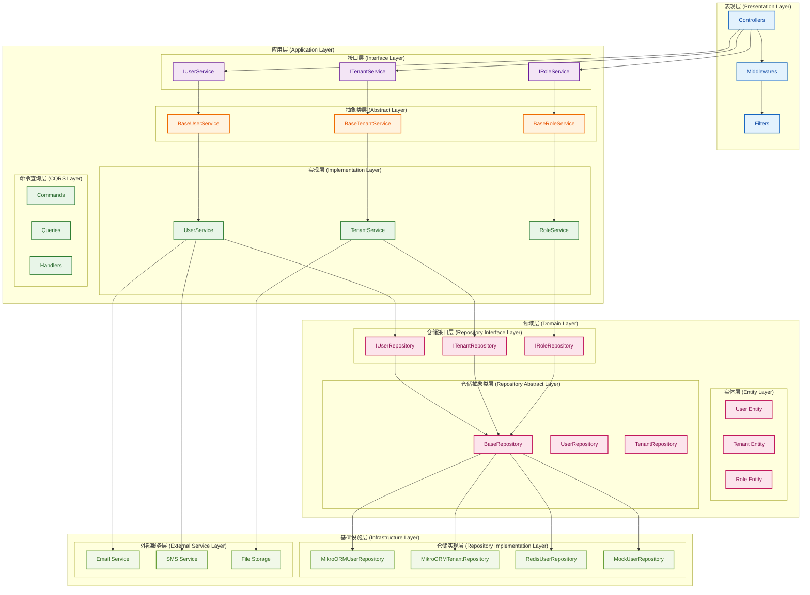

# 接口+抽象类设计方案

## 文档概述

本文档详细描述IAM系统采用接口+抽象类设计方案的架构设计，包括设计原则、实施指南、优势分析等，确保系统的灵活性、可维护性和可扩展性。

## 架构图



---

## 一、设计原则

### 1.1 依赖倒置原则（DIP）

#### 1.1.1 核心思想
- **高层模块不依赖低层模块**：应用层不依赖基础设施层
- **抽象不依赖具体**：接口不依赖具体实现
- **具体依赖抽象**：实现类依赖接口定义

#### 1.1.2 实现方式
```typescript
// ❌ 错误：直接依赖具体实现
class UserService {
  constructor(private userRepository: MikroORMUserRepository) {}
}

// ✅ 正确：依赖接口抽象
class UserService {
  constructor(private userRepository: IUserRepository) {}
}
```

### 1.2 单一职责原则（SRP）

#### 1.2.1 接口职责
- **定义契约**：明确服务或仓储的职责边界
- **业务导向**：基于业务需求定义方法
- **稳定设计**：接口一旦定义，保持稳定

#### 1.2.2 抽象类职责
- **通用实现**：提供可复用的通用逻辑
- **模板方法**：定义算法骨架，子类实现具体步骤
- **横切关注点**：处理日志、缓存、审计等横切关注点

### 1.3 开闭原则（OCP）

#### 1.3.1 对扩展开放
- **新增实现**：可以轻松添加新的实现类
- **功能扩展**：可以在抽象类中添加新功能
- **行为扩展**：子类可以重写或扩展行为

#### 1.3.2 对修改封闭
- **接口稳定**：接口定义保持稳定
- **抽象类稳定**：抽象类的核心逻辑保持稳定
- **向后兼容**：新功能不影响现有代码

---

## 二、架构设计

### 2.1 分层架构

```
┌─────────────────────────────────────────────────────────────┐
│                    表现层 (Presentation Layer)              │
│  ┌─────────────┐ ┌─────────────┐ ┌─────────────┐         │
│  │ Controllers │ │ Middlewares │ │   Filters   │         │
│  └─────────────┘ └─────────────┘ └─────────────┘         │
└─────────────────────────────────────────────────────────────┘
┌─────────────────────────────────────────────────────────────┐
│                    应用层 (Application Layer)               │
│  ┌─────────────┐ ┌─────────────┐ ┌─────────────┐         │
│  │ Interfaces  │ │Abstract Base│ │Implementations│       │
│  └─────────────┘ └─────────────┘ └─────────────┘         │
│  ┌─────────────┐ ┌─────────────┐ ┌─────────────┐         │
│  │ Commands    │ │   Queries   │ │   Handlers  │         │
│  └─────────────┘ └─────────────┘ └─────────────┘         │
└─────────────────────────────────────────────────────────────┘
┌─────────────────────────────────────────────────────────────┐
│                    领域层 (Domain Layer)                   │
│  ┌─────────────┐ ┌─────────────┐ ┌─────────────┐         │
│  │  Entities   │ │Value Objects│ │ Repositories│         │
│  └─────────────┘ └─────────────┘ └─────────────┘         │
└─────────────────────────────────────────────────────────────┘
┌─────────────────────────────────────────────────────────────┐
│                基础设施层 (Infrastructure Layer)            │
│  ┌─────────────┐ ┌─────────────┐ ┌─────────────┐         │
│  │MikroORMRepo │ │RedisRepo    │ │MockRepo     │         │
│  └─────────────┘ └─────────────┘ └─────────────┘         │
└─────────────────────────────────────────────────────────────┘
```

### 2.2 接口设计

#### 2.2.1 仓储接口层次
```typescript
// 基础仓储接口
export interface IBaseRepository<T, ID = string> {
  findById(id: ID): Promise<T | null>;
  save(entity: T): Promise<void>;
  delete(id: ID): Promise<void>;
  exists(id: ID): Promise<boolean>;
  count(): Promise<number>;
}

// 查询仓储接口
export interface IQueryRepository<T, ID = string> extends IBaseRepository<T, ID> {
  findAll(): Promise<T[]>;
  findByCriteria(criteria: QueryCriteria): Promise<T[]>;
  findOneByCriteria(criteria: QueryCriteria): Promise<T | null>;
  countByCriteria(criteria: QueryCriteria): Promise<number>;
}

// 具体仓储接口
export interface IUserRepository extends IQueryRepository<User> {
  findByUsername(username: string, tenantId: string): Promise<User | null>;
  findByEmail(email: string, tenantId: string): Promise<User | null>;
  findByTenantId(tenantId: string): Promise<User[]>;
  // ... 其他用户特定方法
}
```

#### 2.2.2 服务接口层次
```typescript
// 基础服务接口
export interface IBaseService<T, ID = string> {
  create(command: CreateCommand<T>): Promise<CreateResult>;
  update(command: UpdateCommand<T>): Promise<UpdateResult>;
  delete(command: DeleteCommand<ID>): Promise<DeleteResult>;
  getById(query: GetByIdQuery<ID>): Promise<GetByIdResult<T>>;
}

// 具体服务接口
export interface IUserService extends IBaseService<User> {
  authenticateUser(command: AuthenticateUserCommand): Promise<AuthenticateUserResult>;
  changePassword(command: ChangePasswordCommand): Promise<ChangePasswordResult>;
  assignRoleToUser(command: AssignRoleToUserCommand): Promise<AssignRoleToUserResult>;
  // ... 其他用户特定方法
}
```

### 2.3 抽象类设计

#### 2.3.1 基础仓储抽象类
```typescript
export abstract class BaseRepository<T, ID = string> implements IBaseRepository<T, ID> {
  constructor(
    protected readonly logger: Logger,
    protected readonly cacheService: CacheService,
  ) {}

  async findById(id: ID): Promise<T | null> {
    try {
      // 缓存逻辑
      const cached = await this.cacheService.get<T>(`${this.getEntityName()}:${id}`);
      if (cached) return cached;

      // 数据库查询
      const entity = await this.findByIdFromDatabase(id);
      if (entity) {
        await this.cacheService.set(`${this.getEntityName()}:${id}`, entity);
      }
      return entity;
    } catch (error) {
      this.logger.error(`Failed to find entity by id: ${id}`, error);
      throw new RepositoryException(`Failed to find entity by id: ${id}`, error);
    }
  }

  async save(entity: T): Promise<void> {
    try {
      await this.saveToDatabase(entity);
      const id = this.getId(entity);
      await this.cacheService.set(`${this.getEntityName()}:${id}`, entity);
      this.logger.log(`Entity saved: ${id}`);
    } catch (error) {
      this.logger.error('Failed to save entity', error);
      throw new RepositoryException('Failed to save entity', error);
    }
  }

  // 抽象方法，由子类实现
  protected abstract findByIdFromDatabase(id: ID): Promise<T | null>;
  protected abstract saveToDatabase(entity: T): Promise<void>;
  protected abstract deleteFromDatabase(id: ID): Promise<void>;
  protected abstract getId(entity: T): ID;
  protected abstract getEntityName(): string;
}
```

#### 2.3.2 基础服务抽象类
```typescript
export abstract class BaseService<T, ID = string> implements IBaseService<T, ID> {
  constructor(
    protected readonly repository: IBaseRepository<T, ID>,
    protected readonly eventBus: IEventBus,
    protected readonly auditService: IAuditService,
    protected readonly logger: Logger,
  ) {}

  async create(command: CreateCommand<T>): Promise<CreateResult> {
    try {
      // 1. 验证输入
      await this.validateCreateCommand(command);
      
      // 2. 检查业务规则
      await this.checkCreateBusinessRules(command);
      
      // 3. 创建实体
      const entity = await this.createEntity(command);
      
      // 4. 保存实体
      await this.repository.save(entity);
      
      // 5. 发布事件
      await this.publishCreatedEvent(entity);
      
      // 6. 记录审计
      await this.auditCreation(entity, command);
      
      return { success: true, id: this.getId(entity) };
    } catch (error) {
      this.logger.error('Failed to create entity', error);
      return { success: false, error: error.message };
    }
  }

  // 抽象方法，由子类实现
  protected abstract validateCreateCommand(command: CreateCommand<T>): Promise<void>;
  protected abstract checkCreateBusinessRules(command: CreateCommand<T>): Promise<void>;
  protected abstract createEntity(command: CreateCommand<T>): Promise<T>;
  protected abstract publishCreatedEvent(entity: T): Promise<void>;
  protected abstract auditCreation(entity: T, command: CreateCommand<T>): Promise<void>;
  protected abstract getId(entity: T): ID;
}
```

---

## 三、实施指南

### 3.1 开发流程

#### 3.1.1 接口优先设计
1. **定义接口**：首先定义业务接口，明确契约
2. **设计抽象类**：创建抽象类，提供通用实现
3. **实现具体类**：实现具体的业务逻辑
4. **编写测试**：为每个层次编写单元测试

#### 3.1.2 代码组织
```
src/
├── domain/
│   ├── entities/
│   ├── value-objects/
│   └── repositories/
│       ├── interfaces/
│       │   ├── base.repository.interface.ts
│       │   ├── user.repository.interface.ts
│       │   └── tenant.repository.interface.ts
│       └── implementations/
│           ├── base.repository.ts
│           ├── user.repository.ts
│           └── tenant.repository.ts
├── application/
│   ├── services/
│   │   ├── interfaces/
│   │   │   ├── base.service.interface.ts
│   │   │   ├── user.service.interface.ts
│   │   │   └── tenant.service.interface.ts
│   │   └── implementations/
│   │       ├── base.service.ts
│   │       ├── user.service.ts
│   │       └── tenant.service.ts
│   └── commands/
└── infrastructure/
    └── repositories/
        ├── mikroorm/
        ├── redis/
        └── mock/
```

### 3.2 依赖注入配置

#### 3.2.1 仓储注册
```typescript
@Module({
  providers: [
    // 接口绑定到具体实现
    {
      provide: 'IUserRepository',
      useClass: MikroORMUserRepository,
    },
    {
      provide: 'ITenantRepository',
      useClass: MikroORMTenantRepository,
    },
    // 服务注册
    {
      provide: 'IUserService',
      useClass: UserService,
    },
    {
      provide: 'ITenantService',
      useClass: TenantService,
    },
  ],
})
export class IAMModule {}
```

#### 3.2.2 服务注入
```typescript
@Injectable()
export class UserController {
  constructor(
    @Inject('IUserService')
    private readonly userService: IUserService,
  ) {}
}
```

### 3.3 测试策略

#### 3.3.1 单元测试
```typescript
describe('UserService', () => {
  let userService: UserService;
  let mockUserRepository: jest.Mocked<IUserRepository>;
  let mockEventBus: jest.Mocked<IEventBus>;

  beforeEach(() => {
    mockUserRepository = createMockUserRepository();
    mockEventBus = createMockEventBus();
    
    userService = new UserService(
      mockUserRepository,
      mockEventBus,
      mockAuditService,
      mockLogger,
    );
  });

  it('should create user successfully', async () => {
    // Arrange
    const command = new CreateUserCommand(/* ... */);
    mockUserRepository.save.mockResolvedValue();

    // Act
    const result = await userService.createUser(command);

    // Assert
    expect(result.success).toBe(true);
    expect(mockUserRepository.save).toHaveBeenCalled();
    expect(mockEventBus.publish).toHaveBeenCalled();
  });
});
```

#### 3.3.2 集成测试
```typescript
describe('UserRepository Integration', () => {
  let userRepository: MikroORMUserRepository;
  let testDatabase: TestDatabase;

  beforeEach(async () => {
    testDatabase = await createTestDatabase();
    userRepository = new MikroORMUserRepository(
      testDatabase.entityManager,
      mockLogger,
      mockCacheService,
      mockAuditService,
    );
  });

  it('should save and retrieve user', async () => {
    // Arrange
    const user = new User(/* ... */);

    // Act
    await userRepository.save(user);
    const retrieved = await userRepository.findById(user.id);

    // Assert
    expect(retrieved).toBeDefined();
    expect(retrieved.id).toBe(user.id);
  });
});
```

---

## 四、优势分析

### 4.1 架构优势

#### 4.1.1 灵活性
- **多实现支持**：可以轻松切换不同的实现
- **技术无关**：业务逻辑与技术实现解耦
- **渐进式迁移**：可以逐步替换实现

#### 4.1.2 可维护性
- **清晰的分层**：每层职责明确
- **代码复用**：抽象类提供通用实现
- **易于理解**：接口定义清晰，易于理解

#### 4.1.3 可扩展性
- **新功能扩展**：可以轻松添加新功能
- **新实现支持**：可以添加新的实现类
- **向后兼容**：新功能不影响现有代码

### 4.2 开发优势

#### 4.2.1 开发效率
- **并行开发**：接口定义后可以并行开发
- **快速原型**：可以使用Mock实现快速原型
- **代码生成**：可以基于接口生成代码

#### 4.2.2 测试友好
- **易于Mock**：接口易于创建Mock实现
- **单元测试**：可以独立测试每个层次
- **集成测试**：可以测试不同实现的集成

#### 4.2.3 团队协作
- **契约明确**：接口作为团队间的契约
- **职责清晰**：每个开发者的职责明确
- **代码审查**：接口变更需要团队审查

### 4.3 运维优势

#### 4.3.1 部署灵活
- **环境适配**：不同环境可以使用不同实现
- **A/B测试**：可以同时运行多个实现
- **灰度发布**：可以逐步切换实现

#### 4.3.2 监控友好
- **性能监控**：可以监控不同实现的性能
- **错误追踪**：可以追踪不同实现的错误
- **容量规划**：可以基于实现特性进行容量规划

---

## 五、最佳实践

### 5.1 接口设计原则

#### 5.1.1 接口命名
- **清晰明确**：接口名称要清晰表达意图
- **一致性**：保持命名风格的一致性
- **业务导向**：基于业务概念命名

#### 5.1.2 方法设计
- **单一职责**：每个方法只做一件事
- **参数简洁**：避免过多参数，使用DTO
- **返回值明确**：返回值类型要明确

### 5.2 抽象类设计原则

#### 5.2.1 通用逻辑
- **横切关注点**：日志、缓存、审计等
- **错误处理**：统一的错误处理机制
- **性能优化**：通用的性能优化逻辑

#### 5.2.2 模板方法
- **算法骨架**：定义业务操作的骨架
- **钩子方法**：提供子类扩展的钩子
- **默认实现**：提供合理的默认实现

### 5.3 实现类设计原则

#### 5.3.1 具体实现
- **专注业务**：专注于具体的业务逻辑
- **技术适配**：适配具体的技术栈
- **性能优化**：针对具体场景进行优化

#### 5.3.2 错误处理
- **异常转换**：将技术异常转换为业务异常
- **错误恢复**：提供错误恢复机制
- **错误报告**：提供详细的错误信息

---

## 六、总结

接口+抽象类设计方案为IAM系统提供了强大的架构基础：

1. **架构清晰**：分层明确，职责清晰
2. **易于维护**：代码结构清晰，易于理解和维护
3. **高度灵活**：支持多种实现，易于扩展
4. **测试友好**：易于编写单元测试和集成测试
5. **团队协作**：接口作为契约，便于团队协作

通过采用这种设计方案，我们能够构建一个高质量、可维护、可扩展的IAM系统，满足企业级应用的需求。 