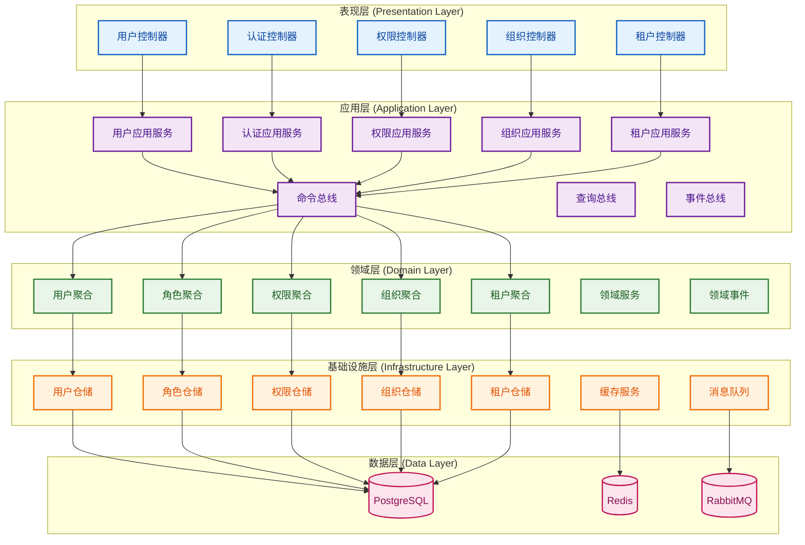

# IAM系统概要设计文档

## 文档概述

本文档是IAM（身份认证与权限管理）系统的概要设计文档，基于领域驱动设计（DDD）和整洁架构（Clean Architecture）模式，实现CQRS和事件溯源（Event Sourcing），为多租户SaaS平台提供完整的身份认证与权限管理解决方案。

---

## 一、系统概述

### 1.1 系统目标

IAM系统旨在为多租户SaaS平台提供：

- **身份认证**：支持多种认证方式，确保用户身份安全
- **权限管理**：基于RBAC和ABAC的细粒度权限控制
- **多租户隔离**：确保不同租户间数据完全隔离
- **组织管理**：支持复杂的组织层级和权限继承
- **审计合规**：完整的操作审计和合规支持
- **高可用性**：支持大规模用户和复杂业务场景

### 1.2 核心功能模块

#### 1.2.1 租户管理模块
- 租户生命周期管理（创建、激活、禁用、删除）
- 租户配置管理（功能开关、权限策略等）
- 租户数据隔离和资源管理

#### 1.2.2 用户管理模块
- 用户注册、认证、信息维护
- 用户状态管理（激活、禁用、锁定）
- 密码管理和安全策略
- 多因素认证支持

#### 1.2.3 角色管理模块
- 角色定义和权限分配
- 角色继承和层级关系
- 角色用户分配管理
- 系统预置角色和自定义角色

#### 1.2.4 权限管理模块
- 细粒度权限控制（页面级、操作级、数据级、字段级）
- CASL集成实现ABAC
- 权限缓存和性能优化
- 动态权限规则

#### 1.2.5 组织管理模块
- 组织层级结构管理
- 用户组织关联管理
- 组织级权限继承
- 组织数据隔离

#### 1.2.6 审计日志模块
- 操作审计记录
- 安全事件监控
- 合规报告生成
- 审计数据管理

---

## 二、架构设计

### 2.1 整体架构

基于DDD和Clean Architecture的分层架构：



### 2.2 接口+抽象类设计模式

#### 2.2.1 设计原则
- **依赖倒置**：高层模块不依赖低层模块，依赖抽象
- **单一职责**：每个类只负责一个功能
- **开闭原则**：对扩展开放，对修改封闭
- **接口隔离**：定义清晰的接口边界

#### 2.2.2 分层架构
```
┌─────────────────────────────────────────────────────────────┐
│                    接口层 (Interface Layer)                │
│  ┌─────────────┐ ┌─────────────┐ ┌─────────────┐         │
│  │IUserService │ │ITenantService│ │IRoleService │         │
│  └─────────────┘ └─────────────┘ └─────────────┘         │
└─────────────────────────────────────────────────────────────┘
┌─────────────────────────────────────────────────────────────┐
│                  抽象类层 (Abstract Layer)                 │
│  ┌─────────────┐ ┌─────────────┐ ┌─────────────┐         │
│  │BaseUserService│ │BaseTenantService│ │BaseRoleService│   │
│  └─────────────┘ └─────────────┘ └─────────────┘         │
└─────────────────────────────────────────────────────────────┘
┌─────────────────────────────────────────────────────────────┐
│                  实现层 (Implementation Layer)             │
│  ┌─────────────┐ ┌─────────────┐ ┌─────────────┐         │
│  │UserService  │ │TenantService│ │RoleService  │         │
│  └─────────────┘ └─────────────┘ └─────────────┘         │
└─────────────────────────────────────────────────────────────┘
```

### 2.3 CQRS架构

#### 2.3.1 命令端（Command Side）
```
┌─────────────┐    ┌─────────────┐    ┌─────────────┐
│   Command   │───▶│   Handler   │───▶│  Aggregate  │
└─────────────┘    └─────────────┘    └─────────────┘
                           │                   │
                           ▼                   ▼
                    ┌─────────────┐    ┌─────────────┐
                    │ Repository  │    │   Events    │
                    └─────────────┘    └─────────────┘
```

#### 2.3.2 查询端（Query Side）
```
┌─────────────┐    ┌─────────────┐    ┌─────────────┐
│   Query     │───▶│   Handler   │───▶│  Read Model │
└─────────────┘    └─────────────┘    └─────────────┘
                           │
                           ▼
                    ┌─────────────┐
                    │ Repository  │
                    └─────────────┘
```

---

## 四、应用服务设计

### 4.1 服务接口设计

#### 4.1.1 用户服务接口
```typescript
export interface IUserService {
  // 用户创建和管理
  createUser(command: CreateUserCommand): Promise<CreateUserResult>;
  updateUser(command: UpdateUserCommand): Promise<UpdateUserResult>;
  deleteUser(command: DeleteUserCommand): Promise<DeleteUserResult>;
  activateUser(command: ActivateUserCommand): Promise<ActivateUserResult>;
  suspendUser(command: SuspendUserCommand): Promise<SuspendUserResult>;
  
  // 用户查询
  getUserById(query: GetUserByIdQuery): Promise<GetUserByIdResult>;
  searchUsers(query: SearchUsersQuery): Promise<SearchUsersResult>;
  getUsersByTenant(query: GetUsersByTenantQuery): Promise<GetUsersByTenantResult>;
  
  // 用户认证
  authenticateUser(command: AuthenticateUserCommand): Promise<AuthenticateUserResult>;
  changePassword(command: ChangePasswordCommand): Promise<ChangePasswordResult>;
  resetPassword(command: ResetPasswordCommand): Promise<ResetPasswordResult>;
  
  // 用户权限
  assignRoleToUser(command: AssignRoleToUserCommand): Promise<AssignRoleToUserResult>;
  removeRoleFromUser(command: RemoveRoleFromUserCommand): Promise<RemoveRoleToUserResult>;
  getUserPermissions(query: GetUserPermissionsQuery): Promise<GetUserPermissionsResult>;
}
```

#### 4.1.2 租户服务接口
```typescript
export interface ITenantService {
  // 租户生命周期管理
  createTenant(command: CreateTenantCommand): Promise<CreateTenantResult>;
  activateTenant(command: ActivateTenantCommand): Promise<ActivateTenantResult>;
  suspendTenant(command: SuspendTenantCommand): Promise<SuspendTenantResult>;
  deleteTenant(command: DeleteTenantCommand): Promise<DeleteTenantResult>;
  
  // 租户查询
  getTenantById(query: GetTenantByIdQuery): Promise<GetTenantByIdResult>;
  searchTenants(query: SearchTenantsQuery): Promise<SearchTenantsResult>;
  getAllTenants(query: GetAllTenantsQuery): Promise<GetAllTenantsResult>;
  
  // 租户配置管理
  updateTenantSettings(command: UpdateTenantSettingsCommand): Promise<UpdateTenantSettingsResult>;
  getTenantSettings(query: GetTenantSettingsQuery): Promise<GetTenantSettingsResult>;
  
  // 租户统计
  getTenantStatistics(query: GetTenantStatisticsQuery): Promise<GetTenantStatisticsResult>;
}
```

### 4.2 命令查询对象

#### 4.2.1 命令对象
```typescript
export class CreateUserCommand {
  constructor(
    public readonly tenantId: string,
    public readonly username: string,
    public readonly email: string,
    public readonly password: string,
    public readonly firstName: string,
    public readonly lastName: string,
    public readonly phone?: string,
    public readonly organizationIds?: string[],
    public readonly roleIds?: string[],
    public readonly sendWelcomeEmail?: boolean,
  ) {}
}

export class UpdateUserCommand {
  constructor(
    public readonly userId: string,
    public readonly tenantId: string,
    public readonly firstName?: string,
    public readonly lastName?: string,
    public readonly displayName?: string,
    public readonly avatar?: string,
    public readonly phone?: string,
    public readonly preferences?: Record<string, any>,
  ) {}
}

export class CreateTenantCommand {
  constructor(
    public readonly name: string,
    public readonly code: string,
    public readonly description?: string,
    public readonly adminUser: {
      username: string;
      email: string;
      password: string;
      firstName: string;
      lastName: string;
    },
    public readonly settings?: Record<string, any>,
  ) {}
}
```

#### 4.2.2 查询对象
```typescript
export class GetUsersQuery {
  constructor(
    public readonly tenantId: string,
    public readonly page?: number,
    public readonly size?: number,
    public readonly search?: string,
    public readonly status?: UserStatus,
    public readonly organizationId?: string,
    public readonly roleId?: string,
    public readonly sort?: string,
  ) {}
}

export class GetUserByIdQuery {
  constructor(
    public readonly userId: string,
    public readonly tenantId: string,
    public readonly includeOrganizations?: boolean,
    public readonly includeRoles?: boolean,
    public readonly includePermissions?: boolean,
  ) {}
}

export class GetTenantsQuery {
  constructor(
    public readonly page?: number,
    public readonly size?: number,
    public readonly search?: string,
    public readonly status?: TenantStatus,
    public readonly sort?: string,
  ) {}
}
```

### 4.3 服务抽象类

#### 4.3.1 基础服务抽象类
```typescript
export abstract class BaseService<T, ID = string> implements IBaseService<T, ID> {
  constructor(
    protected readonly repository: IBaseRepository<T, ID>,
    protected readonly eventBus: IEventBus,
    protected readonly auditService: IAuditService,
    protected readonly logger: Logger,
  ) {}

  async create(command: CreateCommand<T>): Promise<CreateResult> {
    try {
      // 1. 验证输入
      await this.validateCreateCommand(command);
      
      // 2. 检查业务规则
      await this.checkCreateBusinessRules(command);
      
      // 3. 创建实体
      const entity = await this.createEntity(command);
      
      // 4. 保存实体
      await this.repository.save(entity);
      
      // 5. 发布事件
      await this.publishCreatedEvent(entity);
      
      // 6. 记录审计
      await this.auditCreation(entity, command);
      
      return { success: true, id: this.getId(entity) };
    } catch (error) {
      this.logger.error('Failed to create entity', error);
      return { success: false, error: error.message };
    }
  }

  // 抽象方法，由子类实现
  protected abstract validateCreateCommand(command: CreateCommand<T>): Promise<void>;
  protected abstract checkCreateBusinessRules(command: CreateCommand<T>): Promise<void>;
  protected abstract createEntity(command: CreateCommand<T>): Promise<T>;
  protected abstract publishCreatedEvent(entity: T): Promise<void>;
  protected abstract auditCreation(entity: T, command: CreateCommand<T>): Promise<void>;
  protected abstract getId(entity: T): ID;
}
```

---

## 三、领域模型设计

### 3.1 核心实体

#### 3.1.1 租户（Tenant）
```typescript
export class Tenant extends BaseEntity {
  id: string;
  name: TenantName;
  code: TenantCode;
  description?: string;
  status: TenantStatus;
  adminUserId: string;
  settings: Record<string, any>;
  createdAt: Date;
  updatedAt: Date;
  deletedAt?: Date;

  // 业务方法
  activate(): void;
  suspend(): void;
  delete(): void;
  restore(): void;
  updateSettings(settings: Record<string, any>): void;
}
```

#### 3.1.2 用户（User）
```typescript
export class User extends BaseEntity {
  id: string;
  username: Username;
  email: Email;
  phone?: Phone;
  firstName: string;
  lastName: string;
  displayName: string;
  avatar?: string;
  status: UserStatus;
  tenantId: string;
  adminUserId: string;
  passwordHash: string;
  lastLoginAt?: Date;
  loginAttempts: number;
  lockedUntil?: Date;
  emailVerified: boolean;
  phoneVerified: boolean;
  twoFactorEnabled: boolean;
  twoFactorSecret?: string;
  preferences: Record<string, any>;

  // 业务方法
  activate(): void;
  suspend(): void;
  lockAccount(): void;
  unlockAccount(): void;
  updatePassword(newPassword: string): void;
  enableTwoFactor(): void;
  disableTwoFactor(): void;
  verifyEmail(): void;
  verifyPhone(): void;
  isActive(): boolean;
  isLocked(): boolean;
  isPasswordExpired(): boolean;
}
```

#### 3.1.3 角色（Role）
```typescript
export class Role extends BaseEntity {
  id: string;
  name: RoleName;
  code: RoleCode;
  description?: string;
  status: RoleStatus;
  tenantId: string;
  organizationId?: string;
  adminUserId: string;
  isSystemRole: boolean;
  isDefaultRole: boolean;
  priority: number;
  maxUsers?: number;
  expiresAt?: Date;
  parentRoleId?: string;
  permissions: Permission[];
  users: User[];

  // 业务方法
  activate(): void;
  suspend(): void;
  delete(): void;
  assignPermission(permission: Permission): void;
  removePermission(permissionId: string): void;
  assignUser(user: User): void;
  removeUser(userId: string): void;
  isActive(): boolean;
  isExpired(): boolean;
  hasPermission(permissionCode: string): boolean;
}
```

#### 3.1.4 权限（Permission）
```typescript
export class Permission extends BaseEntity {
  id: string;
  name: PermissionName;
  code: PermissionCode;
  description?: string;
  type: PermissionType;
  action: PermissionAction;
  resource: string;
  module: string;
  conditions?: Record<string, any>;
  fields?: string[];
  status: PermissionStatus;
  tenantId: string;
  isSystemPermission: boolean;
  parentPermissionId?: string;
  roles: Role[];

  // 业务方法
  activate(): void;
  suspend(): void;
  delete(): void;
  isActive(): boolean;
  matches(resource: string, action: string): boolean;
  validateConditions(context: Record<string, any>): boolean;
}
```

#### 3.1.5 组织（Organization）
```typescript
export class Organization extends BaseEntity {
  id: string;
  name: OrganizationName;
  code: OrganizationCode;
  description?: string;
  type: OrganizationType;
  status: OrganizationStatus;
  tenantId: string;
  parentId?: string;
  path: string;
  level: number;
  sortOrder: number;
  adminId?: string;
  contactInfo?: Record<string, any>;
  settings?: Record<string, any>;
  users: User[];
  roles: Role[];

  // 业务方法
  activate(): void;
  suspend(): void;
  delete(): void;
  moveToParent(parentId: string): void;
  addUser(user: User): void;
  removeUser(userId: string): void;
  isActive(): boolean;
  getAncestors(): Organization[];
  getDescendants(): Organization[];
}
```

### 3.2 仓储接口设计

#### 3.2.1 基础仓储接口
```typescript
export interface IBaseRepository<T, ID = string> {
  findById(id: ID): Promise<T | null>;
  findByIds(ids: ID[]): Promise<T[]>;
  save(entity: T): Promise<void>;
  saveAll(entities: T[]): Promise<void>;
  delete(id: ID): Promise<void>;
  deleteAll(ids: ID[]): Promise<void>;
  exists(id: ID): Promise<boolean>;
  count(): Promise<number>;
}

export interface IQueryRepository<T, ID = string> extends IBaseRepository<T, ID> {
  findAll(): Promise<T[]>;
  findByCriteria(criteria: QueryCriteria): Promise<T[]>;
  findOneByCriteria(criteria: QueryCriteria): Promise<T | null>;
  countByCriteria(criteria: QueryCriteria): Promise<number>;
  existsByCriteria(criteria: QueryCriteria): Promise<boolean>;
}
```

#### 3.2.2 用户仓储接口
```typescript
export interface IUserRepository extends IQueryRepository<User> {
  findByUsername(username: string, tenantId: string): Promise<User | null>;
  findByEmail(email: string, tenantId: string): Promise<User | null>;
  findByPhone(phone: string, tenantId: string): Promise<User | null>;
  findByTenantId(tenantId: string): Promise<User[]>;
  findByOrganizationId(organizationId: string): Promise<User[]>;
  findByRoleId(roleId: string): Promise<User[]>;
  findActiveUsersByTenantId(tenantId: string): Promise<User[]>;
  findUsersByStatus(status: UserStatus, tenantId: string): Promise<User[]>;
  countByTenantId(tenantId: string): Promise<number>;
  countByOrganizationId(organizationId: string): Promise<number>;
  countByStatus(status: UserStatus, tenantId: string): Promise<number>;
}
```

#### 3.2.3 租户仓储接口
```typescript
export interface ITenantRepository extends IQueryRepository<Tenant> {
  findByCode(code: string): Promise<Tenant | null>;
  findByName(name: string): Promise<Tenant | null>;
  findByStatus(status: TenantStatus): Promise<Tenant[]>;
  findByAdminUserId(adminUserId: string): Promise<Tenant | null>;
  findActiveTenants(): Promise<Tenant[]>;
  findSuspendedTenants(): Promise<Tenant[]>;
  countByStatus(status: TenantStatus): Promise<number>;
  getTenantStatistics(): Promise<TenantStatistics>;
}
```

### 3.3 值对象设计

#### 3.3.1 用户名值对象
```typescript
export class Username {
  constructor(private readonly value: string) {
    this.validate();
  }

  private validate(): void {
    if (!this.value || this.value.length < 3 || this.value.length > 50) {
      throw new Error('Username must be between 3 and 50 characters');
    }
    if (!/^[a-zA-Z0-9_-]+$/.test(this.value)) {
      throw new Error('Username can only contain letters, numbers, underscores and hyphens');
    }
  }

  getValue(): string {
    return this.value;
  }

  equals(other: Username): boolean {
    return this.value === other.value;
  }
}
```

#### 3.3.2 邮箱值对象
```typescript
export class Email {
  constructor(private readonly value: string) {
    this.validate();
  }

  private validate(): void {
    const emailRegex = /^[^\s@]+@[^\s@]+\.[^\s@]+$/;
    if (!emailRegex.test(this.value)) {
      throw new Error('Invalid email format');
    }
  }

  getValue(): string {
    return this.value;
  }

  getDomain(): string {
    return this.value.split('@')[1];
  }

  equals(other: Email): boolean {
    return this.value === other.value;
  }
}
```

---
// ... existing code ...

---

## 五、基础设施设计

### 5.1 数据存储设计

#### 5.1.1 数据库设计
```sql
-- 租户表
CREATE TABLE tenants (
    id UUID PRIMARY KEY DEFAULT gen_random_uuid(),
    name VARCHAR(100) NOT NULL,
    code VARCHAR(50) UNIQUE NOT NULL,
    description TEXT,
    status VARCHAR(20) NOT NULL DEFAULT 'ACTIVE',
    admin_user_id UUID NOT NULL,
    settings JSONB DEFAULT '{}',
    created_at TIMESTAMP WITH TIME ZONE DEFAULT NOW(),
    updated_at TIMESTAMP WITH TIME ZONE DEFAULT NOW(),
    deleted_at TIMESTAMP WITH TIME ZONE
);

-- 用户表
CREATE TABLE users (
    id UUID PRIMARY KEY DEFAULT gen_random_uuid(),
    username VARCHAR(50) NOT NULL,
    email VARCHAR(255) NOT NULL,
    phone VARCHAR(20),
    first_name VARCHAR(50) NOT NULL,
    last_name VARCHAR(50) NOT NULL,
    display_name VARCHAR(100),
    avatar VARCHAR(255),
    status VARCHAR(20) NOT NULL DEFAULT 'ACTIVE',
    tenant_id UUID NOT NULL REFERENCES tenants(id),
    admin_user_id UUID NOT NULL,
    password_hash VARCHAR(255) NOT NULL,
    last_login_at TIMESTAMP WITH TIME ZONE,
    login_attempts INTEGER DEFAULT 0,
    locked_until TIMESTAMP WITH TIME ZONE,
    email_verified BOOLEAN DEFAULT FALSE,
    phone_verified BOOLEAN DEFAULT FALSE,
    two_factor_enabled BOOLEAN DEFAULT FALSE,
    two_factor_secret VARCHAR(255),
    preferences JSONB DEFAULT '{}',
    created_at TIMESTAMP WITH TIME ZONE DEFAULT NOW(),
    updated_at TIMESTAMP WITH TIME ZONE DEFAULT NOW(),
    deleted_at TIMESTAMP WITH TIME ZONE,
    UNIQUE(username, tenant_id),
    UNIQUE(email, tenant_id)
);

-- 角色表
CREATE TABLE roles (
    id UUID PRIMARY KEY DEFAULT gen_random_uuid(),
    name VARCHAR(100) NOT NULL,
    code VARCHAR(50) NOT NULL,
    description TEXT,
    status VARCHAR(20) NOT NULL DEFAULT 'ACTIVE',
    tenant_id UUID NOT NULL REFERENCES tenants(id),
    organization_id UUID,
    admin_user_id UUID NOT NULL,
    is_system_role BOOLEAN DEFAULT FALSE,
    is_default_role BOOLEAN DEFAULT FALSE,
    priority INTEGER DEFAULT 0,
    max_users INTEGER,
    expires_at TIMESTAMP WITH TIME ZONE,
    parent_role_id UUID REFERENCES roles(id),
    created_at TIMESTAMP WITH TIME ZONE DEFAULT NOW(),
    updated_at TIMESTAMP WITH TIME ZONE DEFAULT NOW(),
    deleted_at TIMESTAMP WITH TIME ZONE,
    UNIQUE(code, tenant_id)
);

-- 权限表
CREATE TABLE permissions (
    id UUID PRIMARY KEY DEFAULT gen_random_uuid(),
    name VARCHAR(100) NOT NULL,
    code VARCHAR(100) NOT NULL,
    description TEXT,
    type VARCHAR(20) NOT NULL,
    action VARCHAR(50) NOT NULL,
    resource VARCHAR(100) NOT NULL,
    module VARCHAR(50) NOT NULL,
    conditions JSONB,
    fields TEXT[],
    status VARCHAR(20) NOT NULL DEFAULT 'ACTIVE',
    tenant_id UUID NOT NULL REFERENCES tenants(id),
    is_system_permission BOOLEAN DEFAULT FALSE,
    parent_permission_id UUID REFERENCES permissions(id),
    created_at TIMESTAMP WITH TIME ZONE DEFAULT NOW(),
    updated_at TIMESTAMP WITH TIME ZONE DEFAULT NOW(),
    deleted_at TIMESTAMP WITH TIME ZONE,
    UNIQUE(code, tenant_id)
);

-- 组织表
CREATE TABLE organizations (
    id UUID PRIMARY KEY DEFAULT gen_random_uuid(),
    name VARCHAR(100) NOT NULL,
    code VARCHAR(50) NOT NULL,
    description TEXT,
    type VARCHAR(20) NOT NULL,
    status VARCHAR(20) NOT NULL DEFAULT 'ACTIVE',
    tenant_id UUID NOT NULL REFERENCES tenants(id),
    parent_id UUID REFERENCES organizations(id),
    path VARCHAR(500) NOT NULL,
    level INTEGER NOT NULL DEFAULT 0,
    sort_order INTEGER DEFAULT 0,
    admin_id UUID,
    contact_info JSONB,
    settings JSONB DEFAULT '{}',
    created_at TIMESTAMP WITH TIME ZONE DEFAULT NOW(),
    updated_at TIMESTAMP WITH TIME ZONE DEFAULT NOW(),
    deleted_at TIMESTAMP WITH TIME ZONE,
    UNIQUE(code, tenant_id)
);

-- 用户角色关联表
CREATE TABLE user_roles (
    id UUID PRIMARY KEY DEFAULT gen_random_uuid(),
    user_id UUID NOT NULL REFERENCES users(id) ON DELETE CASCADE,
    role_id UUID NOT NULL REFERENCES roles(id) ON DELETE CASCADE,
    assigned_by UUID NOT NULL,
    assigned_at TIMESTAMP WITH TIME ZONE DEFAULT NOW(),
    expires_at TIMESTAMP WITH TIME ZONE,
    UNIQUE(user_id, role_id)
);

-- 角色权限关联表
CREATE TABLE role_permissions (
    id UUID PRIMARY KEY DEFAULT gen_random_uuid(),
    role_id UUID NOT NULL REFERENCES roles(id) ON DELETE CASCADE,
    permission_id UUID NOT NULL REFERENCES permissions(id) ON DELETE CASCADE,
    granted_by UUID NOT NULL,
    granted_at TIMESTAMP WITH TIME ZONE DEFAULT NOW(),
    UNIQUE(role_id, permission_id)
);

-- 用户组织关联表
CREATE TABLE user_organizations (
    id UUID PRIMARY KEY DEFAULT gen_random_uuid(),
    user_id UUID NOT NULL REFERENCES users(id) ON DELETE CASCADE,
    organization_id UUID NOT NULL REFERENCES organizations(id) ON DELETE CASCADE,
    role VARCHAR(50),
    assigned_by UUID NOT NULL,
    assigned_at TIMESTAMP WITH TIME ZONE DEFAULT NOW(),
    UNIQUE(user_id, organization_id)
);

-- 审计日志表
CREATE TABLE audit_logs (
    id UUID PRIMARY KEY DEFAULT gen_random_uuid(),
    tenant_id UUID NOT NULL REFERENCES tenants(id),
    user_id UUID REFERENCES users(id),
    action VARCHAR(100) NOT NULL,
    resource_type VARCHAR(50) NOT NULL,
    resource_id UUID,
    details JSONB,
    ip_address INET,
    user_agent TEXT,
    created_at TIMESTAMP WITH TIME ZONE DEFAULT NOW()
);
```

#### 5.1.2 索引设计
```sql
-- 用户表索引
CREATE INDEX idx_users_tenant_id ON users(tenant_id);
CREATE INDEX idx_users_username ON users(username);
CREATE INDEX idx_users_email ON users(email);
CREATE INDEX idx_users_status ON users(status);
CREATE INDEX idx_users_organization_id ON users(organization_id);

-- 角色表索引
CREATE INDEX idx_roles_tenant_id ON roles(tenant_id);
CREATE INDEX idx_roles_code ON roles(code);
CREATE INDEX idx_roles_status ON roles(status);
CREATE INDEX idx_roles_organization_id ON roles(organization_id);

-- 权限表索引
CREATE INDEX idx_permissions_tenant_id ON permissions(tenant_id);
CREATE INDEX idx_permissions_code ON permissions(code);
CREATE INDEX idx_permissions_resource ON permissions(resource);
CREATE INDEX idx_permissions_module ON permissions(module);

-- 组织表索引
CREATE INDEX idx_organizations_tenant_id ON organizations(tenant_id);
CREATE INDEX idx_organizations_parent_id ON organizations(parent_id);
CREATE INDEX idx_organizations_path ON organizations(path);
CREATE INDEX idx_organizations_level ON organizations(level);

-- 关联表索引
CREATE INDEX idx_user_roles_user_id ON user_roles(user_id);
CREATE INDEX idx_user_roles_role_id ON user_roles(role_id);
CREATE INDEX idx_role_permissions_role_id ON role_permissions(role_id);
CREATE INDEX idx_role_permissions_permission_id ON role_permissions(permission_id);
CREATE INDEX idx_user_organizations_user_id ON user_organizations(user_id);
CREATE INDEX idx_user_organizations_organization_id ON user_organizations(organization_id);

-- 审计日志索引
CREATE INDEX idx_audit_logs_tenant_id ON audit_logs(tenant_id);
CREATE INDEX idx_audit_logs_user_id ON audit_logs(user_id);
CREATE INDEX idx_audit_logs_action ON audit_logs(action);
CREATE INDEX idx_audit_logs_created_at ON audit_logs(created_at);
```

### 5.2 缓存设计

#### 5.2.1 Redis缓存策略
```typescript
export interface ICacheService {
  // 用户缓存
  getUserById(userId: string, tenantId: string): Promise<User | null>;
  setUser(user: User): Promise<void>;
  invalidateUser(userId: string, tenantId: string): Promise<void>;
  
  // 权限缓存
  getUserPermissions(userId: string, tenantId: string): Promise<Permission[]>;
  setUserPermissions(userId: string, tenantId: string, permissions: Permission[]): Promise<void>;
  invalidateUserPermissions(userId: string, tenantId: string): Promise<void>;
  
  // 角色缓存
  getRoleById(roleId: string, tenantId: string): Promise<Role | null>;
  setRole(role: Role): Promise<void>;
  invalidateRole(roleId: string, tenantId: string): Promise<void>;
  
  // 租户缓存
  getTenantById(tenantId: string): Promise<Tenant | null>;
  setTenant(tenant: Tenant): Promise<void>;
  invalidateTenant(tenantId: string): Promise<void>;
  
  // 会话缓存
  getSession(sessionId: string): Promise<Session | null>;
  setSession(session: Session): Promise<void>;
  invalidateSession(sessionId: string): Promise<void>;
}
```

#### 5.2.2 缓存配置
```typescript
export const CACHE_CONFIG = {
  // 用户缓存配置
  USER: {
    TTL: 3600, // 1小时
    PREFIX: 'user:',
    MAX_SIZE: 10000,
  },
  
  // 权限缓存配置
  PERMISSION: {
    TTL: 1800, // 30分钟
    PREFIX: 'permission:',
    MAX_SIZE: 50000,
  },
  
  // 角色缓存配置
  ROLE: {
    TTL: 3600, // 1小时
    PREFIX: 'role:',
    MAX_SIZE: 5000,
  },
  
  // 租户缓存配置
  TENANT: {
    TTL: 7200, // 2小时
    PREFIX: 'tenant:',
    MAX_SIZE: 1000,
  },
  
  // 会话缓存配置
  SESSION: {
    TTL: 1800, // 30分钟
    PREFIX: 'session:',
    MAX_SIZE: 100000,
  },
};
```

### 5.3 消息队列设计

#### 5.3.1 事件定义
```typescript
export interface IDomainEvent {
  eventId: string;
  eventType: string;
  aggregateId: string;
  tenantId: string;
  userId?: string;
  timestamp: Date;
  version: number;
  data: Record<string, any>;
}

export class UserCreatedEvent implements IDomainEvent {
  constructor(
    public readonly eventId: string,
    public readonly aggregateId: string,
    public readonly tenantId: string,
    public readonly userId: string,
    public readonly timestamp: Date,
    public readonly version: number,
    public readonly data: {
      username: string;
      email: string;
      firstName: string;
      lastName: string;
    },
  ) {}
}

export class UserUpdatedEvent implements IDomainEvent {
  constructor(
    public readonly eventId: string,
    public readonly aggregateId: string,
    public readonly tenantId: string,
    public readonly userId: string,
    public readonly timestamp: Date,
    public readonly version: number,
    public readonly data: {
      changes: Record<string, any>;
    },
  ) {}
}

export class RoleAssignedToUserEvent implements IDomainEvent {
  constructor(
    public readonly eventId: string,
    public readonly aggregateId: string,
    public readonly tenantId: string,
    public readonly userId: string,
    public readonly timestamp: Date,
    public readonly version: number,
    public readonly data: {
      roleId: string;
      roleName: string;
      assignedBy: string;
    },
  ) {}
}
```

#### 5.3.2 事件处理器
```typescript
export class UserCreatedEventHandler implements IEventHandler<UserCreatedEvent> {
  constructor(
    private readonly emailService: IEmailService,
    private readonly auditService: IAuditService,
    private readonly cacheService: ICacheService,
    private readonly logger: Logger,
  ) {}

  async handle(event: UserCreatedEvent): Promise<void> {
    try {
      // 1. 发送欢迎邮件
      await this.emailService.sendWelcomeEmail(event.data.email, event.data);
      
      // 2. 记录审计日志
      await this.auditService.logEvent(event);
      
      // 3. 清除相关缓存
      await this.cacheService.invalidateUser(event.aggregateId, event.tenantId);
      
      this.logger.info('User created event handled successfully', { eventId: event.eventId });
    } catch (error) {
      this.logger.error('Failed to handle user created event', error);
      throw error;
    }
  }
}

export class UserUpdatedEventHandler implements IEventHandler<UserUpdatedEvent> {
  constructor(
    private readonly cacheService: ICacheService,
    private readonly auditService: IAuditService,
    private readonly logger: Logger,
  ) {}

  async handle(event: UserUpdatedEvent): Promise<void> {
    try {
      // 1. 记录审计日志
      await this.auditService.logEvent(event);
      
      // 2. 清除用户缓存
      await this.cacheService.invalidateUser(event.aggregateId, event.tenantId);
      
      this.logger.info('User updated event handled successfully', { eventId: event.eventId });
    } catch (error) {
      this.logger.error('Failed to handle user updated event', error);
      throw error;
    }
  }
}
```

---

## 六、安全与合规设计

### 6.1 认证安全

#### 6.1.1 密码策略
```typescript
export class PasswordPolicy {
  private static readonly MIN_LENGTH = 8;
  private static readonly MAX_LENGTH = 128;
  private static readonly REQUIRE_UPPERCASE = true;
  private static readonly REQUIRE_LOWERCASE = true;
  private static readonly REQUIRE_NUMBERS = true;
  private static readonly REQUIRE_SPECIAL_CHARS = true;
  private static readonly MAX_AGE_DAYS = 90;
  private static readonly HISTORY_COUNT = 5;

  static validate(password: string): PasswordValidationResult {
    const errors: string[] = [];

    if (password.length < this.MIN_LENGTH) {
      errors.push(`Password must be at least ${this.MIN_LENGTH} characters long`);
    }

    if (password.length > this.MAX_LENGTH) {
      errors.push(`Password must not exceed ${this.MAX_LENGTH} characters`);
    }

    if (this.REQUIRE_UPPERCASE && !/[A-Z]/.test(password)) {
      errors.push('Password must contain at least one uppercase letter');
    }

    if (this.REQUIRE_LOWERCASE && !/[a-z]/.test(password)) {
      errors.push('Password must contain at least one lowercase letter');
    }

    if (this.REQUIRE_NUMBERS && !/\d/.test(password)) {
      errors.push('Password must contain at least one number');
    }

    if (this.REQUIRE_SPECIAL_CHARS && !/[!@#$%^&*()_+\-=\[\]{};':"\\|,.<>\/?]/.test(password)) {
      errors.push('Password must contain at least one special character');
    }

    return {
      isValid: errors.length === 0,
      errors,
    };
  }

  static hashPassword(password: string): Promise<string> {
    return bcrypt.hash(password, 12);
  }

  static verifyPassword(password: string, hash: string): Promise<boolean> {
    return bcrypt.compare(password, hash);
  }
}
```

#### 6.1.2 多因素认证
```typescript
export class TwoFactorAuthentication {
  static generateSecret(): string {
    return speakeasy.generateSecret({
      name: 'IAM System',
      length: 32,
    }).base32;
  }

  static generateQRCode(secret: string, email: string): string {
    const otpauth = speakeasy.otpauthURL({
      secret,
      label: email,
      issuer: 'IAM System',
      algorithm: 'sha1',
      digits: 6,
      period: 30,
    });
    
    return QRCode.toDataURL(otpauth);
  }

  static verifyToken(secret: string, token: string): boolean {
    return speakeasy.totp.verify({
      secret,
      encoding: 'base32',
      token,
      window: 2, // 允许前后1个时间窗口的容错
    });
  }

  static generateBackupCodes(): string[] {
    const codes: string[] = [];
    for (let i = 0; i < 10; i++) {
      codes.push(crypto.randomBytes(4).toString('hex').toUpperCase());
    }
    return codes;
  }
}
```

### 6.2 授权安全

#### 6.2.1 CASL权限集成
```typescript
export class PermissionService {
  constructor(
    private readonly userRepository: IUserRepository,
    private readonly roleRepository: IRoleRepository,
    private readonly permissionRepository: IPermissionRepository,
    private readonly cacheService: ICacheService,
  ) {}

  async buildAbilityForUser(userId: string, tenantId: string): Promise<Ability> {
    // 1. 从缓存获取用户权限
    let permissions = await this.cacheService.getUserPermissions(userId, tenantId);
    
    if (!permissions) {
      // 2. 从数据库获取用户权限
      const user = await this.userRepository.findById(userId);
      if (!user) {
        throw new Error('User not found');
      }

      const roles = await this.roleRepository.findByUserId(userId);
      permissions = await this.permissionRepository.findByRoleIds(
        roles.map(role => role.id)
      );

      // 3. 缓存用户权限
      await this.cacheService.setUserPermissions(userId, tenantId, permissions);
    }

    // 4. 构建CASL Ability
    return this.buildAbilityFromPermissions(permissions);
  }

  private buildAbilityFromPermissions(permissions: Permission[]): Ability {
    const rules: AbilityRule[] = [];

    for (const permission of permissions) {
      if (permission.status !== 'ACTIVE') continue;

      const rule: AbilityRule = {
        action: permission.action,
        subject: permission.resource,
        conditions: permission.conditions,
        fields: permission.fields,
      };

      rules.push(rule);
    }

    return new Ability(rules);
  }

  async checkPermission(
    userId: string,
    tenantId: string,
    action: string,
    resource: string,
    context?: Record<string, any>,
  ): Promise<boolean> {
    const ability = await this.buildAbilityForUser(userId, tenantId);
    return ability.can(action, resource, context);
  }
}
```

#### 6.2.2 数据级权限控制
```typescript
export class DataPermissionService {
  async filterDataByPermission<T>(
    userId: string,
    tenantId: string,
    data: T[],
    resource: string,
    context?: Record<string, any>,
  ): Promise<T[]> {
    const ability = await this.permissionService.buildAbilityForUser(userId, tenantId);
    
    return data.filter(item => {
      return ability.can('read', resource, { ...context, item });
    });
  }

  async addDataPermissionFilter(
    userId: string,
    tenantId: string,
    queryBuilder: any,
    resource: string,
  ): Promise<any> {
    const user = await this.userRepository.findById(userId);
    if (!user) {
      throw new Error('User not found');
    }

    // 根据用户角色添加数据过滤条件
    const roles = await this.roleRepository.findByUserId(userId);
    const hasAdminRole = roles.some(role => role.code === 'ADMIN');
    
    if (hasAdminRole) {
      return queryBuilder; // 管理员可以查看所有数据
    }

    // 普通用户只能查看自己组织的数据
    const userOrganizations = await this.organizationRepository.findByUserId(userId);
    const organizationIds = userOrganizations.map(org => org.id);

    return queryBuilder.whereIn('organization_id', organizationIds);
  }
}
```

### 6.3 数据安全

#### 6.3.1 数据加密
```typescript
export class DataEncryptionService {
  private readonly algorithm = 'aes-256-gcm';
  private readonly keyLength = 32;
  private readonly ivLength = 16;
  private readonly tagLength = 16;

  async encrypt(data: string): Promise<string> {
    const key = crypto.randomBytes(this.keyLength);
    const iv = crypto.randomBytes(this.ivLength);
    
    const cipher = crypto.createCipher(this.algorithm, key);
    cipher.setAAD(Buffer.from('IAM System', 'utf8'));
    
    let encrypted = cipher.update(data, 'utf8', 'hex');
    encrypted += cipher.final('hex');
    
    const tag = cipher.getAuthTag();
    
    // 将key、iv、tag和加密数据组合
    const combined = Buffer.concat([key, iv, tag, Buffer.from(encrypted, 'hex')]);
    return combined.toString('base64');
  }

  async decrypt(encryptedData: string): Promise<string> {
    const combined = Buffer.from(encryptedData, 'base64');
    
    const key = combined.slice(0, this.keyLength);
    const iv = combined.slice(this.keyLength, this.keyLength + this.ivLength);
    const tag = combined.slice(this.keyLength + this.ivLength, this.keyLength + this.ivLength + this.tagLength);
    const encrypted = combined.slice(this.keyLength + this.ivLength + this.tagLength);
    
    const decipher = crypto.createDecipher(this.algorithm, key);
    decipher.setAAD(Buffer.from('IAM System', 'utf8'));
    decipher.setAuthTag(tag);
    
    let decrypted = decipher.update(encrypted, null, 'utf8');
    decrypted += decipher.final('utf8');
    
    return decrypted;
  }
}
```

#### 6.3.2 敏感数据处理
```typescript
export class SensitiveDataService {
  private readonly sensitiveFields = [
    'password',
    'passwordHash',
    'twoFactorSecret',
    'backupCodes',
    'apiKey',
    'secretKey',
  ];

  maskSensitiveData<T>(data: T): T {
    if (typeof data !== 'object' || data === null) {
      return data;
    }

    const masked = { ...data };
    
    for (const field of this.sensitiveFields) {
      if (field in masked) {
        (masked as any)[field] = '***MASKED***';
      }
    }

    return masked;
  }

  validateSensitiveData(data: Record<string, any>): ValidationResult {
    const errors: string[] = [];

    for (const field of this.sensitiveFields) {
      if (field in data) {
        const value = data[field];
        if (typeof value === 'string' && value.length < 8) {
          errors.push(`${field} must be at least 8 characters long`);
        }
      }
    }

    return {
      isValid: errors.length === 0,
      errors,
    };
  }
}
```

---

## 七、部署与运维设计

容器化部署