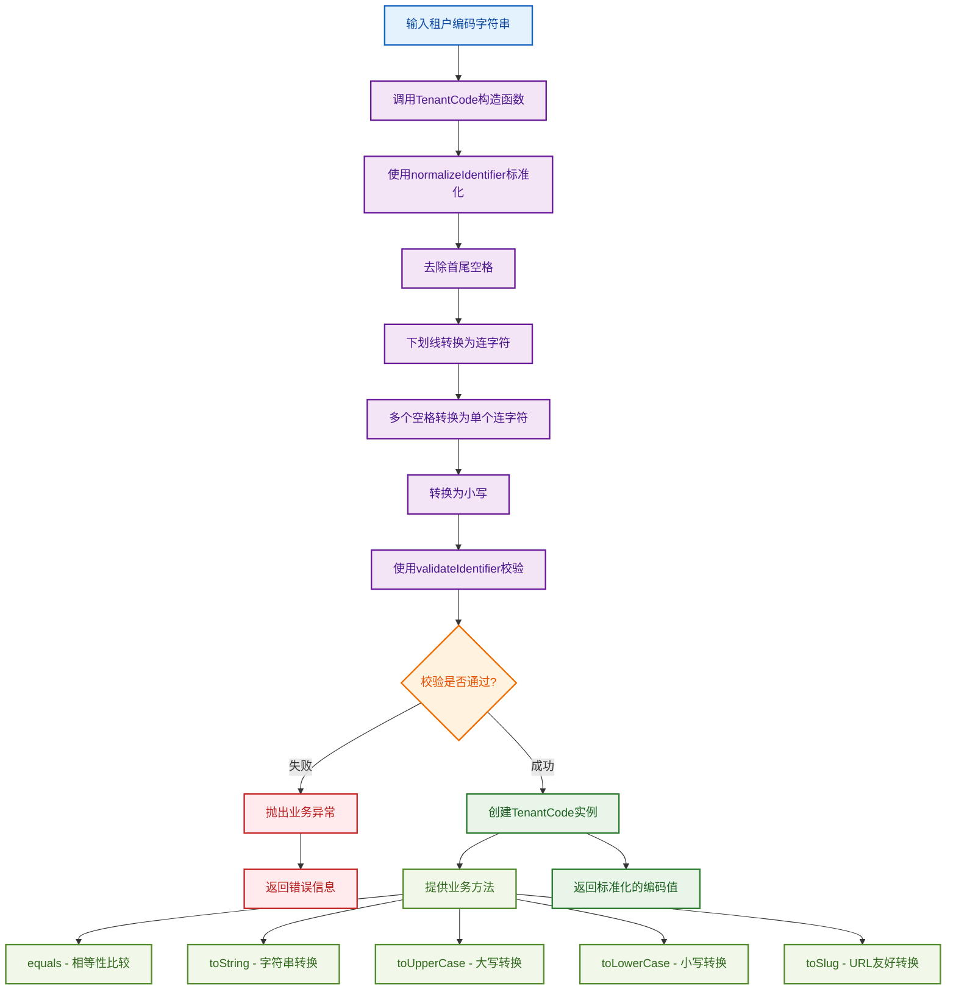

# 租户编码值对象工作流程图

## 概述
租户编码值对象（TenantCode）是DDD中的值对象，负责封装租户编码的业务规则和约束。它使用shared层的identifier.util工具进行标准化和校验。

## 工作流程图



## 标准化流程详解

### 1. 输入处理
- 接收任意字符串作为租户编码输入
- 支持大小写字母、数字、下划线、空格等字符

### 2. 标准化步骤
1. **去除首尾空格**：使用`trim()`方法
2. **下划线转连字符**：将`_`替换为`-`
3. **空格转连字符**：将多个连续空格转换为单个`-`
4. **转换为小写**：确保编码格式统一

### 3. 校验规则
- **非空校验**：编码不能为空或只包含空格
- **长度校验**：3-50个字符
- **字符集校验**：只允许小写字母、数字、下划线、连字符
- **格式校验**：不能以连字符开头或结尾
- **连续字符校验**：不允许连续连字符

### 4. 业务方法
- **equals()**：值对象相等性比较
- **toString()**：字符串表示
- **toUpperCase()**：转换为大写
- **toLowerCase()**：转换为小写
- **toSlug()**：转换为URL友好格式

## 使用示例

```typescript
// 正常创建
const tenantCode1 = new TenantCode('test-tenant');
console.log(tenantCode1.value); // 'test-tenant'

// 自动标准化
const tenantCode2 = new TenantCode('Test Tenant');
console.log(tenantCode2.value); // 'test-tenant'

// 相等性比较
const tenantCode3 = new TenantCode('TEST-TENANT');
console.log(tenantCode1.equals(tenantCode3)); // true

// URL友好转换
const tenantCode4 = new TenantCode('test_tenant_123');
console.log(tenantCode4.toSlug()); // 'test-tenant-123'
```

## 设计原则

1. **不可变性**：值对象一旦创建就不能修改
2. **自验证**：构造函数确保数据有效性
3. **标准化**：统一处理各种输入格式
4. **业务封装**：封装租户编码的业务规则
5. **可测试性**：提供完整的单元测试覆盖 