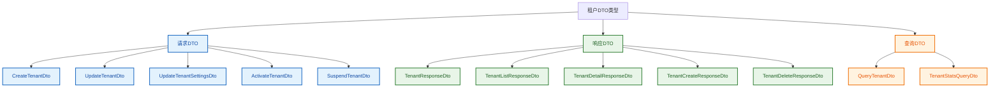
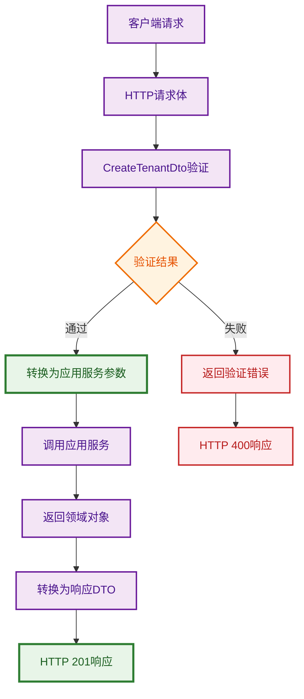
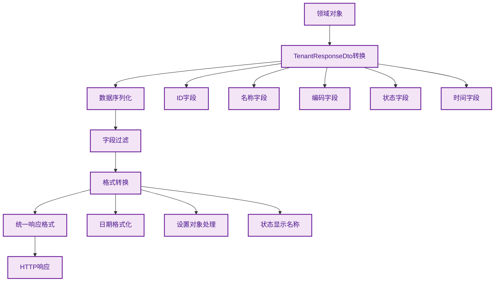
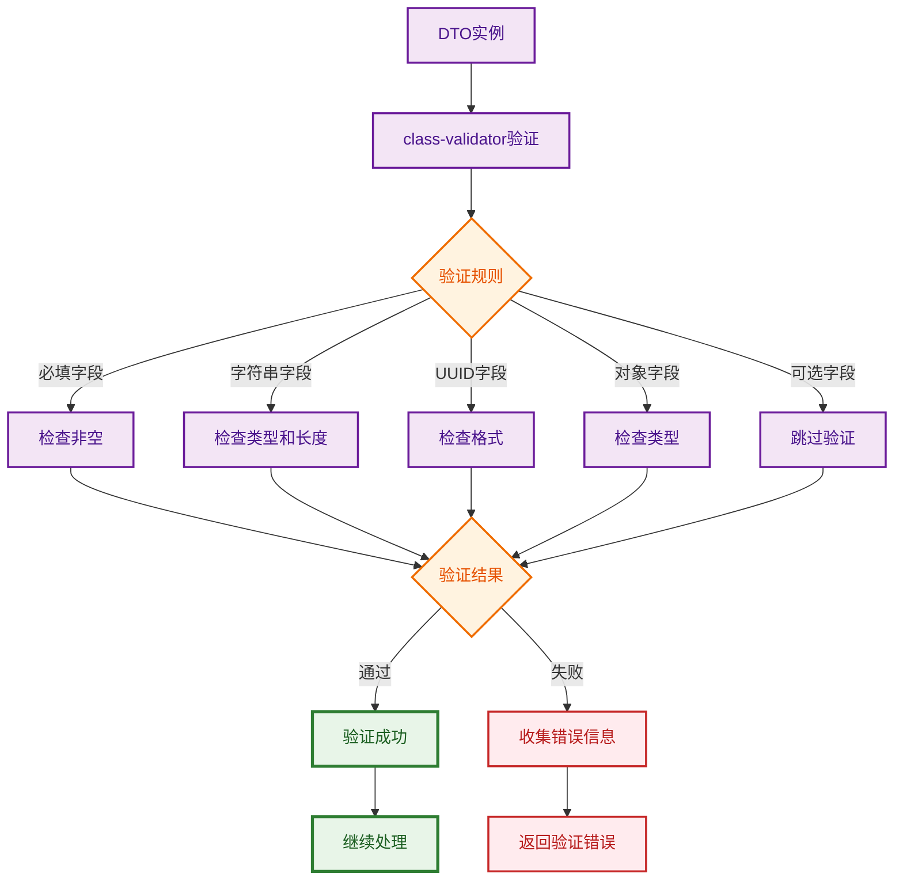

# 租户DTO流程图

## 概述

租户DTO（Data Transfer Objects）是表现层的重要组成部分，用于定义API接口的数据传输格式，包括请求和响应的数据结构。

## DTO类型分类

## 请求DTO数据流

## 响应DTO数据流

## 验证流程

## DTO字段映射

| DTO类型 | 主要字段 | 验证规则 | 用途 |
|---------|----------|----------|------|
| CreateTenantDto | name, code, adminUserId | 必填、长度、格式 | 创建租户请求 |
| UpdateTenantDto | name?, code?, adminUserId? | 可选、长度、格式 | 更新租户请求 |
| TenantResponseDto | id, name, code, status | 序列化、转换 | 租户响应数据 |
| QueryTenantDto | page, limit, search, status | 分页、过滤、排序 | 查询参数 |
| UpdateTenantSettingsDto | settings | 对象验证 | 更新配置请求 |

## 设计原则

1. **单一职责** - 每个DTO只负责一种数据传输场景
2. **类型安全** - 使用TypeScript强类型定义
3. **验证完整** - 使用class-validator进行参数验证
4. **文档生成** - 使用Swagger装饰器生成API文档
5. **数据转换** - 使用class-transformer进行数据转换 