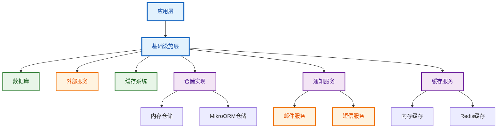
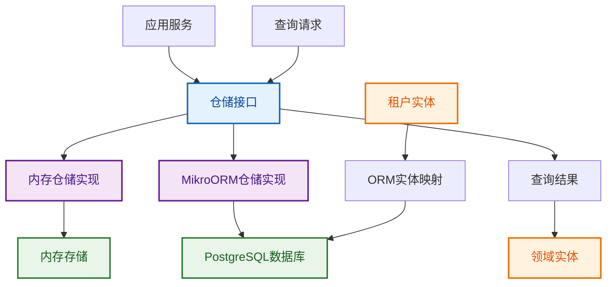
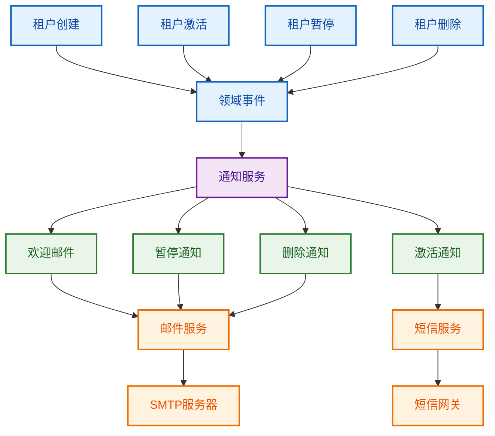
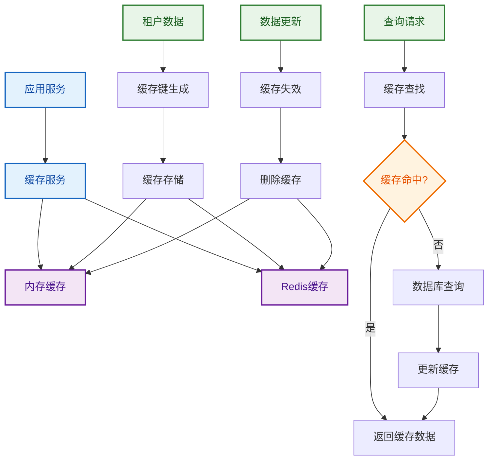

# 租户基础设施层流程图

## 概述

租户基础设施层负责提供数据持久化、外部服务集成和缓存功能，是连接领域层与外部系统的桥梁。

## 整体架构流程图

## 仓储实现流程图

## 通知服务流程图

## 缓存服务流程图

## 总结

基础设施层作为连接领域层与外部系统的桥梁，提供了：

1. **数据持久化**：通过仓储模式实现数据访问抽象
2. **外部服务集成**：提供通知、邮件等外部服务接口
3. **缓存管理**：提升系统性能和响应速度
4. **错误处理**：统一的异常处理和错误恢复机制
5. **性能优化**：通过缓存、索引等手段优化系统性能
6. **测试保障**：完整的测试策略确保系统稳定性
7. **部署支持**：支持多环境部署和监控

通过这些流程图，可以清晰地了解基础设施层的各个组件如何协同工作，为上层应用提供可靠的基础服务。 