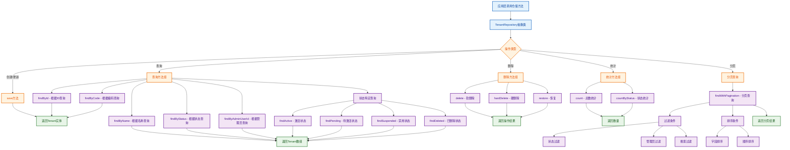

# 租户仓储抽象类工作流程图

## 概述
租户仓储抽象类（TenantRepository Abstract Class）是DDD中领域层的一部分，定义了租户数据访问的抽象契约。它遵循依赖倒置原则，使用领域对象作为参数和返回值，提供完整的CRUD操作和领域特定的查询方法。使用抽象类而非接口，可以包含通用实现和模板方法。

## 工作流程图



## 方法分类详解

### 1. 基础CRUD操作
```typescript
// 保存租户实体
save(tenant: Tenant): Promise<Tenant>

// 根据ID查找
findById(id: string): Promise<Tenant | null>

// 删除操作
delete(id: string): Promise<boolean>
hardDelete(id: string): Promise<boolean>
restore(id: string): Promise<boolean>
```

### 2. 领域特定查询
```typescript
// 根据编码查询
findByCode(code: TenantCode): Promise<Tenant | null>
findByCodeString(code: string): Promise<Tenant | null>

// 根据名称查询
findByName(name: string): Promise<Tenant[]>

// 根据状态查询
findByStatus(status: TenantStatus): Promise<Tenant[]>

// 根据管理员查询
findByAdminUserId(adminUserId: string): Promise<Tenant[]>
```

### 3. 状态特定查询
```typescript
// 状态特定查询方法
findActive(): Promise<Tenant[]>
findPending(): Promise<Tenant[]>
findSuspended(): Promise<Tenant[]>
findDeleted(): Promise<Tenant[]>
```

### 4. 存在性检查
```typescript
// 存在性检查
exists(id: string): Promise<boolean>
existsByCode(code: TenantCode): Promise<boolean>
existsByCodeString(code: string): Promise<boolean>
```

### 5. 统计方法
```typescript
// 统计方法
count(): Promise<number>
countByStatus(status: TenantStatus): Promise<number>
```

### 6. 高级查询
```typescript
// 分页查询
findWithPagination(
  page: number,
  limit: number,
  filters?: {
    status?: TenantStatus;
    adminUserId?: string;
    search?: string;
  },
  sort?: {
    field: 'name' | 'code' | 'status' | 'createdAt' | 'updatedAt';
    order: 'asc' | 'desc';
  }
): Promise<{
  tenants: Tenant[];
  total: number;
  page: number;
  limit: number;
  totalPages: number;
}>

// 搜索查询
findBySearch(search: string, limit?: number): Promise<Tenant[]>

// 最近创建
findRecent(limit?: number): Promise<Tenant[]>

// 日期范围查询
findByDateRange(startDate: Date, endDate: Date): Promise<Tenant[]>
```

### 7. 更新操作
```typescript
// 更新操作
updateStatus(id: string, status: TenantStatus): Promise<boolean>
updateSettings(id: string, settings: Record<string, any>): Promise<boolean>
```

## 设计原则

### 1. DDD原则
- ✅ **领域驱动**: 接口定义在领域层，使用领域对象
- ✅ **依赖倒置**: 领域层定义抽象，基础设施层实现
- ✅ **聚合根**: 以Tenant实体作为聚合根进行操作
- ✅ **仓储模式**: 封装数据访问逻辑，提供领域友好的接口

### 2. Clean Architecture原则
- ✅ **依赖方向**: 依赖指向领域层
- ✅ **接口隔离**: 定义清晰的接口边界
- ✅ **单一职责**: 每个方法职责明确
- ✅ **开闭原则**: 易于扩展新的查询方法

### 3. 查询优化
- ✅ **领域特定**: 提供业务相关的查询方法
- ✅ **性能考虑**: 支持分页、过滤、排序
- ✅ **灵活性**: 支持多种查询方式
- ✅ **类型安全**: 完整的TypeScript类型定义

## 使用示例

```typescript
// 在应用服务中使用仓储接口
export class TenantService {
  constructor(private tenantRepository: TenantRepository) {}

  async createTenant(name: string, code: string, adminUserId: string): Promise<Tenant> {
    // 检查编码是否已存在
    if (await this.tenantRepository.existsByCodeString(code)) {
      throw new Error('租户编码已存在');
    }

    // 创建租户实体
    const tenant = new Tenant(
      generateId(),
      name,
      code,
      adminUserId
    );

    // 保存到仓储
    return await this.tenantRepository.save(tenant);
  }

  async findActiveTenants(): Promise<Tenant[]> {
    return await this.tenantRepository.findActive();
  }

  async findTenantsWithPagination(
    page: number,
    limit: number,
    filters?: { status?: TenantStatus; search?: string }
  ) {
    return await this.tenantRepository.findWithPagination(page, limit, filters);
  }

  async activateTenant(id: string): Promise<void> {
    const tenant = await this.tenantRepository.findById(id);
    if (!tenant) {
      throw new Error('租户不存在');
    }

    tenant.activate();
    await this.tenantRepository.save(tenant);
  }
}
```

## 实现考虑

### 1. 基础设施层实现
```typescript
// 在infrastructure层实现具体的数据访问逻辑
export class TenantRepositoryImpl implements TenantRepository {
  constructor(private readonly em: EntityManager) {}

  async save(tenant: Tenant): Promise<Tenant> {
    // 实现具体的保存逻辑
  }

  async findById(id: string): Promise<Tenant | null> {
    // 实现具体的查询逻辑
  }

  // ... 其他方法实现
}
```

### 2. 依赖注入配置
```typescript
// 在模块中配置依赖注入
@Module({
  providers: [
    {
      provide: 'TenantRepository',
      useClass: TenantRepositoryImpl,
    },
  ],
})
export class TenantsModule {}
```

## 总结

租户仓储接口为租户子领域提供了完整的数据访问抽象，遵循DDD和Clean Architecture的最佳实践。它定义了丰富的查询方法，支持复杂的业务场景，同时保持了良好的可测试性和可维护性。 