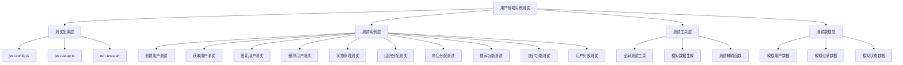
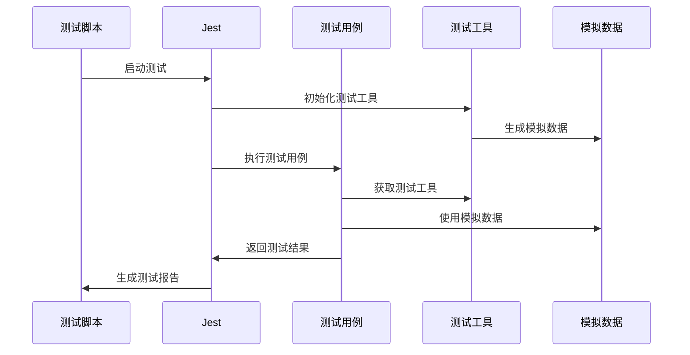

# 用户领域用例测试架构

## 🏗️ 测试架构概览



## 📁 目录结构

```
__tests__/
├── jest.config.js                    # Jest配置文件
├── jest.setup.ts                     # Jest设置文件
├── run-tests.sh                      # 测试运行脚本
├── README.md                         # 测试文档
├── TEST_SUMMARY.md                   # 测试总结报告
├── TEST_ARCHITECTURE.md              # 测试架构文档
│
├── create-user.use-case.spec.ts      # 创建用户测试
├── get-user.use-case.spec.ts         # 获取用户测试
├── get-users.use-case.spec.ts        # 获取用户列表测试
├── update-user.use-case.spec.ts      # 更新用户测试
├── delete-user.use-case.spec.ts      # 删除用户测试
├── update-user-status.use-case.spec.ts # 状态管理测试
├── assign-user-to-organization.use-case.spec.ts # 组织分配测试
├── assign-role-to-user.use-case.spec.ts # 角色分配测试
├── search-users.use-case.spec.ts     # 搜索功能测试
└── get-user-statistics.use-case.spec.ts # 统计功能测试
```

## 🧪 测试层次结构

### 1. 测试配置层 (Configuration Layer)
```typescript
// jest.config.js - Jest配置
module.exports = {
  displayName: 'User Use Cases Tests',
  testEnvironment: 'node',
  roots: ['<rootDir>'],
  testMatch: ['**/*.spec.ts'],
  // ... 其他配置
};

// jest.setup.ts - 测试设置
beforeAll(() => {
  process.env.NODE_ENV = 'test';
});

// 全局测试工具
global.testUtils = {
  createMockUser: (overrides = {}) => ({ ... }),
  createMockUserRepository: () => ({ ... }),
  createMockUserStatus: (status = 'ACTIVE') => ({ ... }),
};
```

### 2. 测试用例层 (Test Cases Layer)

#### 2.1 基础CRUD测试
```typescript
// create-user.use-case.spec.ts
describe('CreateUserUseCase', () => {
  describe('execute', () => {
    it('应该成功创建用户', async () => {
      // Arrange
      const mockUser = global.testUtils.createMockUser();
      userRepository.save.mockResolvedValue(mockUser);
      
      // Act
      const result = await useCase.execute(createUserData, tenantId, adminUserId);
      
      // Assert
      expect(result).toBe(mockUser);
    });
  });
});
```

#### 2.2 业务逻辑测试
```typescript
// update-user-status.use-case.spec.ts
describe('UpdateUserStatusUseCase', () => {
  describe('execute', () => {
    it('应该成功更新用户状态为激活', async () => {
      // Arrange
      const newStatus = new UserStatusValue(UserStatus.ACTIVE);
      const mockUser = global.testUtils.createMockUser();
      
      // Act
      const result = await useCase.execute(userId, newStatus, tenantId, adminUserId);
      
      // Assert
      expect(mockUser.activate).toHaveBeenCalled();
    });
  });
});
```

#### 2.3 权限验证测试
```typescript
// assign-user-to-organization.use-case.spec.ts
describe('AssignUserToOrganizationUseCase', () => {
  describe('execute', () => {
    it('当尝试修改自己的组织分配时应该抛出BadRequestException', async () => {
      // Arrange
      const mockUser = global.testUtils.createMockUser({ id: 'admin-1' });
      
      // Act & Assert
      await expect(useCase.execute(userId, organizationId, tenantId, adminUserId))
        .rejects.toThrow(BadRequestException);
    });
  });
});
```

### 3. 测试工具层 (Test Utilities Layer)

#### 3.1 全局测试工具
```typescript
// jest.setup.ts
global.testUtils = {
  // 创建模拟用户
  createMockUser: (overrides = {}) => ({
    id: 'user-1',
    username: 'testuser',
    email: 'test@example.com',
    status: {
      getValue: jest.fn().mockReturnValue('ACTIVE'),
      isActive: jest.fn().mockReturnValue(true),
      canDelete: jest.fn().mockReturnValue(true),
    },
    // ... 其他属性和方法
    ...overrides,
  }),

  // 创建模拟仓储
  createMockUserRepository: () => ({
    findById: jest.fn(),
    save: jest.fn(),
    delete: jest.fn(),
    // ... 其他方法
  }),

  // 创建模拟状态
  createMockUserStatus: (status = 'ACTIVE') => ({
    getValue: jest.fn().mockReturnValue(status),
    isActive: jest.fn().mockReturnValue(status === 'ACTIVE'),
    canDelete: jest.fn().mockReturnValue(['PENDING', 'ACTIVE'].includes(status)),
  }),
};
```

#### 3.2 测试辅助函数
```typescript
// 测试数据生成器
const createTestUserData = (overrides = {}) => ({
  username: 'testuser',
  email: 'test@example.com',
  firstName: 'Test',
  lastName: 'User',
  passwordHash: 'hashedPassword123',
  ...overrides,
});

// 测试验证器
const validateUserResponse = (user, expectedData) => {
  expect(user.id).toBe(expectedData.id);
  expect(user.username).toBe(expectedData.username);
  expect(user.email).toBe(expectedData.email);
};
```

### 4. 测试数据层 (Test Data Layer)

#### 4.1 模拟数据模式
```typescript
// 用户数据模式
interface MockUser {
  id: string;
  username: string;
  email: string;
  firstName: string;
  lastName: string;
  status: MockUserStatus;
  tenantId: string;
  adminUserId: string;
  // ... 其他属性
}

// 仓储数据模式
interface MockUserRepository {
  findById: jest.Mock;
  save: jest.Mock;
  delete: jest.Mock;
  // ... 其他方法
}

// 状态数据模式
interface MockUserStatus {
  getValue: jest.Mock;
  isActive: jest.Mock;
  canDelete: jest.Mock;
  isDeleted: jest.Mock;
}
```

## 🔄 测试执行流程



## 🎯 测试设计模式

### 1. AAA模式 (Arrange-Act-Assert)
```typescript
describe('测试用例', () => {
  it('应该执行特定行为', async () => {
    // Arrange - 准备测试数据
    const mockUser = global.testUtils.createMockUser();
    userRepository.findById.mockResolvedValue(mockUser);
    
    // Act - 执行被测试的方法
    const result = await useCase.execute(userId, tenantId);
    
    // Assert - 验证结果
    expect(result).toBe(mockUser);
    expect(userRepository.findById).toHaveBeenCalledWith(userId, tenantId);
  });
});
```

### 2. 依赖注入测试模式
```typescript
beforeEach(async () => {
  const module: TestingModule = await Test.createTestingModule({
    providers: [
      UseCaseClass,
      {
        provide: UserRepository,
        useValue: mockUserRepository,
      },
    ],
  }).compile();

  useCase = module.get<UseCaseClass>(UseCaseClass);
  userRepository = module.get(UserRepository);
});
```

### 3. 异常测试模式
```typescript
it('当条件不满足时应该抛出异常', async () => {
  // Arrange
  userRepository.findById.mockResolvedValue(null);
  
  // Act & Assert
  await expect(useCase.execute(userId, tenantId))
    .rejects.toThrow(NotFoundException);
  await expect(useCase.execute(userId, tenantId))
    .rejects.toThrow('用户不存在');
});
```

## 📊 测试质量指标

### 代码覆盖率
- **语句覆盖率**: 目标 80%
- **分支覆盖率**: 目标 80%
- **函数覆盖率**: 目标 80%
- **行覆盖率**: 目标 80%

### 测试类型分布
- **正常流程测试**: 60%
- **异常流程测试**: 25%
- **边界条件测试**: 15%

### 测试执行时间
- **单个测试**: < 100ms
- **测试套件**: < 5s
- **完整测试**: < 30s

## 🚀 最佳实践

### 1. 测试命名规范
```typescript
// 好的命名
it('应该成功创建用户', async () => { ... });
it('当用户不存在时应该抛出NotFoundException', async () => { ... });
it('应该正确处理空结果', async () => { ... });

// 避免的命名
it('test1', async () => { ... });
it('should work', async () => { ... });
```

### 2. 测试数据管理
```typescript
// 使用工厂函数创建测试数据
const createTestUser = (overrides = {}) => ({
  id: 'user-1',
  username: 'testuser',
  ...overrides,
});

// 在测试中使用
const mockUser = createTestUser({ id: 'custom-id' });
```

### 3. 模拟管理
```typescript
// 在每个测试后清理模拟
afterEach(() => {
  jest.clearAllMocks();
});

// 使用具体的模拟返回值
userRepository.findById.mockResolvedValue(mockUser);
userRepository.save.mockResolvedValue(savedUser);
```

## 📈 持续改进

### 1. 测试监控
- 测试执行时间监控
- 测试失败率监控
- 代码覆盖率趋势监控

### 2. 测试优化
- 并行测试执行
- 测试数据缓存
- 增量测试执行

### 3. 测试扩展
- 集成测试添加
- 性能测试添加
- 安全测试添加

这个测试架构为用户领域的用例提供了完整的测试覆盖，确保了代码质量和可维护性。 