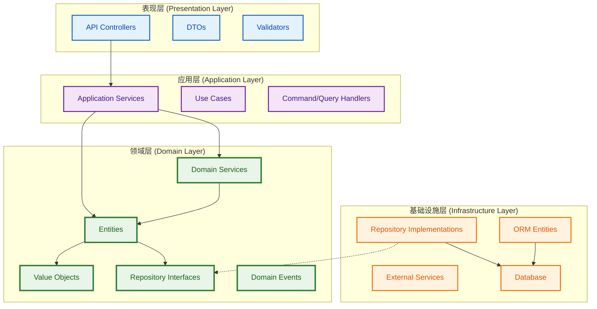
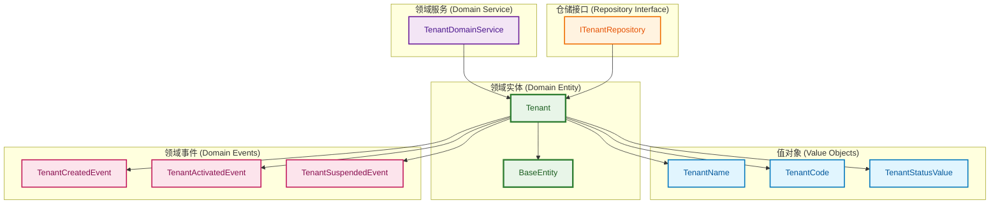
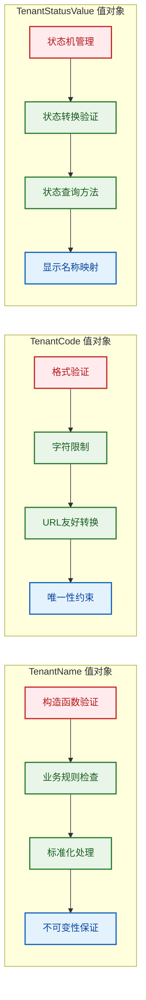
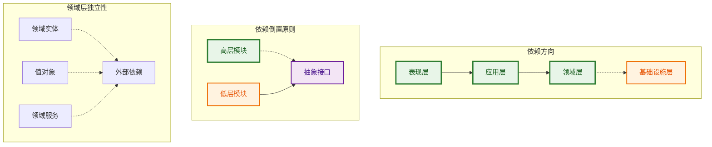

# 领域实体设计架构图

## 整体架构图

## 租户领域模型图

## 值对象设计模式图

## 分层依赖关系图

## 设计原则总结

### 1. 纯领域对象原则
- ✅ 领域实体不包含ORM装饰器
- ✅ 使用class-validator进行数据校验
- ✅ 使用class-transformer控制序列化
- ✅ 领域逻辑与基础设施分离

### 2. 值对象优先原则
- ✅ 封装业务概念（名称、编码、状态）
- ✅ 确保不可变性
- ✅ 包含业务规则验证
- ✅ 提供丰富的业务方法

### 3. 分层架构原则
- ✅ 清晰的依赖方向
- ✅ 依赖倒置原则
- ✅ 领域层独立性
- ✅ 单一职责原则

### 4. 代码质量要求
- ✅ TSDoc格式注释
- ✅ 中文业务描述
- ✅ 严格的类型安全
- ✅ 完善的错误处理 