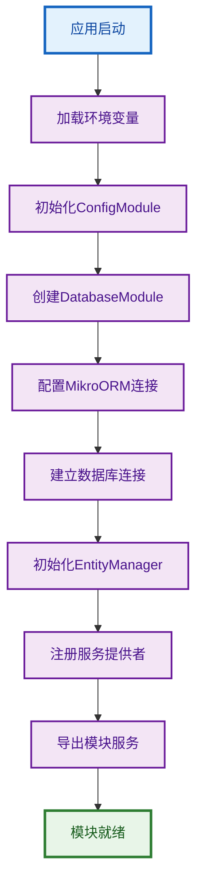
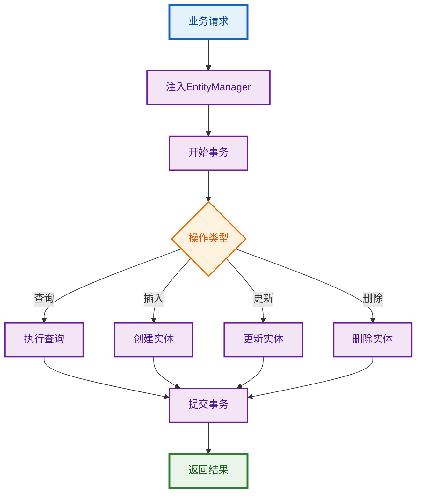
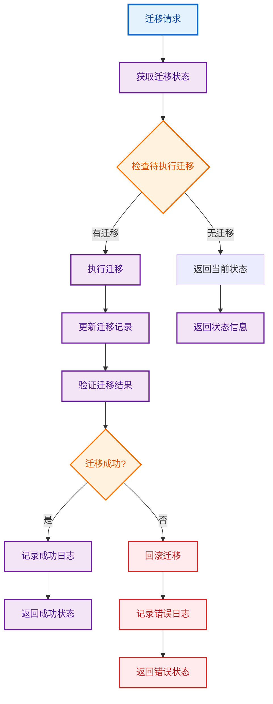
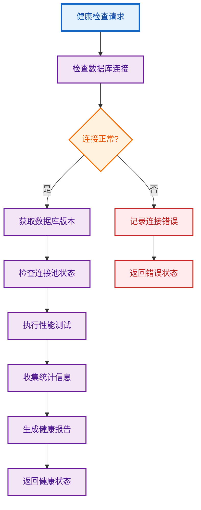
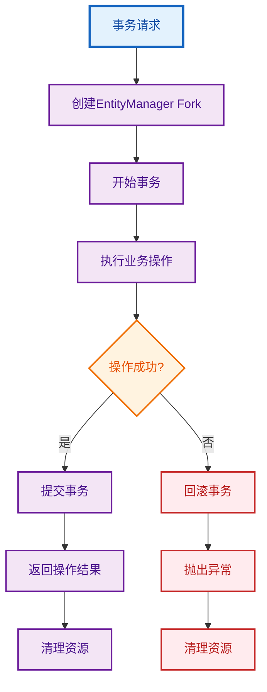
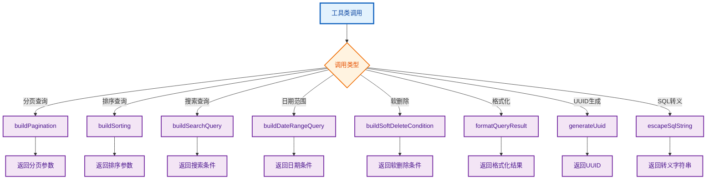
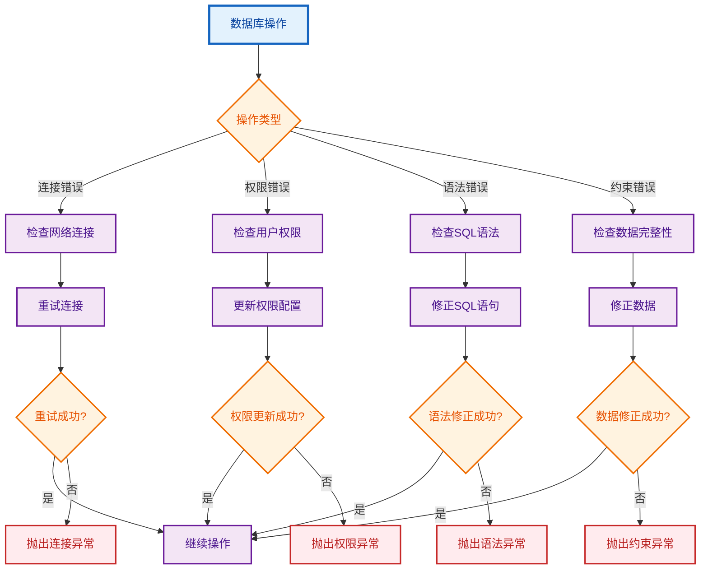
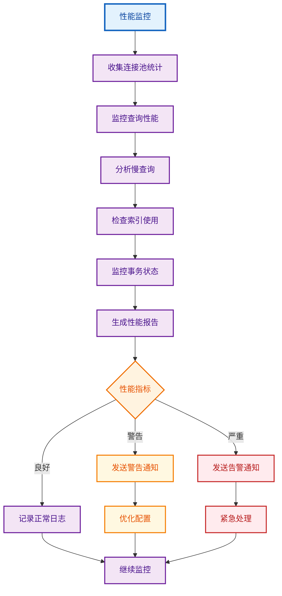

# 数据库基础设施模块流程图

## 模块初始化流程

```mermaid
graph TD
    A[应用启动] --> B[加载环境变量]
    B --> C[初始化ConfigModule]
    C --> D[创建DatabaseModule]
    D --> E[配置MikroORM连接]
    E --> F[建立数据库连接]
    F --> G[初始化EntityManager]
    G --> H[注册服务提供者]
    H --> I[导出模块服务]
    I --> J[模块就绪]
    
    classDef start fill:#e3f2fd,stroke:#1565c0,stroke-width:3px,color:#0d47a1
    classDef process fill:#f3e5f5,stroke:#6a1b9a,stroke-width:2px,color:#4a148c
    classDef success fill:#e8f5e8,stroke:#2e7d32,stroke-width:3px,color:#1b5e20
    classDef error fill:#ffebee,stroke:#c62828,stroke-width:2px,color:#b71c1c
    
    class A start
    class B,C,D,E,F,G,H,I process
    class J success
```

## 数据库操作流程

```mermaid
graph TD
    A[业务请求] --> B[注入EntityManager]
    B --> C[开始事务]
    C --> D{操作类型}
    D -->|查询| E[执行查询]
    D -->|插入| F[创建实体]
    D -->|更新| G[更新实体]
    D -->|删除| H[删除实体]
    E --> I[提交事务]
    F --> I
    G --> I
    H --> I
    I --> J[返回结果]
    
    classDef start fill:#e3f2fd,stroke:#1565c0,stroke-width:3px,color:#0d47a1
    classDef process fill:#f3e5f5,stroke:#6a1b9a,stroke-width:2px,color:#4a148c
    classDef success fill:#e8f5e8,stroke:#2e7d32,stroke-width:3px,color:#1b5e20
    classDef decision fill:#fff3e0,stroke:#ef6c00,stroke-width:2px,color:#e65100
    
    class A start
    class B,C,E,F,G,H,I process
    class J success
    class D decision
```

## 迁移管理流程

```mermaid
graph TD
    A[迁移请求] --> B[获取迁移状态]
    B --> C{检查待执行迁移}
    C -->|有迁移| D[执行迁移]
    C -->|无迁移| E[返回当前状态]
    D --> F[更新迁移记录]
    F --> G[验证迁移结果]
    G --> H{迁移成功?}
    H -->|是| I[记录成功日志]
    H -->|否| J[回滚迁移]
    I --> K[返回成功状态]
    J --> L[记录错误日志]
    L --> M[返回错误状态]
    E --> N[返回状态信息]
    
    classDef start fill:#e3f2fd,stroke:#1565c0,stroke-width:3px,color:#0d47a1
    classDef process fill:#f3e5f5,stroke:#6a1b9a,stroke-width:2px,color:#4a148c
    classDef success fill:#e8f5e8,stroke:#2e7d32,stroke-width:3px,color:#1b5e20
    classDef error fill:#ffebee,stroke:#c62828,stroke-width:2px,color:#b71c1c
    classDef decision fill:#fff3e0,stroke:#ef6c00,stroke-width:2px,color:#e65100
    
    class A start
    class B,D,F,G,I,K,N process
    class C,H decision
    class J,L,M error
```

## 健康检查流程

```mermaid
graph TD
    A[健康检查请求] --> B[检查数据库连接]
    B --> C{连接正常?}
    C -->|是| D[获取数据库版本]
    C -->|否| E[记录连接错误]
    D --> F[检查连接池状态]
    F --> G[执行性能测试]
    G --> H[收集统计信息]
    H --> I[生成健康报告]
    I --> J[返回健康状态]
    E --> K[返回错误状态]
    
    classDef start fill:#e3f2fd,stroke:#1565c0,stroke-width:3px,color:#0d47a1
    classDef process fill:#f3e5f5,stroke:#6a1b9a,stroke-width:2px,color:#4a148c
    classDef success fill:#e8f5e8,stroke:#2e7d32,stroke-width:3px,color:#1b5e20
    classDef error fill:#ffebee,stroke:#c62828,stroke-width:2px,color:#b71c1c
    classDef decision fill:#fff3e0,stroke:#ef6c00,stroke-width:2px,color:#e65100
    
    class A start
    class B,D,F,G,H,I,J process
    class C decision
    class E,K error
```

## 事务管理流程

```mermaid
graph TD
    A[事务请求] --> B[创建EntityManager Fork]
    B --> C[开始事务]
    C --> D[执行业务操作]
    D --> E{操作成功?}
    E -->|是| F[提交事务]
    E -->|否| G[回滚事务]
    F --> H[返回操作结果]
    G --> I[抛出异常]
    H --> J[清理资源]
    I --> K[清理资源]
    
    classDef start fill:#e3f2fd,stroke:#1565c0,stroke-width:3px,color:#0d47a1
    classDef process fill:#f3e5f5,stroke:#6a1b9a,stroke-width:2px,color:#4a148c
    classDef success fill:#e8f5e8,stroke:#2e7d32,stroke-width:3px,color:#1b5e20
    classDef error fill:#ffebee,stroke:#c62828,stroke-width:2px,color:#b71c1c
    classDef decision fill:#fff3e0,stroke:#ef6c00,stroke-width:2px,color:#e65100
    
    class A start
    class B,C,D,F,H,J process
    class E decision
    class G,I,K error
```

## 工具类使用流程

```mermaid
graph TD
    A[工具类调用] --> B{调用类型}
    B -->|分页查询| C[buildPagination]
    B -->|排序查询| D[buildSorting]
    B -->|搜索查询| E[buildSearchQuery]
    B -->|日期范围| F[buildDateRangeQuery]
    B -->|软删除| G[buildSoftDeleteCondition]
    B -->|格式化| H[formatQueryResult]
    B -->|UUID生成| I[generateUuid]
    B -->|SQL转义| J[escapeSqlString]
    C --> K[返回分页参数]
    D --> L[返回排序参数]
    E --> M[返回搜索条件]
    F --> N[返回日期条件]
    G --> O[返回软删除条件]
    H --> P[返回格式化结果]
    I --> Q[返回UUID]
    J --> R[返回转义字符串]
    
    classDef start fill:#e3f2fd,stroke:#1565c0,stroke-width:3px,color:#0d47a1
    classDef process fill:#f3e5f5,stroke:#6a1b9a,stroke-width:2px,color:#4a148c
    classDef success fill:#e8f5e8,stroke:#2e7d32,stroke-width:3px,color:#1b5e20
    classDef decision fill:#fff3e0,stroke:#ef6c00,stroke-width:2px,color:#e65100
    
    class A start
    class B decision
    class C,D,E,F,G,H,I,J,K,L,M,N,O,P,Q,R process
```

## 错误处理流程

```mermaid
graph TD
    A[数据库操作] --> B{操作类型}
    B -->|连接错误| C[检查网络连接]
    B -->|权限错误| D[检查用户权限]
    B -->|语法错误| E[检查SQL语法]
    B -->|约束错误| F[检查数据完整性]
    C --> G[重试连接]
    D --> H[更新权限配置]
    E --> I[修正SQL语句]
    F --> J[修正数据]
    G --> K{重试成功?}
    H --> L{权限更新成功?}
    I --> M{语法修正成功?}
    J --> N{数据修正成功?}
    K -->|是| O[继续操作]
    K -->|否| P[抛出连接异常]
    L -->|是| O
    L -->|否| Q[抛出权限异常]
    M -->|是| O
    M -->|否| R[抛出语法异常]
    N -->|是| O
    N -->|否| S[抛出约束异常]
    
    classDef start fill:#e3f2fd,stroke:#1565c0,stroke-width:3px,color:#0d47a1
    classDef process fill:#f3e5f5,stroke:#6a1b9a,stroke-width:2px,color:#4a148c
    classDef success fill:#e8f5e8,stroke:#2e7d32,stroke-width:3px,color:#1b5e20
    classDef error fill:#ffebee,stroke:#c62828,stroke-width:2px,color:#b71c1c
    classDef decision fill:#fff3e0,stroke:#ef6c00,stroke-width:2px,color:#e65100
    
    class A start
    class B decision
    class C,D,E,F,G,H,I,J,O process
    class K,L,M,N decision
    class P,Q,R,S error
```

## 性能监控流程

```mermaid
graph TD
    A[性能监控] --> B[收集连接池统计]
    B --> C[监控查询性能]
    C --> D[分析慢查询]
    D --> E[检查索引使用]
    E --> F[监控事务状态]
    F --> G[生成性能报告]
    G --> H{性能指标}
    H -->|良好| I[记录正常日志]
    H -->|警告| J[发送警告通知]
    H -->|严重| K[发送告警通知]
    I --> L[继续监控]
    J --> M[优化配置]
    K --> N[紧急处理]
    M --> L
    N --> L
    
    classDef start fill:#e3f2fd,stroke:#1565c0,stroke-width:3px,color:#0d47a1
    classDef process fill:#f3e5f5,stroke:#6a1b9a,stroke-width:2px,color:#4a148c
    classDef success fill:#e8f5e8,stroke:#2e7d32,stroke-width:3px,color:#1b5e20
    classDef warning fill:#fff8e1,stroke:#f57c00,stroke-width:2px,color:#e65100
    classDef error fill:#ffebee,stroke:#c62828,stroke-width:2px,color:#b71c1c
    classDef decision fill:#fff3e0,stroke:#ef6c00,stroke-width:2px,color:#e65100
    
    class A start
    class B,C,D,E,F,G,I,L process
    class H decision
    class J,M warning
    class K,N error
``` 