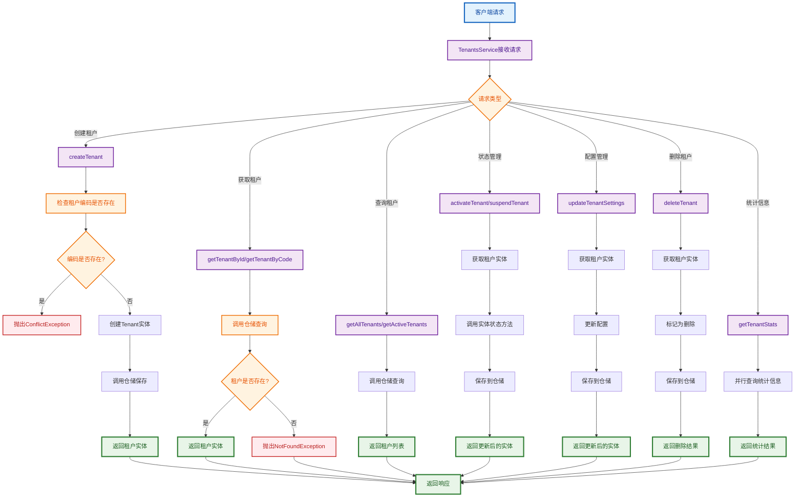

# 租户应用服务流程图

## 概述

租户应用服务（TenantsService）是应用层的核心组件，负责协调领域对象完成业务用例，连接表现层和领域层。

## 主要业务流程

## 设计原则

1. **单一职责** - 每个方法只负责一个业务用例
2. **依赖倒置** - 依赖抽象接口而非具体实现
3. **异常处理** - 统一的异常处理和错误响应
4. **事务边界** - 应用服务作为事务边界
5. **业务协调** - 协调领域对象完成业务用例 