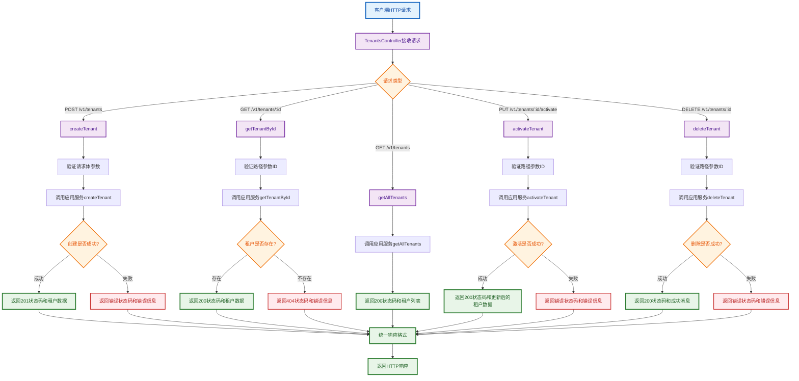
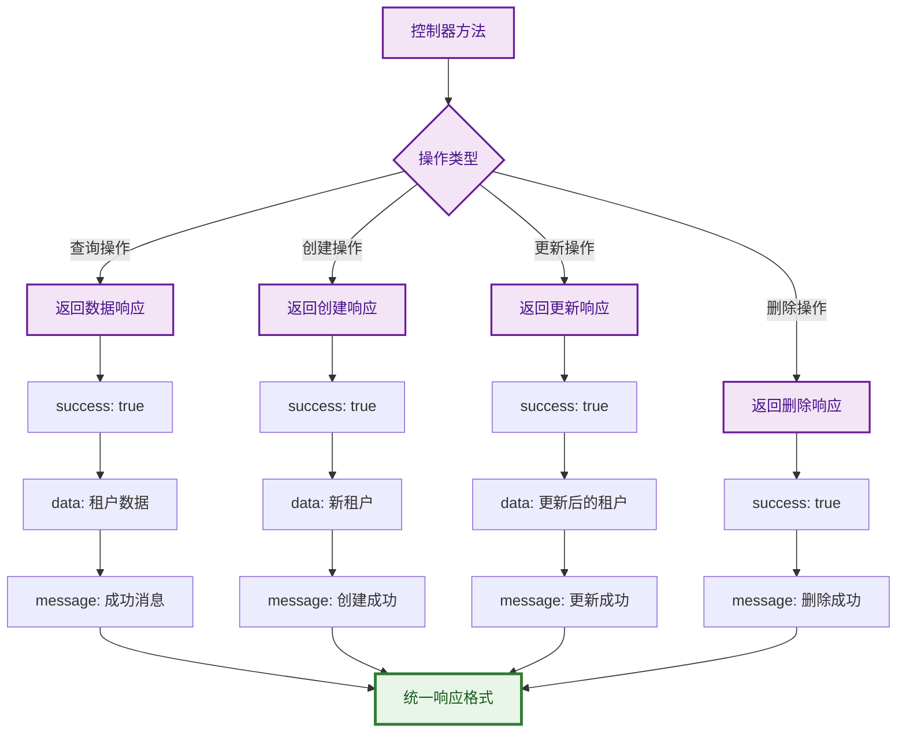
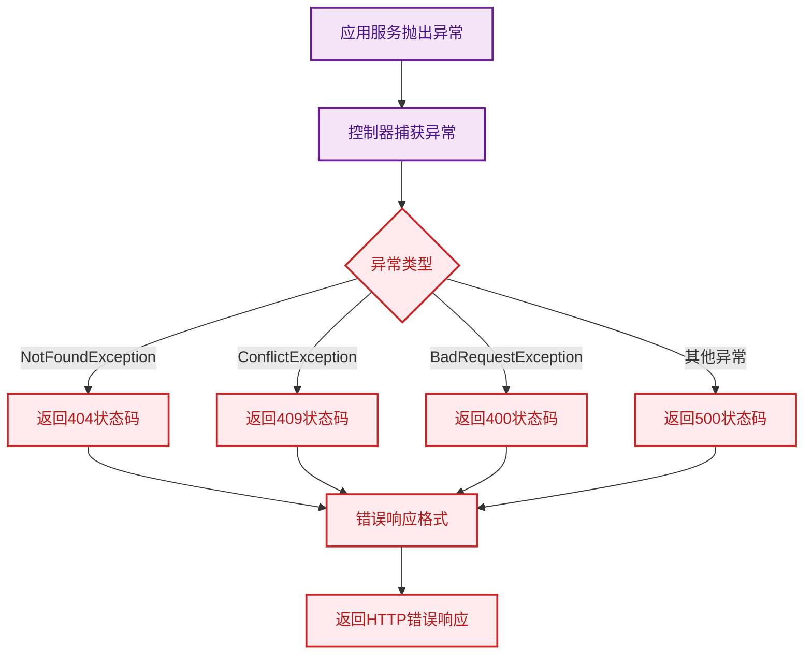

# 租户控制器流程图

## 概述

租户控制器（TenantsController）是表现层的核心组件，负责处理HTTP请求和响应，连接客户端和应用服务。

## HTTP接口流程

## 响应格式

## 异常处理流程

## API接口列表

| HTTP方法 | 路径 | 描述 | 状态码 |
|---------|------|------|--------|
| POST | `/v1/tenants` | 创建新租户 | 201/400/409 |
| GET | `/v1/tenants/:id` | 根据ID获取租户 | 200/404 |
| GET | `/v1/tenants` | 获取所有租户 | 200 |
| PUT | `/v1/tenants/:id/activate` | 激活租户 | 200/404/400 |
| DELETE | `/v1/tenants/:id` | 删除租户 | 200/404/400 |

## 设计原则

1. **RESTful设计** - 遵循REST API设计原则
2. **统一响应格式** - 所有响应使用统一的数据结构
3. **异常处理** - 统一的异常处理和错误响应
4. **参数验证** - 使用NestJS的验证管道
5. **文档生成** - 集成Swagger文档生成 