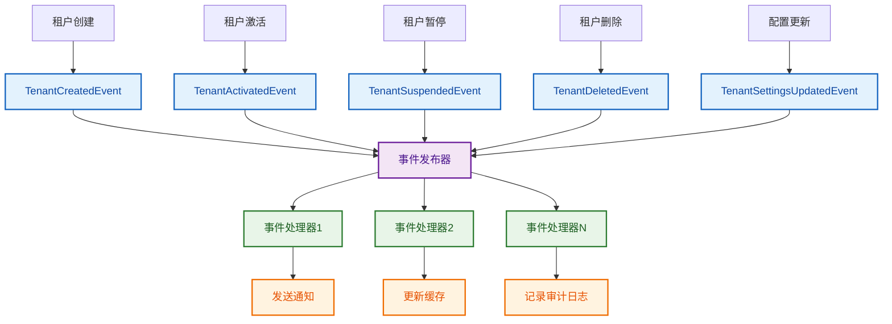
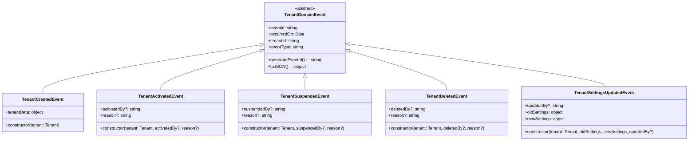

# 租户领域事件流程图

## 领域事件概述

租户子领域实现了完整的领域事件系统，用于在领域对象之间进行松耦合的通信。领域事件在重要的业务操作发生时自动触发。

## 领域事件流程图



## 领域事件类型详细流程

### 1. 租户创建事件流程

```mermaid
graph TD
    A[new Tenant()] --> B[构造函数执行]
    B --> C[设置基本属性]
    C --> D[创建TenantCreatedEvent]
    D --> E[添加到领域事件集合]
    E --> F[事件包含租户数据快照]
    
    F --> G[事件发布]
    G --> H[通知订阅者]
    H --> I[发送欢迎邮件]
    H --> J[初始化默认配置]
    H --> K[记录创建日志]
    
    classDef start fill:#e3f2fd,stroke:#1565c0,stroke-width:3px,color:#0d47a1
    classDef event fill:#f3e5f5,stroke:#6a1b9a,stroke-width:2px,color:#4a148c
    classDef action fill:#e8f5e8,stroke:#2e7d32,stroke-width:2px,color:#1b5e20
    
    class A start
    class D,F event
    class I,J,K action
```

### 2. 租户状态变更事件流程

```mermaid
graph TD
    A[租户状态变更] --> B{状态类型}
    B -->|激活| C[tenant.activate()]
    B -->|暂停| D[tenant.suspend()]
    B -->|删除| E[tenant.markAsDeleted()]
    
    C --> F[验证状态转换规则]
    D --> F
    E --> F
    
    F --> G{转换是否有效?}
    G -->|是| H[更新状态]
    G -->|否| I[抛出异常]
    
    H --> J[创建对应事件]
    J --> K[添加到领域事件集合]
    K --> L[事件发布]
    
    L --> M[通知管理员]
    L --> N[更新租户状态缓存]
    L --> O[记录状态变更日志]
    
    classDef decision fill:#fff3e0,stroke:#ef6c00,stroke-width:2px,color:#e65100
    classDef event fill:#f3e5f5,stroke:#6a1b9a,stroke-width:2px,color:#4a148c
    classDef action fill:#e8f5e8,stroke:#2e7d32,stroke-width:2px,color:#1b5e20
    classDef error fill:#ffebee,stroke:#c62828,stroke-width:2px,color:#b71c1c
    
    class B,G decision
    class J,K event
    class M,N,O action
    class I error
```

## 领域事件处理机制

### 事件基类结构



## 事件驱动架构优势

1. **松耦合**: 领域对象之间通过事件通信，降低直接依赖
2. **可扩展性**: 新功能可以通过订阅事件来实现，无需修改现有代码
3. **可测试性**: 事件可以独立测试，提高测试覆盖率
4. **审计追踪**: 所有重要操作都有对应的事件记录
5. **异步处理**: 事件可以异步处理，提高系统性能 