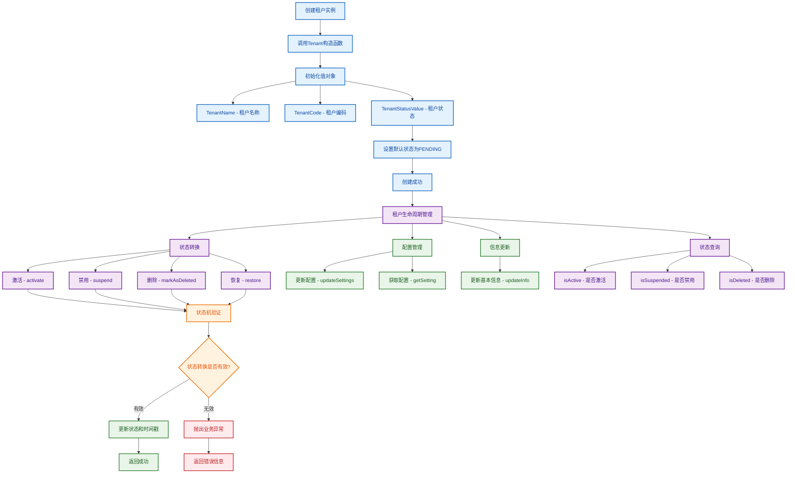
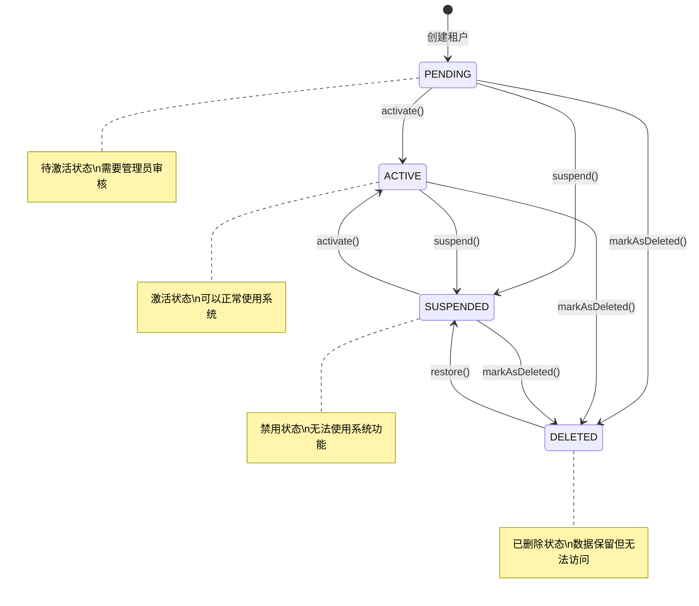

# 租户实体工作流程图

## 概述
租户实体（Tenant Entity）是DDD中的核心实体，代表系统中的租户。它继承自BaseEntity，使用值对象封装业务概念，实现租户的生命周期管理和业务逻辑。

## 工作流程图



## 状态机流程图



## 实体结构详解

### 1. 继承关系
```typescript
Tenant extends BaseEntity {
  // 继承的通用属性
  id: string;           // 唯一标识符
  createdAt: Date;      // 创建时间
  updatedAt: Date;      // 更新时间
  deletedAt?: Date;     // 软删除时间
}
```

### 2. 值对象封装
```typescript
// 使用值对象封装业务概念
name: TenantName;           // 租户名称
code: TenantCode;           // 租户编码
status: TenantStatusValue;  // 租户状态
```

### 3. 业务属性
```typescript
adminUserId: string;                    // 管理员用户ID
description?: string;                   // 租户描述
settings: Record<string, any>;         // 自定义配置
```

## 核心业务方法

### 1. 状态管理
```typescript
// 激活租户
activate(): void {
  if (!this.status.canActivate()) {
    throw new Error(`租户当前状态为${this.status.getDisplayName()}，无法激活`);
  }
  this.status = new TenantStatusValue(TenantStatus.ACTIVE);
  this.updateTimestamp();
}

// 禁用租户
suspend(): void {
  if (!this.status.canSuspend()) {
    throw new Error(`租户当前状态为${this.status.getDisplayName()}，无法禁用`);
  }
  this.status = new TenantStatusValue(TenantStatus.SUSPENDED);
  this.updateTimestamp();
}
```

### 2. 配置管理
```typescript
// 更新配置
updateSettings(settings: Record<string, any>): void {
  this.settings = { ...this.settings, ...settings };
  this.updateTimestamp();
}

// 获取配置（支持嵌套路径）
getSetting<T>(key: string, defaultValue?: T): T | undefined {
  const keys = key.split('.');
  let value: any = this.settings;
  
  for (const k of keys) {
    if (value && typeof value === 'object' && k in value) {
      value = value[k];
    } else {
      return defaultValue;
    }
  }
  
  return value !== undefined ? value : defaultValue;
}
```

### 3. 信息更新
```typescript
// 更新基本信息
updateInfo(name: string, code: string, description?: string): void {
  this.name = new TenantName(name);
  this.code = new TenantCode(code);
  this.description = description;
  this.updateTimestamp();
}
```

## 使用示例

```typescript
// 创建租户
const tenant = new Tenant(
  'tenant-id',
  '测试租户',
  'test-tenant',
  'admin-user-id',
  '这是一个测试租户',
  { theme: 'dark', language: 'zh-CN' }
);

// 激活租户
tenant.activate();
console.log(tenant.isActive()); // true

// 更新配置
tenant.updateSettings({ 
  theme: 'light',
  notifications: { email: true, sms: false }
});

// 获取配置
const theme = tenant.getSetting('theme', 'default'); // 'light'
const emailNotifications = tenant.getSetting('notifications.email', false); // true

// 更新信息
tenant.updateInfo('新租户名称', 'new-tenant-code', '新的描述');

// 软删除
tenant.markAsDeleted();
console.log(tenant.isDeleted()); // true
```

## 设计原则

### 1. DDD原则
- ✅ **实体唯一性**: 通过ID确保实体的唯一性
- ✅ **业务规则封装**: 在实体内部封装业务逻辑
- ✅ **值对象使用**: 使用值对象封装业务概念
- ✅ **生命周期管理**: 管理实体的完整生命周期

### 2. Clean Architecture原则
- ✅ **依赖倒置**: 依赖抽象而非具体实现
- ✅ **单一职责**: 实体只负责租户相关的业务逻辑
- ✅ **开闭原则**: 易于扩展，无需修改现有代码

### 3. 状态机模式
- ✅ **状态转换验证**: 确保状态转换的合法性
- ✅ **状态查询方法**: 提供便捷的状态查询
- ✅ **业务规则封装**: 在状态值对象中封装状态逻辑

### 4. 配置管理
- ✅ **灵活配置**: 支持任意结构的配置
- ✅ **嵌套路径**: 支持点号分隔的嵌套路径
- ✅ **默认值**: 提供默认值机制
- ✅ **类型安全**: 支持泛型类型推断 