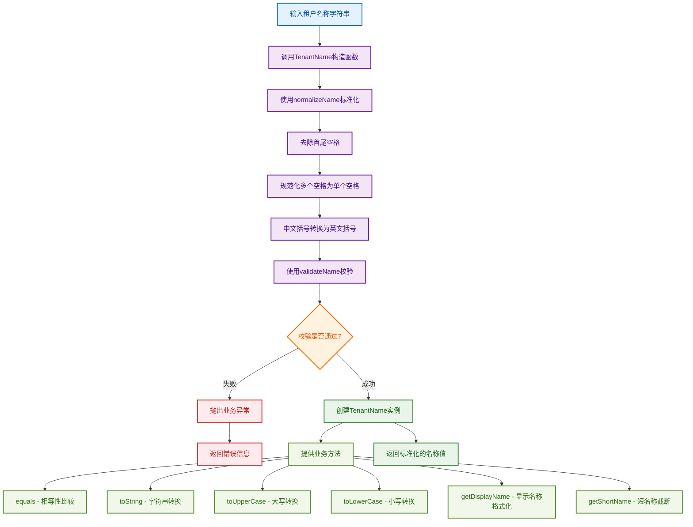

# 租户名称值对象工作流程图

## 概述
租户名称值对象（TenantName）是DDD中的值对象，负责封装租户名称的业务规则和约束。它支持多语言字符（中文、英文、数字等），并提供名称的标准化处理和格式化功能。

## 工作流程图



## 标准化流程详解

### 1. 输入处理
- 接收任意字符串作为租户名称输入
- 支持中文、英文、数字、空格、连字符、下划线、括号等字符

### 2. 标准化步骤
1. **去除首尾空格**：使用`trim()`方法
2. **规范化空格**：将多个连续空格替换为单个空格
3. **括号转换**：将中文括号`（）`转换为英文括号`()`

### 3. 校验规则
- **非空校验**：名称不能为空或只包含空格
- **长度校验**：2-100个字符
- **字符集校验**：只允许中文、英文、数字、空格、连字符、下划线、括号
- **格式校验**：不能以空格开头或结尾，不能只包含空格

### 4. 业务方法
- **equals()**：值对象相等性比较
- **toString()**：字符串表示
- **toUpperCase()**：转换为大写
- **toLowerCase()**：转换为小写
- **getDisplayName()**：获取格式化的显示名称（首字母大写）
- **getShortName()**：获取短名称（超过20字符时截断）

## 使用示例

```typescript
// 正常创建
const tenantName1 = new TenantName('测试租户');
console.log(tenantName1.value); // '测试租户'

// 自动标准化
const tenantName2 = new TenantName('  测试  租户  ');
console.log(tenantName2.value); // '测试 租户'

// 中文括号转换
const tenantName3 = new TenantName('测试租户（测试）');
console.log(tenantName3.value); // '测试租户(测试)'

// 显示名称格式化
const tenantName4 = new TenantName('test tenant');
console.log(tenantName4.getDisplayName()); // 'Test Tenant'

// 短名称截断
const tenantName5 = new TenantName('这是一个很长的租户名称用于测试截断功能');
console.log(tenantName5.getShortName()); // '这是一个很长的租户名称用于测试截断功能...'

// 相等性比较
const tenantName6 = new TenantName('测试租户');
const tenantName7 = new TenantName('  测试租户  ');
console.log(tenantName6.equals(tenantName7)); // true
```

## 设计原则

1. **不可变性**：值对象一旦创建就不能修改
2. **自验证**：构造函数确保数据有效性
3. **标准化**：统一处理各种输入格式
4. **多语言支持**：支持中文、英文等多种字符
5. **业务封装**：封装租户名称的业务规则
6. **可测试性**：提供完整的单元测试覆盖
7. **用户体验**：提供友好的显示和截断功能 