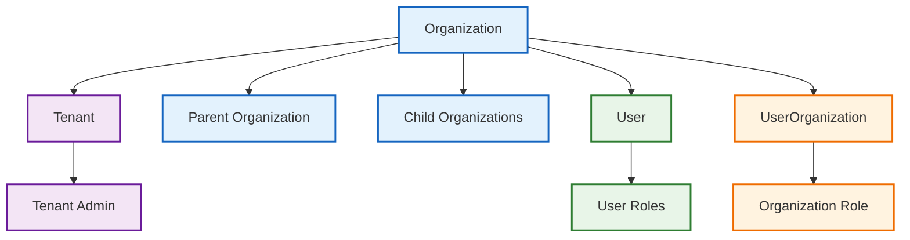
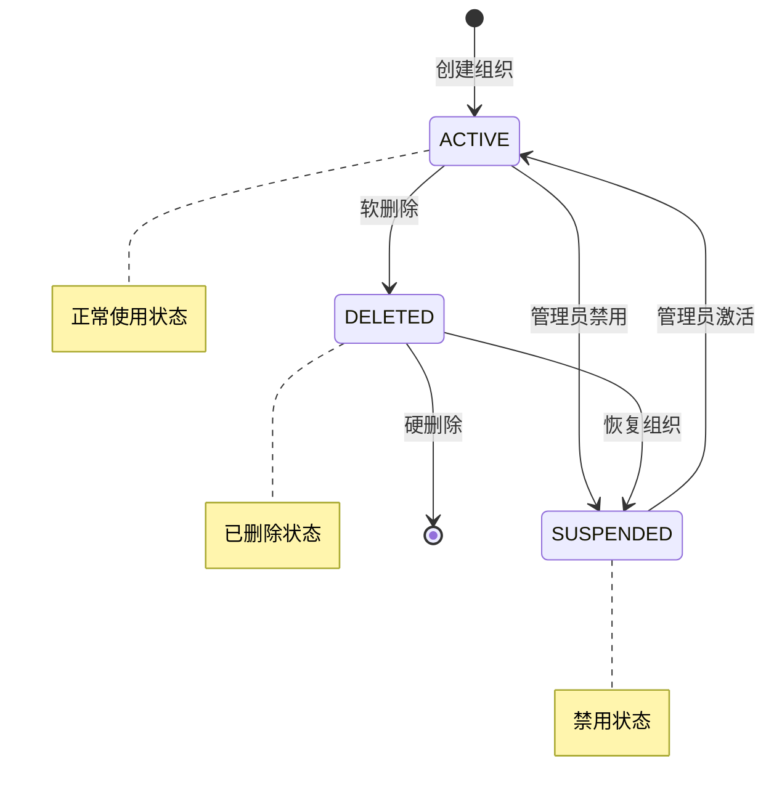
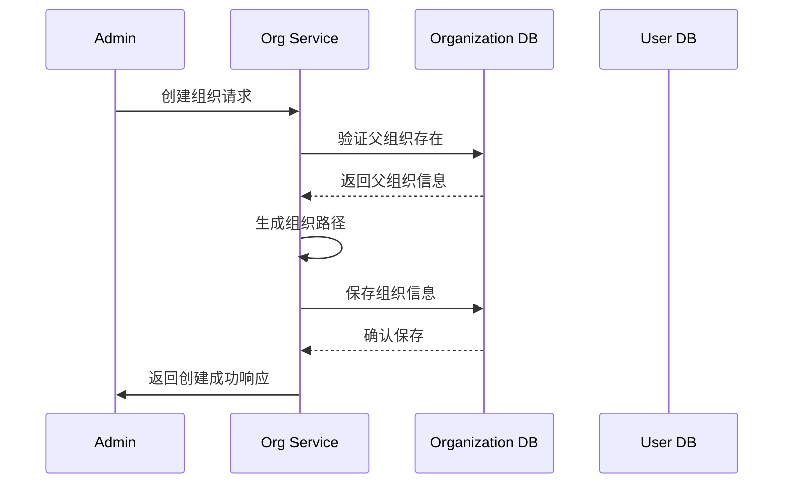
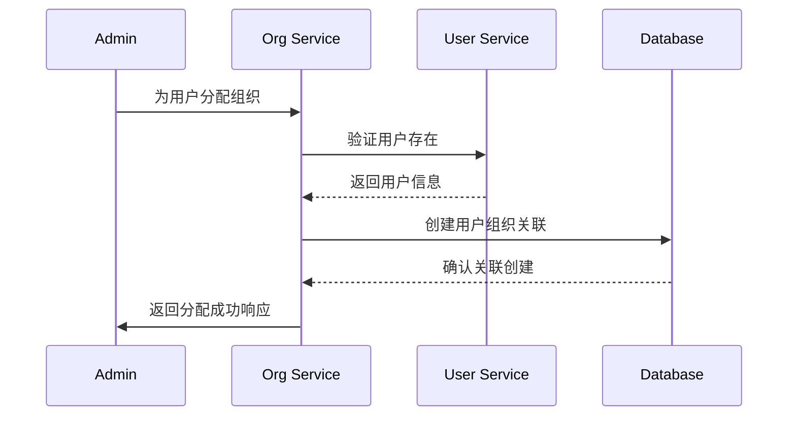
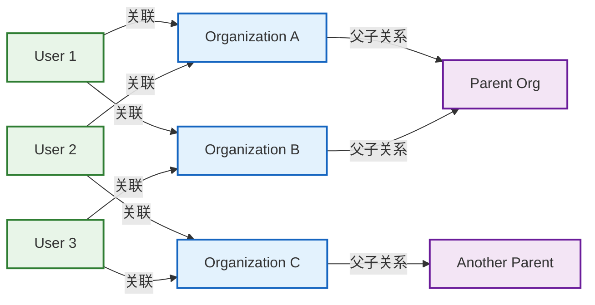

# 组织管理子领域的详细设计

本节详细说明IAM系统中"组织管理"子领域的核心设计，包括领域实体、聚合、用例流程、接口规范及审计要求等，确保多租户架构下的组织管理安全性、可扩展性与合规性。

---

## 一、组织领域实体设计

### 1.1 组织（Organization）领域实体

> 设计要求：组织实体为纯领域对象，不包含任何ORM装饰器或数据库依赖。序列化安全性通过`class-transformer`控制，数据校验通过`class-validator`实现。

- **属性定义**：
  - `id`：组织唯一标识（UUID）
  - `name`：组织名称值对象（必填，在租户内唯一）
  - `code`：组织编码值对象（必填，在租户内唯一，用于系统标识）
  - `description`：组织描述（可选）
  - `type`：组织类型值对象（部门、子公司、项目组、团队等）
  - `status`：组织状态值对象（激活、禁用、已删除等）
  - `tenantId`：所属租户ID（必填，实现数据隔离）
  - `parentId`：父组织ID（可选，支持树状结构）
  - `path`：组织路径（如：/总公司/技术部/前端组，用于快速查询层级）
  - `level`：组织层级（从0开始，顶级组织为0）
  - `sortOrder`：排序字段（同级组织间的显示顺序）
  - `adminUserId`：组织管理员ID（可选，负责该组织的管理）
  - `contactInfo`：联系信息（JSON，包含地址、电话、邮箱等）
  - `settings`：组织设置（JSON，扩展字段）
  - `createdAt`：创建时间
  - `updatedAt`：更新时间
  - `deletedAt`：软删除时间（可选）
  - `_domainEvents`：领域事件集合（私有）

- **领域规则**：
  - 组织名称和编码在租户内唯一，全局唯一性通过租户ID+名称/编码组合实现。
  - 组织必须归属于某个租户，实现数据软隔离。
  - 组织支持树状结构，每个组织只能有一个父组织（顶级组织除外）。
  - 组织路径自动生成和维护，便于层级查询和权限继承。
  - 组织删除采用软删除策略，保留数据以便审计。
  - 组织状态变更需记录审计日志。
  - 继承BaseEntity获得通用属性和方法。
  - 使用值对象封装业务概念（名称、编码、类型、状态）。
  - 使用class-validator进行数据校验，确保业务规则的正确性。
  - 使用class-transformer控制序列化安全性。
  - 实现组织特有的业务逻辑和状态管理。
  - 通过值对象确保业务规则的一致性和不可变性。
  - **以租户ID为标识，实现数据软隔离。所有与组织相关的业务数据（如用户关联、权限等）均需通过租户ID进行关联和隔离，确保不同租户间数据互不干扰。**

### 1.2 组织聚合根

- 组织（Organization）为聚合根，聚合内可包含组织下的用户关联、权限等子实体的引用，但不直接持有其数据，仅通过ID或外键关联。
- **所有聚合内的子实体（如用户关联、权限等）均需包含租户ID字段，作为软隔离的关键标识。应用层和基础设施层在查询、操作数据时，必须基于当前租户ID进行过滤，防止数据越权访问。**

### 1.3 组织值对象

#### 1.3.1 组织名称（OrganizationName）
- 长度限制：2-100个字符
- 字符限制：支持中文、英文、数字、空格、连字符、下划线
- 唯一性：在租户内唯一
- 验证规则：不能为空，不能包含特殊字符

#### 1.3.2 组织编码（OrganizationCode）
- 长度限制：3-20个字符
- 字符限制：仅允许大写字母、数字、下划线
- 唯一性：在租户内唯一
- 验证规则：不能以数字开头，建议使用有意义的缩写

#### 1.3.3 组织类型（OrganizationType）
- 枚举值：DEPARTMENT（部门）、SUBSIDIARY（子公司）、PROJECT（项目组）、TEAM（团队）、DIVISION（事业部）、BRANCH（分支机构）
- 类型影响：不同组织类型可能有不同的管理策略和权限模型

#### 1.3.4 组织状态（OrganizationStatus）
- 枚举值：ACTIVE（激活）、SUSPENDED（禁用）、DELETED（已删除）
- 状态转换规则：定义各状态间的合法转换
- 业务影响：不同状态对组织内用户权限等的影响

### 1.5 组织领域事件

#### 1.5.1 组织生命周期事件
- `OrganizationCreatedEvent`：组织创建事件
- `OrganizationActivatedEvent`：组织激活事件
- `OrganizationSuspendedEvent`：组织禁用事件
- `OrganizationDeletedEvent`：组织删除事件
- `OrganizationRestoredEvent`：组织恢复事件

#### 1.5.2 组织信息变更事件
- `OrganizationInfoUpdatedEvent`：组织信息更新事件
- `OrganizationSettingsUpdatedEvent`：组织设置更新事件
- `OrganizationHierarchyChangedEvent`：组织层级变更事件

#### 1.5.3 用户组织关联事件
- `UserAssignedToOrganizationEvent`：用户分配到组织事件
- `UserRemovedFromOrganizationEvent`：用户从组织移除事件
- `UserOrganizationRoleChangedEvent`：用户组织角色变更事件
- `UserPrimaryOrganizationChangedEvent`：用户主要组织变更事件

### 1.6 用户组织关联（UserOrganization）实体

> 设计要求：用户组织关联实体为纯领域对象，用于实现用户与组织的多对多关系。

- **属性定义**：
  - `id`：关联唯一标识（UUID）
  - `userId`：用户ID（必填）
  - `organizationId`：组织ID（必填）
  - `tenantId`：所属租户ID（必填，实现数据隔离）
  - `role`：在组织中的角色值对象（如：成员、主管、管理员等）
  - `isPrimary`：是否为主要组织（布尔值，用户可能有多个组织，但通常有一个主要组织）
  - `joinDate`：加入组织时间
  - `leaveDate`：离开组织时间（可选）
  - `status`：关联状态值对象（ACTIVE、INACTIVE、PENDING等）
  - `createdAt`：创建时间
  - `updatedAt`：更新时间
  - `_domainEvents`：领域事件集合（私有）

- **领域规则**：
  - 用户与组织为多对多关系，一个用户可以关联多个组织，一个组织可以关联多个用户。
  - 用户在每个组织中只能有一个关联记录。
  - 用户的主要组织用于默认权限和界面显示。
  - 关联状态变更需记录审计日志。
  - 继承BaseEntity获得通用属性和方法。
  - 使用值对象封装业务概念（角色、状态）。
  - 使用class-validator进行数据校验，确保业务规则的正确性。
  - 使用class-transformer控制序列化安全性。
  - 实现用户组织关联特有的业务逻辑和状态管理。
  - 通过值对象确保业务规则的一致性和不可变性。
  - **所有用户组织关联数据均需包含租户ID字段，确保数据隔离。**

### 1.7 组织聚合根设计

#### 1.7.1 组织聚合根
- 组织（Organization）为聚合根，管理组织相关的所有业务规则。
- 聚合内包含组织的基本信息、层级关系、设置等。
- 组织聚合根负责维护组织的一致性和完整性。
- 组织聚合根发布领域事件，支持事件驱动架构。

#### 1.7.2 用户组织关联聚合根
- 用户组织关联（UserOrganization）为独立的聚合根。
- 管理用户与组织之间的关联关系。
- 维护关联状态、角色、主要组织标识等。
- 用户组织关联聚合根发布关联变更事件。

#### 1.7.3 聚合边界
- 组织聚合与用户组织关联聚合通过ID引用进行关联。
- 组织聚合不直接持有用户组织关联的数据。
- 用户组织关联聚合通过组织ID和用户ID引用相关实体。
- 聚合间通过领域事件进行通信。

---

## 二、核心用例流程

### 2.1 组织创建

1. 租户管理员提交组织创建申请（填写组织名称、编码、类型、描述等基本信息）。
2. 系统校验组织名称、编码在租户内的唯一性。
3. 验证父组织存在且属于同一租户。
4. 创建组织实体，状态为"激活"。
5. 自动生成组织路径和层级信息。
6. 如果指定了组织管理员，验证管理员权限。
7. 发布`OrganizationCreatedEvent`领域事件。
8. 记录审计日志。
9. **所有与新组织相关的业务数据，均需绑定租户ID，实现数据软隔离。**

### 2.2 组织信息修改

- 仅租户管理员或组织管理员可修改组织信息。
- 修改组织名称、编码需重新验证唯一性。
- 修改父组织需验证不会形成循环引用。
- 发布`OrganizationInfoUpdatedEvent`领域事件。
- 修改操作需记录审计日志。
- **修改操作仅限于当前租户ID下的数据，防止跨租户操作。**

### 2.3 组织激活/禁用

- 支持组织的激活、禁用操作，禁用后组织内用户权限受限。
- 激活时发布`OrganizationActivatedEvent`领域事件。
- 禁用时发布`OrganizationSuspendedEvent`领域事件。
- 状态变更需记录审计日志。
- 禁用组织时，可选择是否同时禁用其子组织。
- **激活/禁用操作需基于租户ID进行，确保只影响目标租户及其下属数据。**

### 2.4 组织软删除与恢复

- 删除操作为软删除，标记`deletedAt`时间。
- 删除前需校验是否有用户或子组织仍关联，防止误删。
- 删除时发布`OrganizationDeletedEvent`领域事件。
- 支持组织恢复，恢复后状态为"禁用"。
- 恢复时发布`OrganizationRestoredEvent`领域事件。
- 删除与恢复均需记录审计日志。
- **软删除与恢复操作需基于租户ID进行，且相关业务数据（如用户关联等）也应同步标记或处理，确保数据隔离一致性。**

### 2.5 组织层级管理

- 支持组织的层级调整，包括移动、合并、拆分等操作。
- 层级调整需验证不会形成循环引用。
- 调整后自动更新组织路径和层级信息。
- 发布`OrganizationHierarchyChangedEvent`领域事件。
- 层级变更需记录审计日志。
- **层级调整操作需基于租户ID进行，确保只影响目标租户的组织结构。**

### 2.6 用户组织关联管理

- 支持为用户分配、移除组织关联。
- 分配用户到组织时发布`UserAssignedToOrganizationEvent`领域事件。
- 从组织移除用户时发布`UserRemovedFromOrganizationEvent`领域事件。
- 支持设置用户的主要组织。
- 主要组织变更时发布`UserPrimaryOrganizationChangedEvent`领域事件。
- 支持批量用户组织操作。
- 关联变更实时生效。
- 关联操作需记录审计日志。
- **用户组织关联操作需基于租户ID进行，确保只影响目标租户的数据。**

### 2.7 组织权限继承

- 支持组织级权限继承机制，子组织可自动继承父组织的部分权限。
- 权限继承策略可配置（如：全部继承、部分继承、不继承）。
- 权限继承变更实时生效。
- 权限继承配置变更时发布`OrganizationSettingsUpdatedEvent`领域事件。
- 权限继承配置需记录审计日志。

---

## 三、接口与API设计（RESTful）

### 3.1 组织管理接口

- `POST /api/organizations`：创建组织
- `GET /api/organizations/{id}`：查询组织详情
- `PUT /api/organizations/{id}`：更新组织信息
- `PATCH /api/organizations/{id}/status`：变更组织状态（激活/禁用）
- `DELETE /api/organizations/{id}`：软删除组织
- `POST /api/organizations/{id}/restore`：恢复组织
- `GET /api/organizations/{id}/children`：查询子组织
- `GET /api/organizations/{id}/ancestors`：查询祖先组织
- `GET /api/organizations/{id}/descendants`：查询后代组织
- `PUT /api/organizations/{id}/parent`：调整组织层级
- `GET /api/organizations/tree`：查询组织树结构

### 3.2 用户组织关联接口

- `POST /api/organizations/{id}/users`：为组织添加用户
- `DELETE /api/organizations/{id}/users/{userId}`：从组织移除用户
- `PUT /api/organizations/{id}/users/{userId}`：更新用户在组织中的信息
- `GET /api/organizations/{id}/users`：查询组织下的用户
- `GET /api/users/{id}/organizations`：查询用户关联的组织
- `PUT /api/users/{id}/organizations/{orgId}/primary`：设置用户的主要组织

> **接口实现要求：**
> - 所有与组织相关的API请求，均需携带或自动注入租户ID，后端服务需基于租户ID进行数据过滤和权限校验，防止数据越权访问，实现软隔离。

---

## 四、安全与合规

### 4.1 数据隔离

- 所有组织操作必须基于租户ID进行过滤。
- 组织数据在数据库层面通过租户ID进行分区。
- 缓存策略需考虑租户隔离。

### 4.2 权限控制

- 组织创建、修改、删除仅限租户管理员。
- 组织内用户管理仅限组织管理员或租户管理员。
- 组织层级调整需特殊权限。
- 权限变更实时生效。

### 4.3 数据保护

- 组织敏感信息加密存储。
- 支持数据导出和删除（GDPR合规）。
- 审计日志保留期限：7年。
- 数据备份和恢复机制。

---

## 五、审计与合规

- 所有组织相关操作（创建、修改、状态变更、删除、恢复、层级调整、用户关联等）均需记录详细审计日志，包含操作人、时间、变更内容等。
- 审计日志需支持追溯和合规导出。
- **审计日志中需包含租户ID字段，便于多租户环境下的合规追溯和隔离分析。**

---

## 六、示意图（Mermaid）

### 6.1 组织实体关系图

### 6.2 组织状态转换图

### 6.3 组织层级管理流程图

### 6.4 用户组织关联流程图

### 6.5 组织与用户多对多关系图

---

## 七、扩展性考虑

### 7.1 多租户隔离

- 所有组织操作必须基于租户ID进行过滤。
- 组织数据在数据库层面通过租户ID进行分区。
- 缓存策略需考虑租户隔离。

### 7.2 性能优化

- 组织查询支持分页和搜索。
- 组织树结构缓存。
- 用户组织关联信息缓存。

### 7.3 集成能力

- 支持LDAP/AD组织同步。
- 支持组织数据导入导出。
- 支持Webhook事件通知。

---

## 八、监控与运维

### 8.1 关键指标

- 组织创建成功率
- 组织层级调整频率
- 用户组织关联变更频率
- 组织权限继承效果

### 8.2 告警机制

- 异常组织操作告警
- 批量组织变更告警
- 系统性能告警
- 安全事件告警

### 8.3 运维工具

- 组织数据导入导出
- 批量组织操作
- 组织数据清理
- 审计日志分析

---

## 九、最佳实践

### 9.1 组织设计原则

- 组织层级不宜过深，建议不超过5层。
- 组织编码应具有业务含义，便于识别。
- 定期清理无效组织，保持数据整洁。

### 9.2 权限管理

- 合理设置组织管理员，避免权限过度集中。
- 定期审查组织权限配置。
- 建立权限变更审批流程。

### 9.3 数据维护

- 定期备份组织数据。
- 建立组织数据质量检查机制。
- 提供组织数据修复工具。 